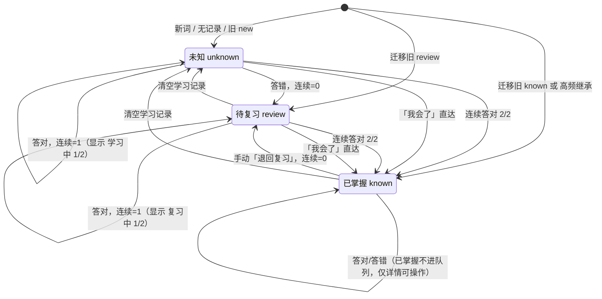
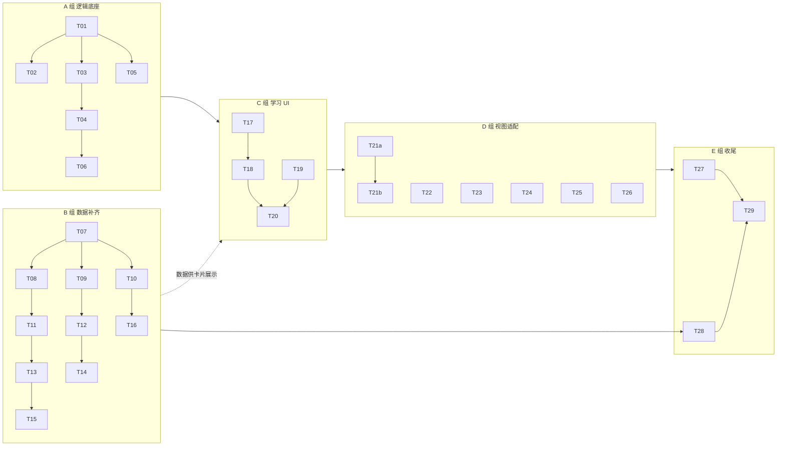

# 词根词缀单词云：学习闭环 — 增量设计与任务分解

> 文档性质：架构设计 + 任务分解，不含实现代码（仅伪代码与函数签名）。
> 上游依据：`docs/DATA_MODEL.md`（数据模型权威）、`docs/PRD_LEARNING.md`（增量 PRD）。
> 冲突时以**本文第 0 节「口径修正」与用户已拍板决策**为准。

---

## 0. 口径修正（开工前必须先达成一致）

设计过程中核对了实际数据，发现 PRD 与团队口径中的「200」与真实数据不一致，这直接影响分母、进度条和数据补齐工作量。

| 项目 | PRD/团队口径 | 实际数据（脚本实测） | 结论 |
|---|---|---|---|
| 词条记录数 | 310 | 310 | 一致 |
| **去重后不同单词数** | 200 | **310**（`id` 去重 310，`form` 去重也是 310，无同形重复） | **PRD 口径有误** |
| 「200」是怎么来的 | — | `freqRank > 2500` 的词正好 200 个（中频 88 + 次低频 97 + 低频 15） | 「200」= 中频及以下池，不是全库 |
| `freqRank ≤ 2500` 的词 | 隐含不计 | 110 个（基础 45 + 高频 65） | 这批词默认继承为 `known` |
| 缺 `pos` 的词 | 需补齐 | **0 个**（现有 310 条全部已填 `pos`） | 「pos 改必填」工作量≈0，只改校验级别 |
| 已有 `phoneticBr` / `example` | 需补齐 | **0 个** | 纯新增，无历史包袱 |

**设计采用的口径（已与产品经理对齐并拍板）：**

| 指标 | 取值 | 说明 |
|---|---|---|
| 三态统计分母 | **全库去重 310** | `unknown + review + known === 310`，进度条 `known / 310` |
| 迁移后初始进度 | `110 / 310 ≈ 35%` | 反映用户 12000 词汇量设定，起点不为 0，体验更真实 |
| 数据补齐范围（P0） | **200 个** `freqRank > 2500` 的词 | 学习卡片真实会用到的池；与 PRD 的 200 吻合 |
| 数据补齐范围（P1） | 剩余 110 个高频词 | 卡片用不到，仅为了 `validate` 全量一致；可延后 |

> **两个 200/310 口径在界面上必须分别标注、不得混用**：统计卡、进度条、侧栏统计一律用「全库 310」；若某处要展示「200」，必须写成「中低频 200（学习池）」并加说明。切换口径只需改 `derive.js` 里一个常量 `STATS_SCOPE`。

---

## 1. 实现方案概述

本次是**叠加式增量**，不是重写。改动范围是：新增一套「学习记录 + 状态机 + 取词队列」的纯函数层（`src/lib/learning.js`、`src/lib/migrate.js`）、一个持久化 hook（`src/hooks/useLearn.js`）、一组学习 UI 组件（学习首页 / 学习卡片 / 会话容器），并把现有三视图的「手工三态标注」语义替换为「学习记录驱动的三态」。

最小变更原则：

1. **现有网状视图（气泡打包、同心环、列表、构词拆解）一律不删不改结构**，只把状态来源从 `userStatus[wordId]` 换成 `records[wordId].status`。
2. **`AUTO_KNOWN_RANK` 常量不删除**，仅从「状态判定依据」降级为「词群视图弱化展示依据」。
3. **不引入任何间隔重复算法**（无 SM-2、无遗忘曲线、无复习天数调度）。全部逻辑只是：三态 + 连续答对计数 + 两个排序队列。
4. **不新增依赖**，纯函数用 Node 原生断言脚本验证；E2E 继续用现有 jsdom 方案。
5. **词库规模不变**（310 条 / 310 个不同单词），本次只补内容质量，不加新词。

---

## 2. 状态机与核心算法

### 2.1 三态定义

| 状态 | 含义 | 进入条件 | 离开条件 |
|---|---|---|---|
| `unknown` | 未知（含「答对 1 次待验证」的透明阶段） | 无记录 / 迁移旧 `new` / 清空记录 | 答错 → `review`；连续第 2 次答对 → `known`；「我会了」→ `known` |
| `review` | 待复习 | 答错 / 从 `known` 退回 / 迁移旧 `review` | 连续第 2 次答对 → `known`；「我会了」→ `known`；清空记录 → `unknown` |
| `known` | 已掌握 | 连续答对 2 次 / 迁移继承 / 「我会了」 | 「退回复习」→ `review`；清空记录 → `unknown` |

**答对 1 次的词仍停在 `unknown`，界面必须改显示「学习中 1/2」**，不能继续显示「未知」。这是 `unknown` 内部的展示分支，不新增状态。

### 2.2 状态机图



### 2.3 事件对计数的影响

| 当前状态 | 事件 | correctCount | consecutiveCorrect | incorrectCount | lastResult | 新状态 | statusSource |
|---|---|---:|---:|---:|---|---|---|
| `unknown` | 答对（第 1 次连续） | +1 | 1 | — | `correct` | `unknown` | `learning` |
| `unknown` | 答对（连续第 2 次） | +1 | 2 | — | `correct` | `known` | `learning` |
| `unknown` | 答错 | — | 0 | +1 | `incorrect` | `review` | `learning` |
| `unknown` | 「我会了」 | 不变 | **2** | 不变 | 不变 | `known` | `manual-known` |
| `review` | 答对（第 1 次连续） | +1 | 1 | — | `correct` | `review` | `learning` |
| `review` | 答对（连续第 2 次） | +1 | 2 | — | `correct` | `known` | `learning` |
| `review` | 答错 | — | 0 | +1 | `incorrect` | `review` | `learning` |
| `review` | 「我会了」 | 不变 | **2** | 不变 | 不变 | `known` | `manual-known` |
| `known` | 退回复习 | 不变 | 0 | 不变 | 不变 | `review` | `manual-retreat` |
| 任意 | 清空记录 | 0 | 0 | 0 | `null` | `unknown` | `initial` |

> **「我会了」的计数口径（team-lead 已裁定）**：`consecutiveCorrect` 置为 `MASTER_THRESHOLD`（2），表示"已达标"；**累计 `correctCount` / `incorrectCount` 一律不动**（不伪造答题历史），`lastStudiedAt` / `lastResult` 也不变（它不是一次答题），`statusSource='manual-known'` 可追溯。
> 置 2 而非归零的理由：`consecutiveCorrect` 语义就是"已连续答对次数"，置 2 是"已达标"的自然表达；归零会让字段含义与状态自相矛盾，并迫使展示层、统计、导入导出到处按 `statusSource` 分支判断。
> **该规则在浏览侧（详情 / 列表 / 批量）与学习卡片 / 复习卡片上完全一致** —— 四处调用的是同一个纯函数 `markKnown()`，不允许各写一套。

### 2.4 纯函数签名（`src/lib/learning.js`）

```js
// ---------- 常量 ----------
export const LEARN_STATUS = ['unknown', 'review', 'known']
export const MASTER_THRESHOLD = 2          // 连续答对几次进 known
export const DEFAULT_ROUND_SIZE = 10       // 每轮词数
export const LEARN_STORE_VERSION = 2       // localStorage 版本号
export const STATUS_SOURCE = ['initial', 'learning', 'manual-known', 'manual-retreat', 'migration']

// ---------- 记录构造 ----------
/** 返回一条默认学习记录（unknown、计数全 0、时间全 null） */
export function emptyRecord(): LearningRecord

/** 读记录，缺失时返回 emptyRecord；保证调用方永远拿到完整结构 */
export function getRecord(records: Object, wordId: string): LearningRecord

// ---------- 状态迁移（全部为纯函数，不修改入参，返回新对象） ----------
/**
 * 答题。result: 'correct' | 'incorrect'；now: ISO 字符串
 * 返回 { record, statusChanged: boolean, mastered: boolean }
 */
export function applyAnswer(record: LearningRecord, result: string, now: string): {
  record: LearningRecord, statusChanged: boolean, mastered: boolean
}

/**
 * 「我会了」一键直达 known（浏览侧与卡片共用同一个函数，行为必须一致）
 * 状态置 known、statusSource='manual-known'、consecutiveCorrect = MASTER_THRESHOLD(2)；
 * correctCount / incorrectCount / lastResult / lastStudiedAt 一律不动。
 */
export function markKnown(record: LearningRecord, now: string): LearningRecord

/** 已掌握 → 退回复习 */
export function retreatToReview(record: LearningRecord, now: string): LearningRecord

/** 清空该词学习记录，回到 unknown */
export function resetRecord(now: string): LearningRecord

// ---------- 派生展示 ----------
/** 展示态：'未知' | '学习中 1/2' | '待复习' | '复习中 1/2' | '已掌握' */
export function statusLabel(record: LearningRecord): string
/** 是否已达掌握门槛（用于列表/详情的进度小标） */
export function isMastered(record: LearningRecord): boolean

// ---------- 队列 ----------
/**
 * 学习队列：仅取 status === 'unknown'
 * 排序：freqRank 升序 → cefrScore 升序 → form 字母序
 */
export function buildLearnQueue(words: Word[], records: Object, size = DEFAULT_ROUND_SIZE): Word[]

/**
 * 复习队列：仅取 status === 'review'
 * 排序：consecutiveCorrect 升序 → incorrectCount 降序 → lastIncorrectAt 升序（null 排最后）
 *      → freqRank 升序 → form 字母序
 */
export function buildReviewQueue(words: Word[], records: Object, size = DEFAULT_ROUND_SIZE): Word[]

/** 三态去重统计：返回 { unknown, review, known, total }，total 按 word.id 去重 */
export function countByStatus(words: Word[], records: Object): Stats

// ---------- 校验 ----------
/** 导入/迁移结果的结构校验，返回 { ok: boolean, errors: string[] } */
export function validateRecords(obj: any): { ok: boolean, errors: string[] }
```

**排序稳定性说明**：所有排序键都带有 `form` 字母序兜底，保证同一份记录多次调用结果完全一致（不随机、可解释、可回归测试）。

### 2.5 队列取词规则

| 队列 | 池 | 排序键（依次） | 每轮 | 重复规则 |
|---|---|---|---|---|
| 学习 | `status === 'unknown'` | `freqRank ↑` → `cefrScore ↑` → `form ↑` | 10 | 同轮不重复；答对 1 次的词仍 `unknown`，下轮可再现 |
| 复习 | `status === 'review'` | `consecutiveCorrect ↑` → `incorrectCount ↓` → `lastIncorrectAt ↑`（null 最后）→ `freqRank ↑` → `form ↑` | 10 | 同轮不重复；答错后仍在 `review`，下轮重排后可再现 |

> 两个队列**都不跟随浏览页的状态筛选**（不受 `minCefr` / `hideAutoKnown` / 搜索词影响），避免用户改了筛选后队列变空的误解。

---

## 3. 数据结构设计

### 3.1 词条新增字段（`src/data/words-*.js`）

| 字段 | 类型 | 必填 | 变更 | 示例 | 说明 |
|---|---|---:|---|---|---|
| `pos` | string | ✅ | 建议 → 必填（现有 310 条已全部有值，仅需校验升级） | `v.` | 词性 |
| `phoneticBr` | string | ✅（P0 对 `freqRank > 2500` 的 200 词） | 新增 | `/ɪnˈspekt/` | DJ 英式音标，**含首尾斜杠**，重音 `ˈ`、次重音 `ˌ` |
| `example` | object | ✅（同上） | 新增 | — | 每词 1 条例句 |
| `example.en` | string | ✅ | 新增 | `The committee will inspect the records.` | 英文原句，8~20 词，句首大写句末句号 |
| `example.zh` | string | ✅ | 新增 | `委员会将检查这些记录。` | 中文翻译，完整句，句号结尾 |

字段追加位置：紧跟 `gloss` 之后（`gloss` → `phoneticBr` → `example` → `morphs`），保证三个数据文件写法一致。

### 3.2 学习记录结构（每词一条，`records[wordId]`）

| 字段 | 类型 | 默认值 | 说明 |
|---|---|---|---|
| `status` | `'unknown' \| 'review' \| 'known'` | `'unknown'` | 当前状态 |
| `correctCount` | int ≥ 0 | `0` | 历史答对总次数 |
| `consecutiveCorrect` | int ≥ 0 | `0` | 当前连续答对次数；答错、退回复习时归零 |
| `incorrectCount` | int ≥ 0 | `0` | 历史答错总次数 |
| `lastStudiedAt` | ISO string \| null | `null` | 最近一次**真实答题**时间；「我会了」「退回复习」不写 |
| `lastResult` | `'correct' \| 'incorrect' \| null` | `null` | 最近一次真实答题结果 |
| `lastIncorrectAt` | ISO string \| null | `null` | 最近答错时间，用于错题排序 |
| `statusChangedAt` | ISO string \| null | `null` | 最近状态改变时间；`unknown` 且从未变过则为 `null` |
| `statusSource` | `'initial' \| 'learning' \| 'manual-known' \| 'manual-retreat' \| 'migration'` | `'initial'` | 状态来源，用于兼容旧数据与解释「我会了」 |

**不变量（由 `validateRecords` 与单测保证）：**

1. 三个计数不得为负、不得为小数。
2. `status === 'known'` ⇒ `consecutiveCorrect >= MASTER_THRESHOLD`。**不按 `statusSource` 分支**：迁移 `known` 与「我会了」的 `known` 均置 `consecutiveCorrect = 2`，因此一律满足（二者都不增加 `correctCount`，历史累计不被伪造）。
3. `status !== 'known'` ⇒ `consecutiveCorrect < MASTER_THRESHOLD`。
4. `lastResult` 只在真实答题时变化；「我会了」「退回复习」不动 `lastResult` / `lastStudiedAt`。
5. 单词无记录时按 `emptyRecord()` 计算，**不为 310 词预写空记录**（v2 只存有变化的词）。

> 展示层**统一渲染** `x/2` 进度，不对 `migration` / `manual-known` 做任何特判隐藏。

### 3.3 localStorage key 设计

| key | 版本 | 结构 | 说明 |
|---|---|---|---|
| `wrc.learn.v2` | v2 | `{ version: 2, records: { [wordId]: LearningRecord } }` | **主存储，新增** |
| `wrc.settings.v2` | v2 | `{ ...旧 settings, status: 'all'\|'unknown'\|'review'\|'known', inheritFreqKnown: boolean, roundSize?: number }` | 过滤设置 + 迁移开关 |
| `wrc.status.v1` | v1 | `{ [wordId]: 'known'\|'review'\|'new' }` | **原样保留，不再写入**，只读 |
| `wrc.status.v1.backup` | 备份 | 同 v1 结构 + `{ backedUpAt }` | **只读迁移备份**，迁移成功时写入 |
| `wrc.settings.v1.backup` | 备份 | 同 v1 | 只读迁移备份 |
| `wrc.migration.v2` | 标记 | `{ done: true, at: ISO, report: {...} }` | 迁移完成标记，避免重复迁移 |

> 备份 key 只写一次、永不读取、永不删除（提供「找回失效 wordId」的兜底）。

### 3.4 v1 → v2 迁移

```js
// src/lib/migrate.js
/**
 * @param {object} args
 * @param {object} args.legacyStatus    读自 wrc.status.v1，形如 { 'w.inspect': 'review' }
 * @param {Word[]} args.words           全量去重单词（310）
 * @param {boolean} args.inheritFreqKnown  true=高频无记录词继承为 known（用户决策 5，可配置）
 * @param {number} args.freqRankLine    继承判定线，默认 AUTO_KNOWN_RANK = 2500
 * @param {string} args.now             ISO 时间字符串
 * @returns {{ records: Object, report: { known, review, unknown, inheritedByFreq, migratedManual, dropped } }}
 */
export function migrateV1toV2(args): { records: Object, report: Object }

/** 主流程编排：读旧 → 迁移 → 写备份 → 写 v2 → 写标记。任一环节抛错则不写 v2 */
export function runMigration({ words, inheritFreqKnown, now }): { ok: boolean, report?: Object, error?: string }
```

**映射表**

| 旧数据 | 新状态 | 计数 | `statusSource` |
|---|---|---|---|
| 手工 `known` | `known` | 全 0（`consecutiveCorrect` 置 2 以满足不变量） | `migration` |
| 手工 `review` | `review` | 全 0 | `migration` |
| 手工 `new` | `unknown` | 全 0 | `initial` |
| 无记录 **且** `inheritFreqKnown && freqRank <= 2500` | `known` | 全 0（`consecutiveCorrect` 置 2） | `migration` |
| 无记录 且（开关关闭 或 `freqRank > 2500`） | `unknown` | 全 0 | `initial` |
| 旧 `wordId` 在当前词库中不存在 | **不写入 v2**，只留在备份 | — | — |
| 旧筛选值 `status: 'new'` | `status: 'unknown'` | — | — |

> **确认口径（与 PRD §3.2/§3.4/§8.1 一致）**：迁移写入的 `known` 同样 `consecutiveCorrect = 2`，`correctCount` / `incorrectCount` 仍为 0。
> 这样不变量保持**单一无例外**（`known ⇒ consecutiveCorrect >= 2`），迁移与「我会了」都不需要豁免。
> 唯一可见的副作用：这类词在详情里会显示「已掌握 · 连续 2/2」但「累计答对 0 次」。这是预期结果，不是数据错误——`statusSource='migration'` 已标明来源，详情页建议补一行小字「来自旧标注 / 高频继承」以消除困惑（P1，不阻塞）。

**步骤（原子性）**

1. 若 `wrc.migration.v2.done === true` 或 `wrc.learn.v2` 已存在 → 直接跳过。
2. 读 `wrc.status.v1`（不存在则视为 `{}`，并按纯继承规则生成）。
3. 在**内存**中生成完整 `records` 并跑 `validateRecords`；校验不通过 → 抛错，不写任何 key。
4. 写 `wrc.status.v1.backup` / `wrc.settings.v1.backup`。
5. 写 `wrc.learn.v2`（含 `version: 2`）。
6. 写 `wrc.settings.v2`（`status: 'new' → 'unknown'`）。
7. 写 `wrc.migration.v2 = { done: true, at, report }`。
8. UI 提示：`已保留 X 个已掌握、Y 个待复习、Z 个未知`。

**失败策略**：任一步抛错 → 不写 v2，继续使用旧数据并提示「迁移失败，请导出备份」，**绝不生成半份新记录**。

---

## 4. 文件清单

| 文件路径 | 新增/修改 | 职责 | 依赖 |
|---|---|---|---|
| `src/lib/learning.js` | **新增** | 状态常量、记录构造、状态迁移纯函数、队列构建、统计、记录校验 | 无 |
| `src/lib/migrate.js` | **新增** | v1→v2 迁移映射与编排、备份 key 写入、迁移开关处理 | `learning.js`、`derive.js`（`AUTO_KNOWN_RANK`） |
| `src/lib/derive.js` | 修改 | `STATUS` 三态常量改键（`new`→`unknown`）；新增 `STATS_SCOPE`；`effectiveStatus` 改为读学习记录；保留 `autoKnown`/`AUTO_KNOWN_RANK` 仅作弱化展示 | `learning.js` |
| `src/hooks/useLearn.js` | **新增** | 学习记录状态 + 持久化（`wrc.learn.v2`）+ `applyAnswer`/`markKnown`/`retreat`/`reset`/导出导入 | `learning.js`、`migrate.js` |
| `src/hooks/useStatus.js` | 修改 | 收敛为薄封装，导出旧 API 供过渡期使用；不再写入 `wrc.status.v1` | `useLearn.js` |
| `src/data/words-latin.js` | 修改 | 补 `phoneticBr`、`example`（88 个目标词） | 无 |
| `src/data/words-greek.js` | 修改 | 补 `phoneticBr`、`example`（41 个目标词） | 无 |
| `src/data/words-affix.js` | 修改 | 补 `phoneticBr`、`example`（71 个目标词） | 无 |
| `src/components/LearnHome.jsx` | **新增** | 学习首页：三态统计卡、进度条、开始学习/优先复习入口、上一轮摘要、空状态 | `useLearn`、`derive` |
| `src/components/StudyCard.jsx` | **新增** | 学习/复习卡片（正面：词/音标/词性；作答后：释义/双语例句/构词拆解/状态反馈），含「我会了」按钮 | `learning.js`、`derive` |
| `src/components/StudySession.jsx` | **新增** | 会话容器：取队列、轮次进度、逐题提交、持久化、轮次总结 | `learning.js`、`StudyCard` |
| `src/components/Sidebar.jsx` | 修改 | 状态筛选项改文案（全部/未知/待复习/已掌握）、统计数字、迁移继承开关、导出导入说明 | `derive`、`useLearn` |
| `src/components/WordRow.jsx` | 修改 | 行内三态徽标 + `1/2` 学习进度 | `derive`、`learning` |
| `src/components/ListView.jsx` | 修改 | 状态列接新三态与进度；批量操作入口调整 | `derive` |
| `src/components/FocusView.jsx` | 修改 | 单词节点三态颜色/徽标 | `derive` |
| `src/components/OverviewView.jsx` | 修改 | 气泡弱化展示依据改用 `autoKnown`（不再参与状态判定） | `derive` |
| `src/components/BulkActionBar.jsx` | 修改 | 移除「标为已掌握」与「标为生词」；保留「加入待复习」「清除学习记录」 | `derive` |
| `src/App.jsx` | 修改 | 新增「学习」页签并设为默认首页；把 `records` 传给三个原视图与右侧详情；WordDetail 改造 | `useLearn`、上述组件 |
| `scripts/validate-data.mjs` | 修改 | `pos` 由 warn 升 error；新增 `phoneticBr`/`example` 校验与补齐进度统计 | 无 |
| `scripts/test-learning.mjs` | **新增** | 纯 Node 断言：状态机、队列排序、迁移映射、不变量 | `learning.js`、`migrate.js` |
| `scripts/qa-harness.jsx` | 修改 | E2E 用例同步新语义 + 新增迁移/阈值/归零/刷新恢复/去重/排序用例 | 全部 UI |

---

## 5. 任务分解

> **执行约定**：
> - 「输出量」是小/中/大三档，按**单个任务一次能改完的代码量**估。任何「大」都不允许出现在列表里 —— 已全部拆到「中」及以下。
> - **串行/并行**见每组说明。跨组可并行；组内标注了依赖的必须串行。
> - 每个任务完成后必须跑 `npm run validate` 与 `npm run test:e2e`（数据类任务只需 `validate`），红灯不许进入下一任务。

### A 组：逻辑底座（组内基本串行，是 C 组的前置）

| # | 标题 | 改哪些文件 | 依赖 | 输出量 | 验收标准 |
|---|---|---|---|---|---|
| **T01** | 学习状态机与队列纯函数 | 新增 `src/lib/learning.js` | 无 | 中 | 导出 2.4 节全部函数；纯函数不修改入参；`unknown` 答对 1 次仍 `unknown`、2 次 `known`；答错归零进 `review`；复习答对不回 `unknown` |
| **T02** | 纯函数断言脚本 | 新增 `scripts/test-learning.mjs`；`package.json` 加 `test:unit` | T01 | 小 | `npm run test:unit` 覆盖：三态迁移全表（2.3 表 10 行）、「我会了」、退回复习、清空、不变量 1~5、两个队列排序稳定性、去重统计；全绿 |
| **T03** | v1→v2 迁移模块 | 新增 `src/lib/migrate.js` | T01 | 中 | 3.4 节映射表逐行可测；`inheritFreqKnown=false` 时高频词一律 `unknown`；失效 `wordId` 不写入；校验失败不写任何 key；备份 key 写入一次 |
| **T04** | 学习记录 hook 与持久化 | 新增 `src/hooks/useLearn.js` | T01、T03 | 中 | 首次加载触发迁移（幂等）；答题/我会了/退回/清空后立即写 `wrc.learn.v2`；刷新后计数与连续数不丢；导出/导入 v2 结构 |
| **T05** | derive 层三态改造 | 修改 `src/lib/derive.js` | T01 | 小 | `STATUS` 键为 `unknown/review/known`（`label` 为 未知/待复习/已掌握）；`effectiveStatus(word, records)` 只读学习记录；`AUTO_KNOWN_RANK`/`autoKnown` 原样保留且不再参与状态判定；新增 `STATS_SCOPE` |
| **T06** | 旧 useStatus 收敛 | 修改 `src/hooks/useStatus.js` | T04、T05 | 小 | 不再写 `wrc.status.v1`；对外 API 保持不变以便过渡；无残留写入 |

### B 组：数据补齐（与 A、C 组并行；**组内按文件并行、同文件内串行**）

| # | 标题 | 改哪些文件 | 依赖 | 输出量 | 验收标准 |
|---|---|---|---|---|---|
| **T07** | 数据校验升级 | 修改 `scripts/validate-data.mjs` | 无 | 小 | `pos` 缺失由 warn 升 error（现有 0 条缺失，应全绿）；新增 `phoneticBr` 正则（`/^[/].+[/]$/`）与 `example.en/zh` 非空校验；输出「补齐进度 X/200」；未补齐期间这些项为 warn 不阻断 |
| **T08** | 数据补齐 · 拉丁链 L1 | `words-latin.js`（22 词） | T07 | 小 | 见第 6 节；`validate` 新增 0 error，补齐进度 +22 |
| **T11** | 数据补齐 · 拉丁链 L2 | `words-latin.js`（22 词） | T08 | 小 | 同上 |
| **T13** | 数据补齐 · 拉丁链 L3 | `words-latin.js`（22 词） | T11 | 小 | 同上 |
| **T15** | 数据补齐 · 拉丁链 L4 | `words-latin.js`（22 词） | T13 | 小 | 同上 |
| **T09** | 数据补齐 · 前后缀链 A1 | `words-affix.js`（24 词） | T07 | 小 | 同上 |
| **T12** | 数据补齐 · 前后缀链 A2 | `words-affix.js`（24 词） | T09 | 小 | 同上 |
| **T14** | 数据补齐 · 前后缀链 A3 | `words-affix.js`（23 词） | T12 | 小 | 同上 |
| **T10** | 数据补齐 · 希腊链 G1 | `words-greek.js`（21 词） | T07 | 小 | 同上 |
| **T16** | 数据补齐 · 希腊链 G2 | `words-greek.js`（20 词） | T10 | 小 | 同上 |

> B 组三条链（拉丁 / 前后缀 / 希腊）**改的是三个不同文件，可同时并行**；每条链内部串行（同文件不可并发写）。

### C 组：学习 UI（依赖 A 组，与 B 组并行）

| # | 标题 | 改哪些文件 | 依赖 | 输出量 | 验收标准 |
|---|---|---|---|---|---|
| **T17** | 学习卡片组件 | 新增 `src/components/StudyCard.jsx` | T01、T05 | 中 | 作答前仅显示 词/音标/词性；三个按钮「不认识」「认识」「我会了」（复习态文案为「答错」「答对」「我会了」）——**Q11 已裁定：学习卡与复习卡都保留三按钮**；作答后展开释义+英文例句+中文翻译+构词拆解+状态反馈；提交后只能点「下一个」，不可重复提交 |
| **T18** | 学习/复习会话容器 | 新增 `src/components/StudySession.jsx` | T01、T17 | 中 | `学习`/`复习` 两种模式；轮次进度 `3/10`；每题立即持久化；队列耗尽或满 10 词进入总结页（认识/不认识/新增掌握/剩余）；不自动开下一轮 |
| **T19** | 学习首页 | 新增 `src/components/LearnHome.jsx` | T04、T05 | 中 | 三张统计卡（未知/待复习/已掌握，去重口径）；进度条 `known/310` 同时显示数量与百分比；有待复习时「优先复习（N）」为主按钮；无词时显示对应空状态；展示上一轮摘要 |
| **T20** | App 接入学习页签 | 修改 `src/App.jsx` | T04、T18、T19 | 中 | 页签变 `[学习] [总览] [聚焦] [列表]`，「学习」为默认；`records` 下发到三视图与右侧详情；原三视图功能不回退 |

### D 组：现有视图适配（依赖 C 组 T20；**组内可并行**）

| # | 标题 | 改哪些文件 | 依赖 | 输出量 | 验收标准 |
|---|---|---|---|---|---|
| **T21a** | 详情 · 学习内容区 | 修改 `src/App.jsx`（WordDetail 上半部） | T20、T08（数据） | 小 | 显示音标、双语例句、状态徽标、`x/2` 进度（统一渲染，不按 `statusSource` 特判）、**「累计答对 N 次 / 累计答错 M 次」**、最近学习时间（从未作答显示「尚未学习」）；继承来的 `known` 显示「累计答对 0 次」，**不额外渲染来源标签** |
| **T21b** | 详情 · 操作按钮区 | 修改 `src/App.jsx`（WordDetail 下半部） | T21a | 小 | 按钮区改为「未知 / 待复习 / 我会了」三态 + `known` 时的「退回复习」；全部走 `useLearn` 的 `markKnown` / `retreat` / `reset`，与卡片共用同一纯函数；所属词群与构词拆解保持不变 |
| **T22** | 列表行与列表视图 | 修改 `WordRow.jsx`、`ListView.jsx` | T20 | 小 | 状态列显示三态 + `x/2`（统一渲染，无 `statusSource` 分支）；颜色/文案与卡片一致；排序、多选、Shift 区间选不回退 |
| **T23** | 侧栏筛选与统计 | 修改 `Sidebar.jsx` | T20、T05 | 小 | 筛选项「全部/未知/待复习/已掌握」；统计按去重计；迁移继承开关 UI；导出导入入口保留 |
| **T24** | 聚焦/总览视图适配 | 修改 `FocusView.jsx`、`OverviewView.jsx` | T20、T05 | 小 | 节点/气泡三态颜色一致；气泡弱化展示仍由 `autoKnown` 决定；点击跳转不回退 |
| **T25** | 批量操作栏改造 | 修改 `BulkActionBar.jsx` | T05 | 小 | 三个按钮改为「我会了」「加入待复习」「清除学习记录」（`标为已掌握`→`我会了`、`标为生词`→移除）；批量「我会了」与卡片走同一个 `markKnown()`；全部调用 `useLearn` 的批量接口并立即持久化 |
| **T26** | 迁移提示与设置项 | 修改 `App.jsx` / `Sidebar.jsx` | T03、T21b、T23 | 小 | 首次迁移后一次性提示「已保留 X 个已掌握、Y 个待复习、Z 个未知」；设置里可关闭「高频词继承为已掌握」并重跑迁移（二次确认） |

### E 组：回归与收尾（串行，最后做）

| # | 标题 | 改哪些文件 | 依赖 | 输出量 | 验收标准 |
|---|---|---|---|---|---|
| **T27** | E2E 回归同步 | 修改 `scripts/qa-harness.jsx` | T20~T26 | 中 | 现有 61 条用例语义同步后全绿（详见第 8 节）；新增用例：迁移映射、连续 2 次达标、答错归零、刷新恢复、去重统计、复习排序 |
| **T28** | 数据补齐收尾 | 修改 `scripts/validate-data.mjs` | T08~T16 | 小 | 补齐进度 200/200；`phoneticBr`/`example` 缺项由 warn 提升为 error；`npm run validate` 0 error |
| **T29** | 全量联调 | 全库 | T27、T28 | 小 | `validate` / `test:unit` / `test:e2e` 三绿；手动走一遍：学习一轮 → 复习一轮 → 我会了 → 退回复习 → 刷新 → 导出导入 |

### 并行关系总览



- **可并行**：A 组与 B 组完全并行；B 组内部 `latin` 链、`greek` 链、`affix` 链三条链可并行（不同文件）；D 组可并行（文件互不重叠；同改 `App.jsx` 的 T21a→T21b→T26 需串行）。
- **必须串行**：A 组内部依赖链；T17→T18→T20；T20→D 组；D 组→T27；T08~T16→T28。

---

## 6. 数据补齐任务的拆分方案

### 6.1 分批维度

**主维度 = 数据文件**（`words-latin.js` / `words-greek.js` / `words-affix.js`），**副维度 = `freqRank` 升序切片**。

选这两个维度的理由：

| 候选维度 | 评价 |
|---|---|
| **数据文件** | ✅ 主维度。每个批次只写**一个文件**，三条链可安全并行，彻底避免写冲突 |
| **freqRank 升序** | ✅ 副维度。同批词难度接近、例句风格统一；先完成较常见的词，早期即可联调 |
| 字母序 | ❌ 打散难度，例句风格跳跃，且无工程收益 |
| 来源（拉丁/希腊/前后缀） | ⚠️ 已隐含在文件维度里，不重复用 |

**每批 20~25 词**：这是单人一次可稳定完成并自校验的量（约每批 25 组「音标 + 英文句 + 中文句」，纯数据录入，无逻辑判断），输出量评级为「小」。

### 6.2 批次表（P0：200 个 `freqRank > 2500` 的词）

每批取「该文件中 `freqRank > 2500` 的词按 `freqRank` 升序的第 N~M 个」。

| 批次 | 文件 | 取该文件中 >2500 的词，升序第 | 词数 | 词频区间 | 依赖 | 输出量 |
|---|---|---|---|---:|---|---|
| **T08 / L1** | `words-latin.js` | 1 ~ 22 | 22 | 2600~4200 | T07 | 小 |
| **T11 / L2** | `words-latin.js` | 23 ~ 44 | 22 | 4200~6500 | T08 | 小 |
| **T13 / L3** | `words-latin.js` | 45 ~ 66 | 22 | 6500~8500 | T11 | 小 |
| **T15 / L4** | `words-latin.js` | 67 ~ 88 | 22 | 8500~18000 | T13 | 小 |
| **T09 / A1** | `words-affix.js` | 1 ~ 24 | 24 | 2600~5000 | T07 | 小 |
| **T12 / A2** | `words-affix.js` | 25 ~ 48 | 24 | 5000~8000 | T09 | 小 |
| **T14 / A3** | `words-affix.js` | 49 ~ 71 | 23 | 8000~18000 | T12 | 小 |
| **T10 / G1** | `words-greek.js` | 1 ~ 21 | 21 | 2600~7000 | T07 | 小 |
| **T16 / G2** | `words-greek.js` | 22 ~ 41 | 20 | 7000~18000 | T10 | 小 |

> 合计 200 词。`latin` 88 / `affix` 71 / `greek` 41。
> 执行顺序建议：**L1 → A1 → G1 三条链同时启动**（每链首批发起后，链内串行推进）。

### 6.3 P1 追加批次（剩余 110 个 `freqRank ≤ 2500` 的高频词）

这 110 个词默认继承为 `known`，学习卡片不会用到。**建议放到 P0 之后**，或按产品判断直接跳过（此时需要 `validate` 对这批词豁免 `phoneticBr`/`example`）。

| 批次 | 文件 | 词数 | 依赖 | 输出量 |
|---|---|---:|---|---|
| L5 / L6 | `words-latin.js` | 30 + 29 | T15 | 小 ×2 |
| A4 / A5 | `words-affix.js` | 24 + 24 | T14 | 小 ×2 |
| G3 | `words-greek.js` | 3 | T16 | 小 |

### 6.4 字段一致性约定（跨批次必须统一）

| 项 | 约定 | 反例 |
|---|---|---|
| 音标体系 | **DJ 英式**，带首尾斜杠，重音 `ˈ`、次重音 `ˌ`；不写美化音标 | ❌ `/ɪnˈspεkt/`、❌ 缺斜杠、❌ 混入 KK 的 `ˋ ˊ` |
| 音标与词形 | 与 `form` 严格对应；有多读音时只取与 `pos` 匹配的那个 | ❌ `record` 名词写成动词音标 |
| `example.en` | 8~20 词，完整句，句首大写句末句号，目标词以正确形式出现，难度贴近该词 CEFR | ❌ 短语碎片、❌ 生僻专有名词 |
| `example.zh` | 完整中文句，句号结尾，**不加括号注释、不加引号**；与 `gloss` 的义项一致 | ❌ 只译半句、❌ 义项跑偏 |
| 例句中文化 | 例句中目标词的义项必须与 `gloss` 的首义项一致 | ❌ `gloss` 是「检查」，例句用的是「视察」引申义且未说明 |
| 标点 | 英文用半角 `.`，中文用全角 `。` | 混用 |
| 插入位置 | 统一 `gloss` 之后、`morphs` 之前 | 三文件不一致 |

### 6.5 每批完成后的校验（三道，缺一不可）

1. **机器校验**：`npm run validate` —— 0 error；「补齐进度」数字应为「已完成批次词数累加值」；本批新增词的 `id` 无重复、`chain`/`morphs` 未被误改（校验脚本已覆盖）。
2. **抽样人工校验**：每批随机抽 3 个词，核对 音标↔词形↔词性、例句义项↔`gloss` 两条。
3. **渲染冒烟**：`npm run test:e2e` 不因数据改动而变红（音标含特殊字符时尤其要跑，防止 JSX 转义问题）。

**批次验收不通过的处理**：只回滚该批次的字段追加（`git` 无版本控制时按文件注释块定位），不连带改其他批次。

---

## 7. 共享知识（跨文件约定）

多个任务并行时，以下约定是唯一事实来源，**任何任务不得自行另起一套**。

| 约定项 | 规定 | 落点 |
|---|---|---|
| 状态键 | `'unknown' \| 'review' \| 'known'`（全小写，不用 `new`） | `learning.js` 的 `LEARN_STATUS` |
| 状态文案/颜色 | **只此一份**：`未知 #c9484b` / `待复习 #c98a17` / `已掌握 #9aa1ac`（沿用现有 `STATUS` 配色，只把 `new` 键改名） | `derive.js` 的 `STATUS`；组件不得硬编码颜色 |
| 字段名拼写 | 全 camelCase；时间字段一律以 `At` 结尾 | `learning.js` |
| 时间格式 | ISO 8601 UTC 字符串，统一 `new Date().toISOString()`；**不存时间戳数字** | `learning.js` 入参 `now` |
| 掌握阈值 | 常量 `MASTER_THRESHOLD = 2`，禁止在组件里写死 `2` | `learning.js` |
| 「我会了」实现 | 五个入口（学习卡 / 复习卡 / 详情 / 列表 / 批量）**只允许调用 `markKnown()`**，不得各自实现状态与计数逻辑 | `learning.js` |
| 详情学习信息 | 固定显示 状态徽标 / `x/2` / 累计答对 / 累计答错 / 最近学习时间（无则「尚未学习」）；**不显示 `statusSource` 来源标签，也不按来源做展示分支** | `App.jsx` WordDetail |
| 时间展示 | `lastStudiedAt` 转本地时间展示；`null` 一律显示「尚未学习」，不显示 `1970` 或空串 | 组件层 |
| 每轮词数 | 常量 `DEFAULT_ROUND_SIZE = 10` | `learning.js` |
| 版本号 | `LEARN_STORE_VERSION = 2`；key 名后缀 `.v2` | `learning.js` / `migrate.js` |
| 词频判定线 | 复用 `derive.js` 的 `AUTO_KNOWN_RANK`，**不复制常量** | `derive.js` |
| 统计口径 | 一律按 `word.id` 去重；`stats.uniqueWords` 为唯一对外数字，`wordCount`（按词群计次）只作次要说明 | `derive.js` |
| props 约定 | 视图组件接收 `records`（对象）而非 `userStatus`；回调统一命名 `onAnswer(wordId, result)` / `onMarkKnown(wordId)` / `onRetreat(wordId)` / `onReset(wordId)` | 全部组件 |
| 数据入口 | 新字段只在 `words-*.js` 里加，**不在 `index.js` 里加工**；`index.js` 只做合并 | `data/index.js` |
| 数据派生 | 任何"算出来的"字段不落数据文件 | `derive.js` / `learning.js` |
| 提交粒度 | 一个任务一次提交；不跨任务混合改同一文件 | 全员 |

---

## 8. 兼容性与风险

### 8.1 现有 E2E（61 条）受影响点与同步动作

| 位置 | 现状 | 影响 | 同步动作 |
|---|---|---|---|
| `qa-harness.jsx:79-80` | 读 `wrc.status.v1`，值为字符串 | v2 值结构变为对象 | 改读 `wrc.learn.v2` 的 `records`；断言条数时用 `Object.keys(records).length` |
| `qa-harness.jsx:184,266` | `rawStatus() === '{}'` | v2 空态是 `{"version":2,"records":{}}` | 改断言 `records` 为空对象，不比对整串 |
| `qa-harness.jsx:61-63` | 左栏统计取「已掌握/待复习/**生词**」 | 「生词」改「未知」 | 三处文案同步；统计口径改为去重 |
| `qa-harness.jsx:142-144` | 断言存在「标为已掌握」「标为待复习」「标为**生词**」三个批量按钮 | 批量按钮改名一个、删一个 | 「标为已掌握」→「我会了」（断言文案同步，语义改为 `statusSource='manual-known'`）；「标为生词」→ 删除，替换为「清除学习记录」 |
| `qa-harness.jsx:148-155` | 点「标为已掌握」后断言左栏「已掌握」+2、「生词」-2 | 语义一致，仅文案变 | 改为点「我会了」；额外断言 `consecutiveCorrect===2`、`correctCount` 未变、`statusSource==='manual-known'` |
| `qa-harness.jsx:177-193` | C9「清除标注应退回自动判定」 | 新模型没有"自动判定回落"概念 | 语义改为「清除学习记录 → 回到未知」，断言状态为 `unknown`、计数为 0 |
| 默认视图 | 默认渲染「总览」 | 默认改为「学习」 | harness 开头需显式点「列表」页签再执行列表用例 |
| `autoKnown` 相关 | 高频词灰显 | 仍保留，但不再决定状态 | 该部分用例无需改 |
| stats 数字 | 生词数含自动判定 | 变为纯学习记录统计 | 断言改用相对变化（+2 / -2）而非绝对值，已大部分如此 |

**新增用例（T27 必须补）**：迁移映射 5 行（含迁移 `known` 的 `consecutiveCorrect===2`、`correctCount===0`）、连续 2 次达标、答错归零、刷新恢复（写 localStorage 后重挂载）、三态去重和 = 310、复习队列排序、`inheritFreqKnown=false` 分支、**详情面板显示「累计答对 N 次 / 累计答错 M 次」且从未作答显示「尚未学习」**、详情「我会了」与「退回复习」两个按钮生效。

### 8.2 现有三视图的连锁反应

| 位置 | 变化 | 处理 |
|---|---|---|
| `effectiveStatus` 语义 | 从「手工标注 + 自动判定回落」变为「只读学习记录」 | 所有调用点改传 `records`；无记录即 `unknown` |
| `hideAutoKnown`（默认 true） | 过去用于隐藏"自动判定的高频已知词" | 保留为**纯展示开关**，改名建议 `hideFreqWeak`，与状态解耦；默认仍开 |
| 左栏统计 | `new` 计数消失 | 改为 `unknown`，口径去重 |
| 气泡弱化展示 | 过去由 `effectiveStatus` 间接实现 | 显式改用 `autoKnown(word)`，明确它只是"词频弱化"，不是状态 |
| 详情三态按钮 | 「✓已掌握 / ~待复习 / !生词」 | 改为「未知 / 待复习 / **我会了**」，并在 `known` 时显示「退回复习」；与卡片共用 `markKnown()`（Q11 已裁定） |
| 批量操作 | 「标为已掌握」改名「我会了」；「标为生词」移除 | 批量「我会了」与卡片共用 `markKnown()`，行为一致；「清除学习记录」替代原「标为生词」 |
| 词群跳转与构词拆解 | 无变化 | 卡片答案区必须保留并跳回词群 |

### 8.3 `AUTO_KNOWN_RANK` 与新三态共存

- **保留常量与原函数** `autoKnown(word)`，语义收敛为一句话：`freqRank <= 2500 → 该词属于高频区，在词群视图中弱化展示`。
- **它不再参与任何状态判定**（不再有"`autoKnown` ⇒ `known`"的回落）。
- 迁移时它作为「继承判定线」被复用一次（`migrateV1toV2` 的 `freqRankLine` 默认取它），且**可被设置开关关闭**。
- 为避免后续误用，`derive.js` 中补注释：状态判定走 `learning.js`，词频弱化走 `autoKnown`。

### 8.4 风险清单

| 风险 | 等级 | 说明 | 缓解 |
|---|---|---|---|
| ~~词数口径 200 vs 310 未对齐就开工~~ | ~~高~~ → **已关闭** | 分母已拍板为全库 310，补齐范围为学习池 200 | 分母抽成常量 `STATS_SCOPE`；界面上两个口径必须分别标注，不得混用 |
| 「我会了」入口位置曾与 PRD 不一致 | 低 | PRD 曾限定只在浏览侧，与用户拍板冲突 | **已裁定关闭**：学习卡 / 复习卡 / 详情 / 列表 / 批量五处均提供，统一走 `markKnown()` |
| 数据补齐工作量被低估 | **高** | 200 词 × 3 字段，是本项目最大工作量；一次性做完必然崩 | 严格按第 6 节的 9 批执行，每批 ≤ 25 词，批批可校验 |
| 音标/例句字段不一致 | 中 | 多批并行容易出现 DJ/KK 混用、标点混用 | 6.4 节约定 + validate 正则（`/^[/].+[/]$/`、非空、禁 KK 符号）+ 每批抽样 |
| 迁移写坏用户数据 | 中 | 一次性不可逆 | 原子写入顺序（先备份 → 后 v2 → 后标记）；校验失败不落盘；旧 key 永不删除 |
| E2E 61 条大面积变红 | 中 | 状态语义、key、文案三处同时变 | T27 单列一个任务；先改 key/文案，再改语义断言，分步跑 |
| 三个数据文件被并行写入冲突 | 中 | 多批同时改同一文件 | 批次按文件切分，一条文件一条串行链（第 6 节） |
| 「我会了」被滥用导致进度虚高 | 低 | 一键直达可能让用户把不认识的词标 known | 已有「退回复习」可逆路径；`statusSource='manual-known'` 可追溯，后续可统计 |

---

## 9. 待明确事项

| # | 问题 | 推荐默认值 | 状态 |
|---|---|---|---|
| **Q1** | 三态统计分母与进度条：全库 310 还是中低频 200？ | **310**（迁移后起点 110/310≈35%，反映 12000 词汇量） | ✅ **已拍板 310**（产品已同步 PRD）；界面出现 200 时必须标注「中低频 200」 |
| **Q2** | 数据补齐范围：200 词（`freqRank>2500`）还是 310 词？ | **先 200，110 个高频词放 P1** | ✅ **已拍板**（P0=学习池 200，P1=剩余 110） |
| **Q3** | 「我会了」是否计入 `correctCount`？ | **不计入** | ✅ **已裁定**：累计次数一律不动；`consecutiveCorrect` 置 2（非归零）；展示层统一渲染 `x/2`，不按 `statusSource` 特判 |
| **Q4** | 批量操作是否保留「标为已掌握」？ | 改名为「我会了」并保留 | ✅ **已拍板**：批量可达 `known`，与卡片共用 `markKnown()` |
| **Q11** | 「我会了」是否出现在学习卡片 / 复习卡片上？ | **要** | ✅ **已裁定 (a)**：学习卡 / 复习卡 / 详情 / 列表 / 批量五处均提供「我会了」，统一走 `markKnown()`；不向用户二次确认 |
| **Q12** | 「我会了」后是否仍可在本轮继续出现该词？ | **否**，本轮队列已建好，状态变更不影响本轮 | 建议：下一轮重排时自然剔除 |
| **Q5** | 迁移继承的高频 `known` 词是否出现在学习队列？ | **否**，学习队列只取 `unknown`；若用户想重学，先「退回复习」 | 队列行为 |
| **Q6** | 迁移继承开关关闭后，已生成的 v2 记录要不要重算？ | **要**，提供「重跑迁移」入口（二次确认，覆盖当前记录，提示先导出） | 设置页交互 |
| **Q7** | 每轮词数是否可配置？ | **P0 固定 10**（常量）；P1 再加 10/20/全部 选择器 | 只影响 P1 |
| **Q8** | 中文例句翻译是否默认显示？ | **作答后默认显示**，层级弱于英文；P1 再做显示/隐藏偏好 | 卡片布局 |
| **Q9** | 旧 `wrc.status.v1` 是否最终删除？ | **不删**，另写 `.backup` 双保险 | 存储兼容性 |
| **Q10** | 卡片键盘快捷键（P1） | P0 不做 | 无 |
