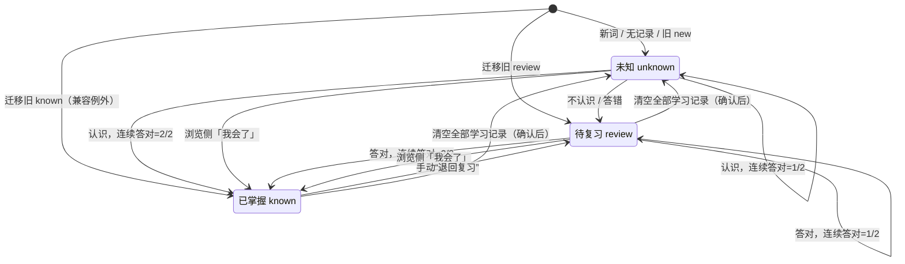
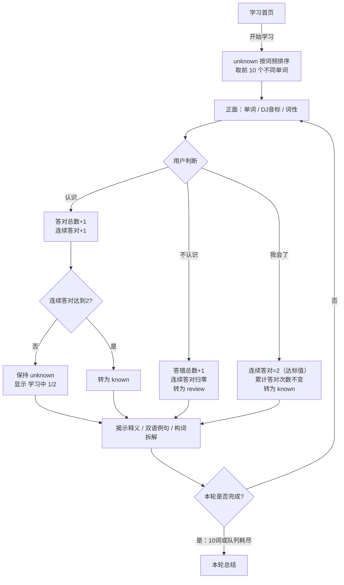
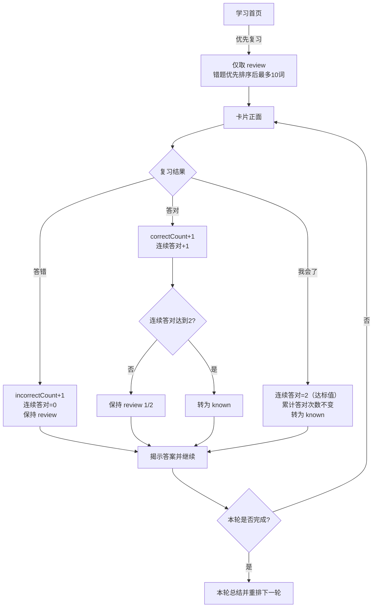

# 词根词缀单词云：学习闭环增量 PRD

> 文档状态：可进入设计与开发  
> 适用范围：在全库 310 个不同单词、三种词根词缀视图之上增加学习闭环；不引入间隔重复算法。  
> 数据口径：页面统计的“总词数”按单词 `id` 去重，**全库为 310 个不同单词**（词条记录 310 条，按 `form` 去重亦为 310，无同形重复）。  
> 学习池口径：`freqRank > 2500` 的中低频词共 **200 个**，是 P0 数据补齐与学习卡片实际取词的主要范围；`freqRank ≤ 2500` 的高频词共 110 个（基础 45 + 高频 65），迁移后默认继承为已掌握。  
> 两个口径并存时必须在界面上写明是“全库 310”还是“学习池 200”，不得混用。

---

## 1. 产品目标

将“以浏览和手工标注为主的词根词缀单词云”，升级为“保留词族网络探索能力，并能完成未知学习、错词复习、连续答对掌握与进度追踪的背词闭环”。

---

## 2. 状态模型

### 2.1 固定规则

| 决策项 | 本期规则 |
|---|---|
| 状态 | 仅 `unknown` / `review` / `known` 三态，不增加第四态 |
| 初始状态 | 新词、无学习记录的词一律为 `unknown`；旧高频词迁移按 §3.4 继承为 `known` |
| 掌握阈值 | **同一单词连续答对 2 次** |
| “连续”范围 | 可跨学习轮次、跨刷新；中间只要答错该词，其连续答对数即归零。学习其他词不打断 |
| 答对 1 次 | 尚未达标，保留当前状态；显示进度 `1/2` |
| 复习答错 | 保持 `review`，连续答对数归零 |
| 复习答对 | 第 1 次保持 `review`；连续第 2 次进入 `known`，**不回 `unknown`** |
| 已掌握退回 | 单词详情中的“退回复习”操作：`known → review`，连续答对数归零；历史累计次数保留 |
| 手工直达掌握 | **提供**：学习卡片、复习卡片、单词详情、批量操作均设「我会了」，一键直接置为 `known`（`statusSource='manual-known'`），连续答对数置为达标值 2，累计答对次数不增加 |
| 「我会了」适用范围 | 全场景可用，重点是**卡片上**（用户明确要求）；行为在卡片/详情/批量间完全一致 |

**为什么选择连续 2 次，而不是累计 2 次或连续 3 次：**

| 方案 | 判断 |
|---|---|
| 累计 2 次 | 中间答错仍可毕业，不能证明当前已稳定认识，不采用 |
| **连续 2 次** | 能过滤一次猜对；又不会让中高级学习者反复验证熟词，采用 |
| 连续 3 次 | 对当前 310 词的轻量产品摩擦偏大，暂不采用 |

### 2.2 三态精确定义

| 状态 | 产品定义 | 什么条件下进入 | 什么条件下离开 | 用户看到什么 |
|---|---|---|---|---|
| `unknown` 未知 | 新词的初始状态；尚未通过掌握门槛、且从未答错的学习池 | 新增词或无记录；旧 `new` 迁移；清空全部学习记录 | “不认识/答错”→ `review`；连续第 2 次答对→ `known` | 未作答时显示“未知”；已答对 1 次时显示“学习中 1/2” |
| `review` 待复习 | 已经学过但答错，或由用户从已掌握主动退回的词 | `unknown` 答错；`known` 点“退回复习”；旧 `review` 迁移 | 连续第 2 次答对→ `known`；清空全部记录→ `unknown` | “待复习”；同时可见连续答对 `0/2` 或 `1/2` |
| `known` 已掌握 | 已连续答对 2 次，或用户在浏览侧点「我会了」直接标记；旧“已掌握”迁移记录作为兼容例外保留 | 任一学习态连续第 2 次答对；浏览侧「我会了」；旧 `known` 迁移 | 点“退回复习”→ `review`；清空全部记录→ `unknown` | “已掌握”；详情中提供“退回复习” |

> **三态语义边界：**仅有三态且掌握阈值为 2 次，因此第一次答对后仍需暂存在 `unknown`。此时它已不是“从未看过”，界面必须改显示“学习中 1/2”，不能继续显示“从未看过”。这是 `unknown` 内部的透明验证阶段，不新增状态。

### 2.3 状态机



### 2.4 事件对计数与状态的影响

| 当前状态 | 用户事件 | 计数变化 | 新状态 |
|---|---|---|---|
| `unknown` | 认识，第 1 次连续答对 | 答对总数 +1；连续答对=1 | `unknown`，展示“学习中 1/2” |
| `unknown` | 认识，第 2 次连续答对 | 答对总数 +1；连续答对=2 | `known` |
| `unknown` | 不认识 | 答错总数 +1；连续答对=0 | `review` |
| `review` | 答对，第 1 次连续答对 | 答对总数 +1；连续答对=1 | `review` |
| `review` | 答对，第 2 次连续答对 | 答对总数 +1；连续答对=2 | `known` |
| `review` | 答错 | 答错总数 +1；连续答对=0 | `review` |
| `unknown` / `review` | 卡片/详情/批量「我会了」 | 累计答对次数不变（不 +1）；连续答对=2（= 掌握阈值） | `known`，`statusSource='manual-known'` |
| `known` | 退回复习 | 累计答对/答错不变；连续答对=0 | `review` |

---

## 3. 数据模型变更

### 3.1 Word 词条增量字段

现有 `id / form / pos / gloss / morphs[] / chain[] / freqRank / cefr` 保留。全库共 **310 个不同单词**；P0 先为学习池 **200 个中低频词**（`freqRank > 2500`）补齐音标与例句，剩余 110 个高频词（`freqRank ≤ 2500`）放 P1；新增词条数量不作为本次验收目标。

> 现状核对：310 条词条 `pos` 已全部填写，「词性必填」只需升级校验级别，无需补数据；`phoneticBr` / `example` 当前覆盖率为 0，需全量新增。

| 字段 | 类型 | 必填 | 变更 | 示例 |
|---|---|---:|---|---|
| `pos` | string | 是 | 由“建议”提升为必填 | `v.` |
| `phoneticBr` | string | 是 | 新增；DJ 英式音标，含重音符号 | `/ɪnˈspekt/` |
| `example` | object | 是 | 新增；每词 1 条与当前释义匹配的例句 | 见下 |
| `example.en` | string | 是 | 英文原句 | `The committee will inspect the records.` |
| `example.zh` | string | 是 | 对应中文翻译 | `委员会将检查这些记录。` |

**例句翻译决策：要，且 P0 必填。**

- 中高级学习者仍需要快速核对例句中的目标义项，中文翻译能减少误判。
- 卡片先突出英文，中文使用次要层级并在作答后出现，不干扰英文阅读。
- 一词先配一条高质量、与 `gloss` 对齐的例句；本期不扩展为例句库。

**音标体系决策：P0 仅用 DJ 英式音标。**

| 选项 | 结论 |
|---|---|
| DJ 英式 | **采用**；与文学阅读、常见英式词典使用习惯更匹配，界面最简洁 |
| KK 美式 | 本期不采用；后续有明确美音需求再补 |
| 两套同时展示 | 本期不采用；会使 200 词的数据校验与卡片信息量翻倍 |

> 数据录入须使用同一套词典口径，不能在 `phoneticBr` 中混入 KK 标注。

### 3.2 每词学习记录

P0 保存聚合学习记录，不保存完整逐题时间线，也不计算遗忘曲线。

| 字段 | 类型 | 必填 | 默认值 | 说明 |
|---|---|---:|---|---|
| `status` | `'unknown' \| 'review' \| 'known'` | 是 | `unknown` | 当前状态 |
| `correctCount` | integer | 是 | `0` | 历史答对总次数 |
| `consecutiveCorrect` | integer | 是 | `0` | 当前连续答对次数；答错或手动退回复习时归零；点「我会了」时置为达标值 2 |
| `incorrectCount` | integer | 是 | `0` | 历史答错总次数 |
| `lastStudiedAt` | ISO datetime \| null | 是 | `null` | 最近一次答题时间；手动退回不伪造答题时间 |
| `lastResult` | `'correct' \| 'incorrect' \| null` | 是 | `null` | 最近一次真实答题结果 |
| `lastIncorrectAt` | ISO datetime \| null | 是 | `null` | 最近答错时间，用于错题排序 |
| `statusChangedAt` | ISO datetime \| null | 是 | `null` | 最近状态改变时间 |
| `statusSource` | `'initial' \| 'learning' \| 'manual-known' \| 'manual-retreat' \| 'migration'` | 是 | `initial` | 解释状态来源，尤其用于旧数据兼容与手工直达掌握 |

约束：

- `correctCount / consecutiveCorrect / incorrectCount` 不得为负数。
- `status==='known'` ⇒ `consecutiveCorrect >= 2`，**无例外分支**；任何来源写入 `known` 时都必须同步满足该不变量。
- 写入侧保证：学习答对达阈值 → 累计到 2；点「我会了」→ 置为 2；旧数据迁移 → 同样置为 2。三者都**不增加** `correctCount`，不伪造答题历史。
- 展示层统一按 `x/2` 渲染，不按 `statusSource` 特判隐藏。
- 单词无记录时按默认学习记录计算，不要求为全库 310 词预写空记录。

### 3.3 持久化结构

| 项目 | 规则 |
|---|---|
| 学习记录版本 | 使用新的 v2 学习记录结构，按 `wordId` 保存上表字段 |
| 过滤设置 | 保留；旧状态筛选值 `new` 一次性改为 `unknown` |
| 保存时机 | 每次答题、退回复习、批量状态操作、导入后立即保存 |
| 刷新恢复 | 刷新后恢复状态、计数、最近结果和时间，不重置连续答对 |
| 导入/导出 | 升级为包含 v2 学习记录；导入前校验版本、状态值与计数 |

### 3.4 旧数据迁移

迁移原则：**保留用户明确表达过的判断；不把旧自动推断伪装成学习结果；不伪造答题次数。**

| 旧数据 | 新状态 | 新计数 | 取舍说明 |
|---|---|---|---|
| 手工 `known` | `known` | `correctCount=0`、`incorrectCount=0`、`consecutiveCorrect=2`；`statusSource='migration'` | 用户已明确说“掌握”，原意优先保留；连续数按达标值写入以满足不变量，累计次数不伪造 |
| 手工 `review` | `review` | 三项计数均为 0；`lastResult=null` | 虽不能证明曾答错，但用户明确要求复习，不能丢失 |
| 手工 `new` | `unknown` | 三项计数均为 0 | 与“尚未掌握”最接近；不猜测用户实际是否看过 |
| 旧记录中无该词，且 `freqRank <= 2500` | `known` | `correctCount=0`、`incorrectCount=0`、`consecutiveCorrect=2`；`statusSource='migration'` | 按用户拍板：沿用旧“高频词视为已掌握”的口径，继承为已掌握；110 个高频词构成迁移后的进度起点 |
| 旧记录中无该词，且 `freqRank > 2500` | `unknown` | 默认计数 | 中低频词进入学习池，是当前主要学习范围 |
| 旧筛选值 `new` | 筛选值 `unknown` | 不适用 | 保持用户原来的筛选意图 |
| 已失效的旧 `wordId` | 不参与统计；留在迁移备份 | 原值保留 | 防止导入或词库变动造成静默丢失 |

迁移步骤：

1. 若不存在 v2 记录，则读取一次旧标注。
2. 按上表生成 v2；全部写入成功后才启用 v2。
3. 旧数据保留为只读迁移备份，不立即删除。
4. 迁移完成提示：`已保留 X 个已掌握、Y 个待复习、Z 个未知标注`；其中未标注的高频词并入 X，进度起点约为 `110 / 310 ≈ 35%`。
5. 若迁移失败，继续使用旧数据并提示导出，不得生成半份新记录。

---

## 4. 学习流程与复习流程

### 4.1 学习流程：只取 `unknown`

#### 取词规则

| 项目 | 固定规则 |
|---|---|
| 范围 | 全部去重后的 `unknown` 单词，不受浏览页状态筛选影响。迁移后该池主要是 200 个中低频词；110 个高频词默认已掌握，只有被退回或清空记录后才进入该池 |
| 顺序 | `freqRank` 从小到大（常用词优先）；并列时按 CEFR 从低到高，再按单词字母序 |
| 一轮数量 | 10 个不同单词；不足 10 个则取完 |
| 重复规则 | 同一轮不重复；答对 1 次的词仍为 `unknown`，可在下一轮再次出现 |
| 随机 | P0 不随机，保证顺序稳定、结果可解释 |

#### 卡片步骤

| 步骤 | 用户看到什么 | 用户能做什么 | 系统变化 |
|---:|---|---|---|
| 1 | 学习首页：未知数量、预计本轮 10 词 | 点“开始学习” | 创建本轮去重队列 |
| 2 | 卡片正面：单词、DJ 音标、词性；释义与例句暂不显示 | 选择“认识”“不认识”或“我会了” | 先记录选择，再揭示答案 |
| 3A | 释义、英文例句、中文翻译、构词拆解；提示“答对 1/2”或“已掌握” | 点“下一个” | “认识”使答对总数与连续答对数 +1；达 2 次则进入 `known` |
| 3B | 同一答案区；提示“已加入待复习” | 点“下一个” | “不认识”使答错总数 +1、连续答对归零、进入 `review` |
| 3C | 同一答案区；提示“已掌握（我会了）” | 点“下一个” | 「我会了」直接置为 `known`、连续答对置为 2、累计答对次数不增加 |
| 4 | 顶部显示 `本轮 3/10` | 继续作答 | 每题后立即持久化 |
| 5 | 本轮总结：认识、不认识、新增掌握、剩余未知数量 | 开始下一轮 / 优先复习 / 返回首页 | 不自动开启下一轮 |



### 4.2 复习流程：只取 `review`

#### 错题优先排序

每轮开始时重新计算，按以下键依次排序：

1. `consecutiveCorrect` 升序：仍为 `0/2` 的活跃错题优先于已答对一次的词。
2. `incorrectCount` 降序：历史错得更多的词优先。
3. `lastIncorrectAt` 升序：同等错误次数时，较久未处理的错题优先；无答错时间的迁移/手动退回词排在有真实错题之后。
4. `freqRank` 升序，再按单词字母序，确保稳定。

#### 复习步骤

| 步骤 | 用户看到什么 | 用户能做什么 | 系统变化 |
|---:|---|---|---|
| 1 | 首页“待复习 N”；若 `N>0`，“优先复习”为主按钮 | 点“优先复习” | 仅从 `review` 按错题优先规则取最多 10 词 |
| 2 | 与学习卡片相同的正面 | 选择“答对”或“答错” | 记录真实结果 |
| 3A | 答案区与 `1/2` 或“已掌握”反馈 | 点“下一个” | 答对：连续 +1；达 2 次进入 `known`，否则保持 `review` |
| 3B | 答案区与“仍需复习”反馈 | 点“下一个” | 答错：保持 `review`、连续归零、答错总数 +1 |
| 3C | 答案区与“已掌握（我会了）”反馈 | 点“下一个” | 直接置为 `known`、连续答对置为 2、累计答对次数不增加 |
| 4 | 本轮总结：答对、答错、本轮掌握、仍待复习 | 再复习一轮 / 学习新词 / 返回首页 | 下一轮重新按最新错误数据排序 |



---

## 5. 界面要求

### 5.1 信息架构

**方案：新增“学习”页签并设为默认首页；保留“总览 / 聚焦 / 列表”三个现有页签。**

```text
顶部页签
[学习] [总览] [聚焦] [列表]

学习：进度与任务入口 → 学习卡片 / 复习卡片
总览：原气泡打包图
聚焦：原同源词同心环
列表：原排序、多选与批量管理
```

理由：

- “完成今日一轮学习”与“探索词根网络”是两种任务，拆页签比把卡片塞进气泡页更清晰。
- 原三视图与左右详情结构不删除，避免产品差异化退化为普通背词卡。
- 所有视图读取同一份状态与学习记录，任何页签发生变化后统计立即同步。

### 5.2 学习首页

| 区域 | 要求 |
|---|---|
| 状态统计 | 三张卡：未知、待复习、已掌握；数量均按去重单词计 |
| 总词数 | `unknown + review + known`，等于全库去重词数，当前应为 310 |
| 学习进度条 | `known / 全库去重词数 × 100%`；当前分母 310，随词库扩充动态变化；迁移后起点约 35% |
| 数值文案 | 同时显示 `已掌握 X / 310` 与百分比，避免只有颜色无数字 |
| 学习池说明 | 若界面出现“学习池 200”，必须标注为“中低频 200”，不与全库 310 混用 |
| 主入口 | 有待复习时突出“优先复习（N）”；同时保留“学习新词（N）” |
| 空状态 | 无待复习时显示“暂无待复习”；无未知时显示“未知词已清空” |
| 最近反馈 | 仅展示上一轮摘要，不扩展日历或遗忘曲线 |

### 5.3 状态筛选与现有三视图共存

| 场景 | 规则 |
|---|---|
| 浏览筛选 | 左侧状态筛选改为：全部 / 未知 / 待复习 / 已掌握 |
| 总览 | 气泡规模仍代表词群规模；状态筛选决定显示哪些去重单词，状态统计不得按多词群重复计数 |
| 聚焦 | 同心环保留；单词节点显示新三态颜色/徽标，可打开详情 |
| 列表 | 保留排序与多选；状态列显示三态及 `1/2` 学习进度 |
| 学习/复习队列 | 不跟随浏览页的状态筛选；各自强制只取 `unknown` / `review`，避免空队列误解 |
| 状态操作 | 浏览侧提供「我会了」，可直接置为 `known`；`known` 详情提供“退回复习” |
| 批量操作 | 三个按钮：「我会了」/「加入待复习」/「清除学习记录」；与卡片共用同一套置为已掌握的行为，结果必须一致 |
| 卡片作答 | 学习/复习卡片为三按钮：「不认识（答错）」/「认识（答对）」/「我会了」，用户明确要求，不可删减 |

### 5.4 学习卡片

**作答前，从上到下：**

1. 轮次进度：`3 / 10`。
2. 单词（主视觉）。
3. DJ 英式音标。
4. 词性。
5. 提示“你认识这个词吗？”
6. 底部按钮行，三个等宽按钮：左「**不认识**」、中「**认识**」、右「**我会了**」。「我会了」为次要样式（描边弱化），避免与常规作答按钮等权重而误触；它一键直接置为已掌握。

复习卡片沿用同一结构，仅将前两个按钮文案改为“答错 / 答对”，「我会了」位置与行为不变。

补充规则：

- 「我会了」与“认识/不认识”互斥：点击后该题即结束，进入答案区与“下一个”。
- 若该词已作答并已揭示答案，仍允许点「我会了」直接毕业。
- 卡片、详情、批量三处「我会了」行为一致：置为 `known`、`statusSource='manual-known'`、连续答对置为 2、累计答对次数不增加。

**作答后，在原卡片内展开：**

1. 中文释义。
2. 英文例句。
3. 中文翻译（次要文字层级）。
4. 构词拆解链与所属词根/词缀入口。
5. 状态反馈：`学习中 1/2`、`已加入待复习` 或 `已掌握 2/2`；进度按 `x/2` 统一渲染，不按来源特判。
6. 底部单一主按钮“下一个”，防止重复提交。

### 5.5 单词详情面板（学习信息）

在现有详情内容（释义、构词拆解、所属词群、难度、词频）之上，增加学习信息区：

| 展示项 | 要求 |
|---|---|
| 状态 | 三态文案之一 |
| 连续答对进度 | 统一显示 `x/2`，不按来源特判 |
| 累计答对 / 答错 | **必显示「累计答对 N 次 / 累计答错 M 次」** |
| 最近学习时间 | 有记录时显示；从未作答显示“尚未学习” |
| 已掌握来源 | 继承或「我会了」产生的已掌握，仍以累计次数呈现真实数据（`累计答对 0 次`），不额外加来源标签 |
| 操作 | 「我会了」（非 `known` 时）、「加入待复习」（非 `known` 时）、「退回复习」（`known` 时） |
| 不提供的操作 | 不提供单独的“退回未知”按钮；如需清零，走批量操作条的“清除学习记录”（`reset`） |

用途：即便状态标签显示“已掌握 2/2”，用户点开详情仍能看到“累计答对 0 次”，即可判断这是继承而来、不是自己答出来的。真实数据始终可见，因此状态标签无需按来源做特判。

### 5.6 保留差异化网状视图

- 不删除气泡打包、同源词同心环、词群列表、构词拆解与所属词群跳转。
- 卡片答案区必须保留“构词拆解”，并可跳回相应词群。
- 三态颜色在卡片、气泡、同心环、列表、详情中保持一致。
- 同一单词挂载多个词素时，只保存一份学习记录；任何词群内看到的状态必须一致。

---

## 6. 需求池

| 需求项 | 优先级 | 说明 |
|---|---|---|
| 新三态与连续答对 2 次规则 | P0 | 唯一状态机；答错归零；复习答对不回未知 |
| 「我会了」手工直达掌握（卡片/详情/批量） | P0 | 三处均可用；标记 `manual-known`，连续答对置为达标值 2，累计答对次数不增加 |
| 详情面板显示累计答对/答错次数 | P0 | 「累计答对 N 次 / 累计答错 M 次」，真实数据始终可见 |
| v1 旧标注无损迁移 | P0 | 按映射表迁移，含 110 个高频词继承已掌握；保留旧数据备份与结果提示 |
| 学习池 200 个中低频词补齐 DJ 音标 | P0 | 每词必填，统一英式标注体系 |
| 学习池 200 个中低频词补齐双语例句 | P0 | 每词 1 条英文例句与中文翻译，须匹配释义 |
| 剩余 110 个高频词补齐音标与例句 | P1 | 全库 310 词最终完整覆盖 |
| 词性字段改为必填 | P0 | 现有 310 词已全量填写，无需补数据，仅升级校验级别 |
| 新增“学习”首页 | P0 | 三态统计、动态总词数、掌握进度条、两个入口 |
| 未知学习流程 | P0 | 固定顺序、每轮 10 词、认识/不认识、轮次总结 |
| 待复习流程 | P0 | 只取 `review`、错题优先、答对/答错、轮次总结 |
| 已掌握手动退回复习 | P0 | 详情明确操作，退回后连续答对归零 |
| 学习记录持久化 | P0 | 状态、计数、时间、最近结果刷新不丢失 |
| 状态筛选贯通原三视图 | P0 | 全部/未知/待复习/已掌握；去重统计 |
| 保留词根词缀网状视图与跳转 | P0 | 原气泡、同心环、列表、拆解链均保留 |
| v2 学习记录导入/导出 | P0 | 兼容现有备份入口，校验版本与字段 |
| 中文例句翻译显示/隐藏偏好 | P1 | 默认显示；中高级用户可收起 |
| 学习/复习轮次大小选择 | P1 | 10 / 20 / 全部；默认仍为 10 |
| 卡片键盘快捷键 | P1 | 左/右选择，Enter 下一个；须避免与浏览快捷键冲突 |
| 增补 KK 美式音标 | P2 | 仅在用户明确需要美音对照时实施 |
| 完整逐题历史时间线 | P2 | P0 聚合字段已满足闭环，暂不增加记录体量 |
| 按现有词根小批量补充新词 | P2 | 先完成学习池 200 词质量；后续按质量逐批增补，不设大规模目标 |

---

## 7. 待确认问题

> 以下均已给出可直接开工的默认值；用户不回复时按默认执行，不阻塞 P0。

| 待确认点 | 推荐默认值 | 原因 |
|---|---|---|
| 掌握门槛是否接受连续答对 2 次？ | **是，连续 2 次** | 比 1 次可靠，比 3 次轻；答错归零能保证“连续”真实 |
| P0 音标是否只采用 DJ 英式？ | **是；KK 延后** | 符合文学阅读场景，减少卡片噪声，并确保学习池 200 词先完成统一校验 |
| 一轮数量与取词顺序是否接受？ | **每轮 10 词；词频从高到低，不随机** | 短轮次易完成；稳定顺序可解释，也便于两轮确认熟词 |
| 例句中文翻译是否默认展示？ | **作答后默认展示，层级弱于英文** | 便于快速核对义项，又不在作答前泄露答案 |
| 迁移写入的 `known` 是否也置 `consecutiveCorrect=2`？ | **是，已拍板**（与「我会了」一致） | 保证 `known ⇒ 连续≥2` 单一不变量；累计答对/答错次数仍为 0，不伪造历史 |

### 7.1 已拍板事项

| 事项 | 结论 |
|---|---|
| 统计分母 | 全库去重 310；不采用 200 作分母 |
| 旧高频自动已掌握词 | **继承为 `known`**（约 110 词，进度起点约 35%） |
| 「我会了」按钮 | **提供**；卡片、详情、批量全场景可用，卡片上必须有（用户拍板原话） |
| 「我会了」的连续答对数 | **置为达标值 2**，不是归零；累计答对次数不增加，`statusSource='manual-known'` 可追溯 |
| 迁移写入的 `known` | `consecutiveCorrect=2`，累计答对/答错仍为 0，不豁免不变量 |
| 详情面板是否显示累计次数？ | **显示**：「累计答对 N 次 / 累计答错 M 次」，真实数据始终可见 |
| 详情面板操作按钮 | 「我会了」/「加入待复习」（非已掌握）、「退回复习」（已掌握）；**不设**单独“退回未知”按钮 |

---

## 8. 验收标准

### 8.1 数据与迁移

- [ ] 学习池口径的 200 个中低频词（`freqRank > 2500`）均有单词、DJ 英式音标、词性、中文释义、英文例句、中文翻译；剩余 110 个高频词可延至 P1。
- [ ] 例句目标义项与该词 `gloss` 一致，无空字符串、无 KK/DJ 混用。
- [ ] 单词属于多个词群时只产生一份学习记录，所有入口状态一致。
- [ ] 首次使用时，三态去重数量之和等于全库去重词数，当前为 310。
- [ ] 旧手工 `known / review / new` 分别迁为 `known / review / unknown`。
- [ ] 旧无手工标注且 `freqRank <= 2500` 的约 110 个高频词迁为 `known`（`statusSource='migration'`，`consecutiveCorrect=2`，累计答对/答错次数为 0）；`freqRank > 2500` 的词迁为 `unknown`。
- [ ] 迁移不伪造答对/答错次数；迁移来源可识别。
- [ ] 迁移失败不会覆盖旧标注；失效 `wordId` 可从备份中找回。
- [ ] 词性字段在 310 词上全部存在，校验按必填执行。

### 8.2 状态机

- [ ] 新词默认 `unknown`，未作答显示“未知”。
- [ ] `unknown` 第 1 次答对仍为 `unknown`，显示“学习中 1/2”。
- [ ] 同一词连续第 2 次答对进入 `known`。
- [ ] 任意一次答错使该词进入或保持 `review`，连续答对归零。
- [ ] `review` 第 1 次答对仍为 `review`；连续第 2 次答对进入 `known`，不会回 `unknown`。
- [ ] `known` 可从详情执行“退回复习”；结果为 `review`、连续答对归零、累计次数不丢失。
- [ ] 学习卡片与复习卡片均有「不认识（答错）」「认识（答对）」「我会了」三个按钮，且「我会了」不与常规作答按钮等权重。
- [ ] 卡片、详情、批量三处「我会了」行为一致：置为 `known`、标记 `manual-known`、连续答对置为 2、累计答对次数不增加。
- [ ] 任意来源写入 `known` 后均满足 `consecutiveCorrect >= 2`（含学习与迁移），校验无例外分支。
- [ ] 界面按 `x/2` 统一显示连续答对进度，不因 `statusSource` 隐藏或特判。
- [ ] 详情面板显示「累计答对 N 次 / 累计答错 M 次」；继承或「我会了」产生的已掌握显示 `累计答对 0 次`。
- [ ] 详情面板按状态提供对应操作：非已掌握时「我会了」「加入待复习」，已掌握时「退回复习」；不出现单独的“退回未知”按钮。
- [ ] 原有「标为已掌握」批量按钮保留能力并与其他入口命名一致，不作为能力删除处理。

### 8.3 学习与复习

- [ ] 学习队列只包含 `unknown`；复习队列只包含 `review`。
- [ ] 默认每轮最多 10 个不同单词，同一轮不重复。
- [ ] 学习队列按 `freqRank` 升序，并列顺序稳定。
- [ ] 复习队列严格按连续答对数、答错总数、最近答错时间、词频的既定规则排序。
- [ ] 作答前不显示释义和例句；提交后显示释义、双语例句与构词拆解。
- [ ] 每题只提交一次；提交后只能进入下一题。
- [ ] 一轮在完成 10 词或候选队列耗尽时结束，并显示本轮结果摘要。
- [ ] 每题后立即保存；页面刷新后状态、计数、连续答对、最近结果与时间均不丢失。

### 8.4 首页与原有视图

- [ ] 默认首页展示未知、待复习、已掌握三个去重数量，三者之和等于全库 310。
- [ ] 进度条计算为 `known / 全库去重词数`（当前 310），同时展示数量与百分比；迁移后起点约 35%。
- [ ] 有待复习词时，“优先复习（N）”为显著入口；无词时显示明确空状态。
- [ ] 顶部存在“学习 / 总览 / 聚焦 / 列表”，原三视图仍可完整使用。
- [ ] 浏览区可按全部、未知、待复习、已掌握筛选，统计不因多词群挂载重复。
- [ ] 气泡打包、同源词同心环、列表排序、多选、构词拆解、词群跳转能力未丢失。
- [ ] 新状态在学习卡片、总览、聚焦、列表、详情中的文案和颜色一致。
- [ ] 学习记录可以导出并重新导入，导入后统计与原记录一致。
- [ ] 现有回归用例全部通过，并新增覆盖迁移、阈值、答错归零、刷新恢复、去重统计与错题排序的用例。
