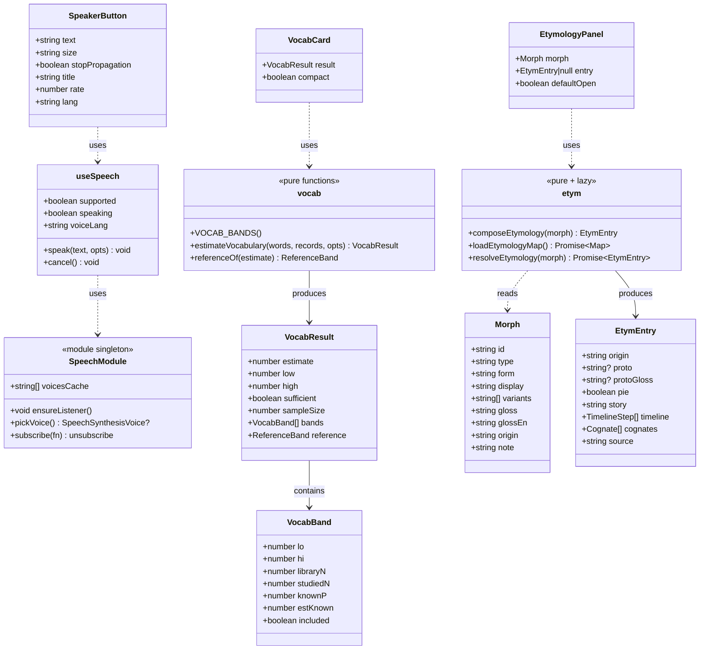
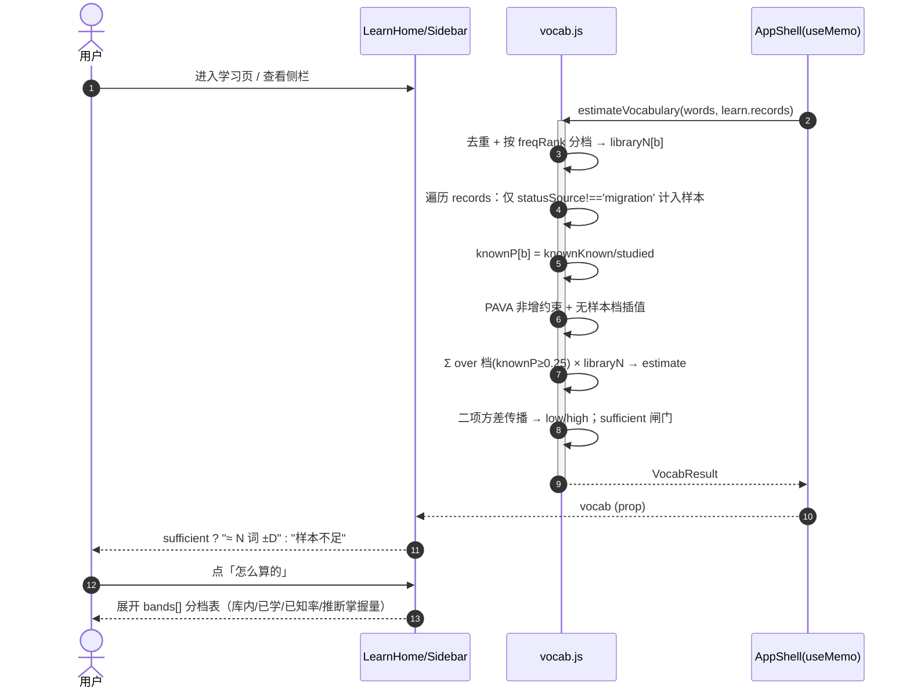
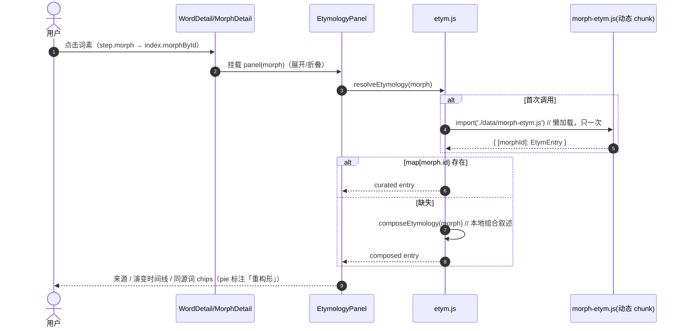

# 增量系统设计 · 发音 / 预测词汇量 / 词源故事

> 归属：`word-root-cloud`（React 18 + Vite 5 + Tailwind，无路由单页页签，离线优先 localStorage + 可选 Supabase 同步，部署 Cloudflare Pages）
> 性质：**增量设计**。不改动现有信息架构、不改数据存储口径，只描述新增与最小接线点。
> 需求来源：`docs/features-prd.md`（PM 增量 PRD）+ team-lead 对 Q1~Q7 的拍板（视为需求）。

---

## 0. 范围与红线（贯穿全设计）

| 红线 | 落地方式 |
|---|---|
| **不引入任何 SRS 字段** | 三功能均**不新增** `ease/interval/lapses/reps`；不改 `src/lib/learning.js`、`src/lib/migrate.js`、`learn_records`、云 schema。 |
| **音标只查表，严禁生成** | 发音走浏览器原生 TTS；词源数据**不含音标字段**；音标仅经 `src/lib/dict.js::phoneticsOfAsync` 查 ECDICT 分片。 |
| **大数据文件不进首屏 bundle** | `src/data/morph-etym.js` **只允许动态 import**（经 `src/lib/etym.js`），禁止任何静态 `import`；Vite 自动切 chunk。 |
| **零新增运行时依赖** | `speechSynthesis` 浏览器原生；`vocab.js`/`etym.js` 为纯 JS。**不新增任何 npm 依赖。** |

**既定决策（team-lead 拍板，直接作为需求）**

- **Q1**：v1 只给「本词库口径」估算 + ± 区间 + 一个**粗略参照带**（高中/四级/六级/考研 大致区间），不做母语者对标；必须可展开「怎么算的」。
- **Q2**：`autoKnown`（freqRank≤2500 继承已知）**不计入**词汇量基线；只统计**有真实记录且 `status==='known'`** 的词。实现判别：排除 `record.statusSource === 'migration'` 的记录。
- **Q3**：**批准**夜间跑 678 条词源生成（`scripts/gen-etym.mjs`）；v1 先上本地组合叙述，UI 优先精编、缺失回退组合。
- **Q4**：自动朗读**只读单词**，默认**关**；例句不朗读。
- **Q5**：无 `en-US` 时允许回退 `en-GB` → 其他 `en` → 系统默认。
- **Q6**：词汇量 **LearnHome 显著位 + Sidebar 精简版**。
- **Q7**：PIE 重构形（如 `*spek-`）**可选**：生成数据有且可靠才展示，并明确标注「重构形」。

---

## A. 实现方案

### A · 发音（点喇叭出声 · 美音）

**技术选型**：浏览器原生 `window.speechSynthesis` + `SpeechSynthesisUtterance`（零依赖）。封装为**单一 hook `useSpeech()`** + **单一展示组件 `SpeakerButton`**，4 个位置共用一套实现。

**关键点**
1. **语音选取优先级**：`en-US` → `en-GB` → 任意 `en*` → `null`（交给浏览器默认）。用 `utterance.lang` 兜底，并对 `utterance.voice` 显式赋值（存在时）。
2. **voices 异步就绪**：首帧 `getVoices()` 常为空；模块级**单一 `voiceschanged` 监听**更新共享缓存并通知订阅者（避免 N 个按钮各挂监听）。
3. **连点不重叠**：`speak()` 前先 `speechSynthesis.cancel()`；再次点击**同一文本**且正在播 → 视为「停止」。
4. **优雅降级**：`!('speechSynthesis' in window)` 或 `getVoices()` 始终为空 → `supported=false`，按钮 `disabled` + `title` 提示，**不抛异常**。
5. **事件隔离**：`WordRow` 内按钮 `stopPropagation`，不触发行选中 / 多选。
6. **自动朗读**：`autoSpeak`（默认 `false`）持久化于现有 `useSettings`（`wrc.settings.v2`）；`StudyCard` 监听 `[word.form, autoSpeak]`，仅朗读**单词**。
7. **iOS 手势**：点击即用户手势，满足自动播放策略；静音键下系统 TTS 仍可出声（在设置里给一句说明文案，非必须）。

**降级策略**：不支持 → 禁用按钮；无 en-US → 回退链；播放报错（`utterance.onerror`）→ 静默复位图标，控制台不 error。

### B · 预测词汇量

**技术选型**：纯函数 `src/lib/vocab.js`（无 React / 无网络 / 无存储），组件 `VocabCard`（显著位 + 精简位）。

**模型（可解释 / 可测 / 诚实）**
1. **分档**：沿 `freqRank` 切 ~11 档，默认边界 `500/1000/2000/3000/5000/8000/12000/20000/30000/45000/64825`（末档 hi 取 maxRank 或 `Infinity`）。
2. **证据**：每档只统计**有真实学习记录**的词（`records[id]` 存在且 `statusSource !== 'migration'`）为样本；`knownP_b = 该档真实样本中 status==='known' 占比`。未学过 / 仅继承已知的词**不计**。
3. **单调约束**：对 `knownP` 施加**非增约束**（PAVA isotonic，档按词频升序即已知率应递减）；无样本档在相邻档间插值。
4. **外推求和**：`estimate = Σ_b knownP_b × libraryN_b`，**截断**到最后一个仍满足 `knownP_b ≥ 0.25` 的档（更低频档按未掌握处理，防长尾吹大）。
5. **区间**：每档二项方差 `se_b = sqrt(p(1-p)/M_b)`，方差传播 `Var = Σ (libraryN_b)²·se_b²`，`low/high = estimate ∓ 1.96·√Var`，向左取整到整百、下限 0。
6. **样本闸门**：`Σ 真实样本 ≥ 30` **且** 有效档（有样本的档）`≥ 2`，否则 `sufficient=false`。
7. **诚实声明**：UI 明标「估算 · 非精确 · 本词库口径」；附**粗略参照带**（Q1）。

**降级策略**：样本不足 → 不显示数字，显示「样本不足，再学几轮」；离线 / 未登录天然可用（纯本地）。

### C · 词源故事

**技术选型**：三层——`lib/etym.js`（本地组合兜底 + 精编懒加载） + `data/morph-etym.js`（精编数据，动态 import） + `EtymologyPanel`（统一渲染）。

**关键点**
1. **v1 本地组合叙述 `composeEtymology(morph)`**：由现有 `origin/gloss/glossEn/note/variants` **零依赖合成**，678 词素 100% 覆盖、离线、即时、**不发网络请求**。
2. **精编优先**：`resolveEtymology(morph)` 首次调用时**动态 import** `morph-etym.js`（模块级 Promise 缓存，只加载一次），键存在用精编，否则回退组合。
3. **UI 两处**：① `WordDetail` 构词拆解中**可点词素内联展开**（step.morph → `index.morphById` 解析）；② `MorphDetail` 新增「词源故事」区块（可折叠）。
4. **PIE 重构形**：数据字段 `pie:boolean`；为真时前缀标注「重构形」，缺省则不显示（Q7）。
5. **生成管线** `scripts/gen-etym.mjs`：复用 `gen-words.mjs` 的 DeepSeek + `.gen-cache` 断点续跑模式，`--pilot 20` 试点；产出 `src/data/morph-etym.js`；**校验不含音标字段**、键 ⊂ 现有词素 id。

**降级策略**：无精编 → 组合叙述；动态 import 失败 → 组合叙述；面板加载中 → 骨架态。

---

## B. 文件清单

### 新增（9 个）

| 相对路径 | 职责（一句话） |
|---|---|
| `src/hooks/useSpeech.js` | 封装 `speechSynthesis`：共享 voice 缓存 + `voiceschanged` 订阅；暴露 `{supported, speaking, speak, cancel, voiceLang}`。 |
| `src/components/SpeakerButton.jsx` | 通用喇叭按钮（三态：可用/播放中/禁用），`stopPropagation` 可选。 |
| `src/lib/vocab.js` | 纯函数 `estimateVocabulary(words, records, opts)` + `referenceOf()` + 默认分档常量；无 React/网络/存储。 |
| `src/components/VocabCard.jsx` | 词汇量卡（显著版 + `compact` 精简版），含「怎么算的」可展开分档表。 |
| `src/lib/etym.js` | `composeEtymology()` 兜底合成 + `resolveEtymology()` 精编懒加载（动态 import，模块级缓存）。 |
| `src/components/EtymologyPanel.jsx` | 词源故事面板（来源 / 演变时间线 / 同源词 chips；精编优先、组合兜底、加载态）。 |
| `src/data/morph-etym.js` | 精编词源数据 `{ [morphId]: EtymEntry }`（初始可空对象 / 少量种子；由脚本产出）。 |
| `scripts/gen-etym.mjs` | DeepSeek 批量生成 678 条词源（`--pilot` 试点、断点续跑），产出 `morph-etym.js`。 |
| `scripts/validate-etym.mjs` | 校验 `morph-etym.js`：键 ⊂ 词素 id、无音标字段、timeline/cognates 结构合法。 |
| `scripts/test-vocab.mjs` | `estimateVocabulary` 单测：单调性 / 样本不足 / 空记录 / 区间 / 参照带。 |

> 注：实际新增 10 个（含单测），均无对现有文件的强侵入。

### 修改（7 个，均为最小接线）

| 相对路径 | 修改点 |
|---|---|
| `src/App.jsx` | ① `DEFAULT_FILTERS` 增 `autoSpeak:false`；② `WordDetail` 词头加 `SpeakerButton`；③ `WordDetail` 构词拆解：词素可点 → 内联 `EtymologyPanel`；④ `MorphDetail` 新增「词源故事」区块；⑤ `AppShell` 计算 `vocab` useMemo 并下发 `LearnHome`/`Sidebar`。 |
| `src/components/WordRow.jsx` | 词形后加 `SpeakerButton`（`stopPropagation`）。 |
| `src/components/StudyCard.jsx` | 大词头加 `SpeakerButton`；`autoSpeak` 开启时进入新卡自动朗读一次（仅单词）。 |
| `src/components/StudySession.jsx` | 透传 `autoSpeak` prop 给 `StudyCard`。 |
| `src/components/LearnHome.jsx` | 三张统计卡下方渲染 `VocabCard`（`vocab` prop 存在时）。 |
| `src/components/Sidebar.jsx` | ① 新增「朗读」设置区（`autoSpeak` 开关）；② 统计区上方放 `VocabCard compact`。 |
| `package.json` | 新增 scripts：`gen:etym`、`test:vocab`；`test:all` 追加 `validate:etym` 与 `test:vocab`。 |
| `scripts/validate-data.mjs` | 追加对 `morph-etym.js` 的引用校验（或由 `validate-etym.mjs` 独立承担，二选一；推荐独立脚本，零侵入）。 |

---

## C. 数据结构与接口

### C.1 类图（模块依赖）



### C.2 关键函数签名（TS 风格伪代码）

```ts
// ---------- src/hooks/useSpeech.js ----------
export interface UseSpeech {
  supported: boolean           // 'speechSynthesis' in window 且 Utterance 构造可用
  speaking: boolean            // 本实例是否正在播
  voiceLang: string | null     // 实际选中的 voice.lang（无语音时 null）
  speak: (text: string, opts?: { lang?: string; rate?: number }) => void
  cancel: () => void
}
export function useSpeech(): UseSpeech
// 内部：模块级 voices 缓存 + 单一 voiceschanged 监听 + 订阅集合

// ---------- src/components/SpeakerButton.jsx ----------
export interface SpeakerButtonProps {
  text: string                  // 要朗读的文本（通常 word.form）
  size?: 'xs' | 'sm' | 'md'     // 视觉尺寸，默认 'sm'
  rate?: number                 // 默认 0.9
  lang?: string                 // 默认 'en-US'
  stopPropagation?: boolean      // 默认 true（列表行内用）
  className?: string
  title?: string
}

// ---------- src/lib/vocab.js ----------
export interface VocabOpts {
  maxRank?: number          // 默认由 words 推导
  minSample?: number        // 默认 30
  minBands?: number         // 默认 2
  cutoff?: number           // 默认 0.25
  z?: number                // 默认 1.96
}
export function estimateVocabulary(
  words: Array<{ id: string; freqRank?: number }>,
  records: Record<string, { status?: string; statusSource?: string }>,
  opts?: VocabOpts
): VocabResult

export function referenceOf(estimate: number): { label: string; max: number }

// ---------- src/lib/etym.js ----------
export interface TimelineStep { era: string; text: string }
export interface Cognate { form: string; gloss?: string; wordId?: string; morphId?: string }
export interface EtymEntry {
  origin: string
  proto: string | null          // 如 '*spek-'（可选）
  protoGloss: string | null
  pie: boolean                  // proto 是否为 PIE 重构形（Q7）
  story: string                 // 一段叙述
  timeline: TimelineStep[]
  cognates: Cognate[]
  source: 'composed' | 'curated'
}
export function composeEtymology(morph: Morph): EtymEntry
export function loadEtymologyMap(): Promise<Record<string, EtymEntry>>
export function resolveEtymology(morph: Morph): Promise<EtymEntry>
```

### C.3 数据文件 schema

**`src/data/morph-etym.js`**（键 ⊂ `morphemes[].id`，**禁止出现音标字段**）

```js
export default {
  "r.spect": {
    origin: "latin",
    proto: "*spek-",            // 可选
    protoGloss: "注视",
    pie: true,                   // 重构形标注
    story: "源自拉丁 specere「看」……经拉丁 spectare、古法语进入英语。",
    timeline: [
      { era: "原始印欧语", text: "*spek-（重构形）注视" },
      { era: "拉丁",       text: "specere 看 → spectare 反复看" },
      { era: "法语",       text: "进入英语 spect- 词族" }
    ],
    cognates: [
      { form: "spectator", gloss: "观众" },
      { form: "perspective", gloss: "视角", wordId: "w.perspective" }
    ]
  }
  // …678 条由 scripts/gen-etym.mjs 产出
}
```

**组合兜底输出**（`composeEtymology`）：字段同 `EtymEntry`，`source='composed'`，`proto=null`、`pie=false`、`cognates=[]`，`timeline` 由 `origin/gloss/variants` 合成，`story` 由 `note` 拼装。

### C.4 设置字段

| 键 | 存储 | 类型 | 默认 | 说明 |
|---|---|---|---|---|
| `autoSpeak` | `wrc.settings.v2`（经 `useSettings`，与 `DEFAULT_FILTERS` 同源） | boolean | `false` | 学习卡进入新词自动朗读**单词**（不读例句）。 |

---

## D. 关键流程（时序图）

### D.1 发音点击

```mermaid
sequenceDiagram
    autonumber
    actor U as 用户
    participant SB as SpeakerButton
    participant H as useSpeech
    participant M as SpeechModule(单例)
    participant SS as window.speechSynthesis

    U->>SB: 点击喇叭
    SB->>SB: e.stopPropagation()
    SB->>H: speak(word.form)
    H->>H: supported? 否 → 直接返回（按钮本就 disabled）
    H->>SS: cancel()  // 清空队列，避免叠加
    alt 同一文本正在播
        H->>SS: cancel() → 停止，speaking=false
    else 播放
        H->>M: pickVoice()  // en-US → en-GB → en* → null
        M-->>H: voice | null
        H->>SS: new SpeechSynthesisUtterance(form)
        H->>SS: u.lang=en-US; u.rate=0.9; u.voice=voice
        H->>SS: speak(u)
        SS-->>H: onstart → speaking=true
        SS-->>H: onend / onerror → speaking=false（静默复位）
    end
    Note over M,SS: 首帧 voices 为空：M 监听 voiceschanged\n就绪后通知所有 useSpeech 实例，按钮恢复可点
```

### D.2 词汇量计算



### D.3 词源展开



---

## E. 任务列表（有序 · 含依赖 · 按实现顺序）

> **依赖拓扑**：T01 为唯一地基，T02/T03/T04/T05 均**只依赖 T01**（星形，非链式）。
> `src/App.jsx` 是共享修改点：请**按 T02 → T03 → T04 顺序**落地，避免同文件并发冲突。
> 今晚可交付切片：**T01 + T02 + T03 全量**，**T04 用组合叙述上线**，**T05 生成脚本就绪待夜跑**。

| 编号 | 任务 | 涉及文件 | 依赖 | 完成判据 |
|---|---|---|---|---|
| **T01** | **基础层（纯逻辑 + 原生 hook + 数据占位 + 脚本登记）** | `src/hooks/useSpeech.js`(新)、`src/components/SpeakerButton.jsx`(新)、`src/lib/vocab.js`(新)、`src/lib/etym.js`(新)、`src/data/morph-etym.js`(新，空对象/少量种子)、`scripts/test-vocab.mjs`(新)、`package.json`(改：`test:vocab`) | 无 | `npm run test:vocab` 全绿；`estimateVocabulary([], {})` 返回 `sufficient:false`；`useSpeech` 在无 `speechSynthesis` 环境 `supported=false` 且不抛错；`resolveEtymology` 对缺数据词素返回 `source:'composed'`。**此为唯一地基任务。** |
| **T02** | **发音全量接线（Feature A）** | `src/components/WordRow.jsx`(改)、`src/components/StudyCard.jsx`(改)、`src/components/StudySession.jsx`(改)、`src/components/Sidebar.jsx`(改：朗读开关)、`src/App.jsx`(改：`DEFAULT_FILTERS.autoSpeak` + `WordDetail` 词头喇叭) | T01 | 4 处（词详情词头 / 列表行 / 学习卡 / 词群 row）均有点击即响；连点 5 次仅最后一声；无语音环境按钮禁用 + title，控制台无 error；`autoSpeak` 默认关，开启后进新词自动读一次单词。 |
| **T03** | **预测词汇量接线（Feature B）** | `src/components/VocabCard.jsx`(新)、`src/components/LearnHome.jsx`(改)、`src/components/Sidebar.jsx`(改：精简位)、`src/App.jsx`(改：`vocab` useMemo 下发) | T01 | LearnHome 显著位显示「≈ N 词（估算 ±D）」+「怎么算的」可展开分档表；侧栏精简同源同值；空/少量记录显示「样本不足」；断网/未登录可算；`StationLearn` 版 LearnHome 不传 `vocab` 时**不渲染**该卡。 |
| **T04** | **词源故事接线（Feature C · UI）** | `src/components/EtymologyPanel.jsx`(新)、`src/App.jsx`(改：构词拆解词素可点内联展开 + `MorphDetail` 新增区块) | T01 | 词详情点 `spect` 展开显示来源/演变/同源词；`MorphDetail` 有「词源故事」区；有精编用精编、无则组合；`morph-etym.js` 为独立 chunk（首屏 bundle 体积不因 C 明显增大）；面板不显示音标。 |
| **T05** | **词源生成与校验管线（夜间长跑就绪）** | `scripts/gen-etym.mjs`(新)、`scripts/validate-etym.mjs`(新)、`package.json`(改：`gen:etym`、`validate:etym`、`test:all` 追加) | T01 | `node scripts/gen-etym.mjs --pilot 20` 可跑通并产出 20 条到 `morph-etym.js`；断点续跑（`.gen-etym-cache.json`）；`npm run validate:etym` 校验键 ⊂ 词素 id、**无音标字段**、结构合法，失败 exit 1。 |

---

## F. 依赖包

**无需新增任何第三方包。**

| 能力 | 实现 | 说明 |
|---|---|---|
| 发音 | 浏览器原生 `window.speechSynthesis` + `SpeechSynthesisUtterance` | 零依赖。 |
| 词汇量 | 原生 JS（PAVA + 二项方差） | 零依赖，纯函数。 |
| 词源 v1 | 原生字符串合成 | 零依赖、离线。 |
| 词源精编生成 | 复用现有 DeepSeek `fetch` 管线（`gen-words.mjs` 同款，仅用 `.env` 的 `DEEPSEEK_API_KEY`） | 无新依赖。 |

---

## G. 共享知识 / 跨文件约定

1. **音标红线**：`morph-etym.js` 与 `SpeakerButton`/`useSpeech` **绝不产出/存储音标**；音标只经 `src/lib/dict.js::phoneticsOfAsync` 查表。`validate-etym.mjs` 显式拦截含 `phonetic`/`phon` 字段的条目。
2. **SRS 红线**：不新增 `ease/interval/lapses/reps`；`learning.js`、`migrate.js`、`learn_records`、云读写路径**零改动**；`autoSpeak` 只写 `wrc.settings.v2`（UI 偏好，非学习记录）。
3. **词汇量口径（关键判别）**：样本 = `records[id]` 存在**且 `statusSource !== 'migration'`** 的词。这是排除 Q2「autoKnown 继承已知」的唯一可靠判别（继承记录由 `migrate.js` 打 `statusSource:'migration'`）。`knownP` 分子 = 这些真实样本中 `status==='known'` 者。**勿**用 `derive.js::effectiveStatus`（它会把无记录高频词判为 known，会污染基线）。
4. **懒加载约定**：`src/data/morph-etym.js` **只允许**通过 `src/lib/etym.js` 内 `import('../data/morph-etym.js')` 动态加载；**禁止**任何组件/其他文件静态 `import` 它。首次加载结果做**模块级 Promise 缓存**（仅加载一次）。
5. **命名约定**：组件 `PascalCase`（`SpeakerButton`/`VocabCard`/`EtymologyPanel`）；hook `useXxx`；纯逻辑放 `src/lib/*.js`；脚本 `scripts/*.mjs`；数据文件 `src/data/*.js`（`export default`）。
6. **样式/常量复用**：颜色一律取自 `src/lib/derive.js` 的 `STATUS`/`ORIGINS`/`TYPES`，**不硬编码**；三态文案取自 `src/lib/learning.js::STATUS_LABEL`。
7. **词素→单词解析**：`WordDetail` 构词拆解里 `word.chain[i].morph` 是词素 id 或 `null`；用 `index.morphById.get(step.morph)` 解析，仅解析成功才可点。
8. **设置读写**：`autoSpeak` 走现有 `useSettings`（读写 `wrc.settings.v2`），键名固定 `autoSpeak`；默认值写入 `DEFAULT_FILTERS`。
9. **组件复用半径**：`WordRow` 被 `ListView` 与 `App.jsx::MorphDetail` 复用，故其在 T02 加喇叭后，**列表页与词群详情自动覆盖**。
10. **数字格式**：词汇量统一「≈ N 词（估算 ±D）」，N 与 D 取整到**整百**；参照带为粗略区间，仅作提示，UI 明标「非精确 · 本词库口径」。

**默认分档常量（`src/lib/vocab.js`）**

```js
export const VOCAB_BOUNDS = [500,1000,2000,3000,5000,8000,12000,20000,30000,45000,64825]
export const VOCAB_REFERENCE = [
  { max: 3500, label: '高中 ~3,500' },
  { max: 4500, label: '四级 ~4,500' },
  { max: 6000, label: '六级 ~6,000' },
  { max: 8000, label: '考研 ~5,500–8,000' },
  { max: Infinity, label: '更高' },
]
```

**`SpeakerButton` props 约定**：`text`（必填） / `size`（`'xs'|'sm'|'md'`，默认 `'sm'`） / `rate`（默认 `0.9`） / `lang`（默认 `'en-US'`） / `stopPropagation`（默认 `true`） / `className` / `title`。

---

## H. 待明确事项

> 仅列**真正的未知**，与已决策项（Q1~Q7）不重复。

1. **词素「同源词」数据来源**：精编 `cognates[]` 由生成脚本产出；**没有精编时组合叙述不给同源词**是否可接受？（设计取「可接受」，避免误导。）若需 v1 就有同源例词，需另定：从 `morph.words`（该词素下单词）取前 N 个作为「同族词」近似——但语义上「同源」≠「同词素」，**需拍板是否允许此近似**。
2. **`gen-etym.mjs` 生成质量校验口径**：目前只做结构校验（键合法、无音标、字段类型）。是否需要引入「人工抽样复核清单」或「关键词黑名单」（如禁止编造不存在的词源）？成本与严格度需定。
3. **词汇量「参照带」文案口径**：Q1 已定「给粗略参照带」，但「高中/四级/六级/考研」边界值（3,500/4,500/6,000/8,000）为设计约定值。是否需要引用一个具体权威来源以便文案更严谨？
4. **`en-US` 缺失时的回退是否需要在 UI 明示**：Q5 已批准静默回退，但用户可能期望「美音」。是否需要当实际回退到 `en-GB` 时给一个极小提示？（设计默认**静默**。）
5. **`morph-etym.js` 在 `npm run build` 的切分确认**：设计依赖 Vite 对动态 import 的自动分包。若后续引入 `build.rollupOptions.manualChunks` 等自定义分片，需回归确认该文件仍是独立 chunk（当前无自定义分片，预期成立）。
