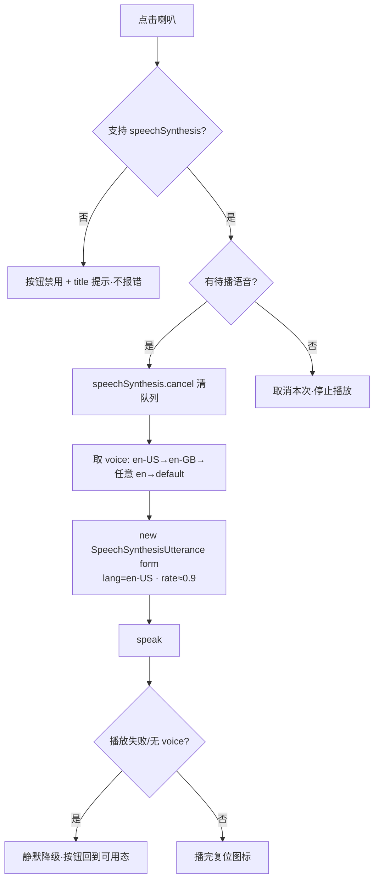

# 增量 PRD · 发音 / 预测词汇量 / 词源故事

| 项 | 值 |
|---|---|
| Language | 中文 |
| 文档类型 | **增量 PRD**（只描述新增，不改动现有信息架构） |
| Programming Language | 沿用现有：Vite + React 18 + Tailwind（无路由、单页页签） |
| Project Name | `word-root-cloud`（增量） |
| 原始需求 | "……给我的单词小站加一个**预测词汇量**和**发音**（点一下喇叭出声，美音，用浏览器自带 speechSynthesis）和**词源故事**（词素要写详细点它怎么来的、演变过程）" |
| 约束红线 | ① 不引入任何 SRS 字段；② cloud 层严禁写 `ease/interval/lapses/reps`；③ 音标严禁生成，只能查表（ECDICT / `public/data/v1/phon/`） |

---

## 1. 背景与目标

现有 app 已有完整的学习闭环（三态状态机 `learning.js`、词频分档、词族成组、离线 localStorage + 可选 Supabase 云同步），右侧详情栏已展示**音标 / 例句 / 用法 / 近反义词 / 学习状态 / 构词拆解 / 所属词群 / 难度 / 词频**。但存在三个明显缺口：

1. **只会看不会听**：词表、练习卡、详情都没有发音入口，用户无法确认读音。
2. **只有占比没有总量**：学习页只有「已掌握 X / 64825」的进度条，用户看不到"我到底相当于多少词汇量"这个更有成就感的指标。
3. **拆解只给结果不给来龙去脉**：`构词拆解` 只展示 `spect=看`，678 个词素的 `note` 仅是**短助记**，没有"这个词素从哪来、怎么演变、有哪些同源词"——而这恰恰是"词根词缀记忆法"的核心价值。

**目标（3 个正交）**

| # | 目标 | 衡量标准 |
|---|---|---|
| G1 | 会读 | 所有展示单词的位置 100% 有喇叭入口；点击 ≤300ms 出声；无声环境零报错 |
| G2 | 有总量感 | 学习首页显著位置给出可解释的词汇量估算 + 置信区间；样本不足时诚实提示而非瞎报 |
| G3 | 讲得清词源 | 拆解里每个词素可展开词源故事（来源/原始形态/演变/同源词）；离线可用 |

---

## 2. 用户故事

**A 发音**
1. 作为学习者，我在**单词详情**点喇叭能听到美音读音，以便确认发音、跟读。
2. 作为刷词用户，我在**列表行**和**词群详情**直接点喇叭，不进入详情也能听，以便快速过词。
3. 作为背单词的用户，我在**学习卡**上能点喇叭听当前词，并可在设置里开启"翻卡自动朗读"，以便边听边记（默认关）。
4. 作为移动端/静音环境用户，喇叭不可用时功能优雅隐藏或提示，绝不弹错、不卡死。

**B 预测词汇量**
5. 作为坚持学习的用户，我在**学习首页**看到"预测词汇量 ≈ 8,500 词（估算）"，以便获得总量成就感、判断水平。
6. 作为好奇的用户，我点开"怎么算的"能看到**分档外推的过程**，以便相信这个数字不是拍脑袋。
7. 作为新用户/离线用户，记录太少时我看到"样本不足，再学几轮"，且离线、未登录也能算（全部本地计算）。

**C 词源故事**
8. 作为词根记忆法用户，我在**单词详情的构词拆解**里点 `spect` 就能展开：它来自拉丁 *specere*（看）、经法语演变、同源词有 spectator / perspective……以便真正记住这个词族。
9. 作为词群浏览用户，我在**词群详情（MorphDetail）**看到该词素的完整词源故事卡，以便系统了解一个词族的来龙去脉。
10. 作为离线用户，词源故事随包内置、断网可看（不依赖运行时生成）。

---

## 3. 需求池

> 优先级：**P0 必须** / **P1 应做** / **P2 可选**。验收标准均为**可测**。

### Feature A · 发音（点喇叭出声 · 美音）

| 编号 | 需求 | 优先级 | 验收标准（可测） | 依赖 |
|---|---|---|---|---|
| A-01 | 复用组件 `SpeakerButton` + `useSpeech()` hook，封装 `window.speechSynthesis` | P0 | 抽出单一 hook/组件；4 个展示位置共用同一实现 | 无 |
| A-02 | 单词详情（`WordDetail`）词头加喇叭按钮 | P0 | 点击后调用 `speak(word.form)`；`lang='en-US'` | A-01 |
| A-03 | 列表行（`WordRow`）加喇叭按钮 | P0 | 每行可单独点响；`stopPropagation` 不触发行选中 | A-01 |
| A-04 | 学习卡（`StudyCard`）词头加喇叭按钮 | P0 | 作答前/后均可点；不干扰"记得/不记得"作答 | A-01 |
| A-05 | 词群详情（`MorphDetail`）词条行加喇叭按钮 | P0 | 经 `WordRow` 覆盖；词群标题词素本身可选（P2） | A-01 / A-03 |
| A-06 | **美音优先选声**：voice 筛选 `en-US` → 回退 `en-GB` → 任意 `en` → 系统默认 | P0 | 存在 en-US voice 时选中它；度量断言 `utterance.voice.lang` 以 `en` 开头 | A-01 |
| A-07 | **连点不重叠**：每次播放前先 `speechSynthesis.cancel()`；再次点击同一词=停止 | P0 | 连续点击 5 次，只有最后一次发声，无排队叠加 | A-01 |
| A-08 | **无语音降级**：`!('speechSynthesis' in window)` 或 voices 为空 → 隐藏/禁用按钮 + `title` 提示 | P0 | 禁用态不抛异常；控制台无 error | A-01 |
| A-09 | voice 列表异步就绪（`voiceschanged`）处理 | P0 | 首屏 voices 为空时，就绪后自动可点 | A-06 |
| A-10 | 学习卡**自动朗读开关**（默认**关**），持久化到 settings | P1 | 默认 `autoSpeak=false`；开启后进入新卡自动读一次 | A-01 / useSettings |
| A-11 | 云端用户偏好同步（若已有 settings 同步通道） | P2 | 换设备自动朗读开关跟随 | 云同步 |
| A-12 | 朗读**例句**（非仅单词）开关 | P2 | 可选朗读 `example.en` | A-01 |

### Feature B · 预测词汇量

| 编号 | 需求 | 优先级 | 验收标准（可测） | 依赖 |
|---|---|---|---|---|
| B-01 | 纯函数 `estimateVocabulary(words, records, opts)` 落在 `src/lib/vocab.js`（无 React / 无网络 / 无存储） | P0 | 同输入必得同输出；单测可跑（参考 `scripts/test-learning.mjs` 风格） | 无 |
| B-02 | 分档外推模型：按 `freqRank` 分档 → 每档用**已学样本**的已知率估计整档掌握量 → 求和 | P0 | 已确认已知词数增加时，估算**单调不减**（可测） | B-01 |
| B-03 | 输出结构 `{ estimate, low, high, sufficient, sampleSize, bands[] }` | P0 | `bands[]` 含每档 `{lo,hi,libraryN,studiedN,knownP,estKnown}` 供"怎么算的" | B-01 |
| B-04 | **样本不足**闸门：确认已知词 < `MIN_SAMPLE`(建议 30) 或有效档 < 2 → `sufficient=false` | P0 | 新用户/空记录 → 不显示数字，显示"样本不足" | B-01 |
| B-05 | `LearnHome` 显著位置展示词汇量卡（含"怎么算的"可展开） | P0 | 有数据时显示"≈ N 词（估算）"；点开显示分档表 | B-01~04 |
| B-06 | 侧栏（`Sidebar`）显示精简数字 | P1 | 与 LearnHome 同源同值 | B-01 |
| B-07 | 未登录 / 离线均可计算 | P0 | 断网、无账号时功能可用（纯本地） | B-01 |
| B-08 | `autoKnown` 是否计入的说明与开关（见 §6 Q2） | P1 | 口径在 UI 有文字说明 | B-01 |
| B-09 | 预估词数四舍五入到整十/百 + 区间（如 `≈ 8,500 ± 600`） | P1 | 数字格式统一，"±"来自二项方差传播 | B-01 |
| B-10 | 对标校准数字（如"约等于成人母语者 xx%"） | P2 | 仅在用户拍板校准基准后提供 | Q1 |

### Feature C · 词源故事（词素来源与演变）

| 编号 | 需求 | 优先级 | 验收标准（可测） | 依赖 |
|---|---|---|---|---|
| C-01 | **v1 本地组合式叙述**：由现有 `origin/gloss/glossEn/note/variants` 零依赖合成一段词源简介 | P0 | 离线、即时、678 词素全覆盖（含无精编数据者）；**不发网络请求** | 现有 morphemes |
| C-02 | 数据文件 `src/data/morph-etym.js`：`{ [morphId]: entry }`，含 `origin/proto/story/timeline/cognates` | P0 | 字段结构通过 `validate-data.mjs` 风格校验；键 ⊂ 现有词素 id | 生成管线 |
| C-03 | **构词拆解**中每个可点词素可**展开词源故事**面板 | P0 | 点 `spect` 展开显示来源/演变/同源词；有精编数据用精编，否则回退 C-01 | C-01/C-02 |
| C-04 | **词群详情（MorphDetail）**新增"词源故事"区 | P0 | 展示 `story` + `timeline`（演变时间线）+ 同源例词 | C-01/C-02 |
| C-05 | 精编数据**随构建内置**、可离线访问 | P0 | 断网可见（非运行时生成） | C-02 |
| C-06 | 懒加载：`morph-etym.js` 动态 import / 分片，不打进首屏 | P0 | 首屏 bundle 体积不因 C 明显增大 | 构建 |
| C-07 | 生成脚本 `scripts/gen-etym.mjs`（夜间长跑，复用 `gen-words.mjs` / `gen-phon.mjs` 的 DeepSeek 缓存续跑模式） | P1 | 可 `--pilot 20` 试点；断点续跑；产出落 `src/data/morph-etym.js` | DeepSeek Key |
| C-08 | 对"用户小站词涉及的词素"按需生成（补充路径） | P2 | 覆盖精编数据缺失的词素 | 服务端管线 |
| C-09 | 词源故事中的原始形态/同源词不与"音标生成"红线冲突（不产出音标） | P0 | 数据校验：etym 条目不含音标字段 | 红线 |

---

## 4. UI 设计要点

### 4.1 Feature A · 发音

**放置位置（4 处 + 覆盖点）**

| 位置 | 组件 | 位置示意 |
|---|---|---|
| 单词详情 | `WordDetail` 词头 | `expect  v.` 🔊 |
| 列表行 | `WordRow` 词形后 | `[✓] expect v.  🔊  预料… ` |
| 学习卡 | `StudyCard` 大词头 | `expect 🔊 /ɪkˈspekt/ v.` |
| 词群详情 | `MorphDetail` → `WordRow` | 自动覆盖 |

**ASCII 草图**

```
WordDetail（词头）
┌────────────────────────────────────────┐
│ ← 返回词群                              │
│  expect  🔊      v.                     │
│  预料；期待                             │
│  /ɪkˈspekt/                             │
└────────────────────────────────────────┘

StudyCard（作答前）
┌────────────────────────────────────────┐
│   expect  🔊   /ˈspekt/   [v.]    ☁在词云中查看
│  ─────────────────────────────────────
│   [ 不记得 ]            [ 记得 ]
└────────────────────────────────────────┘
        （默认不自动读；设置里可开）
```

**交互流程（Mermaid）**



**要点**
- 单一 hook `useSpeech()`：内部 `voices` 状态 + `voiceschanged` 监听；暴露 `speak(text)`、`supported`、`speaking`。
- 按钮三态：可用 / 播放中（图标变化）/ 不可用（disabled）。
- 事件隔离：`WordRow` / `MorphDetail` 里按钮 `stopPropagation`，不触发行选中、不触发多选。
- 移动端：iOS 首次需用户手势触发（点击本身即手势，满足）；静音键时 `speechSynthesis` 仍出声（系统 TTS 走媒体音轨）——在设置里给一句说明即可。

### 4.2 Feature B · 预测词汇量

**放置位置**：`LearnHome` 三张统计卡下方、难度分档上方（**显著位**）；`Sidebar` 顶部精简版。

**ASCII 草图**

```
LearnHome
┌───────────────────────────────────────────────────┐
│  [未知 812]      [待复习 46]      [已掌握 1,240]   │
├───────────────────────────────────────────────────┤
│  预测词汇量                                        │
│  ≈ 8,500 词   (估算 ±600)        ▸ 怎么算的         │
│  基于已学 1,240 词的分档外推 · 非精确                │
├───────────────────────────────────────────────────┤
│  掌握进度  ▓▓▓░░░░░░░  已知 1,240 / 64825          │
└───────────────────────────────────────────────────┘

展开「怎么算的」
┌───────────────────────────────────────────────────┐
│ 词频档      库内词数   已学   已知率   推断掌握量    │
│ 0–1000       1000       90    0.98      980         │
│ 1000–3000    2000      140    0.86     1,720        │
│ …                                                  │
│ 20000+       12000     120    0.31     3,720        │
│ ──────────────────────────────────────────────     │
│ 合计（截断至掌握率<0.25 的档）           8,500       │
│ 说明：样本=已学 1,240；区间由二项方差传播估计         │
└───────────────────────────────────────────────────┘
```

**样本不足态**

```
┌───────────────────────────────────────────┐
│  预测词汇量                                 │
│  样本不足（已确认 12 个词）                  │
│  再学几轮、多标几个「已掌握」就能估算 →       │
└───────────────────────────────────────────┘
```

**模型（可解释、可测、诚实）**

1. **分档**：沿 `log(freqRank)` 将词库切成 ~10~12 档（边界示例 `500/1000/2000/3000/5000/8000/12000/20000/30000/45000/64825`）。
2. **每档证据**：只统计**有学习记录**的词（`records[id]` 存在）作为"已学样本"；`knownP_b = 该档已学词中 status==='known' 的比例`。**未学过的词不当作已知**（避免"高频默认已知"污染）。
3. **单调约束**：理论上越靠后（越低频）的档已知率应越低；对 `knownP_b` 施加**非增约束**（isotonic），无样本档在相邻档间插值。
4. **外推求和**：`estimate = Σ_b knownP_b × libraryN_b`，并**截断**到最后仍满足 `knownP_b ≥ 0.25` 的档（更低的档按未掌握处理），避免长尾把数字吹大。
5. **区间**：每档按二项比例方差 `se_b = sqrt(p(1-p)/M_b)` 传播得 `low/high`。
6. **样本闸门**：`Σ studied ≥ 30` 且 `有效档 ≥ 2`，否则 `sufficient=false`。
7. **诚实声明**：UI 明确标注**估算、非精确**；口径是"本词库（≈64.8k 词频表）下的推断"，不默认换算成"母语者词汇量"（见 Q1）。

> `estimateVocabulary` 是纯函数，单测覆盖：单调性、样本不足、空记录、断网可用。

### 4.3 Feature C · 词源故事

**位置①：单词详情「构词拆解」内联展开**

```
构词拆解
┌──────────┐   ┌──────────┐
│ ex- 向外   │ + │ spect 看  ▾│   ← 可点词素
└──────────┘   └──────────┘
        ↓ 点击 spect 展开
┌───────────────────────────────────────────────┐
│ 词源故事 · spect                                │
│ 来源  拉丁 specere「看」← 原始印欧语 *spek-「注视」│
│ 演变  拉丁 specere → 拉丁 spectare（反复看）      │
│        → 法语 → 英语 spect-（spectacle 1520s）    │
│ 同源词  spectator 观众 · perspective 视角 ·        │
│        inspect 检查 · conspicuous 显眼的           │
└───────────────────────────────────────────────┘
```

**位置②：词群详情（MorphDetail）独立区块**

```
MorphDetail
┌─────────────────────────────┐
│ [词根] 拉丁                  │
│ spect                        │
│ 看，观察                      │
│ 与 -scope/-scopy 同源…        │
├─────────────────────────────┤
│ 词源故事  ▾                   │
│  • 来源 / 原始形态            │
│  • 演变时间线（拉丁→法语→英语）│
│  • 同源词 chips（可跳词）      │
├─────────────────────────────┤
│ 同源词 128                   │
└─────────────────────────────┘
```

**数据获取策略建议（三选一或组合）**

| 方案 | 做法 | 优点 | 缺点 |
|---|---|---|---|
| (i) 全量批量生成 | 复用 `gen-words/gen-phon` 的 DeepSeek 管线，夜间跑 **678 条** → `src/data/morph-etym.js` | 内容最丰富、离线、零运行时成本、一次到位 | 需一次生成成本/时间；质量需抽样校验 |
| (ii) 按需生成 | 只对用户小站词的词素运行时生成 | 省成本 | 引入**运行时生成依赖/成本/失败面**，离线不可用 |
| (iii) 本地组合叙述 | 由 `origin/gloss/note/variants` 即时合成 | 零依赖、即时、离线、100% 覆盖 | 只到"来源+本义+助记"，**没有具体演变过程** |

**推荐：`(iii) + (i)` 组合，`(ii)` 仅作补充。**
- **今晚 v1 先上 (iii)**：`src/lib/etym.js` 的 `composeEtymology(morph)` 由现有字段生成兜底叙述 → 保证 678 词素"点开必有内容、离线可用、零依赖"，不阻塞发版。
- **并行跑 (i)**：夜间用 `scripts/gen-etym.mjs` 批量生成精编词源，落 `morph-etym.js`。UI 读取优先级：**精编数据存在则用精编，否则回退 (iii)**。数据随构建内置 → 依然离线。
- **(ii) 不推荐作主路径**（运行时生成会破坏"离线优先"与成本可控），仅在个别词素缺精编时作为可选补洞。

---

## 5. 数据与接口影响

### 5.1 Feature A
- **新增** `src/hooks/useSpeech.js`、`src/components/SpeakerButton.jsx`。
- **改动（仅注入组件，不改数据结构）**：`WordDetail`、`WordRow`、`StudyCard`、`MorphDetail`（经 WordRow）。
- **settings**：`useSettings` 增加 `autoSpeak`（默认 `false`）——纯 UI 偏好，**非学习记录**。
- **不写任何学习/云字段**；无生成任务。

### 5.2 Feature B
- **新增** `src/lib/vocab.js`（纯函数）、`src/components/VocabCard.jsx`（LearnHome 用）、侧栏精简展示。
- **只读**现有 `words[].freqRank` + `useLearn.records`；**不新增存储字段**、不改 `learning.js`、不改 `migrate.js`。
- 断网 / 未登录可用；计算为 `useMemo` 派生，随 `records` 变化重算。
- 新增单测 `scripts/test-vocab.mjs`（参照 `test-learning.mjs`）。

### 5.3 Feature C
- **新增数据** `src/data/morph-etym.js`（`{ [morphId]: {origin, proto, protoGloss, pie?, story, timeline[], cognates[]} }`），按需 **动态 import / 分片**，不打进首屏。
- **新增** `src/lib/etym.js`（本地组合叙述兜底）、`src/components/EtymologyPanel.jsx`；可选 `scripts/gen-etym.mjs`（DeepSeek 生成，夜间长跑，缓存续跑）。
- **改动**：`WordDetail` 构词拆解（词素可点展开）、`MorphDetail`（新增区块）。
- **对现有 `morphemes` 结构无侵入**（可读 `note` 做兜底，不删不改）；`etym` 为**附加数据文件**，与 `morphemes` 通过 `id` 关联。

### 5.4 红线复核
- 三功能**均不新增** `ease/interval/lapses/reps` 等 SRS 字段；`learn_records` 结构不变。
- 发音走**浏览器原生 TTS**（不生成音标）；词源故事**不产出音标**（数据校验拦截 etym 条目含音标字段）。
- 不新增云端写路径；不改变离线优先与 Supabase 同步口径。

---

## 6. 待确认问题（需用户/架构师拍板）

| # | 问题 | 影响 |
|---|---|---|
| Q1 | **词汇量的对标口径**：只给"本词库（≈64.8k 词频表）口径"的估算数字，还是再乘一个校准因子换算成"对标母语者/雅思/托福词汇量"？ | 决定 B 是否提供第二个数字与校准基准 |
| Q2 | **`autoKnown` 是否计入基线**：`freqRank ≤ 2500` 的"高频默认已知"要不要算进"已知"？建议**只算有记录且 status=known 的词**（否则新用户会被高估）。 | 决定估算口径与 B-08 |
| Q3 | **词源故事数据策略确认**：是否批准夜间跑 **678 条 DeepSeek 词源故事**（时间/成本）？v1 是否先以**本地组合叙述 (iii)** 上线，待精编数据就绪再无缝切换？ | 决定 C 的工期与今晚可交付范围 |
| Q4 | **自动朗读范围**：仅学习卡自动读"单词"，还是也需自动读"例句"？（建议 P1 先只做单词、默认关） | 决定 A-10/A-12 |
| Q5 | **发音回退策略**：无 `en-US` voice 时回退 `en-GB`/其他 `en` 是否可接受？（建议可接受，避免"没声"） | 决定 A-06 验收 |
| Q6 | **词汇量展示位置**：仅在 `LearnHome`，还是侧栏也放？（建议 LearnHome 显著 + 侧栏精简） | 决定 B-05/B-06 |
| Q7 | **词源故事是否展示 PIE 重构形**（如 `*spek-`）：属语言学常识标注，但外观像"生成内容"，是否需要更保守的文案？（不涉及音标红线） | 决定 C-02 字段与文案口径 |

---

### 附：今晚可交付的最小切片（工程师速览）

| 功能 | P0 最小实现 | 产出文件 |
|---|---|---|
| A | `useSpeech` + `SpeakerButton`，接 `WordDetail/WordRow/StudyCard` | `hooks/useSpeech.js`、`components/SpeakerButton.jsx`（改 4 组件） |
| B | `estimateVocabulary` 纯函数 + `VocabCard` 接 `LearnHome` | `lib/vocab.js`、`components/VocabCard.jsx`、`scripts/test-vocab.mjs` |
| C | `composeEtymology` 兜底 + 拆解可点展开 + MorphDetail 区块（精编数据可选挂载） | `lib/etym.js`、`components/EtymologyPanel.jsx`（改 2 组件；数据 `morph-etym.js` 由脚本产出） |
