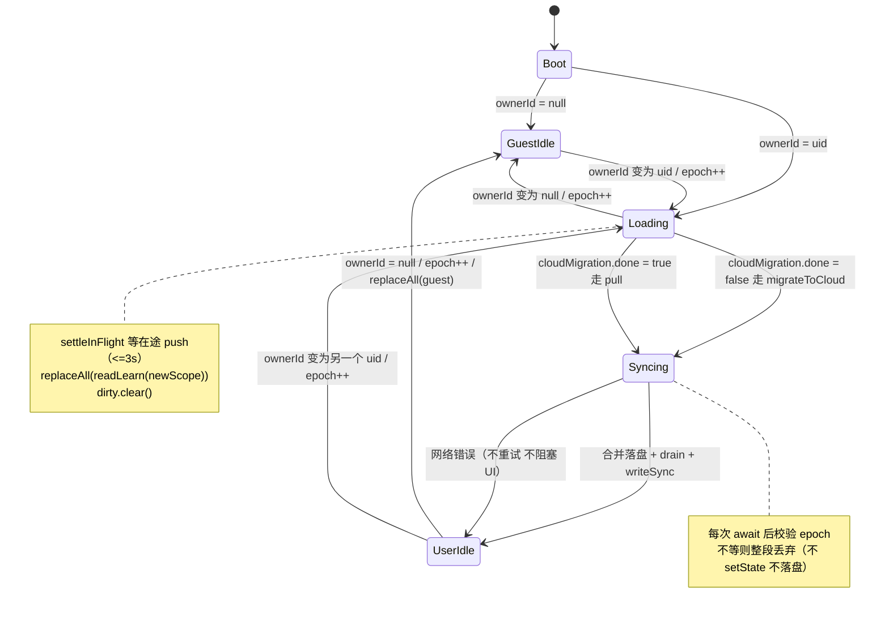
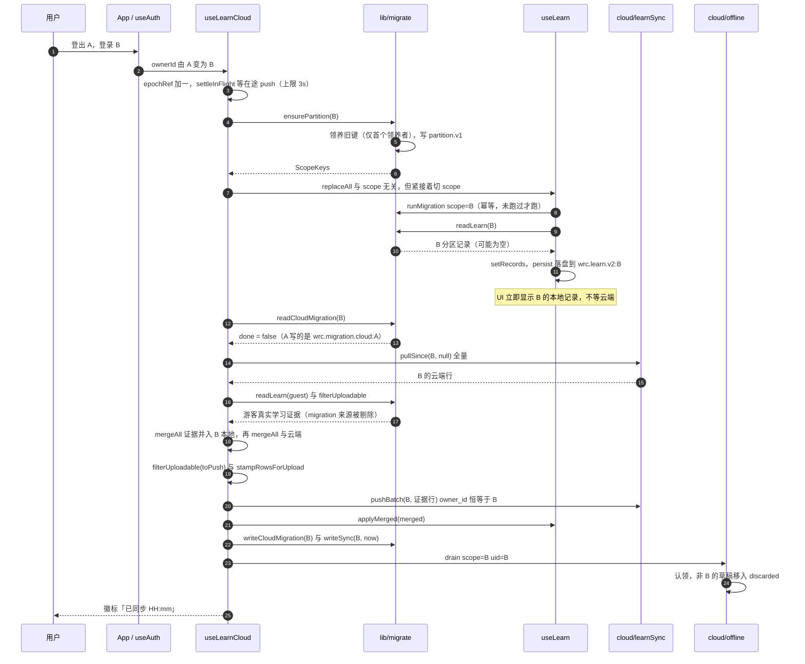
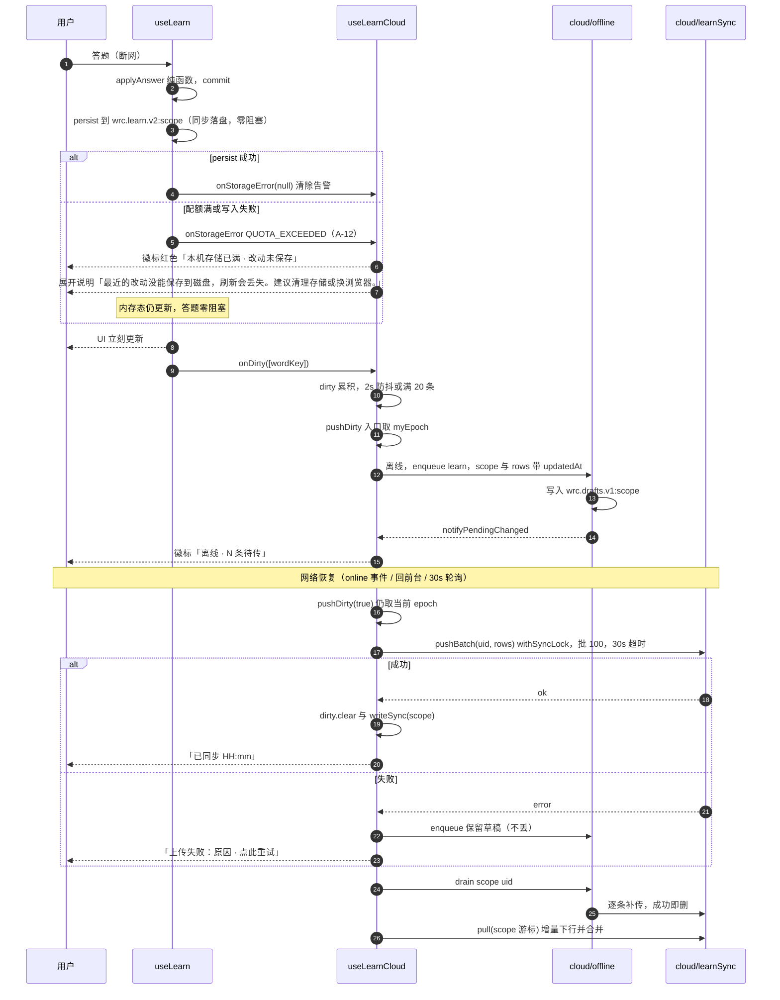
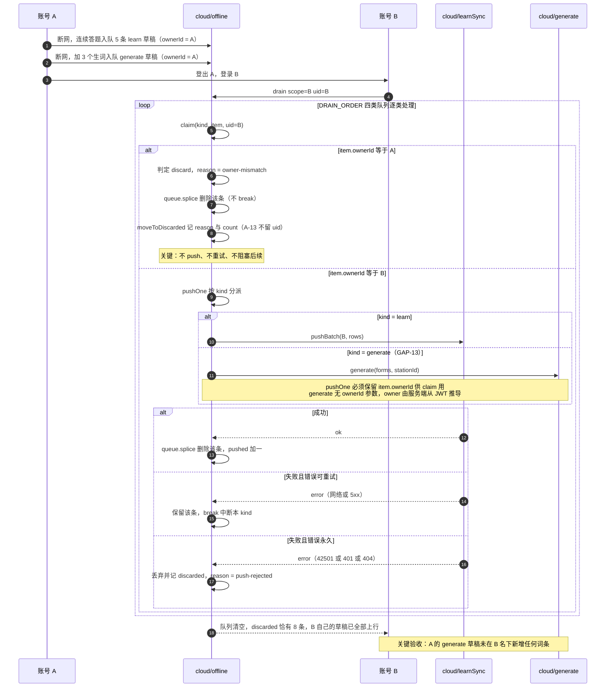
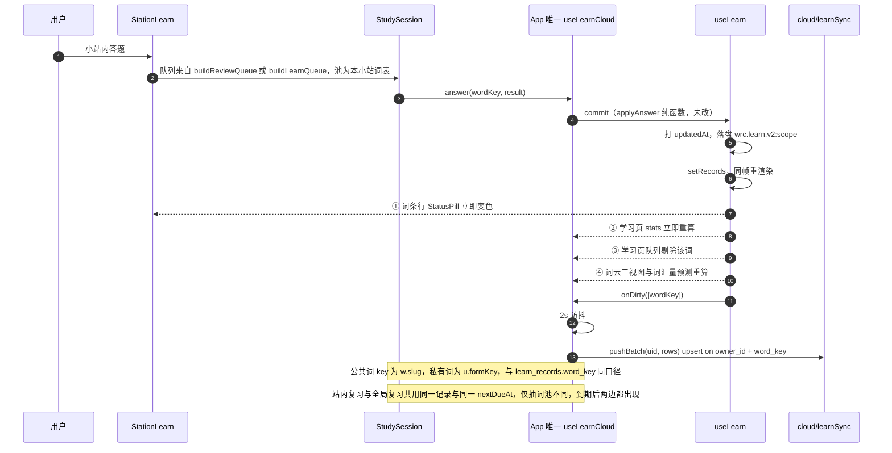
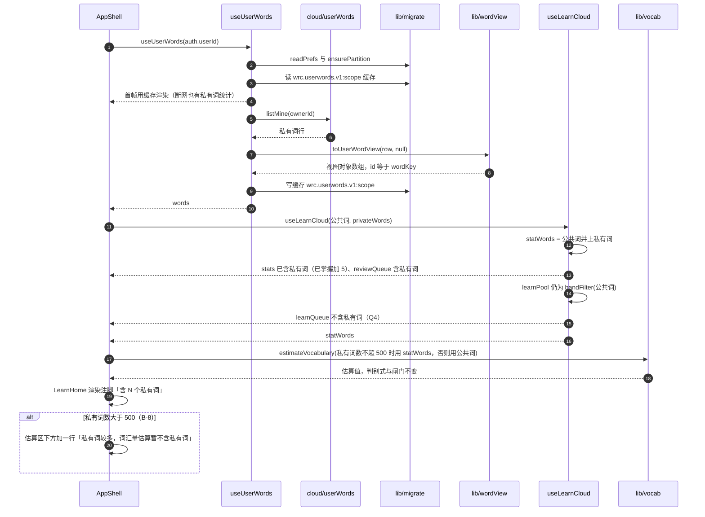
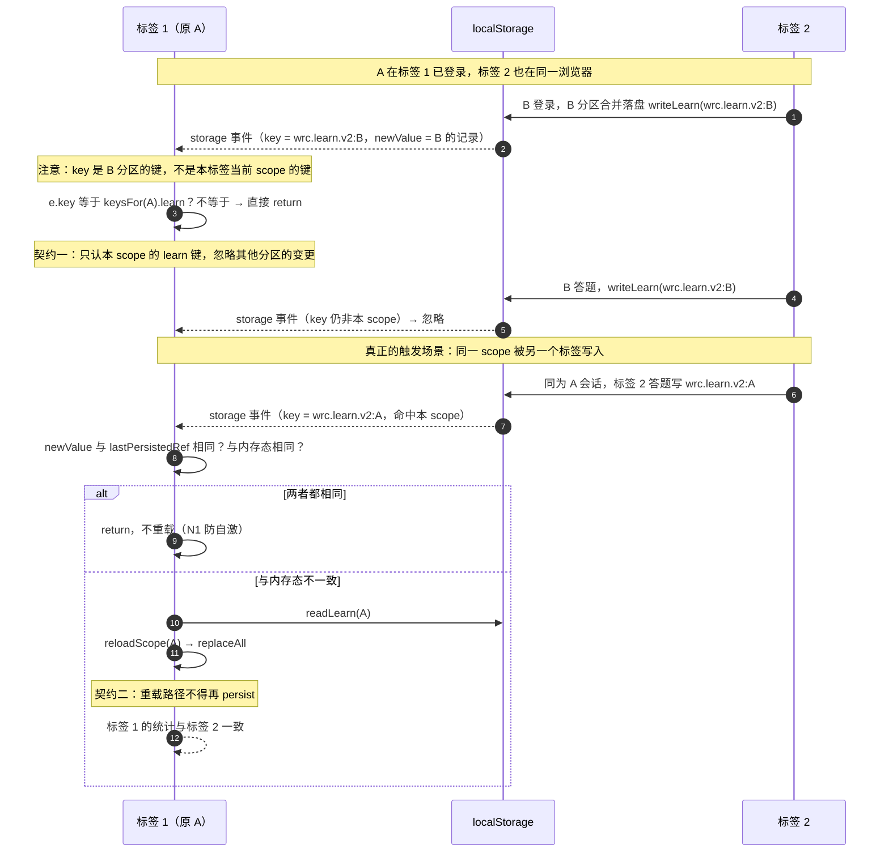
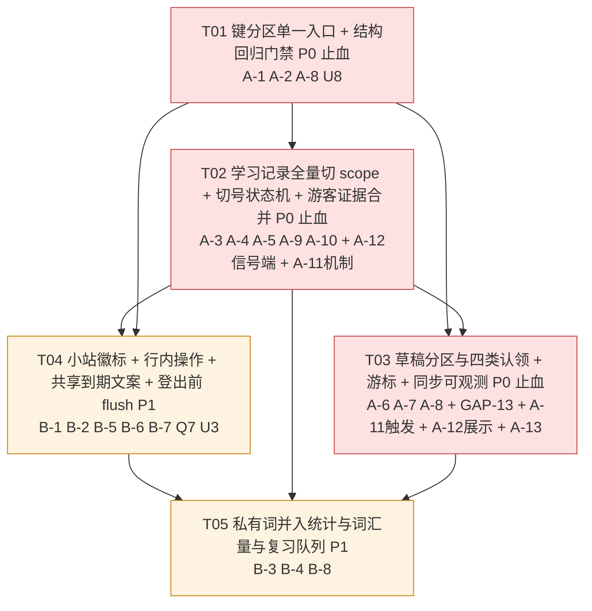
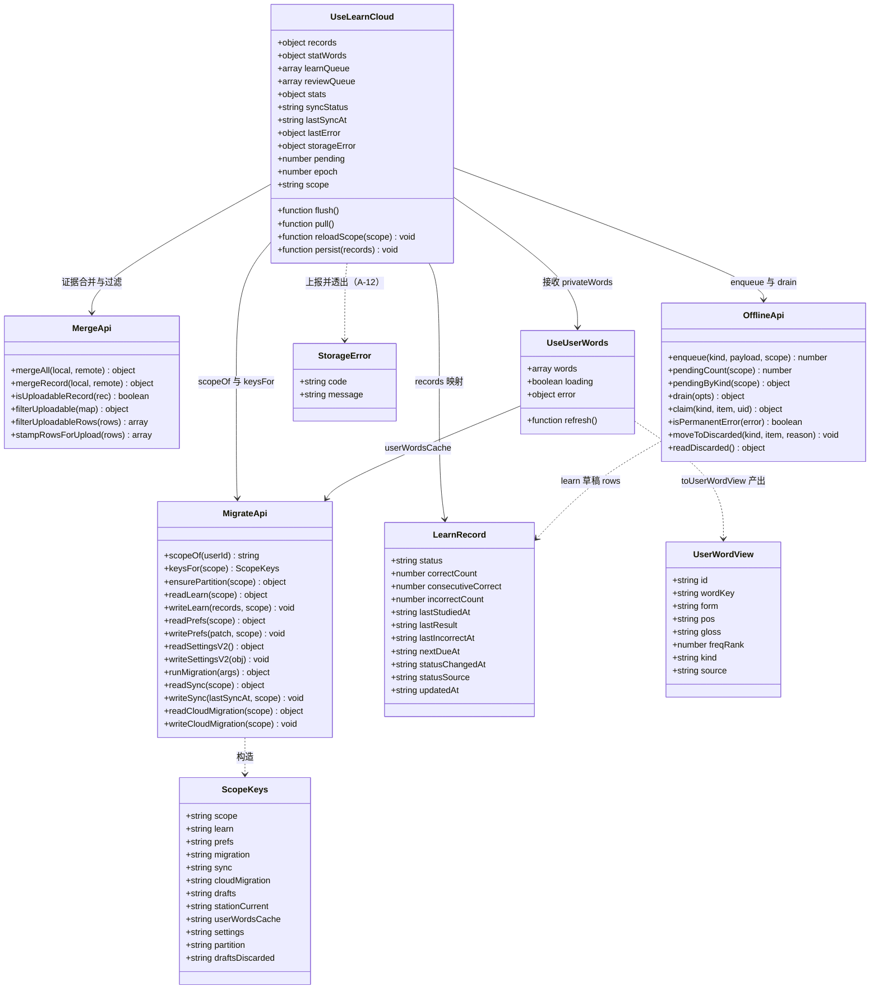

# 词根词缀单词云：学习在线化 + 小站互通 · 增量设计

> 文档状态：可直接开工（增量设计，不重做既有闭环）
> 需求输入：`docs/online-learn-prd.md`（17 条需求 + GAP-1..GAP-12）
> 决策输入：team-lead 已拍板 Q1–Q7（本文按「已决策」处理，不重复讨论）
> 红线：`src/lib/learning.js` **零改动**；cloud 层禁止任何 SRS 字段（`schema.js` 的 `assertNoSrsFields()` 兜底不变）；`wrc.status.v1` 及其两个 backup 键本次**不新增**任何访问；批量 100 / 30s 超时 / `syncLock` 防弹策略沿用
> 依赖：**零新增第三方包**

---

## 1. 实现方案

设计分两组，与 PRD 的 A / B 组一一对应。**A 组是止血项，必须先做**——现状下「A 登出→B 登录」会把 A 的学习记录写进 B 的云端账号，RLS 拦不住（`owner_id=B` 合法），这是真实数据事故。

### A 组：隔离与在线化

#### A-1 技术选型：单一键访问器 `keysFor(scope)`，禁止业务文件拼键

**做法**：在 `src/lib/migrate.js` 收敛唯一入口，业务层只传 `ownerId`，**永不接触 scope 字符串**。

```js
// src/lib/migrate.js
export function scopeOf(userId) { return normalizeScope(userId) }   // null/''/undefined → 'guest'
export function keysFor(scope) { /* 返回该 scope 的全部键 + 3 个全局键 */ }
```

`useLearnCloud` / `useSync` / `useStations` 内部各调一次 `scopeOf(ownerId)`，其余代码只见 `ownerId`。

**为什么不用 `localStorage` 命名空间对象（`localStorage.wrc[scope]`）**：命名空间 API 无法给旧键做「只读保留 + 幂等复制」的平滑升级（`Object.keys(localStorage)` 枚举在部分浏览器隐私模式下行为不稳），而逐键后缀是唯一能同时满足「旧键不删」「按账号切区」「DevTools 可肉眼核对」的方案。

**降级策略**：scope 为空/异常时 `normalizeScope` 一律回落 `'guest'`，绝不抛错、绝不返回 `undefined` 键（宁可退化成游客隔离，也不让整页崩）。

---

#### A-2 / A-6 / A-7：键集合与旧键升级（一次性、幂等、只读保留）

| 逻辑键 | 实际 localStorage 键 | 分区 | 说明 |
|---|---|---|---|
| `learn` | `wrc.learn.v2:<scope>` | ✅ | 主记录；载荷形状**不变**（`{version, records}`） |
| `prefs` | `wrc.prefs.v1:<scope>` | ✅ | **新增**：`{inheritFreqKnown, updatedAt}`，承载 Q3 |
| `migration` | `wrc.migration.v2:<scope>` | ✅ | v1→v2 迁移标记 + report（每个账号各跑一次，修 GAP-7） |
| `sync` | `wrc.sync.v1:<scope>` | ✅ | 游标；新账号分区初始 `null` → 必走全量（修 GAP-6） |
| `cloudMigration` | `wrc.migration.cloud:<scope>` | ✅ | 首次云迁移标记（修 GAP-2/GAP-3 的选路依据） |
| `drafts` | `wrc.drafts.v1:<scope>` | ✅ | 离线草稿四类队列（修 GAP-5） |
| `stationCurrent` | `wrc.station.current:<scope>` | ✅ | 当前小站，换号不残留 |
| `userWordsCache` | `wrc.userwords.v1:<scope>` | ✅ | 私有词离线兜底缓存（B-3 断网可用） |
| `settings` | `wrc.settings.v2` | ❌ 设备级 | 难度档 / 词族成组 / 自动朗读。**`inheritFreqKnown` 迁出** |
| `partition` | `wrc.partition.v1` | ❌ 全局 | `{v, adopted:{...}, at}`，防重复升级 |
| `draftsDiscarded` | `wrc.drafts.discarded` | ❌ 全局 | 跨账号丢弃日志（环形，保留最近 50 条） |

**升级契约（`ensurePartition(scope)`，幂等）**：
1. 旧键（无后缀）**一律保留不删**；铁律同 `wrc.status.v1`。
2. `adopted.learn` 记录「哪个 scope 领养了旧 learn 键」——**只允许第一个领养者**。第二个账号进来时不再复制 → 旧数据不会二次扩散到新账号。
3. `adopted.drafts` 同理，但**领养时机是「首次以某账号身份进入」**；未登录时旧草稿原地保留，等人登录。
4. 每步先 `hasKey` 判存在再写；任何一步失败只影响该键，不回滚已成功的键（升级是「锦上添花」，不是「必须成功」；真正的主存储写入仍由 `writeLearn` 独立负责）。

**降级策略**：`localStorage` 不可写（隐私模式）→ `ensurePartition` 静默返回 `{ok:false}`，应用继续以内存态运行（现状已有该兜底，不新增失败面）。

**明确的设计偏离（相对 PRD §6.1）**：`inheritFreqKnown` **不进** `wrc.learn.v2:<scope>` 的载荷，而是独立的 `prefs` 键。理由：`useLearn` 有一条「records 变化即写盘」的副作用，载荷里塞元信息会被无脑覆盖，且 `exportJson` / `validateRecords` / `importJson` 的形状要跟着变；独立键让 `learn` 载荷字节级不变，回归测试与 `scripts/test-learning.mjs` 的假设全部保持。

---

#### A-3 / A-9 / A-10：切账号状态机（`useLearnCloud` 内置 epoch 守卫）

**根因**：`useLearn` 的 records 只在挂载时 `readLearn()` 一次（GAP-10），加上 `useLearnCloud` 的 `ownerId` 副作用会 `replaceAll(mergeAll(local, remote))`——`local` 是**上一个账号**的记录，`remote` 是**当前账号**的云端，`toPush` 里全是前者的 local-only 行，`pushBatch(uid=B)` 就把 A 的数据写进了 B（RLS 合法，拦不住）。

**修复分三层，缺一不可**：

| 层 | 做法 | 挡住什么 |
|---|---|---|
| L1 数据源 | 切号时先 `replaceAll(readLearn(newScope))`，让 `recordsRef` **只**可能是当前 scope 的数据 | `toPush` 里不可能出现他账号行（根治） |
| L2 epoch 守卫 | `ownerId` 变化时 `epochRef.current++`；`pushDirty` / `pull` / `migrateToCloud` 入口取 `myEpoch`，每次 `await` 之后、**任何** `setState` / `writeXxx` / `applyMerged` 之前校验 `myEpoch === epochRef.current`，不等则整段丢弃 | 在途请求跨账号落地（写游标 / 写合并结果 / 写云迁移标记） |
| L3 互斥收敛 | 切号前 `await settleInFlight()`（等当前 push promise，最多 3s，超时则放弃等待但 epoch 已失配） | A-9 要求的「等结束或显式 abort」 |

**状态机**（`scopeState.phase`）：

| 当前 | 事件 | 动作 | 下一状态 |
|---|---|---|---|
| `idle(guest)` | `ownerId → uid` | `epoch++` → `ensurePartition(uid)` → `settleInFlight()` → `replaceAll(readLearn(uid))` → `dirty.clear()` | `loading` |
| `loading` | `readCloudMigration(uid).done === false` | `migrateToCloud(uid)` | `syncing` |
| `loading` | `done === true` | `pull(uid)` | `syncing` |
| `syncing` | 合并落盘完成 | `drain({scope, uid})` → `writeSync(scope, now)` | `idle(uid)` |
| `syncing` | 网络错误 | `setLastError` / `setSyncStatus('error')`，**不重试不阻塞 UI** | `idle(uid)` |
| `idle(uid)` | `ownerId → null` | `epoch++` → `settleInFlight()` → `replaceAll(readLearn('guest'))` → `dirty.clear()` | `idle(guest)` |
| 任意 | `online: false → true` | `pushDirty(true)` → `drain()` → `pull()` | 原状态 |

**离线优先（A-10）**：状态机全部在 `useEffect` 里异步跑，**不参与** `commit()` 的同步路径。答题永远只做「内存 setState + `persist(next, scope)` 落盘」，零网络等待、零 UI 阻塞。分区切换期间 UI 用**新 scope 的本地记录**立即渲染（不等云端），云端结果后到后覆盖。

---

#### A-4 / A-5：游客 → 登录 = 合并，且只上传「学习证据」

**选路**（修 GAP-2/GAP-3）：`readCloudMigration(scope).done` 换成带 scope 的读取。B 账号的分区键是 `wrc.migration.cloud:B`，A 写的是 `wrc.migration.cloud:A` → B 必然 `done=false` → 走 `migrateToCloud` 全量路径，不会再拿 A 的本地做 merge。

**合并算法（两次 `mergeAll`，不写新合并逻辑）**：

```js
// 1) 游客证据 → 账号分区（记录级 LWW，account 与 guest 同键时按 updatedAt 决）
const evidence = filterUploadable(readLearn('guest'))     // 只要 statusSource !== 'migration'
const local    = { ...readLearn(scope), ...mergeAll(evidence, readLearn(scope)).merged }
// 2) 账号本地 → 云端
const { merged, toPush } = mergeAll(local, remote)
// 3) 只上传真实学习证据（Q2）
await pushBatch(uid, stampRowsForUpload(filterUploadable(toPush)))
applyMerged(merged); writeCloudMigration(scope)
```

**为什么游客的 `statusSource==='migration'` 记录不合并进账号分区**（不只是「不上传」）：新账号自己会跑一次 `runMigration` 生成**属于自己 `inheritFreqKnown` 开关**的继承集合；把游客的继承集合也塞进来会产生两套语义重叠、且在 B 改过继承开关后互相打架。真实学习证据（`learning` / `manual-*`）才必须跨设备延续。

**幂等（关键）**：合并动作在**每次进入账号分区时都跑**（不只在首次）。因为「登录 → 登出 → 以游客身份背了几个词 → 再登录」这条路径必须有合并，否则游客期间的学习证据会丢。`filterUploadable(readLearn('guest'))` 为空时开销≈0（一个对象过滤），不做短路优化以免埋第二套判据。

**A-5 时间戳（GAP-4）**：`stampUpdatedAt` **常开**（任何 scope 都打），而不是登录时补全量时间戳。
- 成本可控：只有**游客态新写入**的记录带 `updatedAt`，3 万条继承记录是历史存量、不会被回填，PRD 风险表里的「+1MB」不成立。
- 兜底再加一层：`stampRowsForUpload(rows)` 在上行前对每行做 `rec.updatedAt || rec.statusChangedAt || rec.lastStudiedAt || now`，覆盖「老版本客户端在游客态写过、且本地已被清过」的长尾。
- `merge.js` 规则本身**不改**（无 `updatedAt` 视为 0 → 取云端），红线上「裁决口径不变」保持。

---

#### A-6：草稿按 scope 分区 + 认领 / 丢弃（修 GAP-5）

现状 `drain()` 遇到失败即 `break`，而 A 的草稿带着 A 的 `ownerId`，B 登录后用 B 的 token 去推 → RLS 拒绝 → 草稿永不删且卡队首，B 自己的草稿也永远传不上去。

**新 `drain()` 语义（认领 / 丢弃 / 真失败三分）**：

```
for kind of DRAIN_ORDER:
  queue = drafts[kind]
  i = 0
  while i < queue.length:
    item = queue[i]
    verdict = claim(kind, item, uid)          # ① 认领
    if verdict === 'discard':
      moveToDiscarded(kind, item, verdict.reason); queue.splice(i,1); continue   # ② 丢弃，不阻塞
    if verdict === 'skip':                    # 结构性损坏 / 缺 ownerId
      moveToDiscarded(kind, item, verdict.reason); queue.splice(i,1); continue
    ok = await pushOne(kind, item)
    if ok: queue.splice(i,1); pushed++
    else:
      failed++
      if isPermanentError(lastError): moveToDiscarded(...); queue.splice(i,1)    # ③ RLS/401/404 → 永久失败，丢弃
      else: break                              # 网络抖动 → 保留，本 kind 中断，等下轮
  write(drafts)
```

**认领表（`claim()`）**：

| kind | 认领条件 | 不认领时的动作 |
|---|---|---|
| `learn` | `item.ownerId === uid` | 丢弃，原因 `owner-mismatch` |
| `stationWords` | `item.ownerId === uid` | 丢弃，原因 `owner-mismatch` |
| `stations` | `item.row?.ownerId === uid` | 丢弃，原因 `owner-mismatch` |
| `generate` | `item.ownerId === uid` | 丢弃，原因 `owner-mismatch` |
| 全部 | 缺 `uid`（游客） | 整个 `drain` 直接返回 `skippedNoAuth`，不动队列 |

这条规则同时兜住了 `generate` 草稿的跨账号污染（**GAP-13**）：`pushOne('generate')` 只解构 `{ stationId, forms }`——`ownerId` 被**直接丢弃**；而 `generateApi.generate(forms, stationId, onProgress)` **根本没有 ownerId 参数**，owner 100% 由服务端从 JWT 推导。旧账号遗留的 `generate` 草稿在 B 登录后执行，会**把词生成到 B 账号下**——比 `learn` 更隐蔽（不留学习痕迹，B 只看到一批陌生词条且无法解释来源）。因此 `pushOne('generate')` 解构时**必须保留 `item.ownerId`**。

**认领是与错误形态无关的第一道防线（U1 定调）**：即使下面的 `isPermanentError` 白名单全判错，最坏也只是「队列清不掉」，**绝不会发生跨账号污染**——因为 `claim()` 在推送之前就把非本账号条目剔除了。这不依赖任何 error code 猜测，是 A-6 的正确性基座。

**永久失败判定**：`{code}` 属于 `42501 / 403 / 401 / PGRST301 / 'NOT_FOUND'` 或 `message` 含 `row-level security|permission|jwt` → 丢弃并记录；其余（网络错 / 5xx / 超时）→ 保留重试。白名单的具体形态需实测校准，见 §8.1 U1。

**`pendingCount` 口径**：只统计**当前 scope** 队列，`discarded` 不计入（否则徽标会永久显示一个减不掉的数字）。

---

#### A-8：可观测性（`SyncBadge` 四态 → 六态）

`SyncBadge` 现在只看 `useSync`，看不到 `useLearnCloud` 的 `syncStatus / lastError`。改为同时接 `sync`（连接/草稿层）与 `learn`（上行/合并层）：

| 条件 | 文案 | 配色 |
|---|---|---|
| `!ownerId` | `本地模式（游客）` | slate |
| `learn.storageError?.code === 'QUOTA_EXCEEDED'` | `本机存储已满 · 改动未保存` | red |
| `learn.lastError` | `上传失败：<message> · 点此重试` | red |
| `!sync.online \|\| pending > 0` | `离线 · N 条待传` | amber |
| `learn.syncStatus === 'syncing'` | `同步中…` | slate |
| `lastSyncAt` | `已同步 HH:mm` | emerald |

**容量告警优先级最高**（A-12）：它意味着「用户以为存上了其实没存」，比同步失败更严重，必须压过 `lastError` 与离线态。且**告警态要持续到下一次 `persist` 成功**才恢复——不是一次性 toast。信号链见 §3.6。

点击 → `learn.flush()`（= `pushDirty(true)` + `drain({force:true})`），取代现在的 `sync.syncNow()`（后者不保证把 dirty 推上去）。样式类沿用现有 `px-2 py-1 rounded border text-[11px]` 约定，不引入新设计语言。

---

### B 组：互通可感知 + 私有词入视野

#### B-1 / B-2：小站词条行的状态徽标与行内快捷操作

**做法**：新增 `src/components/StatusPill.jsx`，唯一数据源是 `derive.js` 的 `STATUS`（`color/soft/icon/label`），与 `WordDetail` / `LearnHome` 卡片视觉完全一致（PRD 红线：组件不得硬编码颜色）。`StationLearn` 词条行右侧渲染 `<StatusPill status={...} />` + 三个 11px 幽灵按钮。

- 需要 `records`（已有）+ `recordOf`（`derive.js` 已有，`w.id === wordKey` 天然对齐，无需新计算）
- 需要 App 补传 `setReview` / `retreat` 两个 `useLearnCloud` 方法（纯透传，无新逻辑、无新 API）

**B-5 共享到期文案**：`LearnHome` 已被 `StationLearn` 复用，因此文案只需在 `LearnHome` 加一个 `showSharedNote` 开关 prop，两端各传一次，**不新建组件**。文案固定为：「小站复习与学习复习是同一份记录、同一个到期时间（答错 +24h），到期后两边都会出现，不是重复出题。」

#### B-3 / B-4 / Q4：私有词进入统计、词汇量预测、复习队列（**不进新学队列**）

**根因**：`useLearn(words)` 的 `words` 是公共库 64825 词，不含 `u.*`；而 `stats` / `reviewQueue` / `vocab` 全部由这个 list 派生 → 私有词在三个地方同时隐形。

**做法**：`useLearn` 内部**一分为二**成两个词集，这是唯一需要动的接缝：

| 词集 | 组成 | 消费者 | 私有词 |
|---|---|---|---|
| `statWords` | `list ∪ privateWords` | `countByStatus` → `stats`；`buildReviewQueue` → `reviewQueue`；`estimateVocabulary` → `vocab` | ✅ 进 |
| `learnPool` | `bandFilter(list, band)` | `buildLearnQueue` → `learnQueue`；`bandCounts` | ❌ 不进（Q4） |

`buildLearnQueue` 按 `freqRank` 升序抽词，私有词 `freqRank` 多为 `null`（`num(null)` → `MAX_SAFE_INTEGER`，会被排到最后一档再被 `take(size)` 砍掉）——放进去不但打乱难度序，还几乎必然抽不到。**结构上把它排除，比在队列里加判据更干净、零运行时开销。**

**私有词视图对象的唯一构造点**：新增 `src/lib/wordView.js` 的纯函数 `toUserWordView(row, note)`，`useStationWords.js`（已有同一段内联映射）与新增的 `useUserWords.js` **共用**，杜绝两处映射漂移。数据形状与 `useStationWords.js:78-100` 现有输出**逐字段一致**，不做任何扩展。

**离线兜底**：新增 `useUserWords(ownerId)` 走 `userWordsApi.listMine(ownerId)`（现成 API，当前全项目未被调用），成功后把视图对象数组写 `wrc.userwords.v1:<scope>`；读取时**先用缓存首帧渲染**，再异步刷新。断网时学习页的私有词统计不消失。

**词汇量预测的注脚与上限护栏**：`App.jsx` 里

```js
const vocabInput = userWords.words.length <= MAX_VOCAB_PRIVATE_WORDS ? learn.statWords : words
const vocab = useMemo(() => estimateVocabulary(vocabInput, learn.records), [vocabInput, learn.records])
```

`MAX_VOCAB_PRIVATE_WORDS = 500`（放 `derive.js` 常量区，紧邻 `STATS_SCOPE`）。理由：`estimateVocabulary` 按 `freqRank` 分档，私有词 `freqRank=null` 会被 `bandIndexOf` 归到**最后一档**（`60000~∞`），既进 `libraryN` 又进 `studiedN`。5 个私有词是噪声（末档约 2 万词，且尾档通常被 `cutoff=0.25` 截断不计）；但私有词上千时会实打实抬高尾档 `knownP` → 吹大估值。500 是护栏，不是口径变更：`statusSource !== 'migration'` 判别式、`minSample/minBands/cutoff/PAVA` 全部**不动**。

`LearnHome` 新增可选 prop `privateCount`，在 `VocabCard` 下方渲染一行注脚「含 N 个私有词」（符合 Q6「一个数 + 一行注脚」）。

#### B-6 / B-7 / GAP-12：小站收尾

- `StationLearn` → `UserWordEditor` 的 `ownerId={null}` 改为透传真实 `ownerId`（App 已有）。
- 词条列表补图例（未知 / 待复习 / 已掌握 三色）与空态——空态已存在，保留并补图例。

---

## 2. 文件清单

### 新增（5 个）

| 相对路径 | 一句话职责 |
|---|---|
| `src/lib/wordView.js` | 纯函数 `toUserWordView(row, note)`：私有词 → 学习侧 Word 视图对象（`id = wordKey`），小站与全局共用唯一构造点 |
| `src/hooks/useUserWords.js` | 拉取当前账号全部私有词并转视图对象；读 `wrc.userwords.v1:<scope>` 缓存首帧；断网可用 |
| `src/components/StatusPill.jsx` | 三态徽标，唯一配色源 `derive.STATUS`；小站词条行与（可选）列表页复用 |
| `scripts/check-storage-keys.mjs` | **结构回归门禁**：断言 `src/` 中只有 `migrate.js`（+ `dict.js` 的 IndexedDB 前缀白名单）能出现存储键字面量 |
| `scripts/test-partition.mjs` | `keysFor` / `ensurePartition` / `scopeOf` / `filterUploadable` / `stampRowsForUpload` 的纯函数单测（Node 直跑，无浏览器依赖） |

### 修改（12 个）

| 相对路径 | 改动摘要 |
|---|---|
| `src/lib/migrate.js` | **本次的地基**：`scopeOf` / `keysFor` / `LEGACY_KEYS` / `FROZEN_KEYS` / `normalizeScope` / `ensurePartition`；`readLearn/writeLearn/exportLocalRecords/runMigration/clearMigration/readSync/writeSync/readCloudMigration/writeCloudMigration` 全部加 `scope` 首参；新增 `readPrefs/writePrefs`；`readSettingsV2/writeSettingsV2` 移出 `inheritFreqKnown`；**`adopted.X` 在对应键写成功后才落盘**（N3） |
| `src/lib/dict.js` | 仅加一条顶部约束注释（U8）：「禁止把 `u.*` 私有词写入本缓存」。**逻辑零改动** |
| `src/lib/cloud/merge.js` | 新增纯函数 `isUploadableRecord` / `filterUploadable` / `filterUploadableRows` / `stampRowsForUpload`；**`mergeRecord` / `mergeAll` 逻辑一行不改** |
| `src/lib/cloud/offline.js` | 删除模块级 `DRAFTS_KEY`，改用 `keysFor(scope).drafts`；`enqueue/pendingCount/pendingByKind/readDrafts/clearKind` 加 `scope`；`drain({scope, uid})` 实现认领/丢弃/永久失败三态；新增 `moveToDiscarded` / `readDiscarded` / `isPermanentError`；**`pushOne('generate')` 解构时保留 `ownerId`**（GAP-13）；`discarded` 条目**不含 uid 片段**（A-13） |
| `src/hooks/useLearn.js` | 加 `scope` / `privateWords` / `onStorageError` 三参；拆出 `statWords`；`stampUpdatedAt` 默认 `true`；**删除「records 变化即写盘」副作用**，改为在 `commit/applyMany/replaceAll/clearAll/importJson/rerunMigration` 六个写入点用 `persist(next, scopeRef.current)` 落盘（`persist` 的 catch 上报 `onStorageError`）；新增切号 effect |
| `src/hooks/useLearnCloud.js` | epoch 守卫 + `settleInFlight` + `scopeState` 状态机；`readCloudMigration` 等全部带 scope；`pull` / `migrateToCloud` 走「证据合并 + 证据过滤上行」；`pull` 游标改为只按服务端 `maxUpdatedAt` 前进；新增 `reloadScope(scope)` + `lastPersistedRef`（T03 的 storage 监听复用）；返回值新增 `statWords` / `scope` / `flush` / `storageError`；`pending` 改为响应式订阅；挂 `storage` 监听（A-11） |
| `src/hooks/useSync.js` | `scopeOf(ownerId)`；`pendingCount` / `drain` 带 scope；`registerPullHandler` 改为携带 scope 的处理器 |
| `src/hooks/useStations.js` | `LS_CURRENT` 字面量删除，改 `keysFor(scopeOf(ownerId)).stationCurrent`；进站时 `ensurePartition` 领养旧键 |
| `src/components/StationLearn.jsx` | 词条行加 `StatusPill` + 三个快捷按钮；`LearnHome` 传 `showSharedNote`；`UserWordEditor` 传真实 `ownerId`；补状态图例（B-7） |
| `src/components/LearnHome.jsx` | 新增 `showSharedNote` / `privateCount` / `vocabIncludesPrivate` 三个可选 prop（默认关，零影响现有两处调用）；`vocabIncludesPrivate === false` 时渲染 B-8 小字 |
| `src/components/SyncBadge.jsx` | 增加 `learn` prop；四态 → **六态**（新增 `storageError.code === 'QUOTA_EXCEEDED'` 红色徽标 + `title` 展开说明，文案定稿见 §3.6，A-12）；点击改调 `learn.flush()` |
| `src/components/AuthPanel.jsx` | 新增可选 `beforeSignOut` prop（Q7）：`false` 则中止登出；弹窗文案含 U3 说明 |
| `src/App.jsx` | 接入 `useUserWords` / `privateWords` / `vocabInput` 护栏 / `vocabIncludesPrivate`；给 `StationLearn` 补传 `setReview` / `retreat` / `ownerId`；给 `SyncBadge` 补传 `learn`；实现 `beforeSignOut` flush 确认 |
| `package.json` | 新增 `test:keys`（结构回归）脚本，并入 `test:cloud` |
| `scripts/test-merge.mjs` | 补 4 组用例：证据过滤、迁移记录不上传、时间戳兜底、两次合并幂等 |

---

## 3. 数据结构与接口

### 3.1 `keysFor(scope)` —— 签名与键集合

```js
/**
 * 归一化 scope：任何 falsy 或非字符串 → 'guest'
 * @param {string|null|undefined} userId
 * @returns {string} 'guest' 或用户 uid
 */
export function scopeOf(userId)

/**
 * 全应用唯一的存储键访问器。业务代码禁止自行拼接 'wrc.*'。
 * @param {string|null|undefined} scope scopeOf() 的结果；非法值回落 'guest'
 * @returns {ScopeKeys}
 */
export function keysFor(scope)

/**
 * @typedef {Object} ScopeKeys
 * @property {string} scope
 * @property {string} learn            wrc.learn.v2:<scope>
 * @property {string} prefs           wrc.prefs.v1:<scope>
 * @property {string} migration       wrc.migration.v2:<scope>
 * @property {string} sync            wrc.sync.v1:<scope>
 * @property {string} cloudMigration  wrc.migration.cloud:<scope>
 * @property {string} drafts          wrc.drafts.v1:<scope>
 * @property {string} stationCurrent  wrc.station.current:<scope>
 * @property {string} userWordsCache  wrc.userwords.v1:<scope>
 * @property {string} settings        wrc.settings.v2            （设备级，不分区）
 * @property {string} partition       wrc.partition.v1           （全局升级标记）
 * @property {string} draftsDiscarded wrc.drafts.discarded       （全局丢弃日志）
 */

/** 旧键：只读领养，永不删除 */
export const LEGACY_KEYS = {
  learn: 'wrc.learn.v2', migration: 'wrc.migration.v2', sync: 'wrc.sync.v1',
  cloudMigration: 'wrc.migration.cloud', drafts: 'wrc.drafts.v1',
  stationCurrent: 'wrc.station.current',
}

/** 冻结键：本次不新增任何访问（v1→v2 迁移的既有读取保持原样） */
export const FROZEN_KEYS = {
  statusV1: 'wrc.status.v1', statusV1Backup: 'wrc.status.v1.backup',
  settingsV1: 'wrc.settings.v1', settingsV1Backup: 'wrc.settings.v1.backup',
}

/**
 * 旧键 → 分区键的幂等升级（可重复调用）。
 * @param {string} scope
 * @returns {{ ok: boolean, adopted: string[], skipped: boolean, error?: string }}
 */
export function ensurePartition(scope)
```

`prefs` 载荷：`{ inheritFreqKnown: boolean, updatedAt: string|null }`。
`partition` 载荷：`{ v: 1, at: string, adopted: { learn?: string, drafts?: string, stationCurrent?: string, prefs?: string } }`——`adopted.X` 的值是**领养者 scope**，用于「只允许第一个领养者」判定。
`draftsDiscarded` 载荷：`{ at, entries: Array<{ at, kind, reason, count, queuedAt }> }`，`entries` 上限 50（环形覆盖）。**A-13：不含任何 uid 片段**——半截 uid 在本机场景没有实际用途，却留下可拼接的隐私面。

### 3.2 分区切换状态机



不可变约束（写代码时对照）：
1. `recordsRef.current` 里的任何一条记录，其归属 scope **恒等于** `scopeRef.current`。
2. 任何 `writeXxx(...)` 的 scope 参数 **恒等于** `scopeRef.current`。
3. epoch 失配后**不允许**任何副作用（`setState` / `writeLearn` / `writeSync` / `writeCloudMigration` / `applyMerged`）。

### 3.3 `drain()` 的认领 / 丢弃策略

```js
/**
 * @param {object}  [opts]
 * @param {string}  [opts.scope]   scopeOf(ownerId) 的结果；缺省 'guest'
 * @param {string}  [opts.uid]     当前 auth.uid()；null → 游客，整轮跳过
 * @param {boolean} [opts.force]    忽略 navigator.onLine（手动点同步）
 * @param {Function}[opts.onProgress]
 * @returns {Promise<{ ok, pushed, failed, discarded, skippedOffline, skippedNoAuth }>}
 */
export async function drain({ scope = 'guest', uid = null, force = false, onProgress = null } = {})

/** 认领判定（纯函数，可单测） */
export function claim(kind, item, uid)   // → { ok: true } | { ok: false, verdict: 'discard'|'skip', reason }

/** 永久失败判定：RLS / 鉴权 / 不存在 → 重试无意义 */
export function isPermanentError(error) // → boolean
```

| 情形 | 队列动作 | 记 discarded | 是否阻塞后续 |
|---|---|---|---|
| `ownerId !== uid` | 删除 | ✅ `owner-mismatch` | ❌ 不阻塞 |
| 结构损坏（缺 `rows` / 缺 `stationId` 等） | 删除 | ✅ `malformed` | ❌ 不阻塞 |
| 上行成功 | 删除 | — | — |
| 上行失败，错误可重试 | **保留** | ❌ | ⛔ 本 kind 中断，下轮重试 |
| 上行失败，错误永久（RLS/401/404） | 删除 | ✅ `push-rejected` | ❌ 不阻塞 |
| `uid` 为空（游客） | 整轮跳过 | — | — |

`discarded` 条目载荷（**A-13：不含任何 uid 片段**）：`{ at, kind, reason, count, queuedAt }`。环形保留最近 50 条。

> **`ownerId` 认领是与错误形态无关的第一道防线（U1 定调）**：即使 `isPermanentError` 的白名单全判错，最坏也只是「队列清不掉」，**绝不会发生跨账号污染**——因为 `claim()` 在推送之前就把非本账号的条目剔除了。这条不依赖任何 error code 猜测，是 A-6 的正确性基座。

### 3.4 GAP-13：`generate` 草稿必须认领（比 learn 更隐蔽）

`offline.js:181` 的 `pushOne('generate')` 只解构 `{ stationId, forms }`——**`ownerId` 被直接丢弃**；而 `generate.js:53` 的签名是 `generate(forms, stationId, onProgress)`，**根本没有 ownerId 参数**。owner 100% 由服务端从 JWT 推导。

后果：A 遗留的 generate 草稿在 B 登录后执行，会**把 A 的生词生成到 B 账号下**。它比 learn 污染更隐蔽——**不留任何学习痕迹**，B 只会在自己的词库里看到一批陌生词条，且完全无法解释来源。

设计要求：
1. `enqueue('generate', ...)` 的载荷**必须带 `ownerId`**（`AddWordsPanel.jsx:135` 当前已带，保持即可）。
2. `claim('generate', item, uid)` 与其他三类**同规则**：`item.ownerId !== uid` → `owner-mismatch` 丢弃。
3. `pushOne('generate')` 里**保留** `item.ownerId`（解构时不要丢），供 `claim` 与日志使用。
4. **验收**：A 离线产生 generate 草稿 → 登出 → B 登录 → `drain()` 后 B 名下**不得新增任何词条**。

### 3.5 `storage` 监听契约（A-11 · U2 定调）

```js
// useLearnCloud 内部
useEffect(() => {
  const onStorage = (e) => {
    if (e.key !== keysFor(scopeRef.current).learn) return          // 只认本 scope 的 learn 键
    if (e.newValue === lastPersistedRef.current) return             // 与我刚写入的完全相同 → 忽略（N1）
    if (e.newValue === JSON.stringify(recordsRef.current)) return   // 与内存态一致 → 无需重载
    reloadScope(scopeRef.current)                                   // 重载，且不得再 persist（N1）
  }
  window.addEventListener('storage', onStorage)
  return () => window.removeEventListener('storage', onStorage)
}, [])
```

五条硬约束：
1. **只认当前 scope 的 `learn` 键**：`keysFor(scopeRef.current).learn` 随 scope 变化，不硬编码键名（受 T01 门禁 R1 约束）。
2. **判据用序列化值比较，不用内存态比较**（N1，**最易写错的一条**）：必须拿 `e.newValue` 与 `lastPersistedRef.current` / `JSON.stringify(recordsRef.current)` 比**字符串**。**不能**写成「与内存态不等」——一旦重载路径上多了一次 `setRecords`，就可能自激。`lastPersistedRef` 由 T02 建立：每次 `persist` 成功后更新为刚写入的那个字符串。
3. **不做跨标签互斥**：不杀对方 tab、不发 `BroadcastChannel`、不抢占 `syncLock`。别的标签怎么改本标签不管。
4. **重载路径不得回写**：`reloadScope` 内部只 `replaceAll(readLearn(scope))`，**不调 `persist`**——否则既产生无谓磁盘写，又是 N1 自激的最后一道风险。
5. **不阻塞 UI**：重载是同步的 `readLearn` + `replaceAll`，在一次 effect 内完成，不引入 loading 态。

> **N1 的验收分两段**（避免「机制对但端到端没验」）：**T02** 用读码确认 `reloadScope` 内搜不到 `persist`、且 `lastPersistedRef` 在每次 `persist` 后被更新；**T03** 用「单标签连续答题 10 词，监听器触发次数为 0」做端到端证明。

### 3.6 写入失败信号链（A-12 · U4 定调）

现状 `useLearn` 的 `persist` 是 `try { writeLearn(...) } catch {}` —— **静默吞掉 `QuotaExceededError`**。分区后每账号一份，Safari 无痕模式单域配额约 5MB，多账号会写失败；用户会以为存上了，刷新即丢。

```js
// useLearn 新增入参
export function useLearn(words, {
  scope = 'guest', privateWords = [],
  onDirty = null, onStorageError = null,   // ← 新增
  stampUpdatedAt = true,
} = {})

const persist = (next, sc = scopeRef.current) => {
  try {
    writeLearn(next, sc)
    if (onStorageErrorRef.current) onStorageErrorRef.current(null)   // 写成功 → 清除告警
  } catch (e) {
    if (onStorageErrorRef.current) onStorageErrorRef.current({
      code: e?.name === 'QuotaExceededError' ? 'QUOTA_EXCEEDED' : 'WRITE_FAILED',
      message: e?.message || String(e),
    })
  }
}
```

信号链（**单向、无回流**，不因写失败而阻断答题）：

| 环节 | 动作 |
|---|---|
| `persist` catch | 上报 `onStorageError({code, message})`；**内存态照常更新**，答题零阻塞 |
| `useLearnCloud` | `setStorageError(err)`，随 `flush()` / `pending` / `lastError` 一起返回 |
| `SyncBadge` | 新增第六态（红）：徽标文案 `本机存储已满 · 改动未保存`；`title` 属性放展开说明（见下） |
| 下次 `persist` 成功 | 上报 `onStorageError(null)` → 徽标自动恢复 |

**第六态文案（已定稿，不得改写）**

徽标（红色，`border-red-300 bg-red-50 text-red-700`）：

```
本机存储已满 · 改动未保存
```

点击 / hover 展开的说明（建议用 `title` 或 tooltip，与现有 `title` 展示上次同步时间的做法一致）：

```
本机存储空间不足，最近的改动没能保存到磁盘。刷新或关闭这个页面会丢失这些改动。
建议：清理浏览器存储，或换用其他浏览器后再继续学习。
```

**文案四条约束（评审要点）**：
1. **必须提到「刷新会丢」**——这是唯一能改变用户行为的信息。不说等于没告警，用户会以为存好了，下次刷新才发现全没，那比一开始报错更糟。
2. **必须说清「最近的改动」**，不是「你的数据」。分区后绝大多数记录早已落盘，丢的只是写失败那几条；写成「数据会丢失」会让用户以为要全部重来，反而不敢继续用。
3. **必须给出可执行的下一步**（清理存储 / 换浏览器），而不只是报错。告警文案的标准是「用户看完知道下一步做什么」。
4. **用「建议」而非命令**——不替用户决定。

**明确不做**：「清理其他账号分区」的清理入口（破坏性 UI，无真实容量投诉前不做）。用户自解手段即提示里的「清理浏览器存储」。

### 3.7 私有词并入 `useLearn`：签名 / props / 数据形状

```js
/**
 * @param {Array} words        公共词库（不变）
 * @param {object} [opts]
 * @param {string} [opts.scope]        默认 'guest'
 * @param {Array}  [opts.privateWords] 私有词视图对象（默认 []）—— 来自 useUserWords
 */
export function useLearn(words, {
  scope = 'guest', privateWords = [],
  roundSize, band, groupByFamily, morphemes,
  onDirty = null, stampUpdatedAt = true,
} = {})
```

内部派生（伪代码，其余分支原样保留）：

```js
const list       = words || []
const statWords  = useMemo(                      // ← 唯一的接缝
  () => (privateWords.length ? [...list, ...privateWords] : list),
  [list, privateWords],
)
const stats      = useMemo(() => countByStatus(statWords, records), [statWords, records])
const learnPool  = useMemo(() => bandFilter(list, band), [list, band])   // ← 仍是公共词
const learnQueue = useMemo(() => buildLearnQueue(learnPool, records, roundSize, { groupByFamily, familyKeyOf }), [...])
const reviewQueue= useMemo(() => buildReviewQueue(statWords, records, roundSize, new Date().toISOString()), [...])
// 返回值新增：scope、statWords
```

写盘改造（**关键，避免跨区写**）：

```js
// 现状（有跨区风险）：useEffect(() => writeLearn(records), [records])
// 改后：删除该副作用，在每个写入点显式落盘，scope 取「records 真正所属的分区」
const scopeRef = useRef(scope)                                  // records 归属分区
useEffect(() => {                                              // 声明在所有写入点之前
  if (scopeRef.current === scope) return
  scopeRef.current = scope
  ensurePartition(scope)
  runMigration({ scope, words: list, inheritFreqKnown: readPrefs(scope).inheritFreqKnown !== false })
  setMigrationFlag(readMigration(scope))
  setInheritFreqKnown(readPrefs(scope).inheritFreqKnown !== false)
  setRecords(readLearn(scope))                                 // 触发下一 commit 落盘
  setLoaded(true)
}, [scope])

const persist = (next, sc = scopeRef.current) => { try { writeLearn(next, sc) } catch { /* 隐私模式 */ } }
// commit / applyMany / replaceAll / clearAll / importJson / rerunMigration 各自调用 persist()
```

`toUserWordView` 输出形状（与 `useStationWords.js` 现有内联映射**逐字段一致**，不扩展）：

| 字段 | 值 | 备注 |
|---|---|---|
| `id` | `row.wordKey`（`u.<formKey>`） | 与 `learn_records.word_key` 同一口径 |
| `wordKey` | 同 `id` | |
| `form` / `pos` / `gloss` / `cefr` / `freqRank` / `phoneticBr` / `phoneticStatus` / `example` / `usage` | 原值 | |
| `morphs` / `chain` | `[]` 兜底 | |
| `morphless` | `(morphs.length === 0 \|\| morphs[0] === 'x.unk')` | 供 `WordDetail` 复用 |
| `kind` / `source` | `'user'` | 供 `applyFilters` / 列表着色 |
| `note` | 来自 `station_words.note`（可空） | 小站场景传入 |
| `userWordId` / `editedByUser` / `generationStatus` | 原值 | `UserWordEditor` 需要 |

组件 props 增量：

| 组件 | 新增 prop | 类型 | 用途 |
|---|---|---|---|
| `AppShell` → `useLearnCloud` | `privateWords` | `Array` | 传入 `useLearn` |
| `useLearnCloud` 返回值 | `statWords` / `scope` / `flush()` | — | `vocab` 输入 / 分区感知 / 登出前 flush |
| `App` → `StationLearn` | `setReview` / `retreat` / `ownerId` | `fn` / `fn` / `string` | B-2 行内操作、B-6 编辑器 |
| `App` → `SyncBadge` | `learn` | `object` | 五态 |
| `App` → `AuthPanel` | `beforeSignOut` | `() => Promise<boolean>` | Q7 |
| `LearnHome` | `showSharedNote` / `privateCount` | `bool` / `number` | B-5 / B-3 注脚（默认关） |

### 3.8 结构回归门禁的判定规则

`scripts/check-storage-keys.mjs` 扫描 `src/**/*.{js,jsx}` 原文（含注释，**故意严格**）：

- **R1 键字面量独占**：除 `src/lib/migrate.js` 与 `src/lib/dict.js` 外，任何文件出现
  `wrc\.(learn\.v2|status\.v1|settings\.v1|settings\.v2|migration\.v2|migration\.cloud|sync\.v1|drafts\.v1|drafts\.discarded|station\.current|partition\.v1|prefs\.v1|userwords\.v1)` → 失败。
- **R2 IndexedDB 白名单**：`src/lib/dict.js` 只允许 `wrc.dict.v1:`（设备级词库缓存，与账号无关）。
- **R3 继承开关隔离**：`inheritFreqKnown` 不得出现在 `src/hooks/useSettings.js`（它已不是设备级设置）。
- **R4 单一入口**：`migrate.js` 必须导出 `keysFor` / `scopeOf` / `LEGACY_KEYS` / `FROZEN_KEYS`。
- **R5 冻结键只读**：`FROZEN_KEYS` 的四个键只允许出现在 `migrate.js` 的 `runMigration` 内（用于「读 v1 源 + 一次性写 backup」的既有行为），不得被 `writeJSON/removeKey` 触达。

> **为什么连注释一起扫**：如果允许在注释里写 `wrc.learn.v2`，工程师很容易在注释里"记下"一个已经过时的键名，而下次照着注释改代码就会引入 bug。严格换来的是「`migrate.js` 之外不可能出现存储键」这条可被机器保证的不变量。代价是 `useLearn.js` / `useLearnCloud.js` / `wordKey.js` 里提到旧键的注释要改写成「键约定见 `lib/migrate.js`」——这本身也是好事。

---

## 4. 关键流程时序图

### 4.1 登录 / 切换账号的分区切换（含游客证据合并）



### 4.2 离线 → 在线补传



### 4.3 草稿跨账号：认领 / 丢弃



### 4.4 小站答题 → 学习页状态更新



### 4.5 私有词进入统计与复习队列



### 4.6 多标签页同源切换：storage 监听（A-11）



### 4.7 任务依赖图



### 4.8 结构类图（关键类与接口）



---

## 5. 任务列表（按实现顺序）

> **止血项**标注 ⛔：T01–T03。上线前必须完成；未完成时「A 登出→B 登录」会持续把 A 的学习记录写进 B 的云端账号。
>
> 需求编号与 `docs/online-learn-prd.md` 对齐：T01 = A-1/A-2/A-8，**T02 = A-3/A-4/A-5/A-9/A-10 + A-11 + A-12 的信号产生端**，T03 = A-6/A-7/A-8 + **GAP-13 + A-12 的展示端 + A-13**，T04 = B-1/B-2/B-5/B-6/B-7 + Q7 + **U3 文案**，T05 = B-3/B-4 + **B-8**。

### T01 ⛔ P0 · 键分区单一入口 + 结构回归门禁

- **涉及文件**：`src/lib/migrate.js`、`scripts/check-storage-keys.mjs`（新）、`scripts/test-partition.mjs`（新）、`package.json`
- **依赖**：无
- **内容**
  1. `migrate.js` 加 `normalizeScope` / `scopeOf` / `keysFor` / `LEGACY_KEYS` / `FROZEN_KEYS` / `ensurePartition`，并把 `readLearn` / `writeLearn` / `exportLocalRecords` / `runMigration` / `clearMigration` / `readSync` / `writeSync` / `readCloudMigration` / `writeCloudMigration` 全部加 `scope` 首参；新增 `readPrefs` / `writePrefs`；`readSettingsV2` 不再返回 `inheritFreqKnown`（首次读时把它 seed 进 `prefs`），`clearMigration` 只清当前 scope。
  2. `merge.js` 加 `isUploadableRecord` / `filterUploadable` / `filterUploadableRows` / `stampRowsForUpload`（纯函数，**不动 `mergeAll`**）。
  3. `dict.js` 顶部加约束注释（U8）：「本缓存只存公共词的音标 / 例句，**禁止把 `u.*` 私有词写入本缓存**」（T01 顺手做掉，零成本）。
  4. `scripts/test-partition.mjs`：mock 一个 `globalThis.localStorage`，覆盖 `keysFor` 键集合、`scopeOf` 回落、`ensurePartition` 幂等（连跑两次 adopted 不变、旧键仍在；**且对应键写成功后才落 `adopted.X` 标记**，见 N3）、`filterUploadable` 剔除 migration、`stampRowsForUpload` 四级兜底。
  5. `scripts/check-storage-keys.mjs` 实现 R1–R5；`package.json` 加 `"test:keys": "node scripts/check-storage-keys.mjs"` 并挂进 `test:cloud`。
- **完成判据**
  - `npm run test:partition` 全绿；
  - `npm run test:keys` 全绿（此时它会**报出** `useLearn.js` / `useLearnCloud.js` / `offline.js` / `useSync.js` / `useStations.js` / `useSettings.js` / `wordKey.js` 的违规——这是预期的，下一任务逐个修）；
  - `npm run test:learning` / `test:merge` 仍全绿（证明 `learn` 载荷形状未变、`mergeAll` 语义未变）；
  - 手工：DevTools 里执行过 `ensurePartition` 后，旧键 `wrc.learn.v2` **仍在**，且 `wrc.partition.v1` 存在。

### T02 ⛔ P0 · 学习记录全量切 scope + 切号状态机 + 游客证据合并

- **涉及文件**：`src/hooks/useLearn.js`、`src/hooks/useLearnCloud.js`、`scripts/test-merge.mjs`
- **依赖**：T01
- **对应需求**：A-3 / A-4 / A-5 / A-9 / A-10，**A-12 的信号产生端**、**A-11 的机制端**
- **内容**
  1. `useLearn`：加 `scope` / `privateWords` / `onStorageError`；拆 `statWords`；`stampUpdatedAt` 默认 `true`；**删掉「records 变化即写盘」的副作用**，改为六个写入点显式 `persist(next, scopeRef.current)`（`persist` 内部 catch → 上报 `onStorageError`，见 §3.6）；新增切号 effect（`ensurePartition` → `runMigration(scope)` → `readLearn(scope)`）；返回值加 `scope` / `statWords`。
  2. `useLearnCloud`：`scopeRef` + `epochRef` + `settleInFlight` + `scopeState`；所有 `migrate.js` 调用带 scope；`migrateToCloud` 与 `pull` 都走「游客证据合并 → `mergeAll` → `filterUploadable(toPush)` → `stampRowsForUpload` → `pushBatch`」；**`pull` 游标只按服务端 `maxUpdatedAt` 前进**（不再用本地最大 `updatedAt` 抬高游标，避免时钟漂移造成「跳过未拉到的行」）；**新增 `reloadScope(scope)` 与 `lastPersistedRef`**（T03 的 storage 监听直接复用，不另写一套重载）；返回值加 `flush()` / `statWords` / `scope` / `storageError`；`pending` 改为 `onPendingChange` 订阅；把 `onStorageError` 接到 `setStorageError`。
  3. **N1 的机制端在此建立**：`lastPersistedRef` 必须在每次 `persist` 成功后更新为**刚写入的序列化字符串**；`reloadScope(scope)` 内部**只做 `replaceAll(readLearn(scope))`，绝不调用 `persist`**。这两点是 T03 storage 监听不发生自激的前提。
  4. `test-merge.mjs` 补 4 组用例（证据过滤 / migration 不上传 / 时间戳兜底 / 两次合并幂等）。
- **完成判据**
  - A（500 条记录）→ 登出 → B（云端 0 条）：切换后 UI 立即显示 B 的 0 条，**统计里不出现 A 的任何 word_key**；切回 A 500 条完好；
  - 游客背 20 词（`statusSource='learning'`）+ 3 万条继承：登录后云端只多 20 行且 `updated_at` 非空、`status` 与本地一致；**不得出现被云端默认 `unknown` 覆盖的本地记录**；3 万条继承**不**出现在 `learn_records`；本地统计仍含继承词；
  - 快速 A→logout→B（间隔 < 1s）连跑 50 次：云端 `owner_id=B` 的行不含任何 A 的 `word_key` 内容；
  - `npm run test:learning` / `test:merge` / `test:partition` / `test:keys` 全绿。
  - 断网连续答题 10 词：界面无卡顿，`wrc.learn.v2:<scope>` 正确落盘。
  - **N1 前置验证（机制端）**：`reloadScope` 源码里**搜不到 `persist` 调用**；`lastPersistedRef` 在每次 `persist` 成功后被更新为刚写入的字符串——两项均可在 T02 结束时用读码确认（T03 再用「单标签答题 10 词，监听器触发 0 次」做端到端证明）。

> **为什么 A-11（storage 监听）放 T03 而 `reloadScope` 放 T02**：监听器本身要在 `useLearnCloud` 里挂 `window` 事件并读 `scopeRef`，但它 90% 的逻辑——`reloadScope` + `lastPersistedRef` + 「重载不得回写」的约束——属于 T02 建立的分区不变量。放 T02 实现会让 T02 承担「一个尚无 UI 消费方的事件监听」，工程师无法判断是否做对；放 T03 则可在 T02 的不变量之上直接叠加，T03 的完成判据（A 在标签 1 登出、B 在标签 2 登录，标签 1 三秒内不再显示 A 的记录）**当场就能验证**。换言之：T02 提供**机制**，T03 提供**触发**。

### T03 ⛔ P0 · 草稿分区与跨账号认领 + 游标分区 + 同步可观测

- **涉及文件**：`src/lib/cloud/offline.js`、`src/hooks/useSync.js`、`src/hooks/useStations.js`、`src/components/SyncBadge.jsx`、`src/hooks/useLearnCloud.js`（`flush` / storage 监听接线）
- **依赖**：T01、T02
- **对应需求**：A-6 / A-7 / A-8，**GAP-13**、**A-11**、**A-12 的展示端**、**A-13**
- **内容**
  1. `offline.js`：删 `DRAFTS_KEY`，全部 API 带 `scope`；实现 `claim` / `moveToDiscarded` / `readDiscarded` / `isPermanentError`；`drain` 改为 splice + 认领/丢弃/永久失败三态；`pendingCount` 只算当前 scope。**四类草稿（`generate` / `stationWords` / `learn` / `stations`）一律认领**——`pushOne('generate')` 解构时**必须保留 `item.ownerId`**（GAP-13）。`discarded` 条目**不含任何 uid 片段**（A-13）。
  2. `useSync.js`：`scopeOf(ownerId)`；`pendingCount` / `drain` 带 scope；`registerPullHandler` 传 scope。
  3. `useStations.js`：`LS_CURRENT` 字面量删除，改 `keysFor(scopeOf(ownerId)).stationCurrent`；进站领养旧键。
  4. `useLearnCloud`：`storage` 监听接线（契约见 §3.5，仅认本 scope 的 `learn` 键、值不一致才重载、**不跨标签互斥**、不做 loading 态）。
  5. `SyncBadge`：接 `learn` prop → **第六态**（`storageError.code === 'QUOTA_EXCEEDED'` → 红色徽标「本机存储已满 · 改动未保存」+ `title` 展开说明，见 §3.6），原五态不变；点击调 `learn.flush()`。
- **完成判据**
  - A 离线产生 5 条草稿 → 登出 → B 登录 → `drain()` 后队列清空、`wrc.drafts.discarded` 恰有 5 条且 `reason='owner-mismatch'`；
  - **A 的 generate 草稿在 B 会话下不得新增任何 B 名下词条**（GAP-13，验收动作：登出前先断网加 3 个生词成草稿，登录 B 后 `drain()` 完成，再查 B 的 `user_words` 无新增）；
  - B 自己离线产生的草稿能正常上行（不被 A 的队首阻塞）；
  - **A 在标签 1 登出、B 在标签 2 登录：标签 1 在 3 秒内不再展示 A 的记录，无需手动刷新**（A-11）；
  - **单标签连续答题 10 词，`storage` 监听器触发次数为 0**（N1 防自激）；
  - 断网答题 3 条 → 徽标 5 秒内变琥珀并显示「3 条待传」；上行失败显示具体原因；点击徽标能真正把 dirty 推上去；
  - **DevTools 里把配额写满（造 >5MB 的分区数据）后答题 → 徽标出现红色空间告警，而非静默假装已保存**（A-12）；
  - **检查 `wrc.drafts.discarded` 载荷，无任何 uid 片段或可关联到账号的标识**（A-13）；
  - B 首次登录必走 `pullSince(B, null)`（Network 面板可见无 `updated_at` 过滤条件）；A 的游标变化不影响 B；
  - A→B 切换后 `wrc.station.current` 不残留 A 的 current；
  - `npm run test:keys` 全绿（`offline.js` / `useSync.js` / `useStations.js` 的裸键已清零）。

### T04 P1 · 小站状态徽标 + 行内快捷操作 + 共享到期文案 + 登出前 flush

- **涉及文件**：`src/components/StatusPill.jsx`（新）、`src/components/StationLearn.jsx`、`src/components/LearnHome.jsx`、`src/components/SyncBadge.jsx`、`src/components/AuthPanel.jsx`、`src/App.jsx`
- **依赖**：T01、T02
- **内容**
  1. `StatusPill`：数据源 `derive.STATUS`；`size='sm'` 用于列表行，`size='md'` 备用。
  2. `StationLearn`：词条行右侧加 `StatusPill` + 「我会了 / 加入待复习 / 退回复习」；`LearnHome` 传 `showSharedNote`；`UserWordEditor` 传真实 `ownerId`；列表头补三色图例。
  3. `LearnHome`：加 `showSharedNote` / `privateCount` / `vocabIncludesPrivate` 三个可选 prop（默认关，不影响现有调用）。
  4. `SyncBadge` 文案与配色表落地（承接 T03 的接口）。
  5. `AuthPanel` + `App.jsx`：`beforeSignOut` → `learn.flush()`；`pending > 0` 时 `confirm(...)`，取消则中止登出。**弹窗文案含 U3 说明**：「这台电脑上已手工标注过的 N 个词会作为初始词表被继承」（N 取 `migrate.js` 的 `migrationReport.migratedManual`，为 0 时不显示这半句）。
- **完成判据**
  - 小站答对 1 词 → 回列表该行徽标变「学习中 1/2」；点「我会了」→ 变「已掌握」；**刷新页面状态不丢**；学习页同一词同帧变已掌握（无需刷新）；
  - 两处学习首页都能看到「同一份记录、同一个到期时间」文案；
  - 小站内编辑私有词保存成功，刷新后 gloss 仍为新值；
  - 断网状态下有残留草稿时点登出 → 弹确认（**文案含 U3 说明**）；确认后正常登出且草稿仍在队列；
  - 列表头能看到未知 / 待复习 / 已掌握三色图例。

### T05 P1 · 私有词并入统计 / 词汇量 / 复习队列

- **涉及文件**：`src/lib/wordView.js`（新）、`src/hooks/useUserWords.js`（新）、`src/hooks/useStationWords.js`、`src/hooks/useLearn.js`、`src/lib/derive.js`、`src/components/LearnHome.jsx`、`src/App.jsx`
- **依赖**：T02、T03、T04
- **对应需求**：B-3 / B-4（Q4 已定：不进新学队列），**B-8**
- **内容**
  1. `wordView.js`：`toUserWordView(row, note)`，逐字段复刻 `useStationWords.js:78-100`；`useStationWords` 改为调用它（消除内联重复）。
  2. `useUserWords.js`：`listMine` + `wrc.userwords.v1:<scope>` 缓存首帧 + `refresh`；`ownerId` 为 null 时返回空数组（游客无私有词，与现状一致）。
  3. `derive.js` 加 `MAX_VOCAB_PRIVATE_WORDS = 500`。
  4. `App.jsx`：`useUserWords` → `privateWords` 传 `useLearnCloud`；`vocabInput` 护栏 + `vocabIncludesPrivate = userWords.words.length <= 500`；`LearnHome` 传 `privateCount` / `vocabIncludesPrivate`；`StationLearn` 的 `onRefresh` 串联 `userWords.refresh()`。
  5. `LearnHome`：`vocabIncludesPrivate === false` 时在估算区下方渲染一行小字「私有词较多，词汇量估算暂不含私有词」（**B-8，阈值不暴露给用户**）。
- **完成判据**
  - 账号下 5 个私有词且全标已掌握 → 学习页「已掌握」= 公共已掌握 + 5；`stats.total` 含私有词；
  - 小站答错一个私有词 → 把 `next_due_at` 改到过去后，学习页复习队列含该词（**验证 B-4**）；
  - 私有词**不出现在**新学队列（`learnQueue` 里 `id` 无 `u.` 前缀）；
  - `estimateVocabulary` 的 `sufficient` / `sampleSize` / `usableBands` 闸门与接入前逐值一致（对拍：同一份 records，只改 `words` 输入，闸门布尔值必须不变）；
  - **私有词 >500 时估算区下方出现「私有词较多，词汇量估算暂不含私有词」；≤500 时不出现**（B-8）；
  - 断网刷新页面：私有词统计仍在（走缓存）；
  - `npm run test:learning`（含 `buildReviewQueue` / `countByStatus` 用例）全绿，`learning.js` **diff 为空**。

---

## 6. 依赖包

**零新增。** 本次全部改动为存量代码重构 + 3 个新源码文件 + 2 个 Node 原生脚本，不引入任何 npm 包。

- 运行环境：Node ≥ 18（已有）、Vite 5 / React 18.3（已有）
- 新脚本仅用 `node:fs` / `node:path` / `node:assert`（`scripts/*.mjs` 现有范式）
- 既有 `test:cloud`（`test:parse-forms` + `test:merge`）扩展为含 `test:keys`；`test:all` 无需改（它已包含 `test:cloud`）
- 产品新增的 A-11 / A-12 / A-13 / B-8 **全部不引入新依赖**：`storage` 事件是浏览器原生 API，容量检测用 `QuotaExceededError` 的 `e.name`，两者都不需要库。

---

## 7. 共享知识 / 跨文件约定

### 7.1 键与命名

| 约定 | 规则 |
|---|---|
| 键的唯一来源 | `keysFor(scope)`；`migrate.js` 之外**禁止**出现 `wrc.*` 字面量（`dict.js` 的 `wrc.dict.v1:` 白名单除外），由 `scripts/check-storage-keys.mjs` 机器保证 |
| 键名格式 | `wrc.<逻辑名>.v<版本>:<scope>`；设备级 / 全局键不带后缀 |
| scope 取值 | `scopeOf(userId)`：uid 或 `'guest'`；非法值一律回落 `'guest'`，永不抛错 |
| 业务层只见 `ownerId` | 任何 hook / 组件都不接触 scope 字符串，只传 `ownerId` |
| 旧键 | `LEGACY_KEYS` 只读领养，**永不删除**；`FROZEN_KEYS` 本次不新增访问 |
| 常量 | `LEARN_STORE_VERSION` / `MASTER_THRESHOLD` / `INCORRECT_DUE_MS` / `DEFAULT_ROUND_SIZE` 只从 `lib/learning.js` 引入，禁止在别处复写数字 |
| 新增常量落位 | 跨层复用的（`MAX_VOCAB_PRIVATE_WORDS`）放 `lib/derive.js`；仅单层用的放本文件顶部 |

### 7.2 作用域与写入

- **单一分区不变量**：`recordsRef.current` 中每条记录、`persist` / `writeSync` / `writeCloudMigration` 的 scope 参数，**恒等于** `scopeRef.current`。
- **写入点显式落盘**：禁止「状态变化 → 副作用写盘」的模式；一律在写入函数内部 `persist(next, scopeRef.current)`。这条消除了「scope 变了一帧、旧 records 被写进新分区」这一类最难查的 bug。
- **epoch 守卫覆盖所有副作用**：`await` 之后先校验 epoch，再 `setState` / 落盘。
- **锁策略不变**：`withSyncLock` 继续做全局互斥（批 100 / 30s 超时沿用），不引入第二套防弹机制。
- **写失败必须上报**：`persist` 的 `catch` **不得静默**——必须走 `onStorageError` 上报（`useLearnCloud` → `setStorageError` → `SyncBadge` 第六态）。`QuotaExceededError` 下内存态是对的、磁盘是旧的，刷新即丢，用户必须看得见（A-12）。告警态**持续到下一次 `persist` 成功**，不是一次性 toast。徽标与说明文案见 §3.6，**已定稿不得改写**。
- **重载路径不得回写**：`reloadScope`（storage 事件触发）只做 `replaceAll(readLearn(scope))`，**不调 `persist`**——否则产生无谓磁盘写，且是 N1 自激风险的来源。
- **storage 判据用序列化值，不用内存态**（N1，**最易写错**）：`e.newValue` 必须与 `lastPersistedRef.current` / `JSON.stringify(recordsRef.current)` 比字符串；`lastPersistedRef` 每次 `persist` 成功后更新为刚写入的字符串。
- **storage 监听只认本 scope 的 learn 键**：`keysFor(scopeRef.current).learn`，随 scope 变化，不硬编码键名（受 T01 门禁 R1 约束）；**不做跨标签互斥**（不杀 tab、不发 `BroadcastChannel`、不抢 `syncLock`）。

### 7.3 纯函数与红线

- `lib/learning.js` **零改动**：`status` 三态、`MASTER_THRESHOLD=2`、`INCORRECT_DUE_MS=24h`、`STATUS_SOURCE` 语义、`buildLearnQueue` 的 `freqRank` 排序口径全部原样。
- `lib/vocab.js` **零改动**：`statusSource !== 'migration'` 判别式、`minSample=30` / `minBands=2` / `cutoff=0.25` / PAVA 非增约束全部原样；私有词只从**输入词表**侧接入。
- `lib/dict.js` **逻辑零改动**：仅加一条约束注释「禁止把 `u.*` 私有词写入本缓存」（U8）——本缓存是公共词音标/例标，跨账号共享是对的。
- `lib/cloud/*` 禁止任何 SRS 字段（`ease` / `interval` / `lapses` / `reps`），`assertNoSrsFields()` 在 `learnRecordToRow` / `userWordToRow` 的兜底调用点不变。
- `learn_records.owner_id` **恒等于**当前 `auth.uid()`——包括草稿补传路径（由 `claim()` 强制，**四类草稿一律适用**，`generate` 亦然：其 owner 由服务端从 JWT 推导，不做认领就会写到别人名下）。
- `statusSource='migration'` 的记录**永不上行**（`filterUploadable` 单点收敛），但**本地统计照常计入**，词汇量预测的判别式因此不受影响。
- `word_key` 口径唯一（`lib/wordKey.js`）：公共 `w.<slug>`、私有 `u.<formKey>`；`toUserWordView` 保证 `id === wordKey`。
- `wordKey.js` 的**内容不改**，只改它顶部注释里提到旧键名的那一行（键归属 `migrate.js`）。
- **隐私**：`wrc.drafts.discarded` **不留任何 uid 片段或可关联到账号的标识**（A-13），只存 `reason` + `kind` + `count` + `queuedAt`。

### 7.4 样式与 UI 约定

- 三态配色 / 文案 / 图标的**唯一来源是 `derive.js` 的 `STATUS`**（`color` / `soft` / `icon` / `label`），组件不得硬编码颜色——`StatusPill`、`StationLearn`、`LearnHome` 全部走它。
- 徽标类名沿用现有约定：`px-2 py-1 rounded border text-[11px]`；状态色 `border-emerald-300 bg-emerald-50 text-emerald-700` / `border-amber-300 …` / `border-slate-300 …` / 新增 `border-red-300 bg-red-50 text-red-700`。
- 小按钮：`px-1.5 py-0.5 rounded border text-[11px]`，与 `StationLearn.jsx:151` 现有「私有」标签同规格。
- 长列表容器沿用 `max-h-72 overflow-auto divide-y divide-slate-100`。
- 文案口吻：面向用户、说明因果（「答错 24h 后两边都会出现」），不暴露内部键名 / scope / epoch 等实现词。

### 7.5 提交与回归

- 每个任务完成后必跑：`npm run test:keys` + `npm run test:learning` + `npm run test:merge` + `npm run test:partition`。
- 涉及纯函数语义变更的任务（T02 的 `pull` 游标口径）必须在 PR 说明里单列一行，评审人重点看。
- 禁止在 `src/` 里新增第二处 `localStorage.setItem('wrc.…')`；如需新键，先加进 `keysFor`，再使用。

---

## 8. 待明确事项

### 8.1 原 U1–U8：已由产品定调，**不再是待拍板项**

产品已复核并逐条定调（见 `docs/online-learn-prd.md` §8）。以下记录定调结论与对应的**设计落点**，供工程师直接照做。

| # | 产品定调 | 设计落点 | 归属任务 |
|---|---|---|---|
| **U1** RLS 错误码形态未知 | **不阻塞开发**：`claim()` 的 `ownerId` 认领是与错误形态无关的**第一道防线**，即使 `isPermanentError` 全判错也不会跨账号污染，最坏只是队列清不掉。抓包仅作**验收前置校准** | `isPermanentError` 先按 `42501/403/401/404` + message 关键词双判；验收时抓 A 草稿在 B 会话下的实际 error 形状后校准白名单 | T03（验收前置） |
| **U2** 多标签页同源串号 | **本期做，最轻量**：监听 `storage`，仅当变更键命中**本标签当前 scope** 的 `learn` 键且**值与内存态不一致**时重载。**不做**跨标签互斥 | 见 §3.5 `storage` 监听契约。`reloadScope` + `lastPersistedRef` 由 **T02** 建立，监听器在 **T03** 挂载 | T03（机制在 T02） |
| **U3** `wrc.status.v1` 归属 | **不做开关**，登出确认弹窗加一句「这台电脑上已手工标注过的 N 个词会作为初始词表被继承」 | `AuthPanel.beforeSignOut` 的 `confirm` 文案（见 T04） | T04 |
| **U4** 分区容量 | **只加容量告警，不做清理入口**。关键：`useLearn` 现有 `try{writeLearn}catch{}` **静默吞掉** `QuotaExceededError`，配额满时用户会以为存上了 | 见 §3.6 写入失败信号链。`onStorageError` 回调 + `setStorageError` 在 **T02** 建立，徽标第六态在 **T03** 呈现 | T03（信号端在 T02） |
| **U5** `discarded` 脱敏 | **不留任何 uid 片段**，只存 `reason` + `kind` + 计数 + `queuedAt` | `moveToDiscarded` 载荷**移除** `ownerIdMasked` 字段 | T03 |
| **U6** 游标重复拉取 | **接受安全侧**（只按服务端推进）。3 万行 / 60s 一次，重复拉取代价是流量；推进过头是**数据静默丢失**，两者不对等 | 列为上线后观测项 | 运维 |
| **U7** 私有词超阈值提示 | **要提示**，一行小字「私有词较多，词汇量估算暂不含私有词」。阈值不暴露给用户 | `LearnHome` 新增 `privateCount` 派生 `vocabIncludesPrivate` 布尔（见 T05） | T05 |
| **U8** `wrc.dict.v1:` 隔离 | **本期不隔离**，加约束注释「禁止把 `u.*` 私有词写入本缓存」。与未来「私有词走本地音标查表」的潜在冲突留待该功能立项时处理 | `dict.js` 顶部注释 | T01 |

**新增需求编号**（已写入 PRD）：`GAP-13`（generate 草稿跨账号）、`A-11`（storage 监听）、`A-12`（容量告警）、`A-13`（discarded 不留 uid）、`B-8`（私有词超阈值提示）。

### 8.2 写契约时新发现的真未知（N1–N3）：已全部定调

这三条不是原有 U 列表的复述，是把 U2/U4 落成可执行契约时才暴露的。**现已全部定调，设计与 PRD 两侧无遗留。**

| # | 当时的未知 | 定调结论 | 落点 |
|---|---|---|---|
| **N1** | `storage` 判据若写成「与内存态不等」，重载路径上多一次 `setRecords` 就可能自激 | **采纳**。判据必须用 `e.newValue` 与 `lastPersistedRef` / `readLearn(scope)` **序列化后**比较；`reloadScope` **绝不调 `persist`**。机制端在 T02 建立并验收，端到端证明在 T03 | §3.5 契约、T02 内容项 3 + 完成判据、T03 完成判据、§7.2 红线 |
| **N2** | 容量告警文案该怎么措辞 | **已定稿**（见 §3.6）：徽标「本机存储已满 · 改动未保存」+ 展开说明含「刷新会丢」「最近的改动」「建议清理或换浏览器」。四条措辞约束已写入 §3.6，**评审时不得改写** | §3.6 信号链、A-8 徽标表、T03 内容项 5、4.2 时序图 |
| **N3** | `ensurePartition` 若先落 `adopted.X` 标记再写数据，中途失败会永久不再重试 | **采纳**。`adopted.X` 必须在对应键写入成功后才落盘 | T01 内容项 4、`test-partition.mjs` 用例、§9 红线自查表 |

---

## 9. 附录：红线自查表（开发完成后逐条核对）

- [ ] `src/lib/learning.js` diff 为空
- [ ] `src/lib/vocab.js` diff 为空（`estimateVocabulary` 判别式、`minSample/minBands/cutoff/PAVA` 未变）
- [ ] `src/lib/dict.js` **仅**顶部注释变化（逻辑零改动，U8）
- [ ] `src/lib/wordKey.js` 仅顶部注释一行变化
- [ ] `assertNoSrsFields()` 的调用点仍在 `learnRecordToRow` / `userWordToRow`，无新增 SRS 字段
- [ ] `learn_records.owner_id` 恒等于当前 `auth.uid()`（含草稿补传路径，由 `claim()` 保证；**四类草稿一律认领，`generate` 亦然** —— GAP-13）
- [ ] `pushOne('generate')` 解构时**保留** `item.ownerId`（否则 claim 无从判定）
- [ ] `statusSource='migration'` 的记录永不上行（`filterUploadable` 单点收敛），本地统计仍含
- [ ] `wrc.status.v1` 及其两个 backup 键未被新增访问、未被改写或删除
- [ ] 旧键（无后缀）在升级后**仍可在 DevTools 看到**
- [ ] `adopted.X` 在对应键写成功后才落盘（N3）
- [ ] `persist` 的 `catch` 走 `onStorageError` 上报，**未静默吞掉** `QuotaExceededError`（A-12）；告警态持续到下次 `persist` 成功
- [ ] `SyncBadge` 第六态文案与 §3.6 定稿**逐字一致**（徽标「本机存储已满 · 改动未保存」+ 展开说明四要点齐全）
- [ ] `reloadScope` 路径**不调** `persist`；`lastPersistedRef` 每次 `persist` 成功后更新为刚写入的字符串；storage 判据用**序列化值**比较而非内存态（N1）
- [ ] 单标签连续答题 10 词，`storage` 监听器触发次数为 0（N1 端到端）
- [ ] `wrc.drafts.discarded` 载荷**无任何 uid 片段**或可关联到账号的标识（A-13）
- [ ] 断网可学习；批量 100 / 30s 超时 / `syncLock` 互斥沿用
- [ ] `npm run test:keys` 全绿（`migrate.js` 与 `dict.js` 之外无任何 `wrc.*` 字面量）
- [ ] `npm run test:partition` / `test:learning` / `test:merge` / `test:all` 全绿
- [ ] 新增第三方依赖数 = 0
