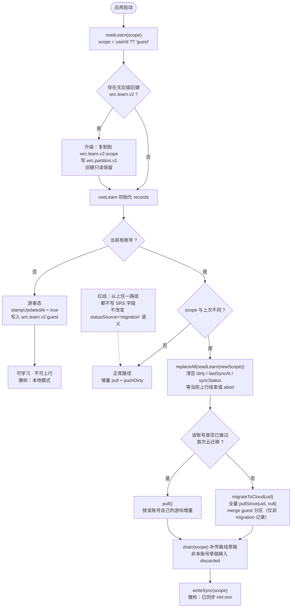
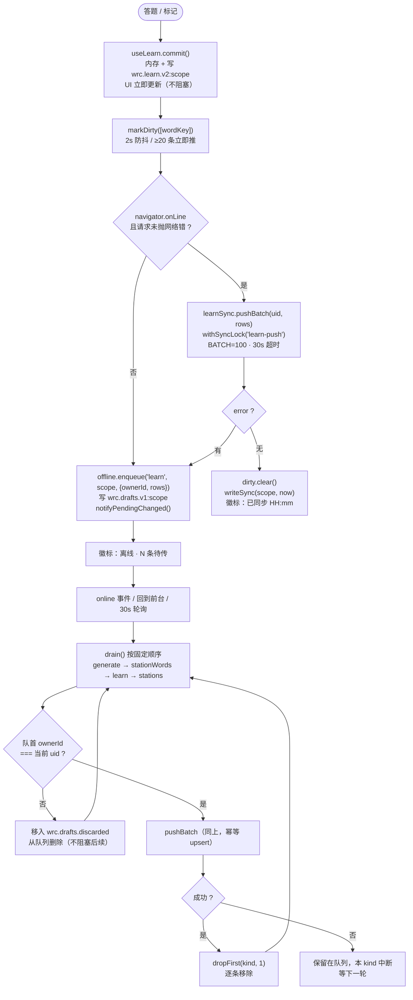
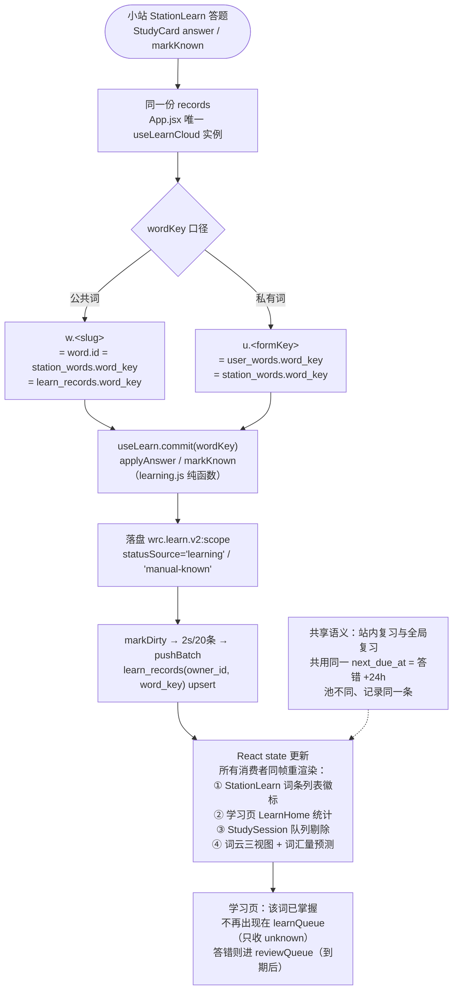

# 词根词缀单词云：学习在线化与小站互通 · 增量 PRD

> 文档状态：可进入设计与开发（增量，不重做既有闭环）
> 增量范围：**A. 学习记录完全在线化 + 按登录用户隔离**、**B. 小站 ↔ 学习双向互通**
> 明确不做：不引入间隔重复算法、不改三态语义、不改掌握阈值、不重构学习纯函数层
> 红线：cloud 层禁止任何 SRS 字段（ease / interval / lapses / reps），`schema.js` 的 `assertNoSrsFields()` 保持兜底

---

## 1. 背景与目标

### 1.1 用户原话

> 「你把学习也做成在线的，就是谁登录保持她的学习记录，保持隔离，然后做到小站和学习互通，就是小站的词汇会了，学习中就也标记成已掌握」

拆成两句话：**A** 学习记录跟着账号走、且不同账号互不可见；**B** 小站里学会的词，学习页要认。

### 1.2 现状一句话

云同步与数据库隔离**已经建好了**（`learnSync.js` + RLS + 全局唯一 `useLearnCloud` 实例），但**本机 localStorage 是全局的**，导致云端的隔离在最后一公里被击穿。

### 1.3 目标（3 个，正交）

| 目标 | 可测口径 |
|---|---|
| **G1 账号即边界** | 同一浏览器登出 A 再登录 B，B 的学习记录与统计在 3 秒内**不含任何 A 的记录**；A 的记录仍在 A 分区完好 |
| **G2 记录不丢** | 断网学习 → 恢复网络后 ≤35 秒内全部上行；换设备登录后学习进度与本机一致 |
| **G3 小站=学习** | 公共词在小站标记「已掌握」→ 学习页该词显示已掌握，反之亦然；私有词在两端都可见 |

---

## 2. 现状盘点

### 2.1 已具备（**复用，不重做**）

| 能力 | 落点 | 状态 |
|---|---|---|
| 学习记录上行 | `lib/cloud/learnSync.js` `pushBatch(ownerId, rows)` upsert `learn_records`，`onConflict: 'owner_id,word_key'`，`BATCH=100` | ✅ 可用 |
| 学习记录下行 | `pullSince(ownerId, lastSyncAt)` `.eq('owner_id', ownerId)`，30s 超时 | ✅ 可用 |
| 同步编排 | `hooks/useLearnCloud.js`：本地写→markDirty→防抖 2s / ≥20 条触发→上行；下行 `mergeAll` 合并 | ✅ 可用 |
| 服务端隔离 | `supabase/migrations/0001_init.sql` 全表 RLS，策略均含 `using` + `with check` = `auth.uid()` | ✅ 严密 |
| 冲突合并 | `lib/cloud/merge.js` 记录级 LWW（`updated_at`），相等取云端，本地无时间戳视为 0 | ✅ 纯函数可测 |
| 离线队列 | `lib/cloud/offline.js` `wrc.drafts.v1` 四类草稿 + `drain()` 逐条补传 | ✅ 可用 |
| 互斥与超时 | `lib/cloud/syncLock.js` 全局锁 + AbortController 30s | ✅ 沿用 |
| 小站↔学习同源 | `App.jsx` 全应用**唯一** `useLearnCloud` 实例，`StationLearn` 的 `records/answer/markKnown` 全部透传 | ✅ 已共用同一份 records |
| `word_key` 口径 | `lib/wordKey.js` 唯一口径；`useStationWords` 把 `wordKey` 直接赋给视图对象 `id` | ✅ 两表口径一致 |
| 游客模式 | `useAuth` 的 `isGuest`；不登录可全库学习 | ✅ 保留 |

### 2.2 缺口（本次要修的）

| # | 缺口 | 严重度 | 后果 |
|---|---|---|---|
| **GAP-1** | `wrc.learn.v2` 全局，A/B 账号共用一份本地学习记录 | 🔴 P0 | B 短暂看到 A 的记录与统计；A 的记录会被 B 覆盖 |
| **GAP-2** | `wrc.migration.cloud` 全局 | 🔴 P0 | A 登录过一次后 `done=true`，B 登录走 `pull()` 而非 `migrateToCloud()`，**B 的本地记录永不上行** |
| **GAP-3** | GAP-2 的连锁：`pull()` 里 `mergeAll(local=A的记录, remote=B的云端)` → A 的 local-only 行进入 `toPush` → `pushBatch(uid=B)` | 🔴 P0 | **A 的学习记录被写进 B 的云端账号**（跨账号污染，RLS 拦不住，因为 upsert 的 owner_id 合法地等于 B） |
| **GAP-4** | 游客记录不打 `updatedAt`（`stampUpdatedAt: Boolean(ownerId)`） | 🔴 P0 | 游客记录 `updatedAtMs()` = 0 → merge 规则「本地无 updatedAt → 取云端」→ **游客的答题痕迹登录后被云端静默覆盖丢弃** |
| **GAP-5** | `wrc.drafts.v1` 全局，`drain()` 遇失败即 `break` | 🔴 P0 | A 的离线草稿在 B 登录后被用 B 的 token 推 A 的 `ownerId` → RLS 拒绝 → 草稿永不删且**队首阻塞，B 自己的草稿也传不上去** |
| **GAP-6** | `wrc.sync.v1` 游标全局 | 🟠 P1 | B 复用 A 的 `lastSyncAt` → B 拉不到自己游标之前的历史记录 |
| **GAP-7** | `wrc.migration.v2` 全局 | 🟠 P1 | B 账号不跑 v1→v2 继承迁移（当前恰好不致命，但口径不可预期） |
| **GAP-8** | `StationLearn` 的词条列表**不渲染学习状态** | 🟠 P1 | 用户在小站答完词，回列表看不出哪些已掌握 → 「互通」在视觉上不成立 |
| **GAP-9** | 私有词（`u.*`）**只存在于小站** | 🟠 P1 | `useLearn(words)` 的 `words` 是公共库 64825 词，不含 `u.*` → 私有词在学习页统计 / 队列 / 词汇量预测中**完全不可见**，原话「小站的词汇会了学习中就标记已掌握」对私有词不成立 |
| **GAP-10** | `useLearn` 的 `records` 仅在挂载时 `readLearn()` | 🟠 P1 | 切账号时内存态不会切到新分区，分区键加了也不生效（需显式 `replaceAll`） |
| **GAP-11** | `SyncBadge` 只看 `useSync`（pending / online / lastSyncAt），`useLearnCloud` 的 `syncStatus / lastError` **没有透出到顶栏** | 🟡 P2 | 上行失败、待上行条数不可见，用户不知道「数据到底存没存上去」 |
| **GAP-12** | `StationLearn.jsx` 传给 `UserWordEditor` 的 `ownerId` 硬编码 `null` | 🟡 P2 | 小站内编辑私有词时丢失 ownerId |
| **GAP-13** | `generate` 草稿也会跨账号污染 | 🔴 P0 | `pushOne('generate')` 只解构 `{stationId, forms}`，**`ownerId` 被丢弃**；`generateApi.generate(forms, stationId)` 无 ownerId 参数，owner 由服务端从 JWT 推导 → **A 遗留的 generate 草稿在 B 登录后执行，会把词生成到 B 账号下**。比 `learn` 更隐蔽（不留学习痕迹，只多出陌生词条） |

### 2.3 小站 ↔ 学习 互通：现状判定

**结论：公共词维度「已满足」，但用户看不见、且私有词维度不成立。**

| 互通方向 | 现状 | 判定 |
|---|---|---|
| 小站答题 → 学习页显示已掌握（**公共词**） | 同一份 `records`，`word_key` 口径一致（`w.<slug>` 两表相同） | ✅ 数据层已通 |
| 学习页标记 → 小站显示（**公共词**） | 同上，反向亦通 | ✅ 数据层已通 |
| 小站私有词 `u.*` → 学习页 | 记录写进了 `learn_records`（key 一致，可同步），但学习页的 `words` 不含私有词 | ❌ **GAP-9**：数据在、界面无 |
| 小站词条列表的状态可见性 | 列表只有 form/pos/gloss/私有标签 | ❌ **GAP-8** |
| 未登录时小站词的状态 | 不成立——`useStationWords` 在 `!ownerId` 时直接清空，小站本身就需要登录 | ✅ 无需处理 |

**「站内复习」与「全局学习」队列的关系（必须写清，当前是刻意设计）：**

- 两者**共享同一份 records、同一个 `nextDueAt`、同一套 `buildReviewQueue` 纯函数**；
- 差别只在**抽词池**：小站池 = 本小站词表，全局池 = 全库 64825 词；
- 因此 **在小站答错的词，会同时出现在小站复习队列和全局学习页的复习队列里**（到期后）。这是记录级共享的必然结果，**不是 bug**，但必须让用户知道，否则会以为重复出题。
- 调度规则仍只有一条：`next_due_at = 答错时刻 + 24h`（`INCORRECT_DUE_MS`），本次不引入任何 SRS 参数。

---

## 3. 用户故事

### A. 学习在线化 + 用户隔离

1. As a **登录用户**, I want 在公司电脑背的词，回家打开网站还在 so that 学习进度不被设备绑定。
2. As a **共用电脑的用户**, I want 我 logout 后别人（或我自己换号）看不到我的学习记录 so that 我的生词与掌握情况不被泄露。
3. As a **离线用户**, I want 断网时照样能背、联网后自动补传 so that 地铁/飞机上不中断学习。
4. As a **游客**, I want 不登录也能用，但我的数据不与任何账号混淆 so that 我可以先试再决定是否注册。
5. As a **谨慎用户**, I want 明确看到「上次同步时间 / 还有几条没传上去 / 失败原因」 so that 我敢确认数据真的存住了。
6. As a **开着旧标签页的用户**, I want 在另一个标签切换账号后，我这个标签不会继续显示旧账号的记录 so that 共用电脑时不会误看到别人的学习数据。

### B. 小站 ↔ 学习互通

1. As a **小站用户**, I want 在小站里把生词背到「已掌握」，学习页就同步显示已掌握 so that 我不用在两个页面各维护一份状态。
2. As a **学习页用户**, I want 在学习页标记已掌握，回到小站这个词也变绿 so that 小站列表能直接当「已掌握清单」用。
3. As a **小站用户**, I want 在小站词条列表上直接看到每个词的状态与「我会了」按钮 so that 不用进复习流就能随手标记。
4. As a **加了生词的用户**, I want 我在小站生成的私有词也能进入学习页的统计与词汇量预测 so that 私有词不被漏算。
5. As a **复习中的用户**, I want 明白小站复习与全局复习的到��是同一份 so that 不以为系统重复出题。

---

## 4. 需求池

### A 组：在线化与隔离

| 编号 | 需求 | 优先级 | 验收标准（可测） | 依赖 |
|---|---|---|---|---|
| A-1 | **本地键按 scope 分区**。引入 `scope(userId) = userId ?? 'guest'`，键改为 `wrc.learn.v2:<scope>`、`wrc.migration.v2:<scope>`、`wrc.sync.v1:<scope>`、`wrc.migration.cloud:<scope>`、`wrc.drafts.v1:<scope>`、`wrc.station.current:<scope>` | P0 | 登出 A、登录 B 后，`localStorage` 中不存在 `wrc.learn.v2`（旧无后缀键）被 B 读取；B 首帧 `stats.total` 全部来自 `wrc.learn.v2:B` | — |
| A-2 | **旧键平滑升级**。首次启动检测到无后缀旧键时，按当前 scope 复制为分区键，写 `wrc.partition.v1 = {migratedAt, fromScope}`，**旧键保留不删**（铁律：只读不动） | P0 | 已有 `wrc.learn.v2` 的老用户升级后，已掌握/待复习/未知三态计数与升级前**完全一致**；旧键仍可在 DevTools 看到 | A-1 |
| A-3 | **切账号时重载分区**。`ownerId` 变化时：`replaceAll(readLearn(scope))` + 重置 `dirty` / `lastSyncAt` / `syncStatus` + 重跑 `migrateToCloud`（按新 scope 判 `done`） | P0 | A（有 500 条记录）→ 切 B（云端 0 条）：切换后 UI 立即显示 B 的 0 条记录，**A 的 500 条不出现在统计里**；切回 A 500 条完好 | A-1、GAP-10 |
| A-4 | **游客 → 登录：合并而非覆盖**。登录瞬间把 `wrc.learn.v2:guest` 合并进该用户分区，**只上传 `statusSource !== 'migration'` 的记录**（真实答题痕迹），`migration` 来源的继承记录只留本地 | P0 | 游客背了 20 个词（带 `statusSource='learning'`）+ 3 万条高频继承（`statusSource='migration'`）：登录后 20 条上行到云端（`learn_records` 可查到），3 万条**不**上行；本地统计仍含继承词，词汇量预测口径不变 | A-1 |
| A-5 | **游客记录补时间戳**。`stampUpdatedAt` 改为「任何 scope 都打」，或登录合并时用 `statusChangedAt \|\| lastStudiedAt \|\| now` 兜底补 `updatedAt` | P0 | 游客记录 20 条，登录后逐条检查云端 `updated_at` 非空且 `status='review'/'known'` 与本地一致；**不得出现被云端默认值覆盖的 `unknown`** | A-4 |
| A-6 | **草稿队列按 scope 分区 + 认领丢弃**。`enqueue` 写入当前 scope 分区；`drain` 只 drain 当前 scope；**四类草稿（`generate` / `stationWords` / `learn` / `stations`）一律按 `ownerId` 认领**，`ownerId !== 当前 uid` → 移入 `wrc.drafts.discarded` 并删除（不重试、不阻塞）。`generate` 尤其关键：其 owner 由服务端从 JWT 推导（`generateApi.generate(forms, stationId)` 无 ownerId 参数，`pushOne` 也丢弃了该字段），误认领会**把 A 的生词生成到 B 账号下**（GAP-13） | P0 | A 离线产生 5 条草稿 → 登出 → B 登录 → `drain()` 后队列清空、`discarded` 恰有 5 条且 `reason='owner-mismatch'`；B 自己离线产生的草稿能正常上行（**不被 A 的队首阻塞**）；A 的 generate 草稿在 B 会话下**不得**新增任何 B 名下词条 | A-1 |
| A-7 | **同步游标按 scope 分区**。`readSync/writeSync` 全部带 scope | P1 | B 首次登录必做**全量** `pullSince(uid, null)`；之后按 B 自己的游标增量。A 的游标变化不影响 B | A-1 |
| A-8 | **可观测性**。`SyncBadge` 接入 `useLearnCloud` 的 `syncStatus / lastError`，徽标文案覆盖四态：`本地模式（游客）` / `已同步 HH:mm` / `同步中…` / `离线 · N 条待传` / `上传失败：<原因> · 点此重试` | P1 | 断网答题 3 条 → 徽标 5 秒内变琥珀且显示「3 条待传」；上行失败时显示具体原因；点击可手动 `syncNow()` | A-6 |
| A-9 | **账号切换时互斥锁不得跨账号串行**。切换账号前必须等当前上行结束或显式 abort，避免 A 的 `pushBatch` 在 B 的会话里执行 | P1 | 快速 A→logout→B 登录（间隔 <1s），压测 50 次：云端 `learn_records` 中 `owner_id=B` 的行不包含任何 A 的 word_key 内容 | A-3、A-6 |
| A-10 | 保留离线优先：断网时**所有**学习写操作正常落盘、UI 零延迟、徽标提示；不因分区改造引入任何同步阻塞 | P0 | DevTools 置 offline 后连续答题 10 词，界面无卡顿，`wrc.learn.v2:<scope>` 正确落盘 | — |
| A-11 | **多标签页同源切换兜底**：监听 `storage` 事件，仅当变更键命中**本标签当前 scope** 的 `learn` 键且值与内存态不一致时，触发本标签分区重载 | P1 | A 在标签 1 登出、B 在标签 2 登录：标签 1 在 3 秒内不再展示 A 的记录（无需手动刷新） | A-3 |
| A-12 | **写入失败必须可见**：分区键写入抛 `QuotaExceededError` 时不得静默吞掉，需在徽标处提示「本机存储空间已满，学习记录可能未保存」 | P1 | 多账号分区占满配额后答题 → 徽标出现空间告警，而非假装已保存 | A-1 |
| A-13 | `discarded` 日志**不留任何 uid 片段**，只存 `reason` + `kind` + `queuedAt` | P2 | 检查 `wrc.drafts.discarded` 载荷，无任何可关联到账号的标识 | A-6 |

### B 组：小站 ↔ 学习互通

| 编号 | 需求 | 优先级 | 验收标准（可测） | 依赖 |
|---|---|---|---|---|
| B-1 | **小站词条列表显示学习状态**：每个词行右侧渲染三态徽标（未知 / 待复习 / 已掌握），复用 `derive.js` 的 `STATUS` 配色，与学习页/列表页视觉一致 | P1 | 在小站答对 1 词 → 回列表该词徽标变「学习中 1/2」；点「我会了」→ 变「已掌握」；刷新页面状态不丢 | — |
| B-2 | **小站词条行内快捷操作**：提供「我会了」/「加入待复习」/「退回复习」三个按钮，直接调 `markKnown/setReview/retreat`（同源，不新增 API） | P1 | 小站列表点「我会了」→ 学习页该词显示已掌握（同一 `records`），无需刷新页面 | B-1 |
| B-3 | **私有词进入学习视野**。学习页统计与词汇量预测的取词集合由「公共库」扩展为「公共库 ∪ 当前用户 `user_words` ∪ 已入库 `station_words` 中的 `u.*` 词」；**不改变公共词的三态口径与队列难度分档** | P1 | 账号下有 5 个私有词且全标已掌握：学习页「已掌握」计数 = 公共已掌握 + 5；词汇量预测的 `sufficient` 闸门与 `statusSource !== 'migration'` 判别**不变**（私有词有真实记录，可作样本） | A-3 |
| B-4 | **私有词可进全局复习队列**：私有词答错后 `next_due_at` 到期时，出现在学习页的「待复习」队列中 | P1 | 小站答错一个私有词 → 24h 后（可改系统时间或直接改 `next_due_at` 验证）学习页复习队列含该词 | B-3 |
| B-5 | **「站内复习 / 全局复习共享到期」的口径说明**：在两处 UI 显式写明「小站复习与学习复习是同一份记录、同一个到期时间，答错 24h 后两边都会出现」 | P1 | 文案出现在小站复习首页与学习复习首页；用 e2e 断言文案节点存在 | — |
| B-6 | 修正 `StationLearn` 传 `UserWordEditor` 的 `ownerId={null}` → 传真实 `ownerId` | P2 | 小站内编辑私有词保存成功，刷新后 gloss 仍为新值 | — |
| B-7 | `StationLearn` 词条列表补齐空态与状态图例（未知/待复习/已掌握 三色说明） | P2 | 视觉走查：无图例时用户无法区分徽标含义 | B-1 |
| B-8 | 私有词超过词汇量护栏阈值时，在估算区下方提示「私有词较多，词汇量估算暂不含私有词」 | P2 | 账号下私有词 >500 时该行小字出现；≤500 时不出现 | B-3 |

---

## 5. 关键流程

### 5.1 登录 / 切换账号的本地数据分区切换

### 5.2 离线 → 在线补传

### 5.3 小站答题 → 学习页状态更新

---

## 6. 数据迁移与兼容策略

### 6.1 键名映射表（旧 → 新）

| 旧键（只读保留） | 新键 | 处理方式 |
|---|---|---|
| `wrc.status.v1` | — | **永不读改写删**（v1 手工标注源数据，铁律） |
| `wrc.status.v1.backup` | — | 同上 |
| `wrc.settings.v1` / `.backup` | — | 同上 |
| `wrc.learn.v2` | `wrc.learn.v2:<scope>` | 首次启动复制到当前 scope；旧键保留 |
| `wrc.migration.v2` | `wrc.migration.v2:<scope>` | 同上（携带 `report`，保证「重跑迁移」语义按账号独立） |
| `wrc.sync.v1` | `wrc.sync.v1:<scope>` | 新账号分区初始 `lastSyncAt = null` → 必走全量 |
| `wrc.migration.cloud` | `wrc.migration.cloud:<scope>` | 换账号后 `done` 为 false → B 会正确触发 `migrateToCloud`（修 GAP-2/GAP-3） |
| `wrc.drafts.v1` | `wrc.drafts.v1:<scope>` | 首次启动整体迁入当前 scope 分区；无法判定归属的，drain 时按 ownerId 认领 |
| `wrc.station.current` | `wrc.station.current:<scope>` | 换账号不再残留上一账号的 current station |
| `wrc.settings.v2` | **保持全局** | 属设备级偏好（难度档位、词族成组、自动朗读）。**例外**：若需严格隔离 `inheritFreqKnown`，见 §8 待确认 Q3 |
| （新增） | `wrc.partition.v1` | `{migratedAt, fromScope}`，防重复升级 |
| （新增） | `wrc.drafts.discarded` | 跨账号草稿认领丢弃记录，供排查 |

### 6.2 升级保证

1. **不丢数据**：旧键一律保留；任何时候删掉新键都能从旧键重建。
2. **不重复迁移**：`wrc.partition.v1` 记录已升级的 scope；同一 scope 不重复复制。
3. **游客数据不丢**：登录时把 guest 分区中 `statusSource !== 'migration'` 的记录合并进该账号（按 `word_key` 记录级 LWW 合并，复用 `mergeAll`，不另写合并逻辑）。
4. **不伪造答题历史**：游客继承来的高频词（`statusSource='migration'`）**不上行**，保持「不上传、不断言」；其 `consecutiveCorrect = MASTER_THRESHOLD` 的不变量不变。
5. **回滚安全**：分区改造若需回退，删掉 `wrc.*:guest` 与各 `wrc.*:<userId>` 即可回到旧键。

---

## 7. 风险与缓解

| 风险 | 影响 | 缓解 |
|---|---|---|
| `useLearn` 是纯本地 hook，改键前缀会牵动 `migrate.js` / `useLearn` / `useLearnCloud` / `useSync` / `offline.js` 全部读写点 | 遗漏一处即读写不同区 | 把 scope 收敛为**单一入口**（`migrate.js` 暴露 `keysFor(scope)`），禁止业务文件自行拼 key；补一条结构回归脚本断言「代码中不出现裸 `wrc.learn.v2` 拼接」 |
| `dirty` 集合是 `useRef` 的 `Set`，切账号不清空会把 A 的 key 推到 B | 跨账号污染 | A-3 强制 `dirty.clear()`；A-9 加切账号互斥 |
| `stampUpdatedAt` 改为常开会让 localStorage 体积上升 | **已核实：影响有限**。仅**游客态新写入**的记录带 `updatedAt`，3 万条高频继承属历史存量、**不会被回填**（`ensurePartition` 只复制不重写载荷），因此不存在「一次性 +1MB」 | 上行再加一层 `stampRowsForUpload` 兜底（`updatedAt \|\| statusChangedAt \|\| lastStudiedAt \|\| now`），覆盖老客户端长尾；不主动回填存量 |
| 私有词进入全局统计会改变词汇量预测数值 | 用户看到估算值跳变 | B-3 明确「只增不改判别式」：`statusSource !== 'migration'` 与 `minSample/minBands` 闸门一律不动，UI 标注口径 |
| 拉全量 `learn_records`（3 万行）在新设备首登可能慢 | 首屏等待 | 沿用 `BATCH=100` 与 30s 超时；游标置 null 只在**每账号一次**；`migrateToCloud` 期间不阻塞 UI（本地记录先渲染） |
| `pull()` 依赖客户端时钟做 LWW | 设备时钟偏移会造成「未来记录」永久压制 | 见 §8 Q1：本次保留 `updated_at` LWW，漂移检测列入 P2 |
| `app.asar`/PWA 缓存旧 JS 与新键并存 | 老页面写旧键、新页面读新键 | 键升级幂等 + 旧键保留；上线后观察一个版本再考虑清理 |

---

## 8. 待确认问题（需要用户拍板）

| # | 问题 | 我的建议 | 影响面 |
|---|---|---|---|
| **Q1** | 冲突裁决是否引入服务端时钟？现状是 `updated_at` 记录级 LWW，若某设备时钟快 1 小时，它写的记录会在所有设备上永久胜出，且**无法自愈** | **本期不改**：`updated_at` 继续做唯一裁决键；`status_changed_at` 只用于展示与到期计算，**不参与冲突裁决**（它不覆盖计数变化，混用会丢计数）。P2 增加漂移检测（`updatedAt > now + 24h` 视为漂移，用 `status_changed_at` 或 now 重置） | P2，跨设备一致性 |
| **Q2** | 游客数据合并进账号时，要不要上传 `statusSource='migration'` 的高频继承记录（可能 3 万条）？ | **建议不上传，且不并入账号分区**（已采纳，见设计 §A-4）。理由：① 它们不是真实学习证据，上云会污染新账号的词汇量预测样本；② 新账号会跑自己的 `runMigration` 生成**符合自己开关**的继承集，混入游客继承集会产生两套语义打架。**真实学习证据（`learning` / `manual-*`）才跨设备延续**，且合并在**每次进入账号分区时都跑**（覆盖「登录→登出→游客背词→再登录」） | A-4，用户预期 |
| **Q3** | `inheritFreqKnown`（高频继承为已掌握）是否也要按账号隔离？它目前存于全局 `wrc.settings.v2`，直接影响「重跑迁移」与词汇量预测 | **已定：隔离**，但**不进 `wrc.learn.v2:<scope>` 载荷**，而走独立 `wrc.prefs.v1:<scope>`（设计 §A-2 的有意偏离）。理由：`useLearn` 的写盘副作用会被无脑覆盖，且独立键让 `learn` 载荷字节级不变，`exportJson`/`validateRecords`/`test-learning.mjs` 假设全保持。其余设置（难度档位/词族/朗读）保持设备级全局 | P1 |
| **Q4** | 私有词（`u.*`）要不要进**全局学习队列**（新学队列）？B-3/B-4 只把它们放进统计、词汇量预测和复习队列 | **已定：不进新学队列**（结构上排除，零运行时开销）。新学队列按 `freqRank` 升序抽词，私有词多数 `freqRank=null` → `num(null)` 排到末档再被 `take(size)` 砍掉，混进去既打乱难度序又几乎必然抽不到。私有词只进「统计 + 词汇量预测 + 复习队列」 | P1，难度分档排序 |
| **Q5** | 切账号时，上一账号的分区数据是「保留在本机」还是「登出即清」？ | **建议保留**（不清）。理由：共用电脑场景下 A 可能只是短暂切号；清空会让「切回来记录没了」变成投诉。隐私诉求由「切号后 UI 立刻切到新分区 + 顶栏显示当前账号」满足 | P0 策略 |
| **Q6** | 词汇量预测在接入私有词后，UI 是否要拆成「公共库估算」与「含私有词估算」两个数？ | **建议合并为一个数 + 一行注脚**（「含 N 个私有词」），避免增加认知负担 | P2 |
| **Q7** | 是否需要「退出登录前确认上传完成」？ | **已采纳为 P1**（原建议 P2）：登出时若 `pending > 0`，弹「还有 N 条未上传，确定退出？」。草稿是认领制，残留草稿不会串号，故纯属体验提醒，但「登出前把学习记录补传完」正是本次「在线化」的用户心智，入口做在登出按钮上最自然 | P1 |

### 8.1 对设计文档 U1–U8 的产品定调（2026-09 补充）

设计阶段新提的 8 个未知点，我逐条给产品结论，避免它们悬空：

| # | 我的结论 |
|---|---|
| **U1** RLS 拒绝的 `error.code` 形态未知 | **接受为 T03 验收前置动作**，但**必须有一层兜底**：判据不能只靠 code 白名单，`ownerId` 认领（`claim()`）已是与错误形态无关的**第一道防线**——即使 `isPermanentError` 全判错，也不会发生跨账号污染，只是队列清不掉。抓包后校准白名单即可，不阻塞开发 |
| **U2** 多标签页同源登录串号 | **本期做，但只做最轻量**：监听 `storage` 事件，仅当变更键命中本标签当前 scope 的 `learn` 键且**值与内存态不一致**时触发本标签重载。不做跨标签互斥（A 登出即杀 B 的 tab 不在本次范围）。理由：共用电脑切号常伴随旧标签页开着，这是隔离的最后一米，成本仅十余行 |
| **U3** `wrc.status.v1` 手工标注的多账号归属 | **本期不做开关，但登出确认弹窗加一句**说明「这台电脑上 A 手工标注过的 N 个词会作为初始词表被继承」。理由：v1 是历史存量数据，让新账号继承反而符合「这台电脑本来就这么标过」的直觉；加开关反而让用户困惑于「为什么我的标注没生效」 |
| **U4** 多账号分区的 localStorage 容量 | **本期只加容量告警，不做清理入口**。理由：云端已有数据，删本地不丢；但「清理别人的分区」是个有破坏性的操作 UI，在没有真实容量投诉前先不做。**触发条件**：某分区写入抛 `QuotaExceededError` 时，在徽标处给出可见提示而不是静默忽略（现状 `writeLearn` 的 try/catch 会静默吞掉，用户会以为存上了） |
| **U5** `discarded` 日志是否脱敏 UID | **同意不留 UID**：只存 `reason` + `kind` + `计数` + `queuedAt`。半截 uid 在本机场景没有实际用途，却留下可拼接的隐私面，删掉是纯收益 |
| **U6** 游标改为只按服务端推进导致重复拉取 | **接受安全侧**。单账号全量约 3 万行、每 60 秒最多触发一次，重复拉取的代价是流量而非正确性；反之「推进过头导致跳过未拉到的行」是**数据静默丢失**，两者不对等。列为上线后观测项，若实测流量不可接受再优化 |
| **U7** 私有词超 500 时的提示 | **要提示，一行小字**：「私有词较多，词汇量估算暂不含私有词」。阈值本身不暴露给用户，只说明行为。用户看不懂算法，但能看懂「没算进去」 |
| **U8** `wrc.dict.v1:` 是否需按账号隔离 | **本期不隔离，但加约束注释**：明确「禁止把 `u.*` 私有词写入本缓存」。当前缓存的音标/例句全部来自公共词，跨账号共享是对的；加一行注释即可挡住未来误加。与「私有词也走本地音标查表」的潜在冲突**留待该功能立项时再处理** |

### 8.2 我已复核并认可的设计偏离

| 偏离 | 复核结论 |
|---|---|
| `inheritFreqKnown` 走独立 `wrc.prefs.v1:<scope>` | ✅ 认可。已同步更新 §6.1 与 Q3 |
| 结构门禁「连注释一起扫」 | ✅ 认可。7 个文件改注释是「防照着过时注释改代码」的必要代价，且可被机器保证的不变量值得这 7 处成本 |
| Q2 收紧为「migration 记录不上传且不并入」 | ✅ 认可，比我原方案更严谨（避免两套继承语义打架），已更新 PRD A-4 与 Q2 |
| `pull` 游标只按服务端 `maxUpdatedAt` 前进 | ✅ 认可，这是我 PRD 未发现的真实数据正确性问题（原 `max(remote, local)` 在时钟漂移时会跳过未拉到的行），已补进风险表 |

---

## 9. 建议实施顺序

与设计文档的 T01–T05 对齐：

1. **T01 ⛔**（A-1 / A-2 + 结构门禁）：键分区单一入口 `keysFor(scope)` + 旧键只读领养 + `npm run test:keys` 上门禁
2. **T02 ⛔**（A-3 / A-4 / A-5 / A-9 / A-10）：学习记录全量切 scope + 切号状态机（epoch 守卫）+ 游客证据合并 + 删掉「records 变化即写盘」副作用
3. **T03 ⛔**（A-6 / A-7 / A-8）：草稿分区与四类认领 + 游标分区 + 同步可观测五态（**含 U2 轻量 storage 监听、U4 容量告警**）
4. **T04**（B-1 / B-2 / B-5 / B-6 / Q7）：小站徽标 + 行内操作 + 共享到期文案 + 登出前 flush
5. **T05**（B-3 / B-4）：私有词并入统计 / 词汇量 / 复习队列（Q4 已定：不进新学队列）
6. **P2 收尾**：B-7 图例 / Q1 时钟漂移检测 / Q6 注脚微调

⛔ = 止血项，未完成时「A 登出 → B 登录」会持续把 A 的学习记录写进 B 的云端账号，**不可带病上线**。

---

## 附录：红线自查表（开发完成后逐条核对）

- [ ] `schema.js` 之外无任何新增 SRS 字段；`assertNoSrsFields()` 仍在 `learnRecordToRow` / `userWordToRow` 生效
- [ ] `src/lib/learning.js` 零改动；三态、`MASTER_THRESHOLD=2`、`INCORRECT_DUE_MS=24h` 未变
- [ ] `statusSource='migration'` 语义未变；词汇量预测的 `statusSource !== 'migration'` 判别式未变
- [ ] 断网可学习；分区改造未引入同步阻塞
- [ ] 上行批量 100 / 30s 超时 / `syncLock` 互斥沿用，未另起炉灶
- [ ] `wrc.status.v1` 与两个 `.backup` 键未被写改删
- [ ] `learn_records` 中 `owner_id` 恒等于当前 `auth.uid()`（含草稿补传路径）
