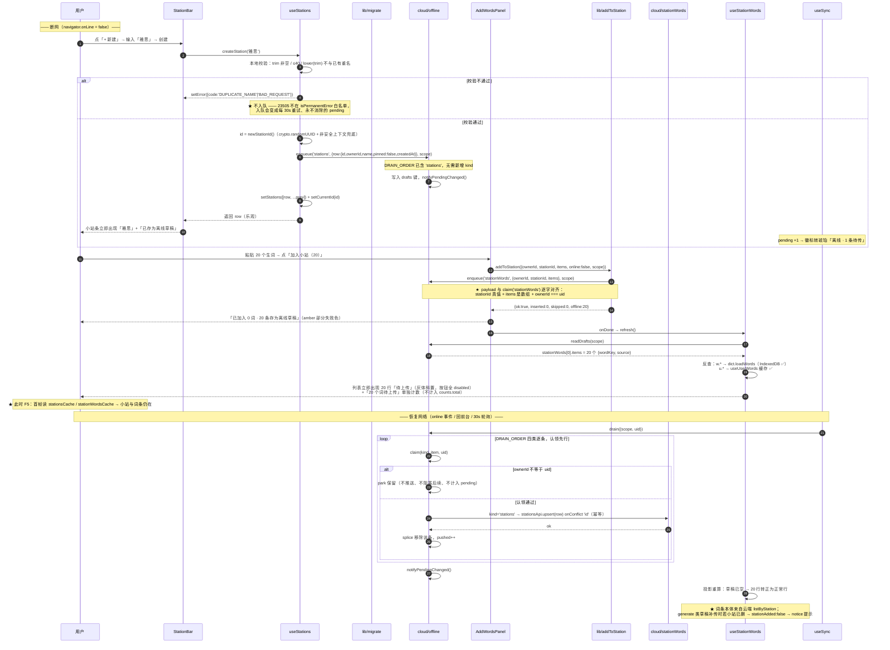
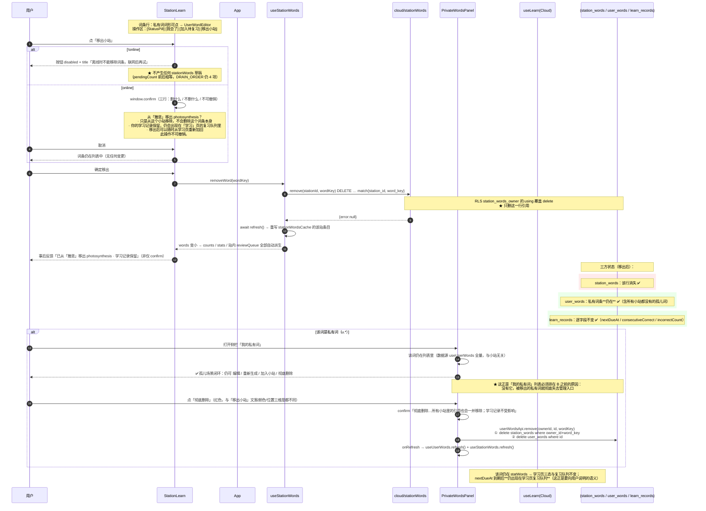
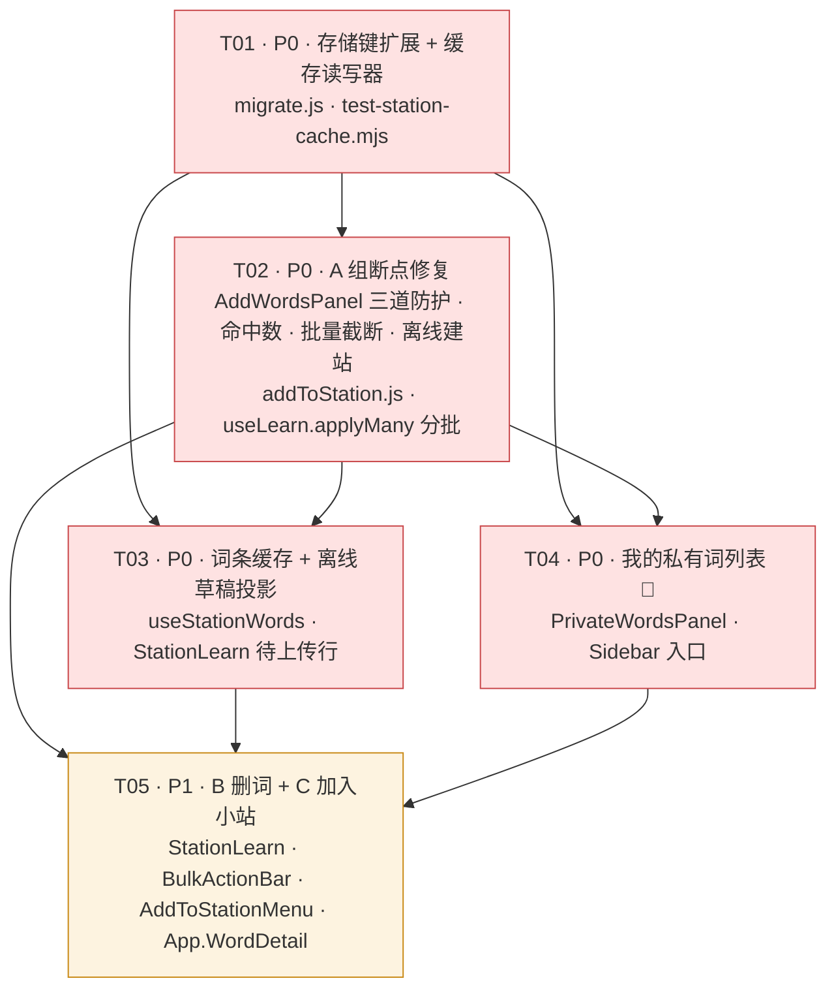

# 词根词缀单词云 · 小站打磨 增量设计

> 文档类型：**增量设计**（不重设计现有架构，只描述新增 / 修复）
> 需求输入：`docs/station-polish-prd.md`（PM 已复核源码的增量 PRD，47 条断点 / 10 条 P0）
> 上游设计输入：`docs/online-learn-design.md`（草稿四分语义 / 分区隔离 / 三层跨账号隔离）
> 决策输入：team-lead 已拍板 Q1–Q8 + 3 条追加要求（本文按「已决策」处理，不重复讨论）
> 硬红线：`src/lib/learning.js` 零改动 · `src/lib/vocab.js` 零改动 · `src/lib/wordView.js` 零改动 ·
> `src/lib/cloud/schema.js` 零改动 · `src/lib/cloud/offline.js` 零改动 · `src/hooks/useLearnCloud.js` 零改动 ·
> 零新增 SRS 字段 · 零新增 npm 依赖 · 存储键只经 `migrate.js`

---

## 0. 设计前源码核验结论（含对 PRD 的偏离）

我把 PRD 的每条 P0 结论都回到源码逐条验证过一遍。**结论：PRD 的 10 条 P0 与 6 条 B、6 条 C 的机制描述全部成立**，其中 4 处需要修正或补齐（下面逐条列）。**PRD 列出的四条「零改动」我核实后全部真能成立**（§7 有验证方法）。

### 0.1 对 PRD 的修正 / 补充

| # | PRD 说法 | 源码实际 | 结论 |
|---|---|---|---|
| **M1** | A-02「`wordKey === null` 的行取消勾选且置灰」 | `AddWordsPanel.jsx:104` 的 `toggleAll` 用 `checked.size === rows.length` 判断「全选 / 全不选」。一旦 `unknown` 行默认不勾选，`checked.size` 永远小于 `rows.length` → **「全不选」按钮永久失效，且文案恒为「全选」** | **PRD 漏了一处耦合**。A-02 必须与 `toggleAll` 一起改：判据换成「**全部可选行**（`wordKey !== null`）是否都已勾选」，可选集单独派生一个 `selectableFormKeys` |
| **M2** | A-04「`applyMany` 分批（每 500）」暗示分批能缓解配额 | `useLearn.js:354` 的 `writeLearn(next, scope)` 写的是**整个 records 映射**（`writeLearn` 载荷 `{version, records:next}`）。分批后每次 persist 写的仍是全量映射 → **单次写入体积完全不变，分批本身不修复 `QuotaExceededError`；反而把总写入字节放大 N 倍** | **分批要保留，但真实修复是 2000 上限**。上限限制了「新生成多少条新记录」（6.4 万 → 最多 2000），这才是配额爆掉的**主因**；分批的真实收益是① 摊平 6 万次 `setState` 的渲染成本 ② 让 `onDirty` 能只调一次。详见 §1.3 |
| **M3** | A-06 离线投影「从 `readDrafts(scope).stationWords` 读出 `wordKey`」 | 草稿 `items` 只有 `{wordKey, source}`，**没有 form / gloss**。渲染一行需要反查词条：`w.*` 走 `dict.loadWords`（IndexedDB，离线可用 ✅）；`u.*` 走 `userWordsApi.listByKeys` 是**纯网络**（`userWords.js:41`），离线必然失败 | **PRD 漏了取数路径**。私有词必须从 `useUserWords` 已有的 `userWordsCache` 取（它已经是全量本地缓存），**不需要任何新请求**。详见 §3.4 |
| **M4** | A-10「`id` 用客户端 `crypto.randomUUID()`」 | ① `crypto.randomUUID` 仅在**安全上下文**可用（`http://` 局域网直连开发会没有）；② `stations` 上有唯一索引 `(owner_id, lower(btrim(name)))`，离线重名草稿补传时会撞 `23505`，而 `isPermanentError('23505')` **不在白名单**（`offline.js:417`）→ 被判为「可重试」→ **每 30s 重试一次、永远传不上去、用户只看到 pending 减不掉** | **必须加两条**：① `newStationId()` 带非安全上下文兜底；② 入队**前**先在本地 `stations` 里做 `lower(trim(name))` 比对，重名直接报错、**不入队**（这样绕开了改不了 `offline.js` 的约束） |

### 0.2 补漏（PRD 完全没提，但会被本轮改动踩到）

| # | 事实 | 影响 |
|---|---|---|
| **G1** | `BulkActionBar` 有 **3 个**调用点，不是 2 个：`ListView.jsx:189`、`FocusView.jsx:424`、**`App.jsx:751`（`MorphDetail` 右侧词群详情）** | C-02「一处改动两边生效」实际是**三处生效**。三处语义都成立（都是「已选若干公共词 → 批量操作」），无需排除，但必须写进任务验收 |
| **G2** | `WordDetail` **不是独立文件**，是 `App.jsx:780` 的内部函数 | C-01 的改动落在 `src/App.jsx`（单文件已 1030 行），不新建组件文件 |
| **G3** | `check-storage-keys.mjs` 的 `NAMESPACE_PATTERN = /wrc\./g`（第 55 行）已覆盖任意新键 | **新增 `stationsCache` / `stationWordsCache` 不需要改门禁脚本**（`migrate.js` 是 `KEY_OWNER`，第 120 行整文件跳过）。`test-partition.mjs` 的 `keysFor` 断言是逐条 `assert.equal` 而非 `deepEqual(Object.keys(k))`，**加键不会挂**，但建议补断言 |
| **G4** | `offline.js:367` 的 `claim('stationWords')` 校验 `!item.stationId \|\| !Array.isArray(item.items)`；`itemOwnerId('stationWords')` 读 `item.ownerId` | C 组复用该 kind 的 payload **必须逐字是 `{ownerId, stationId, items}`**，且 `items` 是数组。§3.3 的 `addToStation()` 签名就是照这个契约定的 |
| **G5** | `useStations.refresh()` 网络失败时 `setError(err); return`（**不清空**） | 所以断网**同一次会话内**切换小站仍能看到旧数据，只有 **F5 后首帧是 `[]`**。A-05 的修法是「首帧读缓存」，不需要改错误分支 |

---

## 1. 实现方案

### A 组：端到端断点修复（P0）

#### A-1 · A-01 三道防护：索引未就绪禁止提交

**双重伤害的机制（已核实）**：`AddWordsPanel.jsx:66-69` 在 `!indexReady` 时置 `lookup={hit:[],miss:[]}` 但同时 `setChecked(全部 usable)`；`rows` 因此全是 `kind:'unknown'`、`wordKey:null`；`selectedHits`/`selectedMiss` 双双为空 → 两个 `if` 都不进 → `已加入 0 词` → **`setRaw('')`（第 206 行，无条件）** → 用户粘贴的 20 个词凭空消失，零报错。

**三道防护（缺一不可）**：

| 道 | 位置 | 做法 |
|---|---|---|
| ① 按钮 | `canSubmit`（第 111 行） | 追加 `&& indexReady`。按钮 `disabled`，副区已有「词条索引加载中…」**补一句**「索引就绪后才能提交」 |
| ② 兜底 | `submit()` 开头（第 113 行之后第一行） | `if (!indexReady) { setMessage('词条索引还在加载，请稍候再提交'); return }`。防脚本 / 竞态 / 按钮 disabled 之前的那一帧 |
| ③ **失败路径绝不碰 `setRaw('')`** | 第 206 行 | 改为**条件清空**：`summary.failed === 0 && summary.offline === 0` 才清；否则保留原文并把光标定位到末尾 |

> **第 ③ 道是 team-lead 追加要求 1 的落点**，也是三道里唯一防「数据消失」的。①② 只防误点，③ 防的是「未来任何新增的失败分支」——把它写成**收敛点**（清空只发生在一个明确的位置、且条件是「零失败零草稿」），而不是散落的 early-return。

**完成判据里必须逐字写明**：`textarea.value` 在任何失败路径下与提交前**完全一致**。

#### A-2 · A-02 `wordKey === null` 不参与提交（**含 M1 的耦合修复**）

- `rows` 派生时按 `wordKey === null` 分流：`selectable`（可提交）与 `unrecognized`（不可提交）。
- `checked` 的初值从 `[...hit, ...miss]` 改为 `selectable.filter(选得上的)`；`unrecognized` 行**永不默认勾选**、置灰、行尾标「未能识别，稍后重试」。
- `canSubmit` 的 `selected.length > 0` 改为 `selectedSelectable.length > 0`；按钮计数 `加入小站（N）` 的 N 用 `selectedSelectable.length`。
- **M1 修复**：`toggleAll` 判据从 `checked.size === rows.length` 改为「`selectable` 中每个 `formKey` 都在 `checked` 里」。

#### A-3 · A-04 三态结果色

`message` 单一字符串改为 `{ tone, text }`：

| 条件 | tone | 类名（沿用现有 emerald 规格） |
|---|---|---|
| `failed === 0 && offline === 0` | `success` | `bg-emerald-50 border-emerald-200 text-emerald-800`（现有） |
| 部分失败（`failed > 0` 或 `offline > 0`，且有成功项） | `warn` | `bg-amber-50 border-amber-200 text-amber-900`（与 `notice` 同族） |
| 全失败（`failed > 0 && added + generated === 0`） | `error` | `bg-red-50 border-red-200 text-red-700` |

三态的**文案拼装收敛到一处**（一个 `parts` 数组 + 一个 `tone` 计算），杜绝「两段错误消息互相覆盖」（PRD 3-5 / A-17 同源）。

#### A-4 · A-05 侧栏搜索命中数（**零性能开销，已确认**）

`App.jsx:442` 的 `hitCount={stats.morphCount}` → `hitCount={searchResult.morphs.length}`。

**性能确认（team-lead 追加要求 3）**：`searchResult` 在 `App.jsx:273-276` 已由 `useMemo` 算出，依赖 `[query, morphemes, words, index]`——**它本来就被 `hitWordIds`（第 277 行）与 `visibleOrphans`（第 279 行）消费，与 `hitCount` 无关**。改读它的 `.length` 是 O(1) 字段访问，**不新增任何 `search()` 调用、不新增任何 memo**。（`search()` 现在每次 query 变化跑两遍——`App.jsx:273` 传 `index.morphById`、`derive.js` 的 `applyFilters` 内部传 `null`——改后仍是两遍。）

文案同时改为两行：「命中 N 个词群」+ 小字「（当前筛选下）」，与 `Sidebar.jsx:76` 的单行结构对齐。

#### A-5 · A-07 批量截断 + 分批（**含 M2 的诚实实现**）

**一致性实现方式（team-lead 追加要求 2）** —— 核心是**只有一个真相源**：

```
ListView 内派生一个唯一的 selectableAllIds：
  allIds.length > 2000 ? allIds.slice(0, 2000) : allIds

按钮 onClick → onSelectMany(selectableAllIds, 'replace')
按钮 label  → 由 selectableAllIds.length 派生（不是由 allIds.length）
BulkActionBar count → 来自 selectedIds.size（= selectableAllIds.length）
applyMany 实际写入 → 同一个 selectableAllIds
```

「文案里的数字」与「实际写入的数字」**在数学上是同一个变量**，因此**不可能出现文案说 2000 而实际写了 1500**。禁止的写法是「按钮文案用 `Math.min(allIds.length, 2000)`，而 onClick 传 `allIds.slice(0, 2000)`」——两处各算一遍，任何一侧漏改就不一致。

按钮文案：
- `allIds.length <= 2000`：`全选当前结果（N）`（现状不变）
- `allIds.length > 2000`：`全选前 2000 个（当前结果 64000 个）` —— **括号里是真实命中数**，避免用户以为搜索只命中 2000

**`applyMany` 分批（`useLearn.js:330-350`）**：

- 签名**不变**（`(ids, kind)`），避免动三个调用点；返回值从 `undefined` 改为 `{ count, chunks }`，供 `BulkActionBar` 出准确文案。
- 分批常量 `BULK_CHUNK = 500`，**只在本文件顶部定义**（与 `BAND_STEP_SMALL` 同规格）。
- 每批：算 records → `recordsRef.current = next` → `setRecords(next)` → `persist(next, scopeRef.current)`。
- **`onDirty(fullIds)` 只在最后调一次**（不是每批一次）—— 逐批调会让 `useLearnCloud` 起 12 次防抖窗口、12 次 `pushDirty`，而 `pushDirty` 读的是 `recordsRef.current`（此时已含全部批次），逐批调纯属浪费。
- 批内失败（如 `persist` 抛配额错）：`persist` 内部已 `catch` 并走 `onStorageError`，**不中断循环**（中断会让「已写 2500 条」变成不可知的中间态）。

> **M2 的诚实表述（写给验收人）**：分批**不减少单次 `setItem` 的体积**（`writeLearn` 写的是全量映射），它减少的是渲染成本与 `onDirty` 次数；**真正把配额爆掉的可能性压下去的是 2000 上限**（它把「新生成的记录数」从最多 6.4 万压到最多 2000）。因此 A-07 的两条**缺一不可**：只有上限 → 大列表点击仍会一次 `setRecords` 6 万条卡顿；只有分批 → 配额仍然爆。

#### A-6 · A-10 离线建站（P0，**含 M4**）

`useStations.createStation` 的失败分支补上「入队 + 本地乐观插入」，**零新增 kind**（`DRAIN_ORDER` 已含 `'stations'`、`claim`/`pushOne`/`stationsApi.upsert` 全在）：

```
1. 前置本地校验：name trim 非空 / ≤40 字符；再对已有 stations 做 lower(trim(name)) 比对
   → 重名：setError({code:'DUPLICATE_NAME', message:`已存在同名小站「x」`}) 并 return null，**不入队**（M4②）
2. const id = newStationId()          // crypto.randomUUID + 非安全上下文兜底（M4①）
3. online → 走现状 stationsApi.create
4. 离线 / 网络错 → offlineApi.enqueue('stations', { row: { id, ownerId, name, pinned:false, createdAt } }, scope)
                 → setStations(prev => [row, ...prev])  → setCurrentId(id)
                 → 返回 row（StationBar 因此显示「已存为离线草稿」并立即出现该小站）
```

payload 形状**必须**是 `{ row: {id, ownerId, name, pinned, createdAt} }`：`claim('stations')`（`offline.js:373`）要求 `item.row.id`，`itemOwnerId('stations')` 要求 `item.row.ownerId`，`pushOne('stations')`（`offline.js:610`）解构 `{ row }` 交给 `stationsApi.upsert`。**三者对齐，改一处必伤另两处。**

**降级策略**：`navigator.onLine` 不可靠（常见于「Wi-Fi 标志连着但没网」）。所以判定用「先试网络，失败再看 `error.code`」而不是先看 `onLine`：与 `AddWordsPanel.jsx:130-143` 的既有写法一致（它在 `addMany` 返回 error 时也入队）。**唯一的例外是 `DUPLICATE_NAME` / `BAD_REQUEST` 这类服务端校验错——它们必须原样抛出、不入队**，否则 `23505` 会变成永不消除的 pending（M4②）。

### B 组：小站词条删除（P1）

#### B-1 · Q1 已定：离线禁止删除并明确提示

`offline.js` **零改动**（已核实成立：删除草稿确实无法复用 `stationWords` kind —— `claim` 会判 malformed；且新增 kind 要改 `offline.js` 五处）。UI 口径：

- `StationLearn` 词条行的「移出小站」`GhostBtn` 在 `!online` 时 `disabled`，`title` 与按钮内联提示统一为一句可执行的话：**「离线时不能移除词条，联网后再试」**。
- 完成判据里断言 `offlineApi.pendingCount(scope)` 前后**完全相等**、`DRAIN_ORDER` 仍为 4 项。

#### B-2 · Q2 已定 + B-06 语义分离

| 位置 | 文案 | 视觉 | 语义 |
|---|---|---|---|
| `StationLearn` 词条行（第 4 个 `GhostBtn`） | **移出小站** | `GhostBtn` 默认灰；hover 转 `border-red-300 text-red-600`（危险语义） | **只删 `station_words` 的一行引用** |
| `UserWordEditor` 底部红按钮 | **删除** | `border-red-300 text-red-600`（保持） | **彻底删 `user_words` + 删掉所有小站引用**（`userWordsApi.remove` 的真实行为，`userWords.js:138-147`） |

`UserWordEditor` 那个按钮**补 `title`**：「彻底删除这个词条，它在所有小站里的引用也会一并移除；学习记录不受影响。」—— 这是 team-lead Q2 决策的**唯一落点**，必须有。

#### B-3 · 删除后的一致性（零新增代码，但必须逐条验收）

`useStationWords.removeWord` 内部已 `await refresh()`，`counts` / `StationLearn` 的 `stats` / 站内 `reviewQueue` 全部由 `words` 派生 → **自动一致**。真正要验的是**学习页那一侧**：`statWords` 不含小站维度，所以该词**仍在学习页复习队列里** —— 这正是要向用户说明的语义，必须写进 confirm。

#### B-4 · Q8 我给出的判断：**删除小站时清掉该小站的 `stationWordsCache` 条目**（采纳 PRD 的 A）

理由（比 PRD 多一条）：
1. **正确性**：`removeStation` 后 `currentId` 会落到另一个小站；若那个小站有缓存条目，切过去首帧就是对的，不会有「刚删完还显示」的错位。
2. **配额**（PRD 未提）：`stationWordsCache` 是按 scope 的 map，**只增不减**。用户反复「建站 → 删站」会让它无界增长，而 localStorage 配额正是 A-07 要保护的同一个资源。删站时顺手清一条，是**唯一成本近似为零的回收点**。

`stationsCache` 本身**不手动清**——它由 `refresh()` 成功时整体重写覆盖（PRD 说的「自然重建」成立）。

### C 组：学习侧加入小站（P1）

#### C-1 · Q3 已定：侧栏入口 + 「我的私有词」列表（**B 的前置**）

- 入口落在 `Sidebar` 的**「掌握状态」区**下方一行：「我的私有词 N 个 · 查看」（复用 `Sidebar.jsx:102` 的 `Section` 容器与 `text-xs text-slate-400` 规格）。
- 点击展开一个内联面板（**不开新页签、不进「列表」页**——理由同 PRD：`allIds` 语义与 A-07 的上限口径会被搅在一起）。

**分页策略（我的判断）：全量渲染 + 增量显示，不做服务端分页。** 三条理由：

1. `useUserWords` **已经**是全量拉取（`userWordsApi.listMine` 无 `limit`），且 `userWordsCache` 缓存的也是全量。复用它 = **零新请求路径 + 断网自动可用**（`useUserWords.js:51` 首帧读缓存）。引入服务端分页就要再造一条 paged fetch + 一套缓存失效逻辑。
2. `MAX_VOCAB_PRIVATE_WORDS = 500`（`derive.js:77`）是**词汇量估算护栏**，**不是存储上限**——真实私有词数可以远超 500。用它当分页阈值是误读。
3. 「上万行列表卡顿」这个问题 `ListView.jsx:13` 已经用 `PAGE_STEP = 300` + 「显示更多」解过一次。**复用同一模式，不引入第二个概念。**

每行可做（`StationLearn.jsx:168` 的行结构同款）：

| 操作 | 落点 | 语义 |
|---|---|---|
| 词形（私有词可点） | 打开 `UserWordEditor`（复用 `StationLearn.jsx:112-127` 的 `editing` 分支） | 编辑 / 重新生成 |
| 释义 / 词性 / 难度 | 纯展示 | — |
| `StatusPill` | 复用 `StatusPill.jsx`（唯一配色源 `derive.STATUS`） | 与小站行内徽标完全一致 |
| 在当前小站？ | `existingKeys.has(wordKey)` | 是 → 标「已在「x」✓」 |
| 加入小站 ▾ | §3.3 的 `AddToStationMenu` | 与公共词**完全同一条代码路径** |
| **彻底删除** | 红字 + confirm「彻底删除…所有小站引用一并移除」 | 与「移出小站」**文案 / 颜色 / 位置**三个维度都不同 |

**「删除私有词」是彻底删**（含所有小站引用 + `user_words` 行，学习记录保留），与「移出小站」语义相反 —— UI 上必须一眼可辨：文案「彻底删除」vs「移出小站」，且前者不放在操作区末尾而放在行尾独立位置。

#### C-2 · Q5 已定：不做批量移出；Q6 已定：不做导出/搬运

#### C-3 · Q4 已定：私有词进词云三视图 **本期不做** —— **明确记为已知缺口**（见 §9.1）

#### C-4 · 共享函数 `addToStation()`（PRD §3.2.6 的抽取）

把 `AddWordsPanel.jsx:134 / 141` 那两段**逐字同构**的入队逻辑抽成唯一出口，`AddWordsPanel` 与 C 组全部入口共用。签名见 §3.3。**不新增 kind、不改 `offline.js`**，草稿 payload 天然满足 `claim('stationWords')`（G4）。

#### C-5 · 下拉菜单组件

新增 `src/components/AddToStationMenu.jsx`，一个组件三处复用：`WordDetail`（`App.jsx` 内）、`BulkActionBar`（ListView / FocusView / MorphDetail）、`我的私有词`面板。

**已在标记的口径（P0 最小方案，与 team-lead 对齐）**：只标记**当前小站**（复用 `existingKeys`，零新增请求）。因此下拉头部必须有一行小字把口径说清楚：**「✓ 已在 只标注当前小站」**——否则用户会以为「没标 = 一定没有」，而重复添加是被数据库 `station_words_uniq` + `ignoreDuplicates` 静默跳过的（`stationWords.js:65`）。

批量结果汇总文案恒含 skipped：「已加入 M 个（N 个已在小站中，已跳过）」——**这是跨小站去重（P2）缺失时的唯一诚实出口**。

---

## 2. 文件清单

### 新增（4 个）

| 相对路径 | 一句话职责 |
|---|---|
| `src/components/AddToStationMenu.jsx` | 「加入小站 ▾」下拉：列小站（置顶优先 + 各站词数）、标「已在」、无站时行内新建并自动加入；`BulkActionBar` / `WordDetail` / 私有词面板共用 |
| `src/components/PrivateWordsPanel.jsx` | 「我的私有词」内联列表：`useUserWords` 全量 + 「显示更多」增量；每行 编辑 / 加入小站 / 彻底删除；复用 `StatusPill` 与 `AddToStationMenu` |
| `scripts/test-station-cache.mjs` | 纯函数单测：`stationsCache` / `stationWordsCache` 读写器 + LRU 上限 + 大小护栏 + 删站清条目 + scope 隔离（Node 直跑，mock localStorage，照 `test-storage.mjs` 现有范式） |
| `scripts/test-bulk-cap.mjs` | 断言「按钮文案数字 === 实际提交数组长度 === `selectedIds.size`」在 1999 / 2000 / 2001 / 64000 四个边界下恒等；断言 `applyMany` 分批后 `onDirty` 只被调一次 |

### 修改（11 个）

| 相对路径 | 改动摘要 |
|---|---|
| `src/lib/migrate.js` | **本轮地基**：`keysFor` 增 `stationsCache` / `stationWordsCache`；`affectsLocalScope` 增两个 family 判定；新增 6 个具名读写器（§3.2）。**唯一允许出现 `wrc.` 字面量的文件** |
| `src/hooks/useStations.js` | 首帧读 `stationsCache`；`refresh()` 成功写缓存 + scope 变化重读；`createStation` 离线入队（A-10 + M4）；`removeStation` 清该站的 `stationWordsCache` 条目（B-4 / Q8） |
| `src/hooks/useStationWords.js` | 首帧读 `stationWordsCache` 的当前站条目；`refresh()` 成功写缓存；**新增离线草稿投影** `pending`（只经 `readDrafts(scope)`，订阅 `onPendingChange`）；`counts` 不含投影，另给 `pendingCount` |
| `src/hooks/useLearn.js` | `applyMany` 分批（500）+ 返回 `{count, chunks}`；`onDirty` 只调一次。**`learning.js` 不动** |
| `src/components/AddWordsPanel.jsx` | A-01 三道防护（含条件清空）；A-02 + M1 的 `toggleAll` 修复；A-04 三态色 + 合并文案；改调 `addToStation()`（入队逻辑不再内联）；`!indexReady` 副区补文案 |
| `src/components/StationLearn.jsx` | 词条行第 4 个 `GhostBtn`「移出小站」+ `confirm` + 事后 toast；`!online` 时 disabled + 提示；操作区 `flex-wrap` |
| `src/components/BulkActionBar.jsx` | 新增第 4 个按钮「加入小站 ▾」（`AddToStationMenu`）；`flash` 文案按动作区分（A-14）；`count` 为 0 时隐藏整条 |
| `src/components/StationBar.jsx` | 删站 confirm 改三行（A-19）；离线建站成功提示「已存为离线草稿」 |
| `src/components/Sidebar.jsx` | 「掌握状态」区下方加「我的私有词 N 个 · 查看」入口；命中数改两行（A-05 文案部分） |
| `src/App.jsx` | `hitCount={searchResult.morphs.length}`（A-05）；`WordDetail` 内加「加入小站」（C-01）；把 `addToStation` / `stations` / `online` 透传给 `BulkActionBar`、`StationLearn`、`PrivateWordsPanel`；新增 `privateWordsOpen` state |
| `package.json` | **只增 2 个 `test:*` 脚本**（`test:station-cache`、`test:bulk-cap`）并挂进 `test:cloud`。零新增 dependency |
| `scripts/test-partition.mjs` | `keysFor` 断言补两个新键 + 两个新键进 `partitioned` 隔离断言（可选，不加也不会挂，见 G3） |

### 明确不改（本轮红线，逐条核实成立）

`src/lib/learning.js` · `src/lib/vocab.js` · `src/lib/wordView.js` · `src/lib/cloud/schema.js` · `src/lib/cloud/offline.js` · `src/hooks/useLearnCloud.js` · `src/lib/cloud/stationWords.js` · `src/lib/cloud/stations.js` · `src/lib/cloud/userWords.js` · `src/lib/derive.js` · `src/lib/wordKey.js` · `supabase/**`

---

## 3. 数据结构与接口

### 3.1 存储键（**必须全部加在 `migrate.js` 的 `keysFor` 内**）

| 逻辑名 | 实际键 | 分区 | 用途 | 需求 |
|---|---|---|---|---|
| `stationsCache` | `wrc.stations.v1:<scope>` | ✅ 账号 | 小站列表本地缓存（断网首帧可读） | A-05 / A-10 / B-04 |
| `stationWordsCache` | `wrc.stationwords.v1:<scope>` | ✅ 账号 | 各小站词条引用本地缓存 | A-05 / A-06 / B-04 |

**红线复述**：业务文件（`useStations.js` / `useStationWords.js` / 任何组件）**不得出现 `wrc.` 字面量（含注释）**，一律 `keysFor(scopeOf(ownerId)).stationsCache`。门禁已覆盖（G3）。

**`affectsLocalScope()` 必须同步**（否则多标签页切号不重读）：

```
family === base(keys.stationsCache) || family === base(keys.stationWordsCache)
```

沿用文件内既有的 `base(key) = split(':')[0]` 写法（`migrate.js:199`）—— 直接比 `…:uid-A` 是这个函数最经典的静默失效坑。

### 3.2 缓存 payload 形状与读写器（`migrate.js` 新增）

```
stationsCache      ← { v: 1, savedAt: string, stations: Station[] }
stationWordsCache  ← { v: 1, savedAt: string,
                       byStation: { [stationId]: { savedAt: string, refs: StationWordRef[] } } }
```

`Station` = `stationsApi.stationFromRow` 的形状（`{id, ownerId, name, pinned, createdAt, updatedAt}`）—— **直接存 API 形状，零转换**。
`StationWordRef` = **只存 `{ wordKey }`** —— 见下方「R1 修订：投影纪律」。

#### R1 修订（2026-09-26，QA 实测触发）：投影纪律取代「零转换」纪律

> **原纪律（已作废）**：「缓存里存的就是 API 行对象，零转换 —— 任何转换都是一处可能与云端漂移的副本。」
> **作废理由**：这条纪律**本身制造了红线 6 的违反**。QA 实测单条 `stationWordRef` 全字段落盘 ≈ 300–390 字节 ⇒ PRD 6.1 那个「共 128 词」的真实小站就超出 256KB 护栏、**断网刷新后读不到自己的站**。存 7 个没人读的字段换来的「将来加字段零改动」，代价是核心功能不可用 —— 不划算。
>
> 更根本的是，**漂移风险的真实来源是「一份映射与云端语义不一致」，不是「存在映射」**。列裁剪不做任何语义转换（不碰 snake/camel、不改字段含义），只是不存没人读的字段 —— **没有可漂移的东西**。

**新纪律（三条，按此判定，不再回退）**：

| # | 规则 | 机械检查 |
|---|---|---|
| **P1** | `stationsCache` 存**完整** `stationFromRow` 输出（8 站量级小、无字段浪费，全存最省心） | `test-station-cache.mjs:182` 已断言逐字段一致 |
| **P2** | `stationWordsCache` 只存**消费侧真正读取的字段**。当前 = `{ wordKey }`；逐字段追踪证明其余 7 个无人读 | `test-station-words.mjs` ④ 节：用 `Object.keys` **精确匹配**（**不用 `length===1`** —— 那样多塞一个字段会静默通过） |
| **P3** | **写入器 `writeStationRefs` 内部自己做投影**，不依赖调用方记得调 `pickCacheRef` | 直接用 8 字段行调写入器，断言落盘仍只含 `wordKey` |

> **P3 是本轮加固项（FAIL 级）**：`writeStationRefs` 原本是「纯写入器、接受任意形状」，裁剪只由调用方（`useStationWords.js:98` 的 `list.map(pickCacheRef)`）保证。将来任何第二个调用方忘了投影，就会静默写进 8 字段行 → 护栏在第 2 个站拒写 → **症状是「离线读不到自己的站」且零报错**。把投影下沉到写入器，「忘传投影」就不再可能。
> QA 的 `qa-cache-bulk.mjs` 实际上无意中扮演了「第二个调用方」并把它照了出来 —— 这是本次修订的由来。

**读侧形状兼容**：`normalizeByStation` 的过滤是 `typeof r.wordKey === 'string'`，对 `{wordKey}` / 三字段 / 八字段**三种形状都成立**，无需为兼容改任何代码。裁剪前后写的缓存都读得动，联网后 `refresh()` 自然重建。

**⚠️ K5（站内笔记 UI，P2）的设计前提**：词条缓存**不存 `note`**。K5 接 UI 时**必须走 `refresh()` 从云端取**，**不得读缓存** —— 否则离线时用户会看到「有的词有笔记、有的没有」的随机不一致。这一条必须写进 K5 的设计里，不能只在代码注释里。

**为什么 `stationWordsCache` 是 map 而不是单槽**：单槽只能记住「最后看过的那个小站」，而红线 6 是「断网必须仍可查看小站」（复数）。map 让「离线切小站」也能出内容。

**两个护栏（防止把 A-07 刚修好的配额问题换个地方再犯）**：

| 护栏 | 值 | 理由 |
|---|---|---|
| `MAX_CACHED_STATIONS = 10` | 按 `savedAt` LRU，超出丢最旧；同毫秒用 `seq` 计数器打破平局 | 只增不减的 map 是配额慢漏。`seq` tiebreaker 是**缺陷注入实测出来的**：`Date.toISOString()` 只有毫秒精度，连着刷新几个站会在同一毫秒内写两次，只按 `savedAt` 排序会让「刚写过的站」被当成最旧的丢掉 |
| `MAX_CACHE_BYTES = 256 * 1024` | 序列化后超限则**跳过写入**（不抛错、不清已有） | `refs` 每行 ~26B（裁剪后），500 词小站 ~13KB。宁可少缓存，不可挤掉学习进度 |

> **★ 调这个护栏值之前必须重跑长词实测，不能用短词估算 ★★**
> 词形长度让单条体积差 **2.12 倍**（`w.a` 18B vs `w.internationalization` 37B）。
> 用短词测出「83KB，很安全」而按最长词实际是 175.8KB —— 结论虽仍在护栏内，**余量差了一倍多**。
> **按最坏情况留余量，不要按平均。** 复跑 `npm run measure:station-cache`。
>
> 这条不是理论风险：裁剪前的全字段落盘（≈300–390B/条）下，护栏在**第 2 个站**就开始拒写，128 词的真实小站离线读不回来 —— **这正是 R1 修订的起因**。

新增具名读写器（全部在 `migrate.js`，业务文件只调这些）：

```js
readStationsCache(scope) → { stations: Station[], savedAt: string|null }   // 结构异常一律回落空
writeStationsCache(stations, scope) → boolean                              // false = 被大小护栏拒绝
readStationRefs(stationId, scope) → { refs: StationWordRef[], savedAt }     // 该站无条目 → 空
writeStationRefs(stationId, refs, scope) → boolean
dropStationRefs(stationId, scope) → void                                   // B-04 / Q8：删站时清一条
dropAllStationRefs(scope) → void                                           // 「清空标注」时用
```

**读写一律整键读改写**（`readJSON` → 改 → `writeJSON`），不引入第二个 localStorage 键的局部更新——单键整写是现有 `writePrefs` 已验证的模式。

### 3.3 `addToStation()` 共享函数签名

位置：`src/lib/addToStation.js`（新增，非 `lib/cloud/`——它是**编排层**，同时调 cloud API 与 offline 队列，放进 `cloud/` 会造成「数据访问层里混编排」的层次倒置）。

```js
/**
 * 把若干词加入小站：在线直写，失败或离线则落草稿队列。
 *
 * ★ payload 契约（G4，与 offline.js:367 的 claim 校验逐字对齐）：
 *     enqueue('stationWords', { ownerId, stationId, items }, scope)
 *   items = [{ wordKey, source: 'public' | 'user' }]
 *   —— stationId 必须真值、items 必须是数组、ownerId 必须等于当前 uid，
 *      否则 claim 判 malformed 直接丢弃（本地投影却还在，用户以为加过了）。
 *
 * @param {object} args
 * @param {string|null} args.ownerId
 * @param {string} args.stationId
 * @param {Array<{wordKey: string, source: 'public'|'user'}>} args.items
 * @param {boolean} [args.online]  缺省用 navigator.onLine !== false
 * @param {string}  [args.scope]   缺省 scopeOf(ownerId)
 * @returns {Promise<{
 *   ok: boolean, inserted: number, skipped: number, offline: number,
 *   error: {code: string, message: string}|null
 * }>}
 */
export async function addToStation({ ownerId, stationId, items, online, scope })
```

**行为契约**：

| 情形 | 行为 | `offline` |
|---|---|---|
| `items` 为空 / 过滤后为空 | 直接返回 `{ok:true, inserted:0, skipped:0, offline:0}`，**不发请求、不入队** | 0 |
| 在线 + `addMany` 成功 | `inserted = data.inserted`，`skipped = data.skipped` | 0 |
| 在线 + `addMany` 返回 error | **入队**（网络类错误）+ `offline = items.length` | >0 |
| 离线 | **入队** + `offline = items.length` | >0 |
| `ownerId` 为 null | `{ok:false, error:{code:'NO_AUTH'}}`，**不入队** | 0 |

**为什么在线失败也入队**（与 `AddWordsPanel.jsx:132-135` 现状一致）：`addMany` 有 15s 超时（`stationWords.js:61`），超时/网络抖动在「`onLine` 为 true」时也会发生。不入队 = 静默丢词。

**`AddWordsPanel` 的改造**：`selectedHits.length > 0` 分支整体替换为 `await addToStation({ownerId, stationId, items, online, scope})`，把返回的 `inserted/skipped/offline` 并入 `summary`。`generate` 分支**不动**（它是另一种 kind）。

### 3.4 A-06 离线草稿投影的取数来源（**含 M3**）

草稿 `items` 只有 `{wordKey, source}`，渲染一行需要 `form` / `pos` / `gloss`。反查路径：

| `wordKey` 前缀 | 取数来源 | 离线可用？ |
|---|---|---|
| `w.*`（`source:'public'`） | `dict.loadWords(keys)` —— IndexedDB 三级缓存 | ✅ 可用 |
| `u.*`（`source:'user'`） | **`useUserWords().words` 的本地缓存**（`userWordsCache`） | ✅ 可用（M3：绝不走 `userWordsApi.listByKeys`，那是纯网络） |

**合并规则（去重优先级，从高到低）**：

1. 已同步的 `refs`（云端已确认）
2. 离线草稿投影
3. 同一条草稿只在**首个匹配的 `stationId`** 下出现一次；`queuedAt` 最新的那条代表它

**投影行的渲染约束**：
- 全部操作按钮 `disabled`（还没上行，标记状态会与草稿补传顺序产生竞态）
- **不参与 `counts.total`**（否则离线时「共 128 词」虚高）；单独一行「N 个词待上传（联网后自动加入本小站）」+ `[立即重试]`（复用 `SyncBadge` 的点击语义 → `learn.flush()`）
- 若投影词在本地缓存里反查不到词条（极端：私有词缓存被清）→ 渲染 `wordKey` 原文 + 「待上传」，**不留空白行**

**刷新时机**：`useStationWords` 订阅 `offlineApi.onPendingChange`（已存在，`offline.js:70`），入队 / 补传完成时重算投影。**不轮询。**

### 3.5 `newStationId()`（M4①）

```js
// src/lib/cloud/stations.js 内新增并导出（或 lib/id.js，本轮只此一个调用点 → 放 stations.js）
export function newStationId()
// 主路径：globalThis.crypto.randomUUID()
// 兜底（非安全上下文，如局域网 http 直连开发）：拼一个 v4 形状的随机串
//   —— 必须仍是合法 uuid 字面量，否则 stations.id（uuid 类型）插入失败
```

### 3.6 props 接口表（全部为**新增可选 prop**，默认值保持现状行为）

| 组件 | 新增 prop | 类型 | 默认 | 用途 |
|---|---|---|---|---|
| `BulkActionBar` | `onAddToStation` | `(ids: string[]) => Promise<{inserted,skipped,offline}> \| null` | `null` | 非 null 时渲染第 4 个按钮「加入小站 ▾」 |
| `BulkActionBar` | `stations` / `stationsLoading` / `ownerId` / `online` / `currentStationId` / `currentStationName` / `existingKeys` | — | `[]` / `false` / `null` / `true` / `null` / `''` / `new Set()` | 透传给 `AddToStationMenu` |
| `AddToStationMenu` | `ownerId` / `stations` / `loading` / `online` / `wordKeys` / `sources` / `existingKeys` / `currentStationId` / `onDone` | `string[]` / `Record<'public'\|'user', …>` | — | `sources` 与 `wordKeys` 等长，公共词传 `'public'`、私有词传 `'user'` |
| `StationLearn` | `online` | `boolean` | `true` | 离线禁用「移出小站」 |
| `StationLearn` | `removeWord` | `(wordKey) => Promise<boolean>` | — | 已有 `useStationWords.removeWord`，此前**未透传**（`App.jsx:502-516` 只传了 `onRefresh`）—— 必须补，否则删词按钮没有执行器 |
| `WordDetail`（`App.jsx` 内） | `addToStation` 相关 6 个 | — | `null` | 复用 `BulkActionBar` 的同一组 |
| `PrivateWordsPanel` | `open` / `userWords` / `stations` / `existingKeys` / `records` / `ownerId` / `online` / `onClose` / `onRefresh` | — | — | 全部由 `App.jsx` 注入 |

> **`StationLearn` 的 `removeWord` 缺失是一个 PRD 未发现的接线漏洞**：`useStationWords` 早就 return 了 `removeWord`，但 `App.jsx:502` 的 `<StationLearn>` 只传了 `words / records / answer / markKnown / setReview / retreat / ownerId / onRefresh`。B-01 若不补这个 prop，按钮点了没反应。

---

## 4. 关键流程 Mermaid 时序图

### 图 ① · 离线建站 / 加词 → 草稿 → 联网补传（含 `enqueue('stations')` 接通后）



### 图 ② · 移出小站（**含私有词孤儿场景**）



### 图 ③ · 学习侧加入小站（下拉选站 + 无站引导新建 + 已在站标记）

```mermaid
sequenceDiagram
    autonumber
    participant U as 用户
    participant M as AddToStationMenu
    participant P as PrivateWordsPanel
    participant BA as BulkActionBar
    participant WD as WordDetail(App 内)
    participant A as App
    participant AS as lib/addToStation
    participant API as cloud/stationWords
    participant O as cloud/offline
    participant MC as lib/migrate

    U->>WD: 点开一个公共词的详情 → 点「加入小站 ▾」
    U->>BA: 列表/聚焦多选 20 个 → 点「加入小站 ▾」
    U->>P: 私有词行 → 点「加入小站 ▾」
    Note over M: 三处共用同一组件，同一 addToStation() 路径

    M->>A: 读 stations / loading / online / existingKeys（当前小站）
    alt stations.length === 0（零小站）
        M-->>U: 下拉只有「你还没有小站」+「＋ 新建小站…」
        U->>M: 点「＋ 新建小站…」→ 行内输入「雅思」
        M->>A: createStation('雅思')
        alt 建站成功（在线）
            A-->>M: Station{id}
            M->>AS: addToStation({stationId: 新建站, wordKeys, sources})
            AS->>API: addMany(ownerId, stationId, items) upsert onConflict 'station_id,word_key' ignoreDuplicates
            API-->>AS: {inserted, skipped}
            AS-->>M: ok
            M-->>U: 「已新建「雅思」并加入该词」（一气呵成，不让用户做两件事）
        else 建站失败（离线）
            A->>O: enqueue('stations', {row:{id:newStationId(), ownerId, name, pinned:false, createdAt}}, scope)
            A-->>M: Station{id}（乐观）
            M->>AS: addToStation(...)
            AS->>O: enqueue('stationWords', {ownerId, stationId, items}, scope)
            AS-->>M: {ok:true, offline:N}
            M-->>U: 「已存为离线草稿，联网后自动加入小站」
            Note over M: 词条立即以「待上传」样式出现在小站列表
        end
    else 有小站
        M-->>U: 下拉：置顶优先 + 各站词数 + 「✓ 已在」标记
        Note over M: ★ P0 只标当前小站（复用 existingKeys，零新增请求）<br/>下拉头部小字：「✓ 已在 只标注当前小站」<br/>重复由 station_words_uniq + ignoreDuplicates 静默跳过
        U->>M: 选「雅思」
        M->>AS: addToStation({ownerId, stationId, items, online, scope})
        alt online
            AS->>API: addMany(...)
            API-->>AS: {inserted, skipped}
            AS-->>M: {ok:true, inserted, skipped}
            M-->>U: 「已加入「雅思」」；批量时「已加入 18 个 · 2 个已在小站中，已跳过」
        else 网络失败 / 离线
            AS->>O: enqueue('stationWords', {ownerId, stationId, items}, scope)
            Note over O: ★ payload 命中 claim('stationWords')：<br/>stationId 真值 + items 数组 + ownerId === uid<br/>跨账号由 claim 判 owner-mismatch → park，不推送
            AS-->>M: {ok:true, offline:N}
            M-->>U: 「已存为离线草稿，联网后自动加入小站」
        end
        M->>A: onDone → useStationWords.refresh() + 重写 stationWordsCache
    end

    Note over U: 私有词路径与公共词**完全相同**，只是 source='user'：<br/>toUserWordView 保证 id === wordKey（u.&lt;formKey&gt;），<br/>所以同一份 records 同时服务小站与学习页 —— 无需为私有词单独设计
```

### 图 ④ · 小站缓存的读 / 写 / 失效时机

```mermaid
sequenceDiagram
    autonumber
    participant B as 浏览器 localStorage
    participant MC as lib/migrate
    participant US as useStations
    participant UW as useStationWords
    participant SB as StationBar
    participant SL as StationLearn
    participant EV as storage 事件
    participant AF as affectsLocalScope

    Note over B: —— ① 写：什么时候落缓存 ——
    US->>API: refresh() → stationsApi.list(ownerId)
    API-->>US: Station[]
    US->>MC: writeStationsCache(stations, scope)
    MC->>MC: LRU 上限 10 站 / 256KB 护栏（超限拒写，不抛错）
    MC->>B: 整键写 stationsCache
    UW->>API: refresh() → stationWordsApi.listByStation(stationId)
    API-->>UW: StationWordRef[]
    UW->>MC: writeStationRefs(stationId, refs, scope)
    MC->>B: 整键写 stationWordsCache.byStation[stationId]

    Note over B: —— ② 读：断网首帧怎么来（F5 红线 6 的核心）——
    B->>US: 挂载，useState 初始化函数
    US->>MC: readStationsCache(scope)
    MC->>B: 读缓存键
    B-->>MC: {v:1, savedAt, stations:[雅思, 论文阅读]}
    MC-->>US: stations（非空）
    US-->>SB: 小站条**首帧**就列出全部小站，当前小站高亮正确
    Note over SB: ★ 不等 refresh()：refresh 在离线时 setError 后 return，
    但首帧已经是缓存内容 —— 这正是 A-05 要修的「刷新后小站消失」
    B->>UW: 挂载
    UW->>MC: readStationRefs(currentId, scope)
    MC-->>UW: {refs:[128 条]}
    UW-->>SL: 词条列表首帧即完整（私有词词条由 loadWords / userWordsCache 反查）

    Note over B: —— ③ 失效：什么时候清 ——
    U->>SB: 删除小站「雅思」
    SB->>US: removeStation(id)
    US->>MC: dropStationRefs(id, scope)
    MC->>B: 从 byStation 删掉该站条目（配额回收点，Q8）
    Note over US: stationsCache 不手动清 —— refresh() 成功时整体重写覆盖
    U->>SL: 点侧栏「清空标注」
    SL->>MC: dropAllStationRefs(scope)
    Note over MC: learn 分区与草稿队列**均不触碰**

    Note over B: —— ④ 换号：多标签页不重读的坑 ——
    T2->>B: 标签 2 登录 B → 写 stationsCache:B
    B-->>EV: 标签 1 收到 storage 事件（key 带 :B 后缀）
    EV->>AF: affectsLocalScope(key)
    AF->>AF: family = split(':')[0]，与 base(keysFor(guest).stationsCache) 比
    alt 命中本标签当前 scope 的 family
        AF-->>EV: true → 强制重载（切号可能已在别处发生）
    else 其他 scope / 其他键
        AF-->>EV: false → 忽略
    end
    Note over AF: ★ 必须走 base() 截断到最后一个冒号前 ——<br/>拿「…:guest」直接比「…:uid-A」永远不相等，<br/>这个函数会静默失效，症状只是「多标签页不重读」，极难归因

    Note over B: —— ⑤ 隐私模式 / 配额满 ——
    MC->>B: setItem 抛 QuotaExceededError
    MC-->>UW: false（静默）
    Note over UW: ★ 缓存写失败**绝不影响主流程**：<br/>内存态照常、UI 照常、学习记录照常落盘。<br/>缓存只是「断网首帧」的加速器，不是数据源
```

---

## 5. 任务列表（按实现顺序，含依赖）

> **前置标记**：🔺 = 本轮其他任务的前置。**P0 必须先落地**；P1 可另批。
> 每条判据都是**可机械验证**的（具体文件 / 具体断言 / 具体命令）。

### T01 · P0 · 存储键扩展与小站缓存读写器 【本轮地基】

- **需求**：A-05 的存储侧、B-04 / Q8 的回收点
- **涉及文件**：`src/lib/migrate.js`、`scripts/test-station-cache.mjs`（新）、`scripts/test-partition.mjs`（可选补断言）
- **依赖**：无
- **内容**
  1. `keysFor(scope)` 增 `stationsCache` / `stationWordsCache` 两个分区键；`ScopeKeys` 的 JSDoc 同步补两行。
  2. `affectsLocalScope()` 增两个 family 判定，**沿用 `base(key) = split(':')[0]` 写法**。
  3. 新增 6 个具名读写器（§3.2），含 `MAX_CACHED_STATIONS = 10` LRU 与 `MAX_CACHE_BYTES = 256KB` 护栏；读一律 `readJSON` try/catch 回落空，写一律 try/catch 返回 boolean。
- **完成判据**
  - `npm run test:keys` 全绿（新增两键只在 `migrate.js` 出现 → 门禁无需改脚本，G3）
  - `npm run test:partition` 全绿（既有 6 条 `keysFor` 断言不受影响，加键不改变逐条 `assert.equal` 的语义）
  - `npm run test:station-cache` 全绿，至少覆盖：① 两键带 `:<scope>` 后缀且三 scope 互不相同 ② `affectsLocalScope(keysFor(uid).stationsCache) === true`、对 `uid-B` 的键在 `uid-A` 上下文下 `=== false` ③ 写 12 个站 → 只留 10 个 ④ 序列化超 256KB → 返回 `false` 且**旧值未被清空** ⑤ `dropStationRefs` 后该站条目消失、其余站条目完好 ⑥ 读损坏 JSON → 回落空且不抛
  - `grep -rn "wrc\." src/ --include=*.js --include=*.jsx | grep -v "lib/migrate.js\|lib/dict.js"` 输出为空（**含注释**）

### T02 · P0 · A 组断点修复（面板三重防护 + 搜索命中数 + 批量截断 + 离线建站）

- **需求**：A-01 A-02 A-03 A-04 A-05 A-07 A-10（含 M1 M2 M4）
- **涉及文件**：`src/components/AddWordsPanel.jsx`、`src/App.jsx`、`src/hooks/useLearn.js`、`src/hooks/useStations.js`、`src/lib/addToStation.js`（新）、`src/lib/cloud/stations.js`（仅加 `newStationId`）、`src/components/Sidebar.jsx`、`src/components/StationBar.jsx`、`scripts/test-bulk-cap.mjs`（新）
- **依赖**：**T01**（`useStations` 要用 `keysFor` 的两个新键）
- **内容**
  1. `AddWordsPanel`：`canSubmit` 加 `indexReady`；`submit()` 开头 early-return；`setRaw('')` 改**条件清空**（`failed === 0 && offline === 0`）；`unknown` 行默认不勾选 + 置灰 + 「未能识别」；`toggleAll` 判据改 `selectable`（M1）；`message` 改 `{tone, text}` 三态；`selectedHits` 分支改调 `addToStation()`；两段错误消息**合并**而非覆盖。
  2. `App.jsx:442` → `hitCount={searchResult.morphs.length}`；`Sidebar` 命中数文案改两行。
  3. `useLearn.applyMany`：分批 500 + 返回 `{count, chunks}` + `onDirty(fullIds)` 只调一次（`learning.js` 不动）。
  4. `useStations.createStation`：本地校验 → `newStationId()` → 失败入队 `{row:{...}}` + 乐观插入（不新增 kind）；`stations.js` 导出 `newStationId()`（含非安全上下文兜底）。
  5. `StationBar`：离线建站成功提示「已存为离线草稿」；删站 confirm 改三行（A-19）。
  6. `stationsCache` 接入 `useStations`（首帧读 / 成功写 / scope 变化重读）。
- **完成判据**
  - **`npm run test:keys` / `test:partition` / `test:learning` / `test:merge` / `test:drafts` / `test:private` 全绿；`git diff --stat src/lib/learning.js` 输出为空**
  - `npm run test:bulk-cap` 全绿：`allIds` 长度 1999 / 2000 / 2001 / 64000 四档下，**按钮 label 里的数字 === 传给 `onSelectMany` 的数组长度 === 调用后 `selectedIds.size` === `applyMany` 收到的 `ids.length`**
  - 手工（首屏 + 断网 + 粘贴 20 词 + 立刻点提交）：按钮 `disabled`；绕过 disabled 强行调用 `submit()` → 消息「词条索引还在加载，请稍候再提交」，**且 `textarea.value` 与提交前逐字符相同**
  - 手工（在线 + 断网各一次 + 全失败）：`textarea.value` 不变、光标在末尾
  - 断网 → 新建小站「雅思」→ 小站条**立即**出现「雅思」+ 草稿提示；`readDrafts(scope).stations.length === 1` 且 `row.id` 是合法 uuid、`row.ownerId === 当前 uid`
  - 离线建**重名**小站 → 报「已存在同名小站「雅思」」，`readDrafts(scope).stations.length` **不增**（M4②）
  - `http://` 局域网直连（`crypto.randomUUID` 不存在）下点新建 → 仍能建出 uuid 形状的 id（M4①）
  - 侧栏把难度收到 B2 后搜「spec」，「命中 N 个词群」的 N 与不收窄筛选时**相同**；Performance 面板确认 `search()` 的调用次数未增加（改前 2 次 / 改后 2 次）
  - `useLearn.applyMany` 在 6000 个 id 下：`<textarea>` 之类的输入无卡死、`onDirty` **只被调用 1 次**、`SyncBadge` 全程不出现红色容量告警
  - 三种结果色（emerald / amber / red）各自的消息块底色可截图区分

### T03 · P0 · 小站词条缓存与离线草稿投影（A-05 词条侧 + A-06）

- **需求**：A-05（词条侧） A-06（含 M3）
- **涉及文件**：`src/hooks/useStationWords.js`、`src/components/StationLearn.jsx`、`src/App.jsx`
- **依赖**：**T01**（缓存键）、**T02**（`addToStation` 与离线草稿的产生侧）
- **前置说明**：本任务完成后，「断网 + F5 仍可查看小站**与词条**」才真正成立（T02 只解决小站列表侧）
- **内容**
  1. `useStationWords`：首帧 `readStationRefs(stationId, scope)` 渲染；`refresh()` 成功写缓存；`stationId` 变化时重读。
  2. 离线草稿投影 `pending`：`readDrafts(scope).stationWords` 过滤本 `stationId` → 反查（`w.*` → `dict.loadWords`；`u.*` → `useUserWords` 缓存，M3）→ 去重合并（同步 refs 优先）。**订阅 `onPendingChange`，不轮询。**
  3. `counts` 口径不动（不含投影），另给 `pendingCount` + 「N 个词待上传」行 + `[立即重试]`（→ `learn.flush()`）。
  4. `App.jsx` 把 `useUserWords().words` 透传给 `useStationWords`（私有词离线反查用）。
- **完成判据**
  - 断网 + F5：小站条列出全部小站、当前小站高亮正确、**词条列表显示全部 N 条**（含私有词，红线 6）
  - 断网提交 3 个公共词 → 列表立即出现 3 行「待上传」（灰体斜置、按钮全 disabled）+ 「3 个词待上传」；`counts.total` **不含**这 3 条
  - 联网后这 3 行自动转正、徽标归零，**无需手动刷新页面**
  - 断网提交 1 个私有词（`u.*`）→ 投影行**能显示 form 与 gloss**（从 `userWordsCache` 反查，不是空白、不是显示 wordKey 原文）
  - 同一词既在 `refs` 又在草稿里 → 只出现一行，以 `refs` 为准
  - `readDrafts` 只被 `useStationWords` 调用；`grep -rn "wrc.drafts" src/` 为空（键只经 `offlineApi` 出口）
  - 切换到另一个小站再断网 F5 → 该小站词条也读得到（`stationWordsCache` 是 map 不是单槽）
  - 12 个小站反复切换 → 缓存里最多 10 个站条目（LRU 生效），`localStorage` 里 `stationsCache` 与 `stationWordsCache` 序列化合计 < 256KB
  - **R1-P3（FAIL 级）**：直接用 8 字段行调 `writeStationRefs`（**不经 `pickCacheRef`**），断言落盘后每行**只含 `wordKey`** —— 投影由写入器保证，不依赖调用方
  - **长词最坏情况实测**（不是平均）：`npm run measure:station-cache` 的「10 站 × 500 词」在最长词形下仍 < 256KB 且余量 > 20%
  - 读侧兼容：手工塞一份 8 字段旧形状缓存，`readStationRefs` 仍能读出（`normalizeByStation` 的 `typeof wordKey === 'string'` 过滤对三种形状都成立）

### T04 · P0 · 「我的私有词」列表 【B 与 C-私有词的前置】🔺

- **需求**：A-09 A-18、8-1、6-1 的最小出口（**Q3 / Q4 已定**）
- **涉及文件**：`src/components/PrivateWordsPanel.jsx`（新）、`src/components/Sidebar.jsx`、`src/App.jsx`
- **依赖**：**T01**（缓存键已在）、**T02**（`addToStation` 存在，C-06 才接得上）
- **前置说明**：**本任务必须排在 T05（B 删词）之前**。理由：私有词被「移出小站」后仍留在 `user_words`，若没有本列表，它就彻底失去编辑 / 重新生成 / 删除入口，成为 PRD 8-1 所说的「清不掉的幽灵词」。本任务数据源是**已存在的** `useUserWords`（全量 + 本地缓存），不新增任何请求路径。
- **内容**
  1. `Sidebar` 「掌握状态」区下方一行入口：「我的私有词 N 个 · 查看」（N = `userWords.words.length`，0 时显示「我的私有词（暂无）」且不可点）。
  2. `PrivateWordsPanel`：内联展开（**不开新页签、不进「列表」页**）；`useUserWords().words` 全量 + 「显示更多」增量（**复用 `ListView.jsx:13` 的 `PAGE_STEP` 模式**，步长 100，**不做服务端分页**、不用 `MAX_VOCAB_PRIVATE_WORDS` 当阈值 —— 那是词汇量护栏不是存储上限）。
  3. 每行：词形（点 → `UserWordEditor`，复用 `StationLearn.jsx:112-127` 的 `editing` 分支写法）/ 词性 / 释义 / `StatusPill` / 「在「x」✓」（`existingKeys.has(wordKey)`）/「加入小站 ▾」/「彻底删除」（红字，行尾独立位置）。
  4. 零小站 / 未登录 / 小站 loading 三态的空态文案。
- **完成判据**
  - 侧栏显示「我的私有词 3 个 · 查看」；点开列出全部 3 条（form / pos / gloss / `StatusPill` 三态色）
  - **用一个私有词走完整链路**：在小站里「移出小站」→ 打开本列表 → 该词**仍在** → 改释义保存成功 → 刷新后 gloss 为新值 → 「重新生成」可用 → 「彻底删除」后 `user_words` 该行消失
  - 「彻底删除」的 confirm 含「所有小站里的引用也会一并移除」；删完后 `station_words` 中该 `word_key` 的**所有**行消失（用两个小站各加一次来验）
  - 「彻底删除」与「移出小站」在**文案、颜色、位置**三个维度都不同（截图对照）
  - 「加入小站 ▾」选中后 `station_words` 新增一行且 `source === 'user'`、`word_key === 'u.<formKey>'`；**走的是同一个 `addToStation()`**（`grep` 断言组件内无 `stationWordsApi.addMany` 直调）
  - 断网 + F5 → 本列表**仍能列出**全部私有词（走 `userWordsCache`）
  - **私有词绝不写进 `dict.js` 的 IndexedDB 缓存**：`grep -n "u\." src/lib/dict.js` 无新增写入路径；`npm run test:keys` 的 R2 规则全绿
  - 侧栏入口不改动「掌握状态」区既有 4 个 `Chip` 的行为

### T05 · P1 · B 删词 + C 学习侧加入小站

- **需求**：B-01 ~ B-06、C-01 ~ C-06（**Q1 / Q2 / Q5 / Q6 已定**）
- **涉及文件**：`src/components/StationLearn.jsx`、`src/components/BulkActionBar.jsx`、`src/components/AddToStationMenu.jsx`（新）、`src/components/UserWordEditor.jsx`、`src/components/StationBar.jsx`、`src/App.jsx`
- **依赖**：**T03**（`removeWord` 透传 + 离线态）、**T04**🔺（**C-06 私有词加入小站的前置**；B 的孤儿闭环靠 T04 兜底）。T02（`addToStation`）
- **内容**
  1. `StationLearn`：词条行第 4 个 `GhostBtn`「移出小站」；`App.jsx` **补传 `removeWord`**（此前根本没传，G-补漏）；`!online` 时 disabled + 「离线时不能移除词条，联网后再试」；操作区 `flex-wrap`。
  2. `window.confirm` 三行定稿文案；删除成功后小站页一次性反馈「已从「雅思」移出 X · 学习记录保留」。
  3. `UserWordEditor` 红色「删除」补 `title`：「彻底删除这个词条，它在所有小站里的引用也会一并移除；学习记录不受影响。」
  4. `AddToStationMenu`（新组件，三处共用）：小站下拉（置顶优先 + 各站词数）/「✓ 已在」只标当前小站 + 头部小字说明口径 / 零小站时行内新建并自动加入 / 游客与 loading 态 disabled。
  5. `BulkActionBar` 第 4 个按钮「加入小站 ▾」（**三处调用点同时生效**：ListView / FocusView / **App.jsx 的 `MorphDetail`**，G1）；`flash` 文案按动作区分（「已标记 N 个已掌握」/「已加入 N 个待复习」/「已清除 N 个学习记录」/「已加入 M 个 · K 个已跳过」）。
  6. `App.jsx` 的 `WordDetail`（`App.jsx:780` 内部函数）加「加入小站 ▾」次级按钮。
  7. `stationsApi.remove` 成功后清 `stationWordsCache` 该站条目（Q8，在 T03 的 `dropStationRefs` 之上，**在 `useStations.removeStation` 里调**）。
- **完成判据**
  - **P0 语义断言（四条，不可妥协）**：删词前后 `station_words` 该行从有到无；`user_words` 该私有词**仍在**；`learn.exportJson()` 对该 `word_key` 的快照**逐字段一致**；把 `nextDueAt` 改到过去后该词**仍出现在学习页复习队列**
  - 一致性：删完小站计数条 `共 N 词` 立即 −1、`StationLearn` 三态卡 `total` 立即 −1、该词从**站内**复习队列消失、**学习页**复习队列不变
  - confirm 取消 → 词条仍在列表、DB 无任何变更
  - `removeWord` 返回 false → 词条**留在**列表 + 出现错误提示
  - **断网断言**：点「移出小站」按钮 `disabled`；`title` 含「联网后再试」；`offlineApi.pendingCount(scope)` 前后**完全相等**；`offline.js` 的 `DRAIN_ORDER` 仍为 `['generate','stationWords','learn','stations']` 4 项
  - `git diff --stat src/lib/cloud/offline.js` **输出为空**
  - C-04：词已在当前小站 → 按钮显示「已在「雅思」 ✓」且该项在下拉里带 `✓ 已在` 且**不可点**；点其他小站仍可加入
  - C-03：零小站 → 下拉只有「＋ 新建小站…」→ 输入提交 → 「已新建「雅思」并加入该词」，且 `stations` 与 `station_words` 各增一行
  - C-02：`BulkActionBar` 的改动在 **ListView / FocusView / MorphDetail 三处**都出现「加入小站 ▾」（G1 逐处确认），且三处语义都正确（都是「已选若干公共词」）
  - C-05：断网点「加入小站」→ 提示「已存为离线草稿」；`readDrafts(scope).stationWords` 新增一条且 `ownerId === 当前 uid`；`drain()` 后云端出现该 `station_words` 行；**跨账号场景下 A 的草稿不会被 B 推送**（`claim` 判 `owner-mismatch` → park）
  - `git diff --stat src/lib/wordView.js src/lib/vocab.js src/lib/learning.js src/lib/cloud/schema.js src/lib/cloud/offline.js src/hooks/useLearnCloud.js` **整行输出为空**
  - `git diff package.json` 只增 `test:station-cache` / `test:bulk-cap` 两个脚本，**无新增 dependency**
  - `npm run test:all-sync` 与 `npm run test:all` 全绿

### 依赖图



**关键路径**：T01 → T02 → T04 → T05。T03 可与 T04 并行（都只依赖 T01/T02）。
**T04 是 B 的硬前置**（🔺）：跳过它就交付了「移出小站制造幽灵词」的功能。

---

## 6. 依赖包

**零新增。** 全部改动为存量代码重构 + 3 个新源码文件 + 2 个 Node 原生脚本。

- 运行环境不变：Node ≥ 18 / Vite 5 / React 18.3（已有）
- 新脚本只用 `node:fs` / `node:path` / `node:assert`，照 `scripts/test-storage.mjs` 与 `scripts/test-partition.mjs` 的现有范式（`makeStorage()` mock localStorage）
- `package.json` **只增 2 个 `test:*` 脚本**，挂进 `test:cloud`；`dependencies` / `devDependencies` **零改动**
- `crypto.randomUUID` 是浏览器原生 API，兜底用 `crypto.getRandomValues`（也是原生）—— 不需要 `uuid` 包

---

## 7. 共享知识 / 跨文件约定

### 7.1 键与命名

| 约定 | 规则 |
|---|---|
| 键的唯一来源 | `keysFor(scope)`；`migrate.js` 之外禁止任何 `wrc.` 字面量（**含注释、含裸前缀**），由 `test:keys` 机器保证 |
| 新增键的落法 | 先在 `keysFor` 加键名 + `ScopeKeys` JSDoc + `affectsLocalScope` 判定，**再**在业务文件用 |
| `affectsLocalScope` 的比较 | **必须**用 `base(key) = split(':')[0]` 截断后比（`migrate.js:199` 的现成写法）。直接比带后缀的完整键 = 静默失效 |
| scope 取值 | 只经 `scopeOf(ownerId)`；非法值回落 `'guest'`，永不抛错 |
| 业务层只见 `ownerId` | hook / 组件都不接触 scope 字符串 |
| 缓存的键与值纪律 | 只经 `migrate.js` 的 6 个具名读写器；**整键读改写**（照 `writePrefs` 模式）；写失败返回 `false`，**绝不影响主流程** |
| 缓存里存什么字段 | **存消费侧真正读取的字段**（见 §3.2 的 R1 修订）。`stationsCache` 存全字段；`stationWordsCache` 只存 `{wordKey}`。**投影必须由写入器自己做**，不能依赖调用方记得调 —— 否则将来第二个调用方一漏，护栏会在第 2 个站静默拒写，症状是「离线读不到自己的站」且零报错 |
| 护栏取值 | `MAX_CACHE_BYTES` **任何调整都必须重跑长词实测**（`npm run measure:station-cache`）。词形长度让单条体积差 **2.12 倍**，用短词估算的「很安全」实际余量差一倍多。**按最坏情况留余量** |
| 新增常量落位 | 跨层复用的放 `lib/`（`BULK_CHUNK` 只被 `useLearn` 用 → 放该文件顶部，与 `BAND_STEP_SMALL` 同规格；`MAX_CACHED_STATIONS` / `MAX_CACHE_BYTES` 是缓存实现细节 → 放 `migrate.js` 内，不导出） |

### 7.2 三态与口径

| 约定 | 规则 |
|---|---|
| 消息三态 | `success` / `warn` / `error` 三色**唯一**定义在 `AddWordsPanel` 内一个 `tone` 计算里；文案与色**同源计算**，不允许两处各判一次（否则重演 PRD 3-5 的覆盖式报错） |
| `summary` 口径 | `added` / `generated` / `skipped` / `offline` / `failed` 五个字段**含义不变**（PRD 4-2 已定「public_hit 不计入 added」是 A-24，本轮不改）；本轮只加 `hitAgain` 的**展示位**不动 |
| 计数口径 | `counts.total` **只数已同步的 `refs`**；离线草稿投影单独计数并单独展示（A-06 / 6.3 已定） |
| 清空输入框的唯一条件 | `summary.failed === 0 && summary.offline === 0`。**全代码库只此一处 `setRaw('')`** |
| `onDirty` 调用契约 | 批量操作**只在结束时调一次**，传完整 id 数组。逐批调会让 `useLearnCloud` 起多个防抖窗口 |
| 跨小站去重口径 | P0 只标当前小站；**下拉头部必须有「✓ 已在 只标注当前小站」**，且结果汇总**恒含 skipped 计数** —— 这是 P2（`listAllRefs`）落地前唯一的诚实出口 |

### 7.3 组件与样式

| 约定 | 规则 |
|---|---|
| 三态配色唯一源 | `derive.js` 的 `STATUS`（`color`/`soft`/`icon`/`label`）。**组件不得硬编码颜色**。`StatusPill` / `PrivateWordsPanel` / `StationLearn` 全部走它 |
| 行内小按钮 | 复用 `StationLearn.jsx:238` 已导出的 `GhostBtn`（`px-1.5 py-0.5 rounded border text-[11px]`）。「移出小站」用同一组件 + hover 转红（`border-red-300 text-red-600`），**不新建按钮样式** |
| 徽标 | `px-2 py-1 rounded border text-[11px]`（`SyncBadge` 规格） |
| 长列表容器 | `max-h-72 overflow-auto divide-y divide-slate-100`（`StationLearn.jsx:157` 规格）；私有词面板沿用 |
| 危险操作按钮 | 文案必须自带语义（`移出小站` / `彻底删除`），**禁止两个后果相反的按钮同名**（Q2 决策的根因） |
| 空态 | 每处列表都要有；文案说明**下一步能做什么**，不只说「空」 |
| 新增可选 prop | 一律带默认值且默认值 = **现状行为**。这样「不传新 prop」的既有调用点零影响 |
| 文案口吻 | 面向用户、说明因果（「答错 24h 后两边都会出现」）；**不暴露** `wordKey` / scope / epoch / draft / payload 等实现词。用户可见的 `u.<formKey>` 一律显示成词形 |

### 7.4 数据安全（不可绕过）

- **跨账号隔离三层**（`useLearnCloud` L1 `replaceAll` / L2 epoch / L3 `settleInFlight`）**零改动、零绕过**。本轮所有新写入都经既有 `useLearn` 的 `commit`/`applyMany`，不新增第二个 localStorage 写者。
- **离线草稿一律带 `scope`**（`scopeOf(ownerId)`），由 `offline.js` 的 `claim()` 认领。**任何新增入口都不得绕过 `enqueue` 直接调 API 了事。**
- **删除草稿的 kind 判定**：`stationWords` kind 的 payload 必须严格是 `{ownerId, stationId, items}`（`offline.js:367`）。**不要试图把删除塞进这个 kind** —— Q1 已定禁止离线删除，正是因为它会被判 malformed 丢弃。
- `learn` 分区载荷 `{version, records}` **字节级不变**（`exportJson` / `validateRecords` / `importJson` 的假设全部保持）
- `statusSource === 'migration'` 的记录永不上行，本地统计照常计入
- **新增的缓存键与 `learn_records` / `user_words` / `stations` / `drafts` 完全隔离**：缓存里的一切都可以随时丢弃，**它不是数据源**。这条是缓存所有写失败路径都能静默的根本理由

---

## 8. 提交前红线自查表

- [ ] `git diff --stat src/lib/learning.js src/lib/vocab.js src/lib/wordView.js src/lib/cloud/schema.js src/lib/cloud/offline.js src/hooks/useLearnCloud.js` **整行输出为空**
- [ ] `git diff --stat src/lib/cloud/stationWords.js src/lib/cloud/stations.js src/lib/cloud/userWords.js src/lib/derive.js src/lib/wordKey.js` **输出仅含 `newStationId`**（T02）
- [ ] `git diff package.json` **只有 scripts 段新增两行**，`dependencies` / `devDependencies` 逐字未变
- [ ] `grep -rn "wrc\." src/ --include=*.js --include=*.jsx | grep -v "lib/migrate.js\|lib/dict.js"` 输出为空（**含注释**）
- [ ] 全仓库无新增 `ease` / `interval` / `lapses` / `reps` 字段；`assertNoSrsFields()` 调用点不变
- [ ] 调度仍只有 `next_due_at = 答错 +24h`；`lib/learning.js` 的 `MASTER_THRESHOLD` / `INCORRECT_DUE_MS` 未被复制到别处
- [ ] `station_words` 的**所有**写入路径都经 `addMany`（`upsert` + `ignoreDuplicates`）；删除都经 `remove`（单行 `match`）
- [ ] 离线草稿写入全部经 `offlineApi.enqueue(kind, payload, scopeOf(ownerId))`；`DRAIN_ORDER` 仍为 4 项
- [ ] `npm run test:keys` / `test:partition` / `test:learning` / `test:merge` / `test:drafts` / `test:storage` / `test:private` / `test:station-cache` / `test:bulk-cap` 全绿
- [ ] `npm run test:all-sync` 与 `npm run test:all` 全绿
- [ ] 新增第三方依赖数 = **0**

---

## 9. 待明确事项（真正的未知，不含已决策的 Q1–Q8）

### 9.1 已知缺口（本期明确不做，**不是待定**）

| # | 缺口 | 影响面 | 何时做 |
|---|---|---|---|
| **K1** | **私有词在词云三视图（总览 / 聚焦 / 列表）完全不可见**（Q4 已定） | 用户在私有词上做的标记无法在列表页看到、无法批量操作。「列表」作为「管理全部我的词」的心智入口仍不完整 | 需连带改 `applyFilters` / `bandFilter` / `visibleMorphs` 分组渲染与 A-07 的批量上限口径，性能与风险超本期。**本期靠「我的私有词」列表兜底** |
| **K2** | 跨小站去重（P2 / C-10） | 下拉只标当前小站；重复添加靠 DB 静默 skip + 汇总提示告知 | 需新增 `listAllRefs(ownerId)` 云函数 + 反向索引 `Map<wordKey, Set<stationId>>`（5000 行 ≈ 500KB，偏大） |
| **K3** | 批量移出小站（Q5 已定，PRD B-07） | 一次清掉 20 个错词只能逐个点 | 行内已有 4 个按钮，再加 checkbox 密度失控 |
| **K4** | 小站导出 / 跨小站搬运（Q6 已定，PRD C-11） | 「小站」目前不能做集合运算 | 会让小站承担集合语义，与本期「打通主链路」目标不重合 |
| **K5** | 站内笔记 `note` 全链路已通、UI 零使用（PRD B-08） | `updateNote` 是一个已就绪但无入口的能力 | 会引出笔记编辑器的范围问题。**⚠️ 硬前提：词条缓存不存 `note`（R1-P2），K5 接 UI 时必须走 `refresh()` 从云端取、不得读缓存** —— 否则离线时会出现「有的词有笔记、有的没有」的随机不一致 |

| ~~**K6**~~ ✅ **已修复并验证** | ~~总览页搜索下拉截断掉精确匹配~~ **已在本轮收尾批次修完** | `NetworkView.jsx` 的 `.slice(0, 8)` / `.slice(0, 6)` 按数据文件物理顺序截断，精确匹配常被截掉。**修前实测：词侧 59.0% 的查询搜不到自己输入的词**（搜 `hi` 命中 2002 个、`hi` 排第 613 位）；词素侧 25.0%（`re`/`the`/`en`/`er` 这类高频短词素最易撞上）。**修后两侧残留均为 0** | 已修：精确匹配置顶 + 其余保持原序。`test:e2e` 98/1 → **106/0**，新增 4 条 K6 专项断言（含「精确匹配排首项」与「下拉头诚实告知总数」） |

<details>
<summary><b>K6 修法（已落地）</b></summary>

```js
// 精确匹配永远排最前：用户输入了什么，就得能选到它。
// 否则搜 "hi"（命中 2002 个词）会看到一堆与他无关的词，而 "hi" 自己不在其中。
const hitWords = [...exactWords, ...otherWords].slice(0, 8)
const hitMorphs = [...exactMorphs, ...otherMorphs].slice(0, 6)
```

- **两段拼接而非排序** ⇒ O(n) 不变（`filter` 本就 O(n)，排序会升到 O(n log n)）；**不动 `words` 原序**（它被 `applyFilters` 与三视图共用，重排影响面远超这一处）
- **命中数 ≤ 上限时行为完全不变** ⇒ 零回归，只修「超限时精确匹配被截」这一种情形
- 下拉头补「精确匹配已置顶，共 N 个」—— 截断时诚实告知总数，不让用户以为只有 8 个结果
- 回归保护加在**产品层**（e2e 断言「精确匹配排首项」），不依赖任何具体词形

</details>

<details>
<summary><b>本次缓存争议的方法论教训（值得留在文档里）</b></summary>

**「测生产路径的行为」时，替身不能比生产路径更宽松。**

QA 上一轮为能直接调 `writeStationRefs`（纯写入器）而自造 8 字段行、**跳过了生产路径上的投影**，于是量出 390B/条并得出「护栏是摆设、与红线 6 实质冲突」的错误结论。若无第二视角，这个错误结论会直接变成设计输入。

**同源的两个错误（同一轮的两次自我纠正）**：

| # | 错误 | 教训 |
|---|---|---|
| 1 | 拿**单一样本**推全局（用 `big` 一个词判「不是产品缺陷」） | 判「某现象影响面广不广」必须跑全量，不能看一个样本 |
| 2 | 用**计数近似顺序**（`hits − eqCount` 近似「排在精确匹配前面的条目数」，得 7.1%） | 涉及**顺序 / 截断 / 排名**的判定，计数近似一定错，必须保序扫描 —— 计数把顺序信息丢了 |

| 3 | **脚本硬编码旧逻辑**（`qa-dropdown-truncation` 复刻了缺陷版的 `[...hits].slice(0,8)`）⇒ 产品修好后仍报 59%，第一反应误判「没修好」 | **门禁本身会过期**。脚本必须读当前源码，而不是复刻一份逻辑快照 |

**↑ 三次都是同一类错误：拿「局部 / 静态的东西」当「全局 / 动态的真相」。** 归纳成一条通用纪律：

> **任何「是否已修好 / 影响面多大」的判断，都必须让脚本读当前源码 + 跑全量。**
> 不能靠复用旧脚本、不能靠单点观察、不能用计数近似顺序。

**两条由此产生的硬约束**：
1. **断言体积必须量实际落盘，不能外推**（曾用 `oneStation * 10` 外推，打出过「293KB < 256KB」的自相矛盾输出）
2. **护栏值任何调整必须按长词重测**（词形长度让单条体积差 2.12 倍，短词估算「83KB 很安全」实际 175.8KB）

### ⚠️ 由此派生的一条协作纪律：**断言要随契约变，不随习惯变**

一个**曾经正确地抓住缺陷的断言，在缺陷修好后必须显式反转**，否则它会变成阻止正确修复的绊脚石。

本轮的真实案例：加固落地（投影下沉到写入器）后，QA 脚本里那条「8 字段行连写 5 站 → **必须拒写**」的断言**变成假断言** —— 它当时正是 FAIL 级证据；不改的话，**加固落地反而会被门禁判成回归**。同理「必须 `list.map(pickCacheRef)`」也要放宽为「`pickCacheRef` 或 `projectRef` 皆可」。

⇒ **设计方在派发一条「把某行为改掉」的任务时，必须同时说明它会让哪些既有断言失效**，否则实现方会陷入「改对了却被门禁拦」的悖论。本轮这条能落地靠的是 QA 主动识别 —— **但这不该依赖个人警觉，应写进任务派发模板。**

</details>

### 9.2 真未知（需要 QA / 产品给答案，不阻塞开发）

| # | 未知 | 影响 | 建议的兜底（不阻塞开工） |
|---|---|---|---|
| **U1** | `stations` 草稿补传时撞 `23505`（离线建重名站）的真实 `error.code` / `message` 形状未实测。`isPermanentError`（`offline.js:411`）的白名单里**没有** `23505` | 已建的站能传上去；重名站会变成「每 30s 重试一次、pending 永远减不掉」的僵尸草稿 | **本轮用 M4② 的本地前置校验彻底绕开**：入队前 `lower(trim(name))` 比对，重名直接报错不入队。QA 需在验收时抓一次真实错误形状并回报；**若将来要放开（比如允许离线建重名站），必须先给 `isPermanentError` 加 `23505` 判据——而那需要改 `offline.js`，本轮红线不允许** |
| ~~**U2**~~ ✅ **已测定** | ~~`stationsCache` / `stationWordsCache` 的真实体积分布未知~~ **已闭环** | 护栏 256KB 是否过松/过紧 | **实测（裁剪后）**：短词 10 站×500 词 = 126.6KB（余量 50%）、长词最坏 = 194.9KB（余量 24%）；QA 独立测得 147.1KB。护栏从「摆设」变回「真兜底」，**取值不动**。若将来要调，**必须重跑长词实测**（单条体积随词形长度差 2.12 倍） |
| **U3** | 多标签页场景下，`storage` 事件触发缓存重读的**频率与体感**未实测。`affectsLocalScope` 现在要覆盖 5 个 family（原 4 个 + 2 个新键，减去设备级） | 若某处高频写缓存（如 `applyMany` 分批后每批都重写 `stationWordsCache`），可能触发另一标签频繁重载 | **写侧约束**：`stationWordsCache` **只在 `refresh()` 成功后写**，`applyMany` 的分批循环里**绝不写**。QA 需验证：单标签连续答题 10 词，另一标签的 storage 监听触发次数为 0 |
| **U4** | `private_words` 的实际规模分布未知。`MAX_VOCAB_PRIVATE_WORDS = 500` 是**词汇量估算护栏**，不是存储上限——是否存在上千私有词的真实用户未确认 | 若真有 thousands 级用户，「显示更多」增量（步长 100）需要点很多次 | 本轮按 `ListView` 既有模式（步长 300）实现，步长做成面板内常量以便调。**不引入服务端分页**（理由见 §1 C-1）。若 QA 确认有 thousands 级用户，再单独立项做分页 |
| **U5** | 零安全上下文（非 `https` / 非 `localhost`）的开发与内网部署形态是否真的在用 | `crypto.randomUUID` 不可用 → `newStationId` 走兜底 | 已用兜底消除风险。QA 只需确认兜底产出的 id 能被 `stations.id`（`uuid` 类型）接受（一次断言即可） |