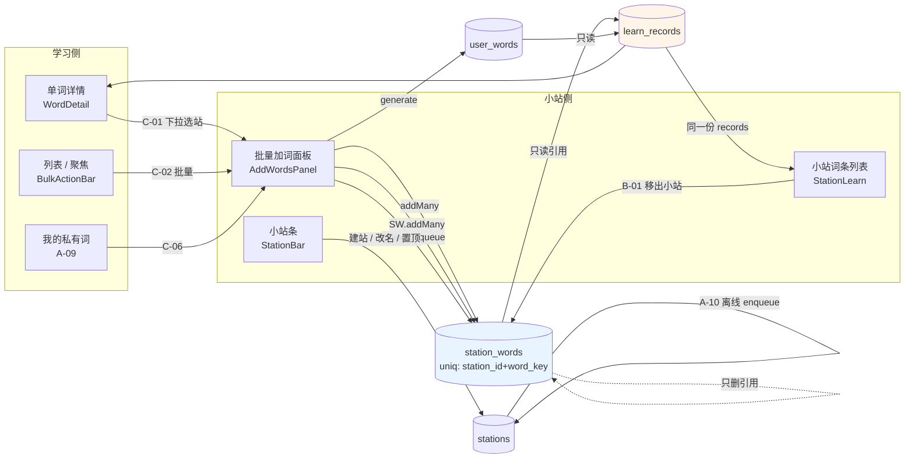

# 词根词缀单词云 · 小站打磨增量 PRD

> 文档类型：**增量 PRD**（不重设计应用，只描述新增 / 改动）
> 需求输入（用户原话）：「做剩下所有的事情，帮我改到可以完整的用，然后小站可以加一个删除功能，也可以把加入学习的词加入小站」
> 拆解为三块：**A** 端到端走查并修通断点 · **B** 小站词条删除 · **C** 学习侧词条一键加入小站
> 上游设计输入：`docs/online-learn-design.md`（草稿四分语义 / 分区隔离 / 三层跨账号隔离）
>
> **硬红线（本文所有需求均不得违反）**
> 1. cloud 层禁止任何 SRS 字段（`ease/interval/lapses/reps`），`schema.js` 的 `assertNoSrsFields()` 兜底不变
> 2. `src/lib/learning.js` **零改动**；调度规则仍只有 `next_due_at = 答错 +24h`，本次**不引入任何 SRS 参数**
> 3. `src/lib/vocab.js` **零改动**（含 `MAX_VOCAB_PRIVATE_WORDS = 500` 护栏与 `statusSource !== 'migration'` 判别式）
> 4. 存储键必须走 `migrate.js` 的 `keysFor(scope)` / `scopeOf(userId)`，禁止任何业务文件自行拼 `wrc.*` 键（含注释）
> 5. 跨账号隔离三层（`useLearnCloud` 的 L1 `replaceAll` / L2 epoch 守卫 / L3 `settleInFlight`）不得绕过；`offline.js` 的 `claim()` 认领机制必须被复用
> 6. **离线优先不能退化：断网必须仍可学习、仍可查看小站**
> 7. 零新增 npm 依赖（`package.json` 只允许增 `test:*` 脚本）

---

## 1. 背景与目标

### 1.1 背景

产品已上线（https://word-station.pages.dev），五个页签（小站 / 学习 / 总览 / 聚焦 / 列表）、离线优先 + Supabase 云同步、`generate-word` Edge Function 刚上线。功能面已经铺得比较全，但**从用户视角看，「从看到一个生词 → 学会它 → 管理它所在的集合」这条主链路还没有真正闭环**。

三类问题：

| 问题 | 表现 |
|---|---|
| **断点** | 多个环节各自能跑，但串起来会卡住 / 静默丢数据 / 给出错误预期（详见 §2） |
| **B 缺口** | 小站词条只能加不能删（云端 API 与 hook 都已存在，只差一个入口） |
| **C 缺口** | 「加入小站」是**单向**的：只有小站页的批量面板能加词，学习侧（详情 / 列表 / 聚焦）**一个入口都没有** |

### 1.2 目标（3 个，正交）

**G1 · 主链路零断点**：从注册 → 建站 → 加词 → 生成 → 复习 → 标记 → 复习到期 → 删除的完整链路，任何一步都不会静默失败、不会让用户误以为成功、不会让已有的学习进度凭空消失。判定标准是 §4 中全部 P0 验收标准可测通过。

**G2 · 小站词条可逆**：用户能安全地把「加错的词」从某个小站移除，且明确知道这**不影响**该词的学习记录与私有词条本身。判定标准是 B-1 ~ B-5 验收标准。

**G3 · 小站 ⇄ 学习双向可达**：在学习的任一自然位置，用户都能把词收进自己某个小站；已收录的词有明确、不可重复添加的视觉标识。判定标准是 C-1 ~ C-6 验收标准。

### 1.3 非目标（本期明确不做）

- 不做 SRS / 间隔重复算法（红线 2）
- 不做小站分享、协作、公共小站
- 不做小站内的筛选 / 搜索 / 排序（P2 另议，见 §7）
- 不做私有词在词云三视图中的呈现（仅在 C-6 里给出入口建议，主体归后续）
- 不重做视觉设计语言

---

## 2. 端到端走查结果

按 10 个环节逐个读源码后的断点清单。等级：**P0 = 卡死 / 静默丢数据 / 误以为成功**；**P1 = 明显别扭、会绕路**；**P2 = 体验瑕疵**。

### 环节 1 · 注册 / 登录 / 登出

| # | 断点 | 复现路径 | 等级 | 建议决策 |
|---|---|---|---|---|
| 1-1 | `beforeSignOut` 的契约与实现相反。注释写「返回 false 表示还没准备好、应中止登出」，但 `catch { return true }` —— flush 失败**从不中止登出**。用户点了确定就登出，未传的数据留在本机 | 断网 → 答题产生记录 → 点「登出」→ 确定 | P1 | 保留「不阻塞登出」的行为（用户要的是登出），但**把 catch 分支的结果如实反映到 UI**：登出后在 `AuthPanel` 位置给一条一次性提示「有 N 条改动没能上传，已留在本机，联网后会自动补传」。**不改** `beforeSignOut` 的返回值语义 |
| 1-2 | 登出提示只统计 `learn.pending` 类草稿。`stationWords` / `generate` / `stations` 三类草稿同样会被计入（`pendingCount` 遍历 `DRAIN_ORDER`），但提示文案统称「N 条改动」，用户不知道是什么 | 离线加词 → 登出 | P2 | 文案补一句分类：「其中小站词条 N 条、学习记录 M 条」。`pendingByKind(scope)` 已存在，直接用 |
| 1-3 | `auth.loading` 期间 TopBar / StationBar 无 loading 态，登录态切换有短暂闪烁 | 刷新页面 | P2 | 低优先，本期不做 |

### 环节 2 · 新建小站 → 改名 → 置顶 → 删除小站

| # | 断点 | 复现路径 | 等级 | 建议决策 |
|---|---|---|---|---|
| 2-1 | **断网时「新建小站」必然失败，且不入队**。`offline.js` 的 `DRAIN_ORDER` 含 `'stations'`、`claim('stations')` 与 `pushOne('stations')` 都已实现、`stationsApi.upsert` 也为离线补传而存在 —— 但**代码里没有任何一处 `enqueue('stations')`**。断网 → 点「+ 新建」→ `insert` 抛网络错 → 小站条右侧红字 `Failed to fetch`，输入框保留 | 断网 → 小站条 → + 新建 → 输入「雅思」→ 创建 | P1 | **补齐 `enqueue('stations', {row:{id,ownerId,name,pinned,createdAt}}, scope)`**（`useStations.createStation` 失败时入队，`id` 用客户端 `crypto.randomUUID()` 作幂等键，与 `upsert` 的 `onConflict:'id'` 对齐）。这不新增 kind，只接通已有链路 |
| 2-2 | 删除小站的 confirm 文案只说「站内词条会一并移除，不可撤销」，**没说清两件用户真正关心的事**：① 那些**私有词条本身不会被删**（`user_words` 保留，只删 `station_words` 引用）；② **学习记录不会被删**（`learn_records` 保留，词仍会出现在学习页复习队列） | 点小站的 ✕ | P1 | confirm 改写为三行：删什么 / 不删什么 / 不可撤销。这是纯文案，零风险 |
| 2-3 | 改名提交空名 → 撞 DB `check (char_length(btrim(name)) between 1 and 40)` → 返回**英文 PG 原始错误**且红字出现在小站条最右端 | 点 ✎ → 清空 → 保存 | P2 | `stationsApi.update` 里 `patch.name` 为空时直接返回 `{code:'BAD_REQUEST', message:'小站名不能为空'}`，与 `create` 的校验对齐（同一文件内已有先例） |
| 2-4 | 置顶 / 改名 / 删除失败无 toast，只有小站条右端红字，删除失败时该 chip 已被乐观移除，红字位置容易错过 | 断网 → 点 ✕ | P2 | 删除失败时在原位补回 chip（`removeStation` 已有 `setStations(snapshot)`）+ 行内红字，本期可不做 |

### 环节 3 · 小站批量加词（粘贴文本解析）

| # | 断点 | 复现路径 | 等级 | 建议决策 |
|---|---|---|---|---|
| 3-1 | **索引未就绪时提交 → 全部词静默消失**。`AddWordsPanel` 的 lookup effect 在 `!indexReady` 时置 `lookup={hit:[],miss:[]}`，于是所有预览行 `kind:'unknown'`；而 `checked` 却被设为**全部勾选**，`canSubmit` 不检查 `indexReady`。点「加入小站（20）」→ `selectedHits` 与 `selectedMiss` 均为空 → 两个 if 都不进 → 消息「已加入 0 词」→ **`setRaw('')` 清空输入框，20 个词彻底消失，全程零报错** | 首屏进小站页（索引 1.7MB 首次加载中）→ 粘贴 20 词 → 立刻点提交 | **P0** | 两处改：① `canSubmit` 增加 `indexReady` 条件，未就绪时按钮 disabled，副区显示已有的「词条索引加载中…」并补一句「索引就绪后才能提交」；② `submit()` 开头加一道 `if (!indexReady) { setMessage('词条索引还在加载，请稍候再提交'); return }` 兜底。**两道都要** —— 前者防误点，后者防脚本/竞态 |
| 3-2 | `kind:'unknown'` 的行（`wordKey: null`）在任何情况下都不会被提交，但**会计入 `selected.length`、显示在按钮计数里、且默认勾选**。即用户勾了一个「算进 N 但永远不会被加」的词 | 同上，或索引加载完成前的任意时刻 | P0 | 与 3-1 同批修：预览行对 `wordKey === null` 的项**取消勾选且置灰**，并在行尾标注「未能识别，稍后重试」 |
| 3-3 | **站内已有的词（`already`）仍默认勾选**。`checked` 由 `[...hit, ...miss]` 生成，不排除 `existing`。用户以为「勾上 = 会加」，实际提交后被 `ignoreDuplicates` 跳过 | 往已有词的小站再粘一次同样的词 | P1 | `already` 的行**默认不勾选**；用户手动勾上时行尾补一个「已跳过（站内已有）」的事后提示。理由：加词动作的意图是「加新的」，重复应当是显式选择 |
| 3-4 | 提交后**无条件 `setRaw('')`**，即使全部失败 / 全部存为离线草稿。用户想重试必须重新粘贴 | 断网 → 提交 → 失败 | P1 | 仅在 `summary.failed === 0` 时清空；否则保留原文并把光标定位到末尾 |
| 3-5 | 单批 20 词上限只在 `generate.js` 里，**面板不阻止用户选超过 20 个 miss 词**。超限时 `generate` 返回 `BAD_REQUEST`，`setMessage('生成失败：单批最多 20 词（当前 25）')` **覆盖掉之前已成功的 `已加入 N 词` 计数** —— 用户完全不知道公共库那部分到底加没加上 | 粘 25 个公共库没有的词 → 提交 | P1 | ① 预览行实时显示「其中 N 个需 AI 生成，单批上限 20」；超过时提交按钮 disabled 并说明。② `submit` 的两段错误消息**合并**而非覆盖（成功计数 + 失败原因同时可见） |
| 3-6 | 离线草稿补传生成的词会自动进 `stationId` 指向的小站。若期间用户删了该小站 / 服务端返回 `stationAdded:false`，`AddWordsPanel` 的 `notice` 能显示 —— 但 **`drain()` 走的是后台补传路径，不经过组件，没有任何 UI 反馈**。用户永远不知道词生成后没进小站 | 离线提交生词 → 删除该小站 → 联网 | P1 | `useStationWords` 在 `refresh` 后对比「本地草稿条数」与「云端实际条数」，不一致时在小站页顶部给一条 amber 提示：「有 N 个词已生成但未能加入本小站（可能小站已被删除），可在小站里重新添加」。这是 P1，与 B/C 解耦 |
| 3-7 | 解析出的非法 token 只展示前 6 个，没有「还有 N 个」 | 粘一段含大量无效文本 | P2 | 补 `+N 个` |

### 环节 4 · AI 生成词条（`generate-word` Edge Function）

| # | 断点 | 复现路径 | 等级 | 建议决策 |
|---|---|---|---|---|
| 4-1 | **失败被显示成成功色**。`message` 的容器写死 `bg-emerald-50 border-emerald-200 text-emerald-800`，而 `setMessage(\`生成失败：${error.message}\`)` 走的是**同一个**绿色块。失败与成功在视觉上不可区分 | 让生成失败（如断网 / 配额耗尽）→ 提交 | P1 | `message` 改为三态：成功（emerald）/ 部分失败（amber）/ 全部失败（red）。`summary.failed > 0 && summary.added + summary.generated === 0` → red |
| 4-2 | **`public_hit` 的结果被计入「已加入」，但服务端不会把它写进小站**。服务端 ③ 回写循环是 `if (r.status !== 'generated' \|\| !r.payload) continue` —— `public_hit` 既无 `payload` 也无 `stationAdded` 字段，直接跳过 `station_words` 写入。而前端 `if (r.status === 'public_hit') summary.added += 1`。**一旦客户端 `words-index.json` 与服务端 `dict_cache` 漂移，就会出现「显示已加入、小站里没有」的静默失败，且 `r.stationAdded === false` 不成立所以 notice 也不提示** | 客户端索引未命中、服务端 dict_cache 有 word_id 时 | P1 | 前端在 `public_hit` 分支**不计入 `added`**，改计入独立的 `hitAgain` 计数并配 notice：「N 个词公共库已收录，无需重复加入」；若未来服务端给 `public_hit` 也补写 `stationAdded`，则按 `stationAdded` 判定。**同时建议服务端补 `public_hit` 的 `stationAdded` 字段**（不阻塞前端上线） |
| 4-3 | 配额用尽（`QUOTA_EXCEEDED`）时 notice 有提示，但**失败的词被清空出表单**（见 3-4 的 `setRaw('')`），用户必须重新粘贴才能重试 | 耗尽配额 → 提交 | P1 | 与 3-4 同批：失败时保留原文 + 高亮失败行 + 每行一个「重试」入口（复用已有的 `generateApi.retry(form, stationId)`，该函数已存在但当前 UI 无入口） |
| 4-4 | 生产走 `supabase.functions.invoke`、开发走同源 `POST /functions/v1/generate-word`，两条路径的错误体形状不同。`fail()` 整体抛错时（如 forms 为空 / 超 20 词），生产路径拿不到 `error.code`（`FunctionsHttpError` 只有 message） | 生产环境提交空表单 | P2 | `generate.js` 的生产分支补一层错误归一：`code: error.code \|\| (error.status === 402 ? 'QUOTA_EXCEEDED' : 'INTERNAL')`，与 `postDev` 的形状对齐 |
| 4-5 | 生成成功的词默认进「当前小站」，用户没有选择余地（`generate(forms, stationId)` 硬绑当前站） | 在小站 A 页生成词 | P1 | 保持现状（与批量加词面板同构），但在小站为空时 `generate` 的 `stationId` 传 `null` 是既有行为 —— 补一条 notice：「词已生成并入库，但当前没有小站，未加入任何小站」 |

### 环节 5 · 小站内复习

| # | 断点 | 复现路径 | 等级 | 建议决策 |
|---|---|---|---|---|
| 5-1 | **「小站复习」与「学习复习」共用同一份 `records`，但只有小站页有说明文案**。`LearnHome` 的 `showSharedNote` 只在 `StationLearn` 里传 true。用户在小站点「我会了」→ 学习页的「已掌握」数字同步变化，但学习页**没有任何解释**，看起来像 bug | 小站点几个词 → 切到学习页 | P1 | 学习页也传 `showSharedNote`，文案调整为双向口径：「小站复习与学习复习是同一份记录、同一个到期时间（答错 +24h），在任一侧标记都会同步到另一侧，不是两套进度」 |
| 5-2 | **「学习卡自动朗读」设置在小站内不生效**。`App.jsx` 给学习页的 `StudySession` 传了 `autoSpeak`，`StationLearn` 内部的 `StudySession` 没传 | 侧栏打开「学习卡自动朗读」→ 进小站 → 开始学习 | P2 | `StationLearn` 增加 `autoSpeak` prop 并从 `App.jsx` 透传 `filters.autoSpeak === true` |
| 5-3 | 小站内学习时**没有「在词云中查看」入口**（`onViewInCloud={null}`），学习页有。同一动作在两个页签能力不一致 | 小站内答题 | P2 | 传 `onViewInCloud`（复用 `App.jsx` 的 `openWordFromStudy`） |
| 5-4 | 小站的难度分档是组件内 `useState`，切页签即丢；学习页的分档持久化在 settings 里 | 小站选档 → 切到学习 → 切回小站 | P2 | 保持现状（小站的档位与全库档位语义不同），但需在小站的分档区加一行说明「只影响本小站的新学队列」 |
| 5-5 | 行内「待复习」按钮在词已是 `review` 且 `consecutiveCorrect === 0` 时仍然显示，点了没有任何变化（`setReviewPure` 早退返回 `prev`） | 反复点行内「待复习」 | P2 | 按钮在该状态下置灰 / 隐藏 |

### 环节 6 · 学习页

| # | 断点 | 复现路径 | 等级 | 建议决策 |
|---|---|---|---|---|
| 6-1 | **私有词在词云三视图与列表页完全不可见**。`ListView` / `FocusView` / `NetworkView` 的词全部来自公共 `words`；私有词只进 `learn.statWords`（统计 + 复习队列 + 词汇量预测）。后果：用户在私有词上做的所有标记**无法在列表页看到也无法批量操作**；「列表」作为「管理全部我的词」的心智入口是残缺的 | 生成 3 个私有词 → 切到列表页搜这几个词 | P1 | 本期不把私有词塞进三视图（改动面大且有性能风险），但走查结论必须记为已知缺口。**本期给一个最小出口**：侧栏「掌握状态」区加一行「我的私有词 N 个 · 查看」，点开用一个轻量列表（复用 `useUserWords`，只读 + 可跳转到小站）呈现。这是 C-6 的前置 |
| 6-2 | **三态统计与「可见单词」无法对账**。`LearnHome` 三态来自 `countByStatus(statWords)`（全库 + 私有词），`Sidebar` 的「可见单词」来自 `applyFilters`（受 CEFR / 类型 / 词源 / 状态筛选影响）。两个数放在一起但没有任何关系说明 | 收窄筛选后同时看侧栏与学习页 | P2 | 学习页三态卡加一行小字「全库口径，不受左侧筛选影响」 |
| 6-3 | **从 StudyCard 点「☁ 在词云中查看」后没有回来的路**。`openWordFromStudy` 切 `view='overview'`，`sessionMode` 仍是 `'learn'`，StudySession 只是 `hidden`。用户在看词云时没有任何「回到学习」的入口，只能手动点顶部「学习 · 进行中」 | 学习中 → 点云 → 想继续 | P1 | 「在词云中查看」改为携带来源标记，跳转后顶部「学习 · 进行中」页签加一个「继续本轮（3/10）」的高亮按钮；或在 overview 顶部加一条「返回本轮学习」的条 |
| 6-4 | 「记得」按钮的语义是**立即判定为已掌握**（`markKnown`），而「答对」才是 +1/2 进度。用户预期是「记得 = 答对」 | 学习中点「记得」→ 直接已掌握 | P2 | 按钮文案改为「已掌握」并加 title「直接标记为已掌握，跳过 2 次答对」；`StudySession` 总结页的「记得 / 不记得 / 新增掌握」三栏口径也随之调整（`remembered` 与 `mastered` 当前大量重叠） |
| 6-5 | 私有词出现在复习队列时，`StudyCard` 的「构词拆解」区对 `chain: []` 的词**整段不渲染**（只 `UserWordEditor` 里有「未拆解（x.unk）」的兜底） | 复习到私有词 | P2 | `StudyCard` 在 `chain` 为空时补一行「未拆解」占位 |

### 环节 7 · 列表页 / 聚焦模式

| # | 断点 | 复现路径 | 等级 | 建议决策 |
|---|---|---|---|---|
| 7-1 | **「全选当前结果」可能一次写入上万条记录，直接打爆本机存储**。按钮无上限地把 `allIds`（最多 6.4 万）塞进 `applyMany` → 单次 `writeLearn` 写一个巨大的 JSON → `QuotaExceededError` → `onStorageError` → 徽标进入红色「本机存储已满 · 改动未保存」。而**内存态已更新、磁盘没更新** → 刷新即丢 | 列表页 → 点「全选当前结果（6 万）」→ 点「我会了」 | **P0** | ① `allIds` 超过阈值（建议 2000）时按钮改为「全选前 2000 个」并说明；② `applyMany` 分批（每 500 条一次 `commit`）而不是「一次 commit 上万条」；③ 保留 `onStorageError` 现有告警语义不动 |
| 7-2 | **`selectedIds` 是全局的、跨页签保留且不可见**。在列表页选 50 个 → 切到聚焦视图 → 浮出 `BulkActionBar count=50`，但聚焦视图里可能只看得见其中 3 个。此时点「我会了」会标记 50 个 | 列表多选 → 切聚焦 → 点批量按钮 | P1 | `BulkActionBar` 显示「已选 N 个（部分不在当前视图）」，并在页签切换时**保留选择但显式提示**；提供「清空选择」。不做自动清空（会破坏列表页的 Shift 连选） |
| 7-3 | **三个批量按钮的 flash 文案完全相同**（「已更新 N 个」）。点错「清除学习记录」与点「加入待复习」事后看不出区别，而前者是破坏性的 | 批量操作 | P1 | flash 文案按按钮区分：「已标记 N 个已掌握」/「已加入 N 个待复习」/「已清除 N 个学习记录」 |
| 7-4 | `WordRow` 行内**没有任何「加入小站」入口** | 列表页 | P1 | 见 §3.2（做法是走 BulkActionBar，不做行内按钮） |
| 7-5 | 选中无词素的词（orphan）时 `if (w.morphs[0]) setSelectedMorphId(...)` 不成立 → 右侧只显示 `WordDetail` → 点「← 返回词群」直接回到「怎么用」引导，**丢失了所在的列表位置** | 列表页点一个「无词素 · 单纯词」 | P2 | `WordDetail` 的返回按钮文案按来源区分（「← 返回词群」vs「← 返回列表」） |

### 环节 8 · 小站 ↔ 学习互通

| # | 断点 | 复现路径 | 等级 | 建议决策 |
|---|---|---|---|---|
| 8-1 | **私有词没有「加入小站」以外的任何管理入口**。`UserWordEditor` 只能从 `StationLearn` 内部点私有词词形进入。**一旦该词被移出小站（本期新增的 B 功能），它就彻底失去编辑 / 重新生成 / 删除入口** —— 但它仍留在 `user_words`、仍计入学习页三态与词汇量、仍会出现在复习队列。用户会看到一个「清不掉的幽灵词」 | 用 B 功能移出小站 → 想改它的释义 | **P0** | 这是 B 功能**必须连带解决**的前置。方案：新增「我的私有词」只读列表（见 6-1），列表内每行提供「编辑 / 重新生成 / 删除」。**该列表同时是 C-6 的载体** —— 一处解决 6-1、8-1、C-6 三个断点 |
| 8-2 | 小站词条行内**没有删除入口**（云端 `stationWordsApi.remove` 与 `useStationWords.removeWord` 都已就绪） | 小站页 | P1 | 见 §3.1 |
| 8-3 | 小站词条的**站内笔记（`note`）既无入口也无展示**。`stationWordsApi.updateNote` / `useStationWords.updateNote` / `wordView` 的 `note` 字段全链路已通，UI 零使用 | 小站页 | P2 | 本期不做（会引出笔记编辑器的范围问题），记为已知缺口 |
| 8-4 | 小站词条行的「待复习」按钮文案与 `WordDetail` 的「加入待复习」不一致；且「加入待复习」在两处**含义相同**（都调 `setReview`），但在列表页 `WordRow` 里又只呈现为三个无文字的图标 | 跨页签对比 | P1 | 统一为「加入待复习」；`WordRow` 的三态图标补 `title`（已有）并在首次使用时保留图例（`StatusLegend` 已在 `StationLearn` 有，列表页无 —— 见 8-5） |
| 8-5 | 列表页 / 聚焦视图**没有三色图例**，`StatusPill` 的三态配色在小站页有 `StatusLegend`、在列表页没有 | 列表页 | P2 | 复用已有的 `StatusLegend` 组件加到列表页表头 |

### 环节 9 · 同步状态徽标

| # | 断点 | 复现路径 | 等级 | 建议决策 |
|---|---|---|---|---|
| 9-1 | **断网刷新页面后，小站列表整个消失**，小站条显示「还没有小站，点右侧『+ 新建』创建一个」——用户会以为小站被删了。根因：`useStations` 的 `stations` 是纯云端态，无本地缓存；离线时 `refresh` 走 `setError(err); return`（**不清空**，所以**同一次会话内**切换小站还能看到旧数据），但**刷新页面后首帧是 `[]` 且永远不会填上**。**这直接违反红线 6「断网必须仍可查看小站」** | 联网建一个小站 → 断网 → F5 | **P0** | 新增一个分区缓存键（`keysFor(scope).stationsCache`，**必须加在 `migrate.js` 里**，业务文件不得自拼键），`useStations` 首帧读缓存渲染、联网后再覆盖。参照 `useUserWords` 的 `userWordsCache` 已有实现，模式现成 |
| 9-2 | **离线提交加词后，小站列表不显示这些草稿词**。`useStationWords` 只读云端 `listByStation`，离线草稿没有任何本地投影。提交后消息说「已加入 0 词 · 3 条存为离线草稿」，但列表里什么都没有 → **误以为失败** | 断网 → 粘贴词 → 提交 → 看列表 | **P0** | 同 9-1 的方向：`useStationWords` 增加本地待传投影 —— 从 `offlineApi.readDrafts(scope).stationWords` 读出本账号本小站待传的 `wordKey`，在列表中以「待上传」灰色斜体行呈现（不参与 `counts.total` 的正式统计，单独计数）。**必须走 `readDrafts(scope)` 而非自行解析键** |
| 9-3 | 徽标文案「离线 · N 条待传」不区分草稿类型。用户看到「3 条待传」无法判断是 3 个词还是 3 次答题 | 离线 | P2 | 文案补分类计数（`pendingByKind` 已存在） |
| 9-4 | 「本机存储已满 · 改动未保存」的徽标**点击行为是 `retry()`（= flush 同步）**，但它 title 里的建议是「先导出 JSON 备份」。点按钮不会导出，用户会反复点 | 配额打满 | P2 | 容量告警态的点击行为改为**直接触发侧栏导出**（文案与行为对齐） |
| 9-5 | 「传不上去」态的徽标，`pending > 0` 时点击是 flush、`pending === 0` 时点击是清除草稿 —— 同一位置两种行为 | 有 parked 草稿 | P2 | 统一：先 flush 再提示「若仍传不上去，点此清除」（一次点击做两件事，语义明确） |
| 9-6 | 游客态直接 return，「本机模式（游客）」徽标**不显示草稿数**。游客 scope 也可能有草稿（`enqueue` 的 scope 缺省就是 `'guest'`） | 游客态产生草稿 | P2 | 游客态也显示 pending / stuck |

### 环节 10 · 总览页（统计自洽性）

| # | 断点 | 复现路径 | 等级 | 建议决策 |
|---|---|---|---|---|
| 10-1 | **侧栏「命中 N 个词群」的口径是错的**。`App.jsx` 传 `hitCount={stats.morphCount}`，而 `stats` 来自 `applyFilters` —— 它除了 `query` 还吃 `types / origins / minCefr / status / hideAutoKnown`。所以「命中 N 个词群」实际是「在当前全部筛选条件下匹配 query 的词群数」。用户先收窄 CEFR 再搜索 → N 变小，会以为搜索结果变少了 | 侧栏把难度调到 B2 → 搜「spec」 | P1 | 改为 `hitCount={searchResult.morphs.length}`（`search` 已在 `App.jsx` 里算好，`searchResult` 就是），并把文案分成两行：「命中 N 个词群（当前筛选下）」。零成本 |
| 10-2 | 三态之和 ≠ 可见单词数。`visibleStats` 把 `visibleOrphans`（无词素词）加进了 `wordCount` / `uniqueWords`，**但没加进 `known/review/unknown`**。`Sidebar` 不显示三态所以无感，但任何把两者并列的 UI 都会不自洽 | — | P2 | 明确口径：`uniqueWords` 含无词素词，三态只统计有词素的词。若要并列展示，须补齐 orphans 的三态 |
| 10-3 | 顶栏 `词群 X · 单词 Y` 与侧栏两个数是同一份 `visibleStats`，重复展示且都随筛选变化，没有「全库口径」的参照 | — | P2 | 顶栏保留（跨页签可见），侧栏改为只显示筛选相关项 |

### 2.11 信息架构 / 文案层面的困惑点（汇总）

| # | 困惑 | 涉及位置 | 建议 |
|---|---|---|---|
| IA-1 | **同一个动作在两个页面叫不同名字**：「加入待复习」（`WordDetail`）vs「待复习」（`StationLearn` 行内） | `WordDetail` / `StationLearn` | 统一为「加入待复习」（`setReview` 的既有语义就是「加入」） |
| IA-2 | **同一个徽标在两个页签存在但只有一处有图例**：`StatusPill` 三色，`StationLearn` 有 `StatusLegend`，`ListView` / `FocusView` 没有 | 三个组件 | 复用 `StatusLegend` 到列表页 / 聚焦页 |
| IA-3 | **「小站」既是「收藏夹」又是「学习范围」**：小站内可背词，但学习页的队列是全库口径。用户在小站背完一个词，会发现它也出现在学习页的复习队列里，反之亦然 | `LearnHome` / `StationLearn` | 保留现有共享设计（它是对的），但**两处都要有说明文案**（见 5-1） |
| IA-4 | **「私有词」这个词在三处含义不同**：`UserWordEditor` 的「仅本人可见」标签（可见性）、`StationLearn` 的「私有」标签（来源）、`generate-word` 的「个人词库」（存储位置） | 多个组件 | 统一为一个术语「我的词」，来源标签改为「我生成的」 |
| IA-5 | 首屏「怎么用」引导第 1 条写「一次可加 20 个」，但**面板实际允许粘任意数量**，超过 20 会在生成阶段失败 | `App.jsx` 空态引导 | 与 3-5 同批修：面板前端也强制 20 上限，引导文案才成立 |
| IA-6 | 顶栏页签「学习 · 进行中」是一个**状态**而不是页签，但长得和页签一样 | `TopBar` | 保持（改动成本高于收益），但配合 6-3 加「继续本轮」 |

---

## 3. B / C 两块功能规格

### 3.1 B · 小站词条删除

#### 3.1.1 现状（已核实，不需重查）

| 层 | 状态 |
|---|---|
| 云端 API | ✅ `stationWordsApi.remove(stationId, wordKey)`（`stationWords.js:90`）、`updateNote`（`:108`） |
| Hook | ✅ `useStationWords.removeWord(wordKey) => Promise<boolean>`，已在 hook 的 return 里 |
| 组件入口 | ❌ `StationLearn.jsx` 词条行（约 168–210 行）只有：编辑私有词 / `StatusPill` / 三个 `GhostBtn`（我会了 / 加入待复习 / 退回复习） |
| 小站本身删除 | ✅ 已有（`StationBar.jsx`，带 confirm） |

**结论：这是「补一个入口」，不是从零实现。**

#### 3.1.2 语义（**必须逐字写进 confirm 与文档，作为验收标准**）

删除的层级：**只删 `station_words` 的一行引用**。

| 对象 | 是否被删 | 说明 |
|---|---|---|
| `station_words` 中该 `(station_id, word_key)` 行 | ✅ 删除 | 小站 → 词的引用 |
| `user_words` 里的私有词条本身 | ❌ **保留** | 词还在个人词库里，仍计入学习页三态 / 词汇量 / 复习队列 |
| `learn_records` 里的学习记录 | ❌ **保留** | 已掌握 / 待复习 / 累计答对答错全部保留，**仍在学习页复习队列里出现** |
| 公共词条 | ❌ 不适用 | 公共库只读，本来就没有副本 |

#### 3.1.3 交互形态决策

| 决策点 | 结论 | 理由 |
|---|---|---|
| 入口位置 | **词条行内第 4 个 `GhostBtn`，文案「移出小站」** | 与现有三个 `GhostBtn` 同一设计语言；行内已有 `ml-auto` 的操作区，加一个不破坏布局 |
| 按钮文案 | **「移出小站」而不是「删除」** | 「删除」会与 `UserWordEditor` 里那个**真正删除 `user_words` 的红色「删除」按钮**混淆。两者语义截然不同（见 8-1） |
| 二次确认 | ✅ `window.confirm`，与 `StationBar` 的删除小站一致 | 删除不可撤销，用 confirm 不用撤销 |
| confirm 文案 | 见下（三行，明确「不删什么」） | 5-2 的直接修复 |
| 是否支持长按 / 批量多选删除 | ❌ **本期不做** | 行内已经有 4 个按钮，再加多选 checkbox 会让词条行密度失控；批量删除的收益低于其 UI 成本。列为 P2（见 §7） |
| 是否可撤销 | ❌ **不做** | 需要额外维护「撤销墓碑」与云端二次删除，是把简单操作复杂化 |

**confirm 文案定稿：**

```
从「雅思」移出 photosynthesis？

· 只是从这个小站移除，不会删除这个词条本身
· 你的学习记录保留，仍会出现在「学习」页的复习队列里
· 移出后可以随时从学习页重新加回

此操作不可撤销。
```

#### 3.1.4 删除后的一致性

| 关注点 | 行为 | 是否需要额外代码 |
|---|---|---|
| `useStationWords` refresh | `removeWord` 内部已 `await refresh()` | ❌ 已有 |
| 计数徽标（`counts.total/public/user`） | `counts` 是 `words` 的 `useMemo` 派生，`words` 随 `refresh` 更新 | ❌ 自动一致 |
| `StationLearn` 的 `stats` | `countByStatus(list, recs)`，`list` 随 `refresh` 变小 | ❌ 自动一致 |
| **小站复习队列** | `reviewQueue = buildReviewQueue(list, recs, ...)`，词从 `list` 移除 → **立即从站内复习队列消失** | ❌ 自动一致 |
| **学习页复习队列** | `reviewQueue = buildReviewQueue(statWords, recs, ...)`，`statWords` 不含小站维度 → **该词仍在学习页复习队列里** | ❌ 自动（**这正是要向用户说明的语义**） |
| 学习记录 | 完全不动 | ❌ 无需改动 |
| 私有词可见性 | 仍在 `user_words` / `statWords` 里 | ❌ 无需改动 |

**「删掉一个正在待复习队列里的词会发生什么」的完整答案：**

1. 该词立即从**小站内的**待复习队列消失（`list` 里没有了）
2. 该词**仍然在**「学习」页的待复习队列里，因为 `statWords` 是全库 ∪ 私有词，与小站无关
3. 该词的 `nextDueAt` / `consecutiveCorrect` / `incorrectCount` 全部不变
4. 用户在**学习页**复习它，状态照常更新；重新加回小站后，站内复习会按**更新后的**记录继续
5. 若该词是私有词且用户从此不再加回小站 → 它仍可通过「我的私有词」列表管理（依赖 8-1 的前置修复）

**因此删除后必须给一条事后反馈**（不能只靠 confirm）：

```
已从「雅思」移出 photosynthesis · 学习记录保留
```

#### 3.1.5 离线删除的产品口径（**需要用户拍板，见 §8 Q1**）

| 方案 | 做法 | 代价 |
|---|---|---|
| **A · 禁止删除并提示**（**推荐**） | 离线时「移出小站」按钮 disabled，title / 点击提示「离线时不能移除词条，联网后再试」 | 无。零新增数据路径 |
| B · 排队待同步 | 新增 `stationWordsRemove` 草稿 kind | **需改 `offline.js` 5 处**（`DRAIN_ORDER` / `claim` 结构校验 / `pushOne` / `summarize` / `itemOwnerId`），且撞上 `claim` 的结构校验 —— 现存 `stationWords` 草稿的 payload 是 `{ownerId, stationId, items}`，`claim` 里写着 `if (kind === 'stationWords' && (!item.stationId \|\| !Array.isArray(item.items))) return skip` —— 把 remove 塞进同一个 kind 会被判为 **malformed 并直接丢弃**。必须新增独立 kind，改动面大 |

**推荐 A 的产品理由（不只是「改动小」）：**

1. **删除是低频操作**，加词才是高频。为低频破坏性操作扩展草稿队列，收益不匹配
2. **A 会引入一类新的数据不一致**：remove 草稿一旦被 `claim` 判为跨账号 park、或 `isPermanentError` 判为永久失败而 park，**云端的词还在，但用户以为已经删了** —— 用户刷新页面发现词又回来了，比「离线时不能删」糟糕得多。加词的草稿是幂等 upsert（重复执行无损），删除不是
3. **顺序语义在离线下不可靠**：离线时「加 A → 删 A」在同一 kind 队列里靠 `queuedAt` 排序侥幸正确，但一旦引入 `force` 重试、多设备并发、或未来任何一次队列重排，删除就会被提前执行
4. 用户离线时想删一个词，绝大多数情况是「刚才加错了」—— 他大概率马上就恢复网络了

**给用户的最终口径：离线时「移出小站」不可用，并明确告知原因，而不是静默失败。**

---

### 3.2 C · 学习侧词条一键加入小站

#### 3.2.1 现状

`AddWordsPanel` 是**唯一**的加词入口，只在小站页。学习页 / 列表页 / 聚焦 / 单词详情**零入口**。

#### 3.2.2 入口位置与优先级

| 优先级 | 位置 | 形态 | 理由 |
|---|---|---|---|
| **P0-1** | **单词详情（`WordDetail`）** | 「加入小站」次级按钮 + 小站下拉 | 「学到这里想收藏」的最自然时机；详情页已有「我会了 / 加入待复习」按钮组，加一个同层按钮不破坏结构。**注意 `WordDetail` 是私有词唯一的详情视图之一**（另一处是 StudyCard） |
| **P0-2** | **列表 / 聚焦的 `BulkActionBar`** | 第 4 个按钮「加入小站」+ 小站下拉 | **一处改动同时覆盖 `ListView` 与 `FocusView`**（两者共用同一组件），且天然支持批量。**不做 `WordRow` 行内按钮** —— 行内已有喇叭 + 三态图标 + 状态文字，再加会让密度失控 |
| **P1-1** | 侧栏搜索命中的单词行 | 与「单词命中」列表同行的 `+` 按钮 | 「搜到一个词 → 收进小站」 |
| **P1-2** | 「我的私有词」列表 | 每行一个「加入小站」 | 依赖 8-1 的前置列表 |
| **P2-1** | `StudyCard` 内 | 小图标 | **明确不做**：打断答题节奏，学习中不该有「整理收藏」的诱因 |

#### 3.2.3 交互形态

**下拉选择小站**，而不是「立即加入当前小站」。理由：当前小站未必是用户想要的目标（用户可能正在小站 A 页但想把词收进小站 B）。

```
点「加入小站」
   ↓
┌────────────────────────────────┐
│ 选择小站                        │
├────────────────────────────────┤
│ 📌 雅思            128 词       │  ← 置顶优先
│   论文阅读           43 词       │
│   日常口语            0 词       │
├────────────────────────────────┤
│ ＋ 新建小站…                    │
└────────────────────────────────┘
   ↓ 选中
addMany(ownerId, stationId, [{wordKey, source}])
   ↓
成功 → 「已加入「雅思」」+ 按钮变为「已在「雅思」 ✓」
失败 → 「加入失败：<原因>」+ 按钮恢复原状
```

| 场景 | 行为 |
|---|---|
| **当前词已在某小站** | 下拉里那一项右侧显示 `✓ 已在` 且**不可点**（已收录的小站）；其他小站正常可选 → 支持「一个词同时进多个小站」 |
| **当前词已在当前小站** | 按钮本身变为 `已在「雅思」 ✓`（不可点），但**仍可点开下拉**加到别的小站 |
| **无小站**（`stations.length === 0`） | 下拉里只有「＋ 新建小站…」。点击 → 行内输入框 → 提交 → 创站成功后**自动把词加进去**（一气呵成，不让用户做两件事） |
| **未登录 / 游客** | 按钮 disabled + 文案「登录后可把小站同步到云端」。**不做游客本地小站** —— 小站是云端概念，游客态做本地小站会立刻引出「登出后这些小站去哪」的问题 |
| **小站 loading 中** | 按钮 disabled + 「小站加载中…」 |
| **批量（N 个词）** | 一律用 `addMany` 一次请求；结果汇总为「已加入 M 个（N 个已在小站中，已跳过）」。**不逐词提示** |

#### 3.2.4 词类支持

| 词类 | `wordKey` | `source` | 来源对象 | 备注 |
|---|---|---|---|---|
| 公共词 | `w.<slug>` = `word.id` | `'public'` | `ListView` / `FocusView` / `WordDetail` 的 `word` | 零转换 |
| 私有词 | `u.<formKey>` = `word.id` | `'user'` | 「我的私有词」列表（`toUserWordView` 保证 `id === wordKey`） | 同一条 `addMany` 路径，`wordView.js` 的硬要求正好让这件事免费 |

**结论：公共词与私有词走完全相同的一条代码路径**，只是 `source` 不同。不需要为私有词单独设计。

**但必须先解决 8-1**：私有词目前**没有列表页入口**，所以「私有词也能加入小站」在 P0 阶段是**无处可触发**的。私有词的可触发位置只有 StudyCard（不做）和即将新增的「我的私有词」列表（P1-2）。**因此 C 的私有词部分整体落在 P1，依赖「我的私有词」列表先落地。**

#### 3.2.5 去重（避免重复添加）

`station_words` 有唯一索引 `station_words_uniq (station_id, word_key)`，`addMany` 用 `upsert(..., { onConflict: 'station_id,word_key', ignoreDuplicates: true })` —— **重复添加在数据库层已经安全**，会走 `skipped` 计数。

用户侧的可见性由前端负责：

- `App.jsx` 已有 `existingKeys`（当前小站的 `wordKey` 集合，`:206-209`）→ 用于「已在当前小站」
- **需要扩展为 `wordKey → Set<stationId>` 的反向索引**，才能在下拉里标出「已在哪些小站」。数据来源：`useStationWords` 目前只加载当前小站的 `refs`，拿不到其他小站的内容

**决策（P0 用最小方案）：** 拉全量 `station_words`（当前账号所有小站的引用行）到 `useStationWords` 或一个新的轻量 `useStationIndex(ownerId)`，构造 `Map<wordKey, Set<stationId>>`。数据量级估算：`station_words` 每行约 100 字节，一个账号 10 个小站 × 500 词 = 5000 行 ≈ 500KB —— **偏大**。因此：

- **P0**：只标记「已在**当前**小站」（复用 `existingKeys`，零新增请求），其他小站不标记，重复添加交给 `skipped` 静默跳过 + 汇总提示里的「N 个已在小站中」
- **P1**：若需要精确的「已在哪些小站」，走一个新的 `listAllRefs(ownerId)` 云函数（`select station_id, word_key from station_words where owner_id = ?`），并给 `useStationWords` 加本地缓存（与 9-1 的 `stationsCache` 同一个分区缓存键体系）

#### 3.2.6 离线支持

**结论：复用现有 `stationWords` 草稿 kind，不新增。**

`AddWordsPanel.jsx:134 / 141` 已经有完整的入队逻辑：

```js
offlineApi.enqueue('stationWords', { ownerId, stationId, items }, scope)
```

C 功能只需要把这段逻辑**抽成一个共享的 `addToStation(ownerId, stationId, items, scope, online)` 辅助函数**（放在 `src/lib/` 或 `src/hooks/` 下），让 `AddWordsPanel` 与新的反向入口共用。`items` 的形状 `{ wordKey, source }` 与 `pushOne('stationWords')` 期望的 `{ ownerId, stationId, items }` 完全吻合，**无需改动 `offline.js` 任何一行**。

离线时的 UI 口径与 9-2 联动：入队成功后提示「已存为离线草稿，联网后自动加入小站」，且该词**立即以「待上传」样式出现在小站列表**（来自 9-2 的本地投影）。

**必须复用 `claim()`**：草稿带 `ownerId`（`scopeOf(ownerId)`），跨账号污染由 `offline.js` 的认领机制兜底。**反向入口不得绕过这条路径直接调 `addMany` 了事。**

#### 3.2.7 与「批量加词」的关系

**建议：把批量面板也做成双向，但不是本期做。**

| 方向 | 现状 | 建议 |
|---|---|---|
| 小站 → 学习（加词） | ✅ 已有批量面板 | 保持 |
| 学习 → 小站（收词） | ❌ 无 | **本期做**（C-1 ~ C-5） |
| **小站 → 学习（导出）** | ❌ 无 | **P2**：「把本小站 128 个词导出为文本 / 导入到另一小站」。这是自然的第三向，但会让「小站」承担「集合运算」的语义，超出本期范围 |
| 面板本身改造 | — | **本期不动** `AddWordsPanel` 的定位与布局，只做走查中列出的断点修复（3-1 ~ 3-7） |

---

## 4. 用户故事

### A · 端到端修通

| ID | 角色 | 场景 | 价值 |
|---|---|---|---|
| US-A1 | 首次使用者 | 打开小站页，词条索引还在加载，我粘贴了 20 个生词就点了「加入小站」 | 不会「显示已加入 0 词、然后我的 20 个词凭空消失」；按钮明确告诉我还没准备好（9-1 同源问题） |
| US-A2 | 重度使用者 | 断网状态下打开应用，想看看我上次建的「雅思」小站里有哪些词 | 断网也能看到小站与词条，不必等到有网（红线 6） |
| US-A3 | 离线学习者 | 断网时往小站加了 5 个词 | 列表里能立刻看到这 5 个词标着「待上传」，而不是「加了 0 词」什么都没有 |
| US-A4 | 谨慎的用户 | 点删除小站前 | 明确知道「词条本身不删、学习记录不删」，而不是以为把词和进度都删了 |
| US-A5 | 刷题者 | 我在列表页选了 3 万个词点了「我会了」 | 不会因为一次批量操作把本机存储写爆、然后刷新丢进度 |
| US-A6 | 搜索者 | 收窄了难度筛选后搜索「spec」 | 「命中 N 个词群」是真的命中数，不是我当前筛选下的词群总数 |
| US-A7 | 收藏者 | 生成了一批私有词，想改其中一个的释义 | 即使它已经不在任何小站里，我仍然找得到它、能编辑它 |
| US-A8 | 学习中的人 | 在小站里点了「我会了」，然后去学习页 | 学习页有说明告诉我这是同一份记录，不是两套进度 |

### B · 小站词条删除

| ID | 角色 | 场景 | 价值 |
|---|---|---|---|
| US-B1 | 加错词的用户 | 往「雅思」里误加了 3 个不相关的词 | 能把它们从「雅思」移出去，小站恢复干净 |
| US-B2 | 谨慎的用户 | 移出一个我昨天背过的词 | 弹窗明确告诉我：这个词本身没被删、我的学习进度也没被删 |
| US-B3 | 正在复习的用户 | 我在「雅思」里移出了一个正待复习的词 | 我知道它只是从小站里出去了，「学习」页的复习队列还会出现它 —— 不是消失 |
| US-B4 | 离线用户 | 我想断网时移出误加的词 | 按钮不可用并说明原因（而不是点了没反应，或者以为删了其实没删） |
| US-B5 | 私有词主人 | 我把一个私有词移出了小站 | 我仍然能在「我的私有词」里编辑 / 重新生成 / 删除它 |

### C · 学习侧加入小站

| ID | 角色 | 场景 | 价值 |
|---|---|---|---|
| US-C1 | 学习者 | 在词详情里看到一个刚学会的词 | 一键收进「雅思」，不用切到小站页重新粘一遍 |
| US-C2 | 整理者 | 在列表页选了 20 个同族词 | 一次把它们全收进「论文阅读」，而不是逐个点 |
| US-C3 | 谨慎的用户 | 这个词已经在「雅思」里了 | 下拉里那项标着「✓ 已在」且不可点 —— 我知道不会重复添加 |
| US-C4 | 多站用户 | 我想把同一个词同时放进「雅思」和「论文阅读」 | 下拉里可以多选不同小站，已有的那几项标着「已在」 |
| US-C5 | 新用户 | 我还没有任何小站 | 下拉里直接「＋ 新建小站」，建完自动把词加进去 |
| US-C6 | 私有词主人 | 我生成了一批生词，想把其中几个单独收进一个小站 | 在「我的私有词」列表里就能加，和公共词完全一样 |

---

## 5. 需求池

### 5.1 P0 —— 卡死 / 静默丢数据 / 误以为成功

| 编号 | 需求 | 优先级 | 验收标准（可测） | 依赖 |
|---|---|---|---|---|
| A-01 | `AddWordsPanel` 在词条索引未就绪时禁止提交 | P0 | ① 首屏加载中，「加入小站」按钮 `disabled`；② 此时点击不产生任何请求、输入框不清空、消息区提示「词条索引还在加载，请稍候再提交」；③ 索引就绪后按钮自动可用 | — |
| A-02 | 预览行 `wordKey === null` 的项不参与提交 | P0 | 构造一行无法识别的词：它显示为置灰、**复选框未勾选**、行尾有「未能识别」标注；按钮计数 `N` 不包含它 | A-01 |
| A-03 | 提交失败时保留输入原文 | P0 | 制造全部失败（断网 + 断网下的 generate 草稿路径除外）；断言：`textarea.value` 与提交前完全一致，光标在末尾；面板出现「重试」入口可只重试失败行 | — |
| A-04 | 区分成功 / 部分失败 / 全部失败三种结果色 | P0 | 三种情况下消息块底色分别为 emerald / amber / red；断言文案含精确的成功数与失败数 | A-03 |
| A-05 | 小站列表与当前小站 id 的本地缓存（断网可读） | P0 | ① 断网 + F5，小站条仍列出全部小站、当前小站高亮正确；② 小站词条列表仍显示全部词条；③ 缓存键**只经** `migrate.js` 的 `keysFor(scope)` 生成（`npm run test:keys` 通过） | 新增 `keysFor(scope).stationsCache` + `stationWordsCache`，**必须加在 `migrate.js`** |
| A-06 | 离线草稿词条在小站列表的本地投影 | P0 | 断网提交 3 个公共词 → 小站列表立即出现 3 行「待上传」样式；徽标计数为 3；联网后这 3 行变为正常行且徽标归零；投影数据**只经** `offlineApi.readDrafts(scope)` 读取 | A-05 |
| A-07 | `applyMany` 分批提交 + 全选上限 | P0 | ① 列表页选中 6000 个词执行批量操作，通过（不触发 `QuotaExceededError`）；② 「全选当前结果」在结果 > 2000 时按钮文案变为「全选前 2000 个」并说明；③ 全程徽标不出现红色容量告警 | — |
| A-08 | 侧栏搜索命中数改为真实命中数 | P0 | 收窄 CEFR 到 B2 后搜索「spec」，「命中 N 个词群」与仅搜索（不收窄筛选）时的 N 相同 | — |
| A-09 | 私有词的常驻管理入口（「我的私有词」列表） | P0 | ① 侧栏有入口，展示 `useUserWords` 的全部私有词（词形 / 释义 / 状态徽标 / 是否在当前小站）；② 每行可「编辑」（复用 `UserWordEditor`）与「加入小站」；③ 某私有词被移出小站后，仍可从该列表编辑它；④ 该列表**不得**把私有词写进 `dict.js` 的 IndexedDB 缓存（红线：`check-storage-keys.mjs` R2） | 8-1 的修复；B 的语义 |
| A-10 | `enqueue('stations')` 接通离线建站 | P0 | 断网 → 新建小站「雅思」→ 提示「已存为离线草稿」→ 小站条**立即出现**「雅思」→ 联网后自动出现在另一台设备。`claim('stations')` / `pushOne('stations')` 已存在，**不新增 kind** | 需 `useStations` 增加本地缓存读（与 A-05 同源） |

### 5.2 P1 —— 明显别扭 / 会绕路

| 编号 | 需求 | 优先级 | 验收标准（可测） | 依赖 |
|---|---|---|---|---|
| **B-01** | `StationLearn` 词条行新增「移出小站」按钮（行内第 4 个 `GhostBtn`） | P1 | ① 词条行操作区出现「移出小站」；② 点击弹出 confirm，文案含「不会删除这个词条本身」与「学习记录保留，仍会出现在「学习」页的复习队列里」两行；③ 取消 → 词条仍在列表中 | — |
| **B-02** | 删除只移除引用，不动词条与学习记录 | P1 | ① 删除后 `station_words` 该行消失（`station_words_uniq` 无残留）；② `user_words` 中该私有词**仍在**；③ 学习页三态统计与该词 `records` 内容**逐字段不变**（删前删后 `exportJson()` 对该 key 的快照一致）；④ 「学习」页的复习队列在 `nextDueAt` 到期后**仍出现**该词 | B-01 |
| **B-03** | 删除后的一致性自动更新 | P1 | ① 小站计数条 `共 N 词` 立即 −1；② `StationLearn` 三态卡的 `total` 立即 −1；③ 该词从**小站内**的待复习队列消失；④ 若 `removeWord` 返回 false，词条**留在**列表且出现错误提示 | B-01 |
| **B-04** | 删除后的事后反馈（非仅 confirm） | P1 | 删除成功后小站页出现「已从「雅思」移出 X · 学习记录保留」，2s 后或 hover 可再查看 | B-01 |
| **B-05** | 离线禁止删除并明确告知 | P1 | 断网时「移出小站」按钮 `disabled`，hover / 点击提示「离线时不能移除词条，联网后再试」；**不产生任何 `station_words` 草稿**（`pendingCount` 不变）；`offline.js` 的 `DRAIN_ORDER` 保持 4 项不变 | 需 §8 Q1 拍板 |
| **B-06** | 删除按钮文案与 `UserWordEditor` 的「删除」明确区分 | P1 | 词条行用「移出小站」（灰色 Ghost 按钮）；`UserWordEditor` 保留红色「删除」并补 title「彻底删除这个词条，所有小站里的引用也会移除」 | B-01 |
| **C-01** | 单词详情新增「加入小站」入口 | P1 | ① `WordDetail` 的按钮组出现「加入小站」；② 点击展开小站下拉（置顶优先，含各站词数）；③ 选中后调用 `addMany` 并提示「已加入「雅思」」；④ 失败提示原因且按钮恢复 | — |
| **C-02** | 列表 / 聚焦的 `BulkActionBar` 新增「加入小站」 | P1 | ① 多选后 `BulkActionBar` 出现第 4 个按钮；② 一次 `addMany` 完成，提示「已加入 M 个（N 个已在小站中，已跳过）」；③ 一处改动同时在 `ListView` 与 `FocusView` 生效 | C-01 |
| **C-03** | 无小站时引导新建并自动加入 | P1 | 零小站状态下点「加入小站」→ 下拉只有「＋ 新建小站…」→ 输入名称提交 → 小站创建成功**且**该词自动加入，最终提示「已新建「雅思」并加入该词」 | C-01 |
| **C-04** | 已在当前小站的词有明确标识 | P1 | 该词已在当前小站时：按钮显示「已在「雅思」 ✓」；下拉中该项右侧带 `✓ 已在` 且**不可点**；点其他小站仍可加入 | C-01 |
| **C-05** | 离线加入小站走现有 `stationWords` 草稿 | P1 | ① 断网点「加入小站」→ 提示「已存为离线草稿」；② `readDrafts(scope).stationWords` 新增一条，`ownerId` 为当前 uid；③ 联网后 `drain()` 自动补传，`claim()` 认领通过（跨账号场景下 A 的草稿不会被 B 推送）；④ **`offline.js` 无任何改动**（git diff 为空） | A-06 |
| **C-06** | 私有词可加入小站 | P1 | 在「我的私有词」列表点「加入小站」→ 该私有词（`u.*`）被加入，`station_words.source === 'user'`；路径与公共词**完全相同**（同一辅助函数） | A-09 |
| A-11 | 「小站复习 = 学习复习」说明双向可见 | P1 | 学习页与��站页都显示该说明，且文案明确「在任一侧标记都会同步到另一侧」 | — |
| A-12 | 从 StudyCard「在词云中查看」后能回到本轮 | P1 | 从学习页跳到总览后，顶部「学习 · 进行中」页签显示「继续本轮（3/10）」，点击回到会话且 `index` 不丢 | — |
| A-13 | `selectedIds` 跨页签的可见性提示 | P1 | 列表页选 50 个 → 切到聚焦 → `BulkActionBar` 显示「已选 50 个（部分不在当前视图）」+「清空选择」 | — |
| A-14 | 批量操作 flash 文案按动作区分 | P1 | 分别点三个批量按钮，flash 依次为「已标记 N 个已掌握」/「已加入 N 个待复习」/「已清除 N 个学习记录」 | — |
| A-15 | 站内已有词默认不勾选 | P1 | 往已有词的小站粘同样的词，行尾「⚠ 站内已有」且复选框**未勾选**；手动勾选后提交，汇总提示「跳过 N 条重复」 | — |
| A-16 | 批量加词 20 词上限前端强制 | P1 | 选中 25 个需生成的词时：按钮 disabled，副区显示「其中 25 个需 AI 生成，单批上限 20」；调整到 20 以内后可提交 | — |
| A-17 | 提交结果不再覆盖式报错 | P1 | 制造「公共词 5 个成功 + 生成 25 个超限失败」，消息同时含「已加入 5 词」与「生成失败：单批最多 20 词」 | A-16 |
| A-18 | 私有词的「我的私有词」入口与状态徽标 | P1 | 见 A-09；徽标复用 `StatusPill`（唯一配色来源） | A-09 |
| A-19 | 删除小站的 confirm 说明「不删什么」 | P1 | confirm 含「私有词条本身不删」与「学习记录不删，词仍会出现在学习页复习队列」 | — |
| A-20 | 词条「未能识别」行的处理 | P1 | 见 A-02 | A-01 |
| A-21 | 学习页三态卡标注口径 | P1 | 三态卡下有「全库口径，不受左侧筛选影响」 | — |
| A-22 | 统一「加入待复习」文案 | P1 | `StationLearn` 行内按钮文案由「待复习」改为「加入待复习」；`WordRow` 三态图标补 `title`（已有） | — |
| A-23 | 列表页 / 聚焦页补三色图例 | P1 | 复用 `StatusLegend`，两处列表头均可见 | — |
| A-24 | `generate` 生产的 `public_hit` 不计入「已加入」 | P1 | 构造服务端 `public_hit` 场景：消息显示「N 个词公共库已收录，无需重复加入」，且小站列表中不出现该词 | 需服务端配合补 `stationAdded` 字段（不阻塞） |
| A-25 | `quota` 失败给逐行重试入口 | P1 | 配额耗尽提交后，失败行行尾有「重试」，点击只重试该词（复用 `generateApi.retry`） | A-03 |

### 5.3 P2 —— 体验瑕疵

| 编号 | 需求 | 优先级 | 验收标准 | 依赖 |
|---|---|---|---|---|
| A-26 | 登出提示区分草稿类型 | P2 | 文案含「其中小站词条 N 条、学习记录 M 条」 | — |
| A-27 | 改名空名校验 | P2 | 输入空名保存 → 中文提示「小站名不能为空」 | — |
| A-28 | 非法 token 补「+N 个」 | P2 | 超过 6 个非法项时显示「+N 个」 | — |
| A-29 | `StationLearn` 透传 `autoSpeak` | P2 | 侧栏开启自动朗读 → 小站内学习卡自动朗读 | — |
| A-30 | `StationLearn` 透传 `onViewInCloud` | P2 | 小站答题卡出现「☁ 在词云中查看」 | — |
| A-31 | StudyCard 按钮文案语义化 | P2 | 「记得」→「已掌握」，title 说明「跳过 2 次答对」；总结页三栏口径随之调整 | — |
| A-32 | StudyCard 私有词「未拆解」占位 | P2 | `chain` 为空时显示「未拆解」 | — |
| A-33 | 行内「待复习」在无变化态置灰 | P2 | 词已是 `review` 且 `consecutiveCorrect === 0` 时按钮 disabled | — |
| A-34 | 徽标文案按草稿类型分类 | P2 | 「离线 · 3 条待传（词条 3）」 | — |
| A-35 | 容量告警徽标点击 = 导出 | P2 | 点击触发侧栏导出而非 flush | — |
| A-36 | 「传不上去」徽标点击 = flush + 清除引导 | P2 | 一次点击先 flush，仍失败则弹清除确认 | — |
| A-37 | 游客态显示草稿数 | P2 | 游客态徽标显示 pending / stuck | — |
| A-38 | 统一「私有词」术语为「我的词」 | P2 | 三处标签统一 | — |
| A-39 | 无小站时生成词条补 notice | P2 | 「词已生成并入库，但当前没有小站，未加入任何小站」 | — |
| A-40 | 词源故事面板的「无词素词」说明 | P2 | 见 2.11 IA 表 | — |
| **B-07** | 小站词条**批量**移出（多选） | P2 | 词条行支持多选；批量移出带统一 confirm；本期**确认不做**（行内已有 4 个按钮，再加 checkbox 密度失控） | B-01 稳定后 |
| B-08 | 站内笔记（`note`）的展示与编辑 | P2 | `updateNote` 已就绪但 UI 零使用；本期不做（会引出笔记编辑器的范围问题） | — |
| **C-07** | `WordRow` 行内「加入小站」 | P2 | **本期确认不做**（行内密度） | — |
| **C-08** | 侧栏搜索命中单词行的 `+` 按钮 | P2 | 搜到的词可直接收进小站 | C-01 |
| **C-09** | `StudyCard` 内「加入小站」 | P2 | **本期确认不做**（打断答题节奏） | — |
| **C-10** | 「全站已收录」精确标记（跨小站） | P2 | 下拉里精确标出「已在哪些小站」；需新增 `listAllRefs` 云函数 | C-04 |
| C-11 | 小站 → 学习（导出 / 跨小站搬运） | P2 | 把本小站 N 个词导出为文本 / 导入到另一小站 | — |

---

## 6. UI 设计要点

### 6.1 B · 小站词条行（删除入口）

```
┌──────────────────────────────────────────────────────────────────────────────┐
│ 批量加词                                                                │
│ ┌────────────────────────────────────────────────────────────────────────┐   │
│ │ 把今天遇到的生词粘进来…                                                  │   │
│ └────────────────────────────────────────────────────────────────────────┘   │
│ 解析 3 个 token：可用 3 · 去重 0 · 非法 0                                   │
│ ┌────────────────────────────────────────────────────────────────────────┐   │
│ │ [x] photosynthesis ✓ 命中公共库  B2                                     │   │
│ │ [x] quixotic        ⚡ 待生成                                            │   │
│ │ [x] ubiquitous      ⚡ 待生成                                            │   │
│ └────────────────────────────────────────────────────────────────────────┘   │
│ [加入小站（3）]  离线：将存为草稿，联网后自动补传                              │
│ ⚠ 已加入 2 词 · 新生成 1 词                                                  │
└──────────────────────────────────────────────────────────────────────────────┘
当前小站：雅思 · 共 128 词（公共 96 · 私有 32）              ← 计数条随删除实时 −1
┌──────────────────────────────────────────────────────────────────────────────┐
│ 本小站词条 128 个（点私有词的词形可编辑）              图例 [✓][~][!]        │
├──────────────────────────────────────────────────────────────────────────────┤
│ photosynthesis  n.  光合作用  ····  学习中 1/2  [已掌握][待复习][退回复习] [移出小站]│ ← 新增
│ quixotic       adj. 异想天开的 私有 [未知]     [我会了][加入待复习]      [移出小站]│
│ ubiquitous     adj. 无处不在的        [已掌握] [退回复习]              [移出小站]│
└──────────────────────────────────────────────────────────────────────────────┘
```

要点：
- 「移出小站」沿用 `GhostBtn` 的样式规格（`px-1.5 py-0.5 rounded border border-slate-300 text-slate-500 text-[11px]`），**不引入新设计语言**；hover 时边框转 `border-red-300 text-red-600`（危险语义）
- 四个按钮在小屏下允许 `flex-wrap`，不撑破 `max-h-72 overflow-auto` 容器
- 「移出小站」与 `UserWordEditor` 的红色「删除」在**位置、颜色、文案**三个维度上都不同

**删除 confirm：**

```
┌────────────────────────────────────────────────┐
│  从「雅思」移出 photosynthesis？                  │
│                                                 │
│  · 只是从这个小站移除，不会删除这个词条本身        │
│  · 你的学习记录保留，仍会出现在「学习」页的复习     │
│    队列里                                       │
│  · 移出后可以随时从学习页重新加回                 │
│                                                 │
│  此操作不可撤销。                                 │
│                              [取消]  [确定移出]   │
└────────────────────────────────────────────────┘
```

**删除后 toast：**

```
已从「雅思」移出 photosynthesis · 学习记录保留
```

### 6.2 C · 「加入小站」下拉

**单词详情（`WordDetail`）按钮组：**

```
┌──────────────────────────────────────────┐
│ [ 我会了 ]        [ 加入待复习 ]          │  ← 既有
│ [ 加入小站 ▾ ]                           │  ← 新增（次级，灰底）
└──────────────────────────────────────────┘
```

**下拉：**

```
┌───────────────────────────────┐
│ 选择小站                       │
├───────────────────────────────┤
│ 📌 雅思              128 词   │
│   论文阅读             43 词   │
│   日常口语             0 词 ✓ │  ← 已在（灰、不可点）
├───────────────────────────────┤
│ ＋ 新建小站…                  │
└───────────────────────────────┘
```

**已收录态（按钮本身）：**

```
[ 已在「雅思」 ✓ ▾ ]     ← 点击仍可展开下拉加到别的小站
```

**批量（`BulkActionBar`）：**

```
┌──────────────────────────────────────────────────────┐
│ 已选 20 个              [我会了][加入待复习]           │
│                        [清除学习记录][加入小站 ▾]     │
│                        [取消选择]                     │
└──────────────────────────────────────────────────────┘
        ↓ 选中「雅思」
┌──────────────────────────────────────────────────────┐
│ 已加入 18 个 · 2 个已在小站中，已跳过                  │
└──────────────────────────────────────────────────────┘
```

**零小站态：**

```
点「加入小站 ▾」
   ↓
┌───────────────────────────────┐
│ 选择小站                       │
├───────────────────────────────┤
│ 你还没有小站                    │
│ ＋ 新建小站…                  │
└───────────────────────────────┘
   ↓ 点「＋ 新建小站…」
┌───────────────────────────────┐
│ ＋ [雅思____________] [创建]   │  ← 行内输入
└───────────────────────────────┘
   ↓ 提交
┌───────────────────────────────┐
│ 已新建「雅思」并加入该词        │
└───────────────────────────────┘
```

### 6.3 A-06 · 离线待上传投影（小站列表）

```
┌──────────────────────────────────────────────────────────────┐
│ 本小站词条 5 个                          图例 [✓][~][!]      │
├──────────────────────────────────────────────────────────────┤
│ photosynthesis  n.  光合作用   [已掌握] [退回复习] [移出小站]  │  ← 已同步
│ quixotic       adj. 异想天开的  [未知]   [我会了][加入待复习]  │  ← 已同步
│ ubiquitous     adj. 无处不在的  待上传 ⋯  （灰体 / 斜体 / 置灰） │  ← 草稿
│ serendipity    n.  意外发现    待上传 ⋯                       │  ← 草稿
│ ephemeral      adj. 短暂的     待上传 ⋯                       │  ← 草稿
├──────────────────────────────────────────────────────────────┤
│ 3 个词待上传（联网后自动加入本小站）      [立即重试]           │
└──────────────────────────────────────────────────────────────┘
```

要点：
- 待上传行的操作按钮**全部 disabled**（还没上行，标记状态会与草稿顺序产生竞态）
- 待上传行**不参与** `counts.total` 的正式统计，单独计数，避免「共 128 词」在离线时虚高
- 该计数区复用 `SyncBadge` 的点击重试语义（`learn.flush()`）

### 6.4 流程图：小站 ⇄ 学习 加词 / 移出



**关键约束（画在图上就是红线）：**
- `SW`（`station_words`）的删除箭头**只回到自己** —— 不指向 `UW`、不指向 `LR`
- `LR`（`learn_records`）**只被读**，从不接收来自小站的写
- 离线路径一律先进草稿队列（带 `scope`），由 `claim()` 认领后补传

---

## 7. 数据与接口影响

### 7.1 是否需要新增离线草稿 kind？

**不需要。** 逐项核对：

| 场景 | 复用 kind | payload | 认领 | 补传实现 | 结论 |
|---|---|---|---|---|---|
| C 离线加入小站 | `'stationWords'`（现有） | `{ownerId, stationId, items:[{wordKey, source}]}` | `claim` 已校验 `stationId` + `items` 数组 | `pushOne('stationWords')` → `addMany`（`ignoreDuplicates` 幂等） | ✅ **零改动 `offline.js`**，只把 `AddWordsPanel` 里的入队逻辑抽成共享函数 |
| A-10 离线建站 | `'stations'`（现有，未被调用） | `{row:{id, ownerId, name, pinned, createdAt}}` | `claim` 已校验 `row.id` | `pushOne('stations')` → `stationsApi.upsert`（`onConflict:'id'` 幂等） | ✅ **零改动 `offline.js`**，只需在 `useStations.createStation` 补 `enqueue` |
| **B 离线删除** | — | — | — | — | ❌ **本期禁止**（§3.1.5 方案 A）。若将来要做，**必须新增独立 kind**（不能塞进 `stationWords`，否则被 `claim` 判 malformed 丢弃），并改动 `offline.js` 五处：`DRAIN_ORDER` / `claim` 结构校验 / `pushOne` / `summarize` / `itemOwnerId` |

**B-05 验收里明确断言「不新增草稿 kind」**，是为了保证这条决策不被实现时悄悄绕过。

### 7.2 是否需要新云端函数？

**本期不需要新增 Edge Function。**

| 变更 | 类型 | 说明 |
|---|---|---|
| `station_words` 删除单行 | ✅ **已存在** | `stationWordsApi.remove(stationId, wordKey)` —— RLS `station_words_owner` 的 `using (owner_id = auth.uid())` 覆盖 delete，删除他人行会被拒 |
| `station_words` 批量加 | ✅ **已存在** | `addMany`（upsert + `ignoreDuplicates`） |
| `stations` upsert（离线补传） | ✅ **已存在** | `stationsApi.upsert` |
| `user_words` patch / remove | ✅ **已存在** | `userWordsApi.patch` / `remove` |
| `generate-word` 的 `public_hit` 分支补 `stationAdded` | ⏭️ **可选**（不阻塞前端上线） | 前端先按「不计入已加入 + 独立 notice」处理（4-2 / A-24） |
| 全站 `station_words` 引用索引 | ⏭️ P2 才需要 | 新增 `listAllRefs(ownerId)`（C-10） |

### 7.3 是否触碰 `learn_records` 分区？

**不触碰。** 逐项确认：

- B（删除词条）**不改** `learn_records`，也不改本地 `learn` 分区键（`keysFor(scope).learn`）
- C（加入小站）**不改** `learn_records`
- A-09（私有词列表）**只读** `useUserWords`，不写
- A-05 / A-06 的本地缓存是**新增键**，不修改 `learn` 键的载荷形状 —— `{version, records}` 保持字节级不变，`exportJson` / `validateRecords` / `importJson` 的假设全部保持
- A-07（`applyMany` 分批）**只改写入节奏**（多次 `commit` 替代一次），不改 `learning.js` 的任何纯函数，也不改 `commit` 内部的 `persist(next, scopeRef.current)` 语义。**注意**：`applyMany` 分批意味着 N 条记录会产生 N 次 `onDirty` 推送 —— `useLearnCloud` 的防抖（2s / ≥20 条）已天然吸收，无需改动

### 7.4 存储键变更清单（**必须全部加在 `migrate.js`**）

| 新键 | 逻辑名 | 分区 | 用途 | 对应需求 |
|---|---|---|---|---|
| `wrc.stations.v1:<scope>` | `stationsCache` | ✅ 账号 | 小站列表本地缓存（断网可读） | A-05 / A-10 |
| `wrc.stationwords.v1:<scope>` | `stationWordsCache` | ✅ 账号 | 当前小站词条引用本地缓存 | A-05 / A-06 |

**红线复述：** 任何业务文件（`useStations.js` / `useStationWords.js` / 组件）都**不得**出现 `wrc.` 字面量（含注释）。必须通过 `keysFor(scope).stationsCache` / `stationWordsCache` 访问。`npm run test:keys` 会把注释一起扫，违规即失败。

**同时要注意 `affectsLocalScope()`**：新增的两个键**必须**加进它的判定列表，否则多标签页场景下另一个标签改了缓存，本标签不会重读。判定同样走 `base(key)` 截断到最后一个冒号前的写法（`migrate.js` 里已有注释说明为什么不能直接比 `…:uid-A`）。

### 7.5 零改动清单（再次确认，供实现方自检）

| 文件 | 约束 |
|---|---|
| `src/lib/learning.js` | **零改动**。队列、统计、`nextDueAt = 答错 +24h` 全部不变 |
| `src/lib/vocab.js` | **零改动**。`MAX_VOCAB_PRIVATE_WORDS = 500` 与 `statusSource !== 'migration'` 判别式不变 |
| `src/lib/wordView.js` | **零改动**。`toUserWordView` 的 `id === wordKey` 硬要求是 C 能走同路径的前提，只读不改 |
| `src/lib/cloud/schema.js` | 零改动。`assertNoSrsFields()` 不变；本期不新增任何 SRS 字段 |
| `src/lib/cloud/offline.js` | **零改动**（B-05 采纳方案 A 的前提） |
| `src/hooks/useLearnCloud.js` | **零改动**。L1 / L2 / L3 三层隔离不得绕过 |
| `src/lib/learning.js` 的 SRS 参数 | **零新增** |
| `package.json` | 只允许增 `test:*` 脚本，**零新增依赖** |

---

## 8. 待确认问题（需要用户拍板）

| # | 问题 | 选项 | 我的建议 | 影响面 |
|---|---|---|---|---|
| **Q1** | **离线时能否删除小站词条？** | **A（推荐）**：禁止删除 + 明确提示，零新增草稿 kind<br/>B：排队待同步，需新增 `stationWordsRemove` kind 并改 `offline.js` 五处 | **选 A**。删除是低频操作；B 会引入「删除草稿被 park → 云端仍有 → 用户以为删了」的新数据不一致，而加词草稿是幂等 upsert，删除不是（详见 §3.1.5 四条理由） | 决定 `offline.js` 是否需要结构性改动；B-05 的验收标准 |
| **Q2** | **「移出小站」的文案是否用「移出小站」而非「删除」？** | A（推荐）：「移出小站」<br/>B：「删除」 | **选 A**。`UserWordEditor` 里已有一个红色「删除」按钮，它的语义是**彻底删掉私有词条 + 删掉所有小站引用**。若词条行也叫「删除」，两个后果相反的按钮同名，是 §8-1 那类「清不掉的幽灵词」问题的温床 | 纯文案，零风险 |
| **Q3** | **「我的私有词」列表放哪？（A-09 的前置）** | A（推荐）：侧栏「掌握状态」区加一行入口，开一个轻量只读列表<br/>B：做成「列表」页的一个额外分组<br/>C：做成独立页签 | **选 A**。B 会让「列表」页的 `allIds`（全选 / 批量标记）语义变得复杂，牵扯 A-07 的分批逻辑；C 要动 `TopBar` 的 tabs 结构。A 的改动面最小，且天然是侧栏「数据管理」的归属地 | 决定 A-09 / A-18 / C-06 的实现位置 |
| **Q4** | **私有词在词云三视图（总览 / 聚焦 / 列表）里可见吗？** | A（推荐）：本期**不**做，走查结论记为已知缺口，靠「我的私有词」列表兜底<br/>B：本期做，私有词并入 `statWords` 参与三视图 | **选 A**。私有词并入三视图会连带影响 `applyFilters` 的 `wordPasses`、`bandFilter`（私有词 `freqRank` 多为 null）、`visibleMorphs` 的分组渲染，以及 A-07 的批量上限口径 —— 改动面和性能风险都远超本期的「走查 + 删词 + 加小站」范围 | 决定 6-1 这个 P1 断点是本期修还是记为缺口 |
| **Q5** | **B 的批量移出（多选）本期做吗？** | A（推荐）：**不做**，只做行内单条 + confirm<br/>B：做，行内加多选 checkbox | **选 A**。词条行已有 4 个按钮（编辑 / StatusPill / 我会了 / 加入待复习 / 退回复习），再加 checkbox 会让行密度失控；而批量移出的真实场景（一次清掉 20 个错词）可以用「批量加词的反向」在后续迭代里更好地解决 | 决定 B-07 留在 P2 还是提前 |
| **Q6** | **小站 → 学习的第三向（小站导出 / 跨小站搬运）本期做吗？** | A（推荐）：**不做**，记为 P2<br/>B：做「把本小站 N 个词导出为文本」 | **选 A**。导出是纯客户端读，`exportJson` 的模式可复用，成本不高；但它会让「小站」承担集合运算语义，与本期「主链路打通」的目标不重合 | 决定 C-11 |
| **Q7** | **A-10（离线建站）算本期 P0 还是 P1？** | A（推荐）：**P0**。它与 A-05 共用同一套缓存机制，且「断网看不到小站」是红线 6 的直接违反<br/>B：P1，先只修缓存不补 `enqueue` | **选 A**。`offline.js` 的 `pushOne('stations')` 与 `stationsApi.upsert` 已经写好等着被调用（明显是为离线建站预留的），接上只需几行。**但**：如果用户认为「断网时小站操作本就不该开放」，可以降级到「断网时禁用新建按钮并提示」，这样连 `enqueue('stations')` 都不需要 | 决定 A-10 是否需要动 `useStations` 的写入路径 |
| **Q8** | **「删除小站」是否也要联动清理本地缓存？** | A（推荐）：删除成功后把 `stationWordsCache` 里该小站的引用清掉（`stationsCache` 由 `refresh` 自然重建）<br/>B：不动缓存，下次 `refresh` 自然覆盖 | **选 A**。断网时删了小站，若缓存里还留着它的词条，用户会看到一个「已删除但还在」的小站。成本是删一次缓存 | 决定 A-05 的缓存失效策略 |

---

## 9. 验收清单（提交前逐条勾）

**P0（必须全过）**
- [ ] A-01 索引未就绪禁止提交（两道防护都在）
- [ ] A-02 `wordKey === null` 的行不参与提交、不计入按钮计数
- [ ] A-03 提交失败保留输入原文
- [ ] A-04 三种结果色可区分
- [ ] A-05 断网 + F5 仍能看到小站与词条
- [ ] A-06 离线草稿词条以「待上传」投影显示，联网后自动转正
- [ ] A-07 批量 6000 词不触发 `QuotaExceededError`；全选按钮有上限
- [ ] A-08 搜索命中数与筛选无关
- [ ] A-09 私有词移出小站后仍可编辑 / 重新生成 / 删除
- [ ] A-10 断网可建站，联网后跨设备可见
- [ ] `npm run test:keys` 通过（无新增 `wrc.` 字面量）
- [ ] `npm run test:all-sync` 通过

**P0 语义断言（B 的核心，不可妥协）**
- [ ] 删除词条后 `station_words` 该行消失
- [ ] 删除词条后 `user_words` 中该私有词**仍在**
- [ ] 删除词条前后，该词的学习记录**逐字段一致**（`exportJson` 快照比对）
- [ ] 该词到期后**仍出现在学习页复习队列**

**红线自检**
- [ ] `git diff --stat src/lib/learning.js src/lib/vocab.js src/lib/wordView.js src/lib/cloud/schema.js src/lib/cloud/offline.js src/hooks/useLearnCloud.js` **输出为空**
- [ ] 全仓库无新增 `ease` / `interval` / `lapses` / `reps` 字段
- [ ] `station_words` 写入路径全部经 `addMany`（upsert + `ignoreDuplicates`）
- [ ] 离线草稿写入全部经 `offlineApi.enqueue(kind, payload, scopeOf(ownerId))`
- [ ] `package.json` 零新增 dependency
