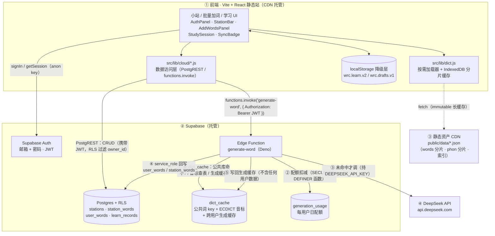
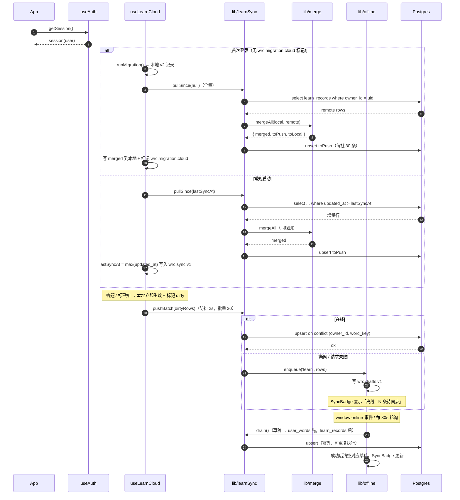
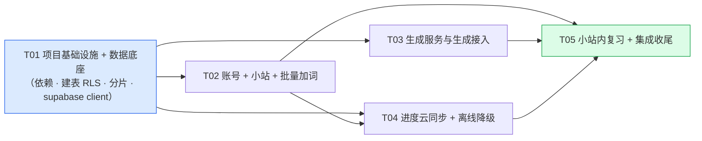

# 单词小站（Word Station）— 系统架构设计

| 项 | 值 |
|---|---|
| Language | 中文 |
| 项目 | `word_station`（工程目录 `word-root-cloud`） |
| 上游文档 | `docs/wordstation-prd.md`（PM 许清楚）、`docs/DATA_MODEL.md`、`docs/DESIGN_LEARNING.md` |
| 架构师 | 高见远（Gao） |
| 已拍板选型 | 前端 Vite+React 静态站直连 **Supabase**（Postgres + Auth + RLS）；登录 **邮箱+密码**；生词生成走**服务端函数持 DEEPSEEK_API_KEY** |
| 状态 | 待用户拍板 §11 的 3 项后开工 |

---

## 0. 结论速览（给赶时间的人）

- **一句话架构**：纯静态 React 站跑在 CDN 上，直连 Supabase 拿账号/数据（RLS 隔离），只有「不在公共库的生词」这一件事走服务端 Edge Function 调 DeepSeek，公共 64825 词永不进数据库、永不被运行时写入。
- **表**：7 张（核心业务 4 张：`stations` / `station_words` / `user_words` / `learn_records`；服务端支撑 3 张：`dict_cache` / `generation_usage` / `profiles`）。`auth.users` 由 Supabase 托管，不建用户表。
- **最大架构变更**：28MB 公共词库**必须改为按需加载**。当前 `dist/assets/index-*.js` 单文件 **26.3MB**，已超过 Cloudflare Pages 单文件 25MB 上限，且首屏不可接受。方案：构建期切分为 `public/data/*.json` 分片 + 词云视图 `React.lazy` 异步 chunk（详见 §1.3）。
- **任务**：5 个（T01 基础设施 → T02 账号/小站/加词 → T03 生成服务 → T04 云同步/离线 → T05 小站复习/集成）。
- **必须用户提供**：① Supabase 项目的 URL + anon key；② `DEEPSEEK_API_KEY`（写入 Supabase Secrets）；③ 静态站托管平台选择（建议 Cloudflare Pages）。

---

## 1. 实现路径与总体架构

### 1.1 难点分析

| # | 难点 | 现有基础 | 本次做法 |
|---|---|---|---|
| D1 | 多设备真同步，且不能丢进度 | `src/lib/learning.js` 已是**纯函数**状态机（无 React/存储依赖），`useLearn` 只负责「取→算→存」，存储层可整体替换 | 保留纯函数层**一行不改**，只把 `useLearn` 的落盘目标从 localStorage 换成「localStorage + 云端 upsert」双写 |
| D2 | 公共库零污染 + 多用户并发写同一词条 | 公共库由 `scripts/gen-*.mjs` 离线产出 | **公共库不进数据库**（见 §1.4），物理上没有写入路径；用户同名词只允许挂 `note`，不复制词条 |
| D3 | 音标红线（严禁模型生成） | `src/data/phonetics.js`（60186 条，ECDICT 查表产出）+ `scripts/gen-phon.mjs` 的 pass1/pass2 查表逻辑 | 服务端建 `dict_cache.phonetic` 做**权威查表**；模型 prompt 里**不出现音标字段**，产出中的音标一律丢弃；查不到 → `phoneticStatus='pending'`，UI 显示「音标待补」 |
| D4 | 28MB 静态词库 vs 首屏 | 打进单一 26.3MB chunk | 分片 + 懒加载（§1.3） |
| D5 | 20 词入库 ≤10s / 含 10 个待生成 ≤60s | 无 | 命中查询全在**浏览器内存索引**完成（0 网络往返）；未命中词一次 Edge Function 批量生成（一次 DeepSeek 调用最多 20 词，`max_tokens 8000`），并行度由前端控制在 2 |
| D6 | 断网不丢词 | localStorage 已在用 | 草稿落 `wrc.drafts.v1`，联网后按序补传，全链路 upsert 幂等 |
| D7 | 不引入 SRS 参数 | `learning.js` 只有 `nextDueAt = 答错 + 24h` | **DB 表结构层面禁止**出现 `ease/interval/lapses/reps`，写入口加断言 |

### 1.2 架构图



### 1.3 部署形态 + 28MB 公共词库是否改为按需加载（判断与理由）

**判断：必须改。三个理由，任何一个单独成立都足够。**

1. **平台硬限制**：当前构建产物 `dist/assets/index-B58RMWq_.js` = **26,283,314 B（25.07 MiB）**。Cloudflare Pages 单文件上限 25MB（Vercel 亦有类似限制），**已踩线**，换平台也只是推迟问题。
2. **首屏不可用**：加了账号体系后，用户进入应用的第一屏是「登录 / 我的小站 / 加词」，**不再是全量词云**。为打开一个登录页下载 26MB 是不可接受的；gzip 后约 6~7MB，4G 网络首屏 20s+，且 `JSON.parse` + `buildIndex` 建 64825 条索引会阻塞主线程数秒。
3. **数据更新成本**：公共库由离线脚本产出（本次还要新增 `dict_cache` 导出）。打进 bundle 意味着每次补音标/扩词都要重建整个 26MB app chunk，CDN 缓存全失效；做成 `public/data/*.json` 分片后，改数据只换对应分片。

**方案（分两步，本次增量只做第 1 步）**

第 1 步（本次必做，T01）——「切数据 + 拆 chunk」：

| 产物 | 内容 | 体积估算 | 加载时机 |
|---|---|---|---|
| `public/data/manifest.json` | 版本号、分片清单、词数 | <2KB | 首屏 |
| `public/data/words-index.json` | `formKey -> [wordId, freqRank, cefr, shardIdx]` | ~2.6MB（gzip ~700KB） | 首屏后台预取，IndexedDB 缓存 |
| `public/data/words/w-<n>.json` | 完整词条，按 **1500 条/片** 均匀切（约 44 片） | ~600KB/片（gzip ~150KB） | 按 `shardIdx` 按需 fetch |
| `public/data/phon/p-<a..z|_>.json` | 音标/例句/用法，按首字母 27 片 | ~430KB/片（gzip ~130KB） | 打开单词详情时按需 fetch |

- 新增 `scripts/split-data.mjs`：读 `src/data/index.js`，产出上述文件到 `public/data/`，并把 manifest 的版本号写进 `src/lib/dict.js` 可见的常量（或直接由前端 fetch manifest）。
- 前端新增 `src/lib/dict.js` 统一封装：`loadIndex()` / `lookupForms(forms[])` / `loadWords(wordKeys[])` / `phoneticsOfAsync(form)`，内存 Map + IndexedDB（`idb-keyval`）二级缓存。
- **词云三视图（NetworkView / FocusView / ListView）保留全量数据，但改为 `React.lazy` 异步 chunk**：新增 `src/data/words-entry.js`（只聚合 `words-*.js`，不含 `phonetics.js`），三个视图从它 import，Vite 自动切成独立 chunk；用户不点「总览/聚焦/列表」就永远不下载。
- 顺带修掉 3 个把 28MB 拖进首屏的隐式依赖：
  - `src/lib/derive.js` 第 10 行 `import { words as ALL_WORDS } from '../data/index.js'`（只为算 `STATS_SCOPE`）→ 改为常量导出 / 由调用方传入。
  - `src/hooks/useStatus.js` 第 13 行 `import { words }` → 把 `useSettings` 抽到 `src/hooks/useSettings.js`，删除 `useStatus.js`（它已标注废弃）。
  - `src/components/StudyCard.jsx` 第 3 行 `import { phoneticsOf }` → 改 `src/lib/dict.js` 异步查表。

第 2 步（本次不做，留作后续）——把词云三视图也迁到 `dict.js` 分片加载（带进度条），彻底删掉 `words-entry.js` 同步导入。第 1 步已解决首屏与平台限制，第 2 步收益递减。

**部署形态**

| 组件 | 部署方式 | 说明 |
|---|---|---|
| 前端静态站 | Cloudflare Pages / Vercel / Netlify（推荐 Cloudflare Pages） | `npm run build` → `dist/`，含 `public/data/**` 分片（immutable 缓存头） |
| Postgres + Auth + RLS | Supabase 托管项目 | 用户自行创建，提供 URL + anon key |
| `generate-word` | Supabase Edge Function（Deno，边缘运行） | `supabase functions deploy generate-word`；Secret：`DEEPSEEK_API_KEY` |
| 离线脚本 | 本地 Node（`npm run gen:*` / `split:data` / `export:dict`） | 产出公共库与 `dict_cache` 导入文件，**不参与运行时** |

> 静态前端**仍然部署**，且仍是纯前端——Supabase 的 PostgREST + Auth + Functions 全部通过 HTTPS API 直连，不需要自建 Node 服务。

### 1.4 为什么不把公共词库放进 Postgres

| 维度 | 放进 DB | 不放（本设计采纳） |
|---|---|---|
| 公共库只读保证 | 靠 RLS 策略（策略写错就污染） | **物理无写入路径**（是静态资产），不变量天然成立 |
| 加词命中查询 | 每次 20 词 → 20 次网络往返 | 浏览器内存索引，0 往返（P0 指标 ≤10s 更容易达成） |
| 存储/成本 | 28MB 数据 + 索引占用免费额度 | 0 |
| 数据同步 | 每次离线脚本产出都要 `psql` 导入全量 | 只需导入**极小**的 `dict_cache`（见下） |

服务端仍需知道两件事，用一张**极小**的表解决：`dict_cache`（64825 行 × form_key + word_id + phonetic ≈ 5MB），由新增脚本 `scripts/export-dict-cache.mjs` 一次性产出 CSV 导入。它同时承担三个职责：① 公共库命中判定 ② **音标权威查表（红线）** ③ 跨用户生成缓存。

---

## 2. 文件清单

### 2.1 新增

| 路径 | 职责 |
|---|---|
| `src/lib/supabase.js` | Supabase 单例 client（`createClient` + `VITE_*` env），导出 `supabase`、`getAccessToken()` |
| `src/lib/wordKey.js` | 统一词条引用 key：`publicKey(form)`→`w.<form>`、`userKey(formKey)`→`u.<formKey>`、`parseWordKey()` |
| `src/lib/parseForms.js` | 多分隔符解析（`, ，; ；` 空格/换行/Tab）+ 去空 + 去重 + 合法性过滤（纯函数，可单测） |
| `src/lib/dict.js` | 公共词索引/分片加载器 + IndexedDB 缓存 + `lookupForms` / `loadWords` / `phoneticsOfAsync` |
| `src/lib/wordSchema.js` | 词条字段校验（与 `scripts/validate-data.mjs` 同规则，前端与 Edge Function 共用一份语义） |
| `src/lib/cloud/schema.js` | 表名常量 + snake_case ↔ camelCase 行列转换（**唯一**转换点） |
| `src/lib/cloud/stations.js` | 小站 CRUD |
| `src/lib/cloud/stationWords.js` | 加词 / 删词 / 改笔记 / 批量 upsert |
| `src/lib/cloud/userWords.js` | 私有词库 CRUD |
| `src/lib/cloud/learnSync.js` | 学习进度上行（upsert 分批）/ 下行（增量 `updated_at > lastSyncAt`） |
| `src/lib/cloud/merge.js` | 冲突合并纯函数（按 `updated_at` 后写胜出）+ 首次登录全量上传合并 |
| `src/lib/cloud/generate.js` | 调 Edge Function：`generateWord({ forms, stationId })`，含进度回调与错误码映射 |
| `src/lib/cloud/offline.js` | 离线草稿队列（`wrc.drafts.v1`）读写 + 补传编排 |
| `src/hooks/useAuth.js` | session / user / signIn / signUp / signOut / resetPassword |
| `src/hooks/useStations.js` | 小站列表 + 当前小站 + CRUD（乐观更新） |
| `src/hooks/useStationWords.js` | 当前小站词条 → 统一 Word 视图对象（公共引用 + 私有词合并） |
| `src/hooks/useLearnCloud.js` | 包装 `useLearn`：本地写 + 标记 dirty + 触发上行 |
| `src/hooks/useSync.js` | 在线状态 + 同步状态机 + 定时/事件驱动的补传 |
| `src/hooks/useSettings.js` | 从 `useStatus.js` 抽出（去掉 `words` 依赖） |
| `src/components/AuthPanel.jsx` | 注册 / 登录 / 登出 / 找回密码 |
| `src/components/StationBar.jsx` | 小站切换 / 新建 / 改名 / 删除 / 置顶 |
| `src/components/AddWordsPanel.jsx` | 粘贴框 + 解析预览 + 勾选 + 提交 + 生成进度 |
| `src/components/StationLearn.jsx` | 小站内学习/复习（复用 `StudySession`） |
| `src/components/SyncBadge.jsx` | 同步状态 / 离线草稿计数 / 补传触发 |
| `src/components/UserWordEditor.jsx` | 私有词编辑 + 重新生成（R-10，P1） |
| `src/data/words-entry.js` | 仅聚合 `words-*.js`（不含 phonetics），供词云视图懒加载 |
| `supabase/migrations/0001_init.sql` | 建表 + 索引 + RLS + `consume_generation_quota()` |
| `supabase/functions/generate-word/index.ts` | Edge Function 生成服务 |
| `supabase/functions/generate-word/prompt.ts` | Prompt 模板 + 版本常量 |
| `scripts/split-data.mjs` | 公共词/音标切分片 → `public/data/` |
| `scripts/export-dict-cache.mjs` | 导出 `dict_cache` 导入 CSV |
| `scripts/test-parse-forms.mjs` | 解析单测 |
| `scripts/test-merge.mjs` | 合并策略单测 |
| `.env.example` | `VITE_SUPABASE_URL` / `VITE_SUPABASE_ANON_KEY`（**不含** DeepSeek key） |

### 2.2 修改

| 路径 | 改动 |
|---|---|
| `package.json` | 加 `@supabase/supabase-js`、`idb-keyval`；加 scripts：`split:data`、`export:dict`、`test:cloud` |
| `vite.config.js` | `build.rollupOptions.output.manualChunks`（把 `words-entry` 单独切出）、`build.chunkSizeWarningLimit`、`assetsInlineLimit` |
| `src/App.jsx` | 顶部 `AuthPanel`；新增 `station` 视图；`words` 改为懒加载；`phoneticsOf` → 异步；`useLearn` 支持 `scope`；未登录游客模式 |
| `src/hooks/useLearn.js` | 记录 key 统一为 `wordKey`；写操作额外 `markDirty()` 触发上行；**纯函数与调度规则不改** |
| `src/lib/migrate.js` | 新增 `KEYS.drafts='wrc.drafts.v1'`、`KEYS.sync='wrc.sync.v1'`、`KEYS.cloudMigration='wrc.migration.cloud'`；新增 `exportLocalRecords()` |
| `src/lib/derive.js` | 移除 `import words`；`STATS_SCOPE` 改为可注入常量（默认 64825） |
| `src/components/StudyCard.jsx` | `phoneticsOf` → `usePhonetics` 异步查表；音标缺失显示「音标待补」 |
| `src/components/NetworkView.jsx` / `FocusView.jsx` / `ListView.jsx` | import 源改为 `../data/words-entry.js`；由 App 用 `React.lazy` 包裹 |
| `src/data/morphemes.js` | 新增占位词素 `x.unk`（见 §10.5） |
| `src/data/index.js` | 保持原样（离线脚本入口）；头部注释标注「前端禁止 import」 |
| `README.md` | 补部署与环境变量说明 |
| `.gitignore` | 加 `public/data/`（构建期产物） |

> **红线**：`src/lib/learning.js` 本次**零改动**。不新增 `ease` / `interval` / `lapses` / `reps` 任何字段。

---

## 3. 数据模型（Postgres）

### 3.1 统一词条引用：`word_key`（贯穿全局的关键设计）

所有引用词条的地方（小站、学习进度、队列）**只用一个 text 字段 `word_key`**，两种取值：

| 来源 | `word_key` | 说明 |
|---|---|---|
| 公共库 | `w.<form>` | 恰好等于现有 `word.id`，**天然向后兼容**现有 `wrc.learn.v2` 的 key |
| 用户私有库 | `u.<form_key>`（`form_key = lower(btrim(form))`） | 每个 `owner_id` 内唯一即可（所有引用点都是 owner 作用域） |

**取舍说明**：`word_key` 跨两种来源，无法用单个外键约束。放弃 FK、换取「小站/进度/队列三处统一引用 + 现有 localStorage 记录零迁移」；完整性由 `resolveWords()` 在读取时校验，孤儿引用（如私有词被删）在读取时跳过 + 后台清理。这是对本项目规模正确的取舍。

### 3.2 表结构

> `auth.users` 由 Supabase Auth 托管，**不建用户表**。

```sql
-- ============ 0001_init.sql ============
create extension if not exists "pgcrypto";

-- ---------- 0) profiles（可选，P2：昵称/展示名） ----------
create table public.profiles (
  id           uuid primary key references auth.users(id) on delete cascade,
  email        text,
  display_name text,
  created_at   timestamptz not null default now(),
  updated_at   timestamptz not null default now()
);

-- ---------- 1) stations 小站 ----------
create table public.stations (
  id         uuid primary key default gen_random_uuid(),
  owner_id   uuid not null references auth.users(id) on delete cascade,
  name       text not null check (char_length(btrim(name)) between 1 and 40),
  pinned     boolean not null default false,
  created_at timestamptz not null default now(),
  updated_at timestamptz not null default now()
);
create index stations_owner_updated_idx on public.stations (owner_id, pinned desc, updated_at desc);
create unique index stations_owner_name_uniq on public.stations (owner_id, lower(btrim(name)));

-- ---------- 2) station_words 小站词条 ----------
create table public.station_words (
  id         uuid primary key default gen_random_uuid(),
  station_id uuid not null references public.stations(id) on delete cascade,
  owner_id   uuid not null references auth.users(id) on delete cascade, -- 冗余：RLS 免 join
  word_key   text not null,              -- 'w.<form>' | 'u.<form_key>'
  source     text not null check (source in ('public','user')),
  note       text,                       -- 个人笔记（公共词也允许加，PRD §5）
  added_at   timestamptz not null default now(),
  updated_at timestamptz not null default now()
);
create unique index station_words_uniq on public.station_words (station_id, word_key);
create index station_words_list_idx on public.station_words (station_id, added_at desc);
create index station_words_owner_idx on public.station_words (owner_id, station_id);

-- ---------- 3) user_words 用户私有词库 ----------
create table public.user_words (
  id               uuid primary key default gen_random_uuid(),
  owner_id         uuid not null references auth.users(id) on delete cascade,
  form             text not null,
  form_key         text not null,                     -- lower(btrim(form))，应用层写入
  word_key         text not null,                     -- 'u.' || form_key
  pos              text,
  gloss            text,
  phonetic_br      text,                              -- 红线：只来自 dict_cache 查表
  phonetic_status  text not null default 'pending' check (phonetic_status in ('ok','pending')),
  example          jsonb,                             -- { en, zh }
  usage            text,
  cefr             text check (cefr in ('A1','A2','B1','B2','C1','C2')),
  freq_rank        int,                               -- null → 前端按低频处理
  morphs           text[] not null default '{}',
  chain            jsonb not null default '[]',       -- [{ morph, form, gloss }]
  source           text not null default 'ai' check (source in ('ai','manual')),
  edited_by_user   boolean not null default false,    -- R-10
  generation_status text not null default 'ready'
                     check (generation_status in ('pending','ready','failed')),
  gen_error        text,
  created_at       timestamptz not null default now(),
  updated_at       timestamptz not null default now()
);
create unique index user_words_owner_form_uniq on public.user_words (owner_id, form_key);
create index user_words_owner_updated_idx on public.user_words (owner_id, updated_at desc);

-- ---------- 4) learn_records 学习进度（严禁 SRS 字段） ----------
create table public.learn_records (
  owner_id            uuid not null references auth.users(id) on delete cascade,
  word_key            text not null,
  status              text not null check (status in ('unknown','review','known')),
  correct_count       int  not null default 0,
  consecutive_correct int  not null default 0,
  incorrect_count     int  not null default 0,
  last_studied_at     timestamptz,
  last_result         text check (last_result in ('correct','incorrect')),
  last_incorrect_at   timestamptz,
  next_due_at         timestamptz,     -- 唯一调度规则：答错时刻 + 24h
  status_changed_at   timestamptz,
  status_source       text,
  updated_at          timestamptz not null default now(),  -- 冲突合并依据
  primary key (owner_id, word_key)
);
create index learn_records_due_idx    on public.learn_records (owner_id, status, next_due_at);
create index learn_records_sync_idx   on public.learn_records (owner_id, updated_at desc);

-- ---------- 5) dict_cache 服务端词典 + 生成缓存（无客户端访问） ----------
create table public.dict_cache (
  form_key       text primary key,
  word_id        text,        -- 公共词 id；非空 = 该词已在公共库（禁止再生成）
  phonetic       text,        -- ECDICT 查表音标（权威，红线）
  payload        jsonb,       -- AI 生成结果：pos/gloss/cefr/morphs/chain/example/usage（不含音标）
  model          text,
  prompt_version text,
  hit_count      int not null default 0,
  created_at     timestamptz not null default now(),
  updated_at     timestamptz not null default now()
);
create index dict_cache_public_idx on public.dict_cache (word_id) where word_id is not null;

-- ---------- 6) generation_usage 日配额 ----------
create table public.generation_usage (
  owner_id uuid not null references auth.users(id) on delete cascade,
  day      date not null default (now() at time zone 'utc')::date,
  used     int  not null default 0,
  quota    int  not null default 50,
  primary key (owner_id, day)
);

-- 原子扣减配额（SECURITY DEFINER，避免读-改-写竞态）
create or replace function public.consume_generation_quota(n int default 1)
returns table (used int, quota int, allowed boolean)
language plpgsql security definer set search_path = public as $$
declare
  uid uuid := auth.uid();
  d   date := (now() at time zone 'utc')::date;
begin
  if uid is null then raise exception 'not authenticated'; end if;
  insert into public.generation_usage (owner_id, day, used)
  values (uid, d, 0)
  on conflict (owner_id, day) do nothing;

  update public.generation_usage g
     set used = g.used + n
   where g.owner_id = uid and g.day = d and g.used + n <= g.quota
  returning g.used, g.quota, true into used, quota, allowed;

  if used is null then
    select g.used, g.quota, false into used, quota, allowed
      from public.generation_usage g where g.owner_id = uid and g.day = d;
  end if;
  return next;
end;
$$;
revoke all on function public.consume_generation_quota(int) from public;
grant execute on function public.consume_generation_quota(int) to authenticated;
```

### 3.3 RLS 策略要点

```sql
alter table public.stations       enable row level security;
alter table public.station_words  enable row level security;
alter table public.user_words     enable row level security;
alter table public.learn_records  enable row level security;
alter table public.profiles       enable row level security;
alter table public.generation_usage enable row level security;
alter table public.dict_cache     enable row level security;  -- 不建任何策略 = 默认全拒

-- 通用模板：四件套全按 owner_id 收口（using + with check 都要写，防止改 owner_id 越权）
create policy stations_owner on public.stations
  for all to authenticated
  using (owner_id = auth.uid()) with check (owner_id = auth.uid());

create policy station_words_owner on public.station_words
  for all to authenticated
  using (owner_id = auth.uid()) with check (owner_id = auth.uid());

create policy user_words_owner on public.user_words
  for all to authenticated
  using (owner_id = auth.uid()) with check (owner_id = auth.uid());

create policy learn_records_owner on public.learn_records
  for all to authenticated
  using (owner_id = auth.uid()) with check (owner_id = auth.uid());

create policy profiles_self on public.profiles
  for all to authenticated
  using (id = auth.uid()) with check (id = auth.uid());

create policy usage_self_read on public.generation_usage
  for select to authenticated using (owner_id = auth.uid());

-- 【关键】station_words 的写操作必须校验 station 归属，否则可往别人小站塞词
create or replace function public.station_owned_by_me(sid uuid)
returns boolean language sql stable security definer set search_path = public as $$
  select exists (select 1 from public.stations s where s.id = sid and s.owner_id = auth.uid());
$$;
-- 在 station_words 的 with check 中追加：
--   with check (owner_id = auth.uid() and public.station_owned_by_me(station_id))
```

**要点清单**

1. **每个业务表同时写 `using` 与 `with check`**——只写 `using` 会允许把行改成别人 `owner_id`。
2. `station_words` 必须**额外校验 `station_id` 归属**（`owner_id` 冗余列可被伪造）。
3. `dict_cache` **启用 RLS 但不建任何策略** → anon/authenticated 全拒，只有 service_role（Edge Function）可读写。这是「公共库只读」在服务端侧的对应保证。
4. `generation_usage` 只允许本人 `select`，写路径只有 `consume_generation_quota()`。
5. **禁止**为 anon 角色建任何写策略；游客模式纯本地，不发请求。
6. `profiles` 由 `auth.users` insert 触发器自动建行（`handle_new_user`），避免前端伪造。

### 3.4 与现有 localStorage 的迁移方案

| 现有 key | 内容 | 迁移动作 |
|---|---|---|
| `wrc.learn.v2` | `{version, records: { "w.inspect": {...} }}` | **key 天然就是 `word_key`**（公共词 `w.<form>`），无需转换。首次登录时全量上传合并（§7.3），成功后写 `wrc.migration.cloud` 标记，**之后 localStorage 降级为离线缓存** |
| `wrc.settings.v2` | filters（含 `learnBand` / `groupByFamily` / `inheritFreqKnown`） | **不迁云端**（P1 可选）。保留本地；跨设备不同步设置可接受 |
| `wrc.status.v1` / `*.backup` | 旧手工标注 | **不动**（migrate.js 铁律：只读、永不写） |
| `wrc.migration.v2` | 迁移标记 | 不动 |

**首次登录上传合并（`src/lib/cloud/merge.js`）**

```
本地 records（L） vs 云端 records（R），逐 word_key 比较：
  1. 仅 L 有          → 上行（upsert）
  2. 仅 R 有          → 下行（写入本地）
  3. 双方都有         → 比较 updatedAt：新的胜出
                        - 相等则比较内容指纹，不同则取云端（服务端权威）
                        - 本地记录无 updatedAt（旧数据）→ 视为 0，取云端
  4. 合并结果分别落本地与云端（上行的行带本地 updatedAt，服务端用 GREATEST 兜底）
迁移前强制：本地先跑一次 runMigration()（保证 v2 口径），再导出。
迁移是幂等的：标记存在则跳过；上传全部走 upsert，中断可续。
```

**`updated_at` 的时钟偏差处理**：前端 `updated_at` 用 `new Date().toISOString()`（可能偏）；服务端 `learn_records.updated_at` 用 `now()` 兜底（`GREATEST(payload.updated_at, now() - interval '5 minutes')` 不采用——太绕）。实际做法：**每次上行批次记录 `lastSyncAt = 服务端返回的 max(updated_at)`**，下次下行用 `updated_at > lastSyncAt`，本地 dirty 行单独上行。时钟偏差只影响「同一 word_key 在两台设备几乎同时被改」的极小概率场景，此时按服务端 `now()` 胜出，可接受。

---

## 4. 数据结构与接口（前端服务层）

```mermaid
classDiagram
    class WordKey {
        <<module>>
        +publicKey(form: string) string
        +userKey(formKey: string) string
        +parse(key: string) {kind, form}
    }

    class ParseForms {
        <<module>>
        +parse(raw: string) ParsedForm[]
        +dedupe(forms: ParsedForm[]) ParsedForm[]
        -SEPARATORS: RegExp
    }

    class DictLoader {
        -index: Map~string, DictEntry~
        -wordCache: Map~string, Word~
        -phonCache: Map~string, Phon~
        +loadIndex() Promise~void~
        +lookupForms(forms: string[]) LookupResult
        +loadWords(wordKeys: string[]) Promise~Word[]~
        +phoneticsOfAsync(form: string) Promise~Phon|null~
    }

    class SupabaseClient {
        +from(table: string) QueryBuilder
        +auth: AuthApi
        +functions: FunctionsApi
    }

    class StationsApi {
        +list() Promise~Station[]~
        +create(name: string) Promise~Station~
        +rename(id, name) Promise~Station~
        +remove(id) Promise~void~
        +togglePin(id, pinned) Promise~Station~
    }

    class StationWordsApi {
        +listByStation(stationId) Promise~StationWord[]~
        +addMany(stationId, items) Promise~AddResult~
        +remove(stationId, wordKey) Promise~void~
        +updateNote(stationId, wordKey, note) Promise~void~
    }

    class UserWordsApi {
        +listMine() Promise~UserWord[]~
        +upsert(row: UserWord) Promise~UserWord~
        +patch(id, patch) Promise~UserWord~
        +remove(id) Promise~void~
    }

    class GenerateApi {
        +generate(forms: string[], stationId: string|null, onProgress) Promise~GenResponse~
        +retry(formKey: string) Promise~GenItem~
    }

    class LearnSyncApi {
        +pullSince(lastSyncAt: string) Promise~{rows, maxUpdatedAt}~
        +pushBatch(rows: LearnRecord[]) Promise~void~
        -BATCH: int
    }

    class MergeUtil {
        <<module>>
        +mergeRecord(local, remote) LearnRecord
        +mergeAll(local, remote) {merged, toPush, toLocal}
        -fingerprint(rec) string
    }

    class OfflineQueue {
        -KEY: string
        +enqueue(kind, payload) void
        +drain(online: boolean) Promise~void~
        +pendingCount() int
    }

    class useLearnCloud {
        +records: Record~string, LearnRecord~
        +answer(wordKey, result) AnswerResult
        +markKnown(wordKey) void
        +setReview(wordKey) void
        +syncStatus: string
    }

    class useLearn {
        <<existing hook>>
        +records
        +learnQueue
        +reviewQueue
        +answer / markKnown / retreat / reset
    }

    class LearningCore {
        <<src/lib/learning.js · 禁止改动>>
        +applyAnswer(rec, result, now)
        +buildLearnQueue(words, records, size, opts)
        +buildReviewQueue(words, records, size, now)
    }

    DictLoader ..> ParseForms : 提供命中查询
    StationsApi --> SupabaseClient
    StationWordsApi --> SupabaseClient
    StationWordsApi ..> WordKey : 生成 word_key
    UserWordsApi --> SupabaseClient
    UserWordsApi ..> WordKey
    GenerateApi --> SupabaseClient : functions.invoke
    LearnSyncApi --> SupabaseClient
    LearnSyncApi ..> MergeUtil
    useLearnCloud --> useLearn : 包装（本地状态机不变）
    useLearnCloud --> LearnSyncApi : 上行 dirty 记录
    useLearnCloud --> OfflineQueue : 断网入队
    useLearn --> LearningCore : 纯函数调用
```

---

## 5. 程序调用流程

### 5.1 批量加词 + 不在库即时生成（主流程）

```mermaid
sequenceDiagram
    autonumber
    actor U as 用户
    participant AP as AddWordsPanel
    participant PF as lib/parseForms
    participant DL as lib/dict
    participant SWA as cloud/stationWords
    participant GA as cloud/generate
    participant FN as Edge Function<br/>generate-word
    participant DC as dict_cache
    participant DS as DeepSeek
    participant DB as Postgres

    U->>AP: 粘贴 "photosynthesis, quixotic; obtuse"
    AP->>PF: parse(raw)
    PF-->>AP: [{form,formKey}, ...]（去重/去空）
    AP->>DL: lookupForms(forms)
    DL-->>AP: { hit: [{wordKey:'w.obtuse', ...}], miss: ['photosynthesis','quixotic'] }
    Note over AP: 预览列表：命中 ✓ / 待生成 ⚡ / 重复 ⚠（站内已有）

    U->>AP: 勾选并提交
    rect rgb(235,244,255)
        AP->>SWA: addMany(stationId, hitItems)
        SWA->>DB: upsert station_words(source='public', word_key='w.obtuse')
        DB-->>SWA: ok（on conflict do nothing → 跳过重复）
    end

    rect rgb(255,244,235)
        AP->>GA: generate(['photosynthesis','quixotic'], stationId)
        GA->>FN: functions.invoke(POST, { forms, stationId }, Bearer JWT)
        FN->>FN: auth.getUser(token) → uid
        FN->>DC: select * from dict_cache where form_key in (...)
        DC-->>FN: 已有：quixotic（payload 缓存）<br/>已有：photosynthesis（word_id 非空 → 公共库命中）
        Note over FN: 公共库命中 → 直接返回 public_hit，不消耗配额
        alt 缓存未命中（如 obtuse 变体）
            FN->>FN: consume_generation_quota(n)（原子扣减）
            FN->>DS: POST /chat/completions（批量 prompt，禁音标）
            DS-->>FN: { items: [...] }
            FN->>FN: 校验（pos/gloss/cefr/morphs/chain/example）<br/>丢弃任何 phonetic；morphs 兜底 ['x.unk']
            FN->>DC: upsert dict_cache(form_key, payload, model, prompt_version)
        end
        FN->>DB: upsert user_words(owner_id, form_key, phonetic from dict_cache)
        FN->>DB: upsert station_words(source='user', word_key='u.<form_key>')
        FN-->>GA: { results, quota }
    end
    GA-->>AP: results（逐词状态 + 进度 onProgress）
    AP->>SWA: refresh
    AP-->>U: 「已加入 18 词 · 新生成 2 词 · 跳过 1 重复」
```

### 5.2 登录 → 进度同步 → 离线补传



---

## 6. API / 接口设计

### 6.1 前端直连 Supabase 调用清单

所有调用经 `src/lib/cloud/*.js` 封装，组件层不得直接使用 `supabase.from(...)`。

| # | 用途 | 调用 | 关键参数 |
|---|---|---|---|
| A1 | 注册 | `supabase.auth.signUp({ email, password })` | `options.emailRedirectTo` |
| A2 | 登录 | `supabase.auth.signInWithPassword({ email, password })` | — |
| A3 | 登出 | `supabase.auth.signOut()` | — |
| A4 | 找回密码 | `supabase.auth.resetPasswordForEmail(email)` | — |
| A5 | 会话监听 | `supabase.auth.onAuthStateChange(cb)` | 驱动全应用 user 状态 |
| A6 | 取 token | `supabase.auth.getSession()` → `session.access_token` | 供 `functions.invoke` |
| S1 | 小站列表 | `from('stations').select('*').eq('owner_id', uid).order('pinned',{ascending:false}).order('updated_at',{ascending:false})` | — |
| S2 | 建小站 | `from('stations').insert({ owner_id: uid, name }).select().single()` | 重名 → 唯一索引冲突，前端提示 |
| S3 | 改名/置顶 | `from('stations').update({ name?, pinned?, updated_at: now }).eq('id', id)` | — |
| S4 | 删小站 | `from('stations').delete().eq('id', id)` | `station_words` 级联删除 |
| W1 | 小站词条 | `from('station_words').select('*').eq('station_id', sid).order('added_at',{ascending:false})` | — |
| W2 | 批量加词 | `from('station_words').upsert(rows, { onConflict: 'station_id,word_key', ignoreDuplicates: true })` | 返回行数用于「跳过 N 条重复」 |
| W3 | 删词/改笔记 | `.delete().match({station_id, word_key})` / `.update({note}).match(...)` | — |
| U1 | 私有词列表 | `from('user_words').select('*').eq('owner_id', uid).order('updated_at',{ascending:false})` | — |
| U2 | 编辑私有词 | `from('user_words').update({ ..., edited_by_user: true, updated_at: now }).eq('id', id)` | R-10 |
| U3 | 删私有词 | `from('user_words').delete().eq('id', id)` | 同时删 `station_words` |
| L1 | 拉增量进度 | `from('learn_records').select('*').eq('owner_id', uid).gt('updated_at', lastSyncAt).order('updated_at')` | — |
| L2 | 上行进度 | `from('learn_records').upsert(rows, { onConflict: 'owner_id,word_key' })` | 每批 ≤30 |
| Q1 | 查配额 | `from('generation_usage').select('used,quota').eq('owner_id', uid).eq('day', today)` | 只读自己的行 |
| G1 | 生成 | `supabase.functions.invoke('generate-word', { body: { forms, stationId } })` | 自动带 token |

### 6.2 生成函数接口：`POST /functions/v1/generate-word`

**鉴权**：`Authorization: Bearer <access_token>`；函数内 `supabase.auth.getUser(token)` 取 uid，**绝不信任 body 里的 owner_id**。

**请求**

```jsonc
{
  "forms": ["photosynthesis", "quixotic"],   // 1..20 个，非空字符串，单条 ≤ 64 字符
  "stationId": "3f2a…"                        // 可选；传了则生成成功后自动加入该小站
}
```

**响应 200**

```jsonc
{
  "results": [
    // ① 已在公共库 —— 不生成、不消耗配额
    { "form": "photosynthesis", "status": "public_hit",
      "wordKey": "w.photosynthesis", "wordId": "w.photosynthesis" },

    // ② 生成成功（cached=true 表示命中跨用户缓存，未消耗配额）
    { "form": "quixotic", "status": "generated", "cached": true,
      "wordKey": "u.quixotic",
      "userWord": {
        "id": "uuid", "wordKey": "u.quixotic", "form": "quixotic",
        "pos": "adj.", "gloss": "堂吉诃德式的；不切实际地理想主义的",
        "phoneticBr": "/kwɪkˈsɒtɪk/", "phoneticStatus": "ok",
        "example": { "en": "His quixotic plan to…", "zh": "他那不切实际的计划……" },
        "usage": "多用于书面语，常含善意嘲讽。",
        "cefr": "C2", "freqRank": null,
        "morphs": ["x.unk"],
        "chain": [{ "morph": null, "form": "quixotic", "gloss": "堂吉诃德式的" }],
        "source": "ai", "editedByUser": false, "generationStatus": "ready"
      }
    },

    // ③ 生成失败（可重试，不入库）
    { "form": "zzzz", "status": "failed", "code": "VALIDATION_FAILED",
      "message": "模型产出缺少 gloss，已放弃该词（未消耗配额）" }
  ],
  "quota": { "used": 3, "quota": 50, "day": "2026-09-30" }
}
```

**错误码**（统一 `{ "error": { "code": "...", "message": "..." } }`）

| HTTP | code | 含义 | 前端处理 |
|---|---|---|---|
| 401 | `UNAUTHORIZED` | 无/过期 token | 刷新 session；仍失败 → 跳登录 |
| 400 | `BAD_REQUEST` | `forms` 空 / >20 / 含非法字符 | 提示，不重试 |
| 402 | `QUOTA_EXCEEDED` | 日配额耗尽（body 带回 `quota`） | 明确提示「今日 50 次已用完，明日 0 点重置」，**不静默失败** |
| 422 | `VALIDATION_FAILED` | 模型产出未通过字段校验 | 该词标记失败，UI 提供「重试 / 手工填写」 |
| 429 | `RATE_LIMITED` | 单用户并发或全局限流 | 指数退避重试（最多 2 次） |
| 502 | `UPSTREAM_ERROR` | DeepSeek 返回非 2xx | 整批标记失败，可重试 |
| 504 | `UPSTREAM_TIMEOUT` | DeepSeek 超时（>25s） | 同上 |
| 500 | `INTERNAL` | 其他 | 上报 + 提示 |

**限流与去重缓存**

| 机制 | 规则 |
|---|---|
| 单批上限 | 20 词（与前端一致）；一次 Edge Function 调用最多一次 DeepSeek 请求 |
| 每用户日配额 | 默认 50；`consume_generation_quota(n)` 原子扣减；**命中公共库或缓存不扣** |
| 并发 | 前端串行（并发 1，最多 2 个未决请求）；服务端对同一 uid 加简单内存节流 |
| 跨用户同名词缓存 | `dict_cache.payload`；命中直接返回，不计配额，`hit_count++` |
| 缓存失效 | `prompt_version` 变更 → 旧缓存不再命中（SQL 里 `where prompt_version = current`）；用户可「重新生成」绕过（强制 `force=true`） |
| 音标红线 | 音标**只**取 `dict_cache.phonetic`（ECDICT 查表）；取不到 → `phoneticBr=null, phoneticStatus='pending'`。**模型产出中的任何音标字段一律丢弃** |

**Prompt 约束（写进 `prompt.ts`）**

```
system: You are a precise lexicographer writing entries for Chinese learners of English. Output strict JSON only.
user:
【本批单词】<form（pos）：gloss> …
【输出】{"items":[{"form","pos","gloss","cefr","example":{"en","zh"},"usage","morphs":[...],"chain":[{"morph","form","gloss"}]}]}
硬性规则：
1. 只输出 JSON，items 数量 == 输入数量，form 原样照抄。
2. 禁止输出 phonetic / 音标字段（音标由词典查表提供，你给的一律丢弃）。
3. morphs 只能从【候选词素 id】中选；无法拆解时填 ["x.unk"]，chain[].morph 填 null、chain[].gloss 填部件含义。
4. cefr 必须是 A1..C2 大写之一。
5. example.en 8~200 字符、自然地道；example.zh 与英文严格对应；usage ≤120 中文字符。
```

服务端校验（`wordSchema` 的镜像实现，Deno 侧内联约 60 行）：`pos/gloss/cefr` 必填、`cefr ∈ A1..C2`、`example.en` 长度 8~200、`example.zh` 非空、`morphs` 非空（缺失兜底 `['x.unk']`）、`chain[].form/gloss` 非空且 `morph` 属候选集或 `null`。

---

## 7. 前端改造点

### 7.1 需要新增/修改的文件

见 §2（新增 28 个 / 修改 12 个）。按模块归纳：

| 模块 | 新增 | 修改 |
|---|---|---|
| 账号 | `useAuth.js`、`AuthPanel.jsx` | `App.jsx` |
| 小站 | `useStations.js`、`StationBar.jsx`、`cloud/stations.js`、`cloud/stationWords.js` | `App.jsx` |
| 加词/生成 | `parseForms.js`、`AddWordsPanel.jsx`、`cloud/generate.js`、`UserWordEditor.jsx` | — |
| 词典加载 | `dict.js`、`words-entry.js`、`wordKey.js`、`wordSchema.js` | `App.jsx`、`StudyCard.jsx`、`derive.js`、`NetworkView/FocusView/ListView.jsx` |
| 同步/离线 | `cloud/learnSync.js`、`cloud/merge.js`、`cloud/offline.js`、`useSync.js`、`useLearnCloud.js`、`SyncBadge.jsx` | `useLearn.js`、`migrate.js` |
| 基建 | `supabase.js`、`cloud/schema.js`、`supabase/migrations/0001_init.sql`、`supabase/functions/generate-word/*`、`scripts/split-data.mjs`、`scripts/export-dict-cache.mjs`、`.env.example` | `package.json`、`vite.config.js`、`.gitignore`、`README.md` |

### 7.2 localStorage 进度如何与云端同步

**双写模型**：`useLearnCloud` 包装现有 `useLearn`，本地写路径**完全不变**（保证离线可用与 UI 零延迟），额外做两件事：

```
写操作（answer / markKnown / retreat / setReview / reset / applyMany）
  → learning.js 纯函数算新 record（不变）
  → commit 到内存 + localStorage（不变）
  → markDirty(wordKey)：把该 wordKey 加入 dirty 集合
  → 触发上行调度（防抖 2s 或 dirty ≥ 20 条）
      ├ 在线：learnSync.pushBatch(dirtyRows)  —— upsert on conflict (owner_id, word_key)
      └ 离线：offline.enqueue('learn', rows)  —— 写 wrc.drafts.v1
```

**下行**：`useSync` 在 ① 登录后 ② 每 60s 轮询 ③ `visibilitychange` 回到前台 时调用 `pullSince(lastSyncAt)`，把云端增量与本地按 §3.4 规则合并，更新本地 records 与 `lastSyncAt`。

**冲突合并策略：按 `updated_at` 最后写入胜出（LWW），记录级，不是整包级。**

| 场景 | 判定 |
|---|---|
| 同一 `word_key` 本地 vs 云端 | `Math.max(local.updatedAt, remote.updatedAt)` 胜出 |
| 时间戳相等 | 比较内容指纹；不同则**取云端**（服务端权威） |
| 本地记录无 `updatedAt`（旧数据） | 视为 0 → 取云端 |
| 上行时机 | 只有 dirty 行上行；上行带本地 `updated_at`，服务端 `now()` 兜底 |
| 下行时机 | `updated_at > lastSyncAt`；`lastSyncAt` 取服务端返回的 `max(updated_at)` |

> 为什么不用「last-write-wins 整包覆盖」：会丢掉另一台设备的整批进度。记录级 LWW + 增量拉取，只在「同一词被两设备几乎同时改」时才可能丢一次答题，代价可接受，且 `status_source` / `status_changed_at` 保留可回溯线索（R-13 的日志表列为 P1）。

### 7.3 离线降级：断网草稿如何落 localStorage 并在联网后补传

| 数据 | 断网时 | 补传顺序 | 幂等保证 |
|---|---|---|---|
| 加词（命中公共库） | 写 `wrc.drafts.v1` 的 `stationWords` 队列 | 2 | `upsert on conflict (station_id, word_key)` |
| 加词（待生成） | 写 `wrc.drafts.v1` 的 `generate` 队列（只存 form 列表 + stationId） | 1（先生成，拿到 `word_key` 再入小站） | `user_words` upsert on conflict `(owner_id, form_key)` |
| 学习进度 | 照常写 `wrc.learn.v2` + dirty 标记 | 3 | `upsert on conflict (owner_id, word_key)` |
| 小站 CRUD | 暂不支持离线（写 `wrc.drafts.v1` 的 `stations` 队列，P1） | 4 | `insert` 用客户端生成的 uuid 做幂等键 |

**补传编排（`offline.drain()`）**

```
1. 守卫：navigator.onLine === false → 直接返回；连续失败 3 次 → 退避 60s
2. 按 kind 顺序：generate → stationWords → learn → stations
3. 每个 kind 内按入队顺序串行；单条失败保留在队列（不丢），整批失败中断本轮
4. 成功后从 wrc.drafts.v1 移除对应条目（逐条移除，避免中途失败丢整批）
5. 全流程结束更新 SyncBadge（离线 · N 条待同步 → 已同步 <时间>）
6. 触发时机：window 'online' 事件 + 每 30s 轮询 + 用户手动点「立即同步」
```

**UI 契约**：`SyncBadge` 三态 —— `已同步`（绿色）/ `同步中…`（灰色）/ `离线 · N 条待同步`（琥珀色，可点手动重试）。答题等本地操作**永不阻塞**，离线时照常可用。

---

## 8. 依赖包

```text
# 运行时新增
@supabase/supabase-js@^2.45.0   Supabase 客户端：Auth（邮箱+密码）+ PostgREST + functions.invoke
idb-keyval@^6.2.1               IndexedDB 键值库，缓存 public/data 分片（localStorage 5MB 装不下）

# 不新增（明确说明）
# - 不引 zod：字段校验沿用 scripts/validate-data.mjs 的规则，抽到 src/lib/wordSchema.js；
#             Edge Function 侧内联一份镜像实现（Deno 引入 npm 校验库徒增冷启动）
# - 不引 vitest：现有测试是裸 node 脚本（scripts/test-*.mjs），保持一致，新增 test-parse-forms / test-merge
# - 不引 react-router：App 目前用 useState 管 view，本次不引入路由（改动面最小）
# - 不引任何加密/JWT 库：会话完全交给 Supabase Auth
# - 不引 MUI/组件库：沿用 Tailwind，与现有 UI 一致

# 开发工具（非 npm 包）
supabase CLI（>=1.200）   supabase functions deploy / db push / secrets set
```

**环境变量**

```bash
# .env.local（前端，Vite 会内联进 bundle —— 只能放公开信息）
VITE_SUPABASE_URL=https://<project>.supabase.co
VITE_SUPABASE_ANON_KEY=<anon key>       # 公开安全，安全性由 RLS 保证

# Supabase Edge Function Secret（服务端，永不下发）
supabase secrets set DEEPSEEK_API_KEY=sk-...

# 本地离线脚本（.env，已 gitignore，绝不加 VITE_ 前缀）
DEEPSEEK_API_KEY=sk-...
```

> **红线**：任何变量只要带 `VITE_` 前缀就会被打进前端产物。`DEEPSEEK_API_KEY` **严禁**加 `VITE_` 前缀，`.env.example` 里也不得出现。

---

## 9. 任务列表（按依赖顺序，工程师照做）

| ID | 任务 | 涉及文件（相对路径） | 依赖 | 优先级 |
|---|---|---|---|---|
| **T01** | **项目基础设施 + 数据底座**：装依赖、配 Vite 分包、建库（表/索引/RLS/配额函数）、产出公共词分片与 `dict_cache` 导入文件、搭 Supabase client 与基础 lib | `package.json`、`vite.config.js`、`.env.example`、`.gitignore`、`supabase/migrations/0001_init.sql`、`src/lib/supabase.js`、`src/lib/wordKey.js`、`src/lib/cloud/schema.js`、`src/data/words-entry.js`、`scripts/split-data.mjs`、`scripts/export-dict-cache.mjs` | — | **P0** |
| **T02** | **账号 + 小站 + 批量加词主链路**：Auth UI/会话、小站 CRUD、多分隔符解析、公共词索引查询、加词入库与重复跳过 | `src/hooks/useAuth.js`、`src/hooks/useStations.js`、`src/hooks/useSettings.js`、`src/components/AuthPanel.jsx`、`src/components/StationBar.jsx`、`src/components/AddWordsPanel.jsx`、`src/lib/parseForms.js`、`src/lib/dict.js`、`src/lib/cloud/stations.js`、`src/lib/cloud/stationWords.js`、`src/App.jsx`（改）、`src/lib/derive.js`（改，去 words 依赖）、`src/hooks/useStatus.js`（删除）、`scripts/test-parse-forms.mjs` | T01 | **P0** |
| **T03** | **生成服务与生成接入**：Edge Function（查表/配额/缓存/DeepSeek/校验/回写）+ 前端生成调用 + 失败重试 + 私有词编辑重生成 | `supabase/functions/generate-word/index.ts`、`supabase/functions/generate-word/prompt.ts`、`src/lib/cloud/generate.js`、`src/lib/cloud/userWords.js`、`src/lib/wordSchema.js`、`src/components/UserWordEditor.jsx`、`src/components/AddWordsPanel.jsx`（接生成进度）、`src/data/morphemes.js`（加 `x.unk` 占位词素） | T01（可与 T02 并行开发） | **P0** |
| **T04** | **进度云同步 + 离线降级**：学习记录上行/下行、按 `updated_at` 合并、首次登录迁移、断网草稿队列与补传、同步状态 UI | `src/lib/cloud/learnSync.js`、`src/lib/cloud/merge.js`、`src/lib/cloud/offline.js`、`src/hooks/useSync.js`、`src/hooks/useLearnCloud.js`、`src/components/SyncBadge.jsx`、`src/hooks/useLearn.js`（改：wordKey + dirty）、`src/lib/migrate.js`（改：新增 KEYS/exportLocalRecords）、`scripts/test-merge.mjs` | T01、T02 | **P0** |
| **T05** | **小站内复习 + 集成收尾**：小站作用域队列、复用 StudySession、词云视图懒加载、音标异步查表与「音标待补」、端到端冒烟与文档 | `src/hooks/useStationWords.js`、`src/components/StationLearn.jsx`、`src/App.jsx`（改：station 视图 + React.lazy）、`src/components/StudyCard.jsx`（改：异步音标）、`src/components/NetworkView.jsx`、`src/components/FocusView.jsx`、`src/components/ListView.jsx`（改：import `words-entry.js`）、`README.md` | T02、T03、T04 | **P0** |

**验收对照**

| PRD 指标 | 落地位置 |
|---|---|
| 20 词命中入库 ≤10s | T02：`lookupForms` 纯内存 + 单次批量 upsert |
| 含 10 个待生成 ≤60s | T03：一次 Edge Function → 一次 DeepSeek 批量调用；缓存命中时 <3s |
| 音标严禁模型生成 | T03：`dict_cache.phonetic` 权威查表 + prompt 禁音标 + 产出丢弃 |
| 公共库只读 | T01：公共库不进 DB；`dict_cache` 无客户端策略 |
| 不引入 SRS 参数 | T01（DDL 无相关列）、T04（写入口断言） |
| 多设备 5s 一致 | T04：增量拉取 + 前台/轮询触发 |

### 9.1 任务依赖图



> T02 与 T03 互不阻塞（前端加词 UI 与 Edge Function 契约先行约定即可并行），可两人同时推进。

---

## 10. 共享知识（跨文件约定，工程师必读）

1. **统一词条引用 `word_key`**：公共 `w.<form>`、私有 `u.<form_key>`。小站表、进度表、队列、localStorage 记录**一律用 `word_key`**，不再用裸 `word.id`。`w.<form>` 与现有 `word.id` 同形，老 localStorage 数据零迁移。
2. **命名与转换**：数据库 snake_case，前端 camelCase；转换**只在** `src/lib/cloud/schema.js` 一处发生，其他文件不得出现 `next_due_at` 之类的裸列名。
3. **时间**：全部 `timestamptz`，传输与存储为 ISO 8601 UTC 字符串；展示用本地时区（复用 `App.jsx` 的 `formatDateTime`）。上行 `updated_at` 由前端生成，服务端 `now()` 兜底。
4. **错误处理**：所有 `src/lib/cloud/*.js` 返回 `{ data, error }`（对齐 supabase 风格）；Edge Function 返回 `{ error: { code, message } }`；组件层禁止 `try/catch` 后静默吞错，必须落到 UI 提示。
5. **音标红线（最高优先级）**：音标只有两个来源 —— 前端 `src/lib/dict.js`（读 `public/data/phon/*.json`，源自 ECDICT）与服务端 `dict_cache.phonetic`。**模型 prompt 不出现音标字段，产出中的音标无条件丢弃**。查不到 → `phoneticBr = null`、`phoneticStatus = 'pending'`，UI 显示「音标待补」。
6. **词根兜底**：AI 给不出拆解时 `morphs = ['x.unk']`、`chain[].morph = null`（`chain[].form/gloss` 仍要有值）。为此在 `src/data/morphemes.js` 注册占位词素：
   ```js
   { id: 'x.unk', type: 'root', form: 'unk', display: 'unk（未拆解）', variants: [],
     gloss: '未拆解', glossEn: 'unanalyzed', origin: 'other',
     note: '占位词素：表示尚未完成构词拆解，仅供用户生成词兜底。' },
   ```
   私有词不进 `scripts/validate-data.mjs` 的校验范围（那是离线公共库脚本）；运行时校验走 `src/lib/wordSchema.js`。
7. **调度红线**：复习只有 `nextDueAt = 答错时刻 + 24h`（`INCORRECT_DUE_MS`）。**DB 表与前端记录里禁止出现 `ease` / `interval` / `lapses` / `reps` / `dueDate` 之外的任何调度字段**。`src/lib/learning.js` 本次零改动。
8. **公共库只读红线**：前端不得有任何写 `words-*.js` / `public/data/words/*.json` 的代码路径；用户遇到与公共库同名的词 → **复用公共词条**（存 `word_key='w.<form>'`，`source='public'`），只允许追加 `note`，禁止覆盖。
9. **离线降级统一口径**：
   - 断网判定：`navigator.onLine === false` **或** 请求抛网络错（不只看 `onLine`）。
   - 草稿容器：单一 key `wrc.drafts.v1` = `{ generate: [...], stationWords: [...], learn: [...], stations: [...] }`。
   - 补传顺序固定：`generate → stationWords → learn → stations`；逐条成功后逐条移除。
   - 所有上行必须 upsert 幂等（冲突键：`station_words(station_id, word_key)`、`user_words(owner_id, form_key)`、`learn_records(owner_id, word_key)`）。
10. **`localStorage` key 总表**（新增三个，旧的一律不动）：`wrc.learn.v2`、`wrc.settings.v2`、`wrc.status.v1`(+backup)、`wrc.migration.v2` 保持；新增 `wrc.drafts.v1`、`wrc.sync.v1`（`{ lastSyncAt }`）、`wrc.migration.cloud`（`{ done, at }`）。
11. **DeepSeek key 不出服务端**：只在 `.env`（本地脚本）与 Supabase Secrets（Edge Function）里。任何 `VITE_` 前缀变量在 Code Review 时一律拦下。
12. **分片缓存**：`public/data/**` 视为 immutable（文件名带 manifest 版本目录，如 `public/data/v1/...`）；前端用 IndexedDB（`idb-keyval`）缓存已加载分片，key 前缀 `wrc.dict.v1:`。
13. **游客模式**：未登录时全功能本地可用（读写 localStorage），登录后按 §3.4 合并上传；`useAuth` 暴露 `isGuest`，组件不得假设 `user` 非空。

---

## 11. 待明确事项（需用户拍板）

| # | 问题 | 我的建议 | 不确认的后果 |
|---|---|---|---|
| **Q1** | **Supabase 项目**：需用户自行创建（free tier 足够），并提供 `VITE_SUPABASE_URL` + `VITE_SUPABASE_ANON_KEY` | 用户建好后把两个值给我；anon key 公开安全（安全性靠 RLS） | **T01 无法开工** |
| **Q2** | **Edge Function 是否部署**：需 `supabase functions deploy`（要装 Supabase CLI + 登录 + `secrets set DEEPSEEK_API_KEY`） | **必须部署**。替代方案是自建常驻 Node 服务（要服务器 + 运维），成本与复杂度都更高 | 无法在应用内即时生成（R-05 落空） |
| **Q3** | **是否同意 28MB 公共词库改为按需加载**（§1.3） | **同意**。已踩 Cloudflare Pages 25MB 单文件上限，且首屏不可接受 | 部署可能失败 / 首屏 20s+ |
| Q4 | **跨用户同名词缓存**是否开启（A 生成的词 B 直接复用） | **开启**。预计降本 80%+；风险（B 复用 A 的释义质量）用 `prompt_version` 失效 + 「重新生成」按钮缓解 | 成本上升，但功能不受阻 |
| Q5 | 每用户**日配额 50** 是否合适 | v1 先只记数 + 超限明确提示，不做硬拦截外的复杂排队 | 可按默认推进 |
| Q6 | **静态站托管平台**（Cloudflare Pages / Vercel / Netlify） | 推荐 **Cloudflare Pages**（免费额度大、全球 CDN、对静态分片友好） | 可用 Vercel 推进 |
| Q7 | 邮箱注册是否开启**邮箱验证**（Supabase 默认开） | 开发期关闭（`--no-verify-jwt` 不影响；在 Dashboard 关 Confirm email），上线前开启 | 仅影响注册体验 |
| Q8 | 未登录**游客模式**是否保留 | **保留**（localStorage 试用，登录时合并上传），降低试用门槛 | 可按默认推进 |
| Q9 | 公共词库是否**进 Postgres**（本设计选"不进"） | 不进（§1.4 已论证） | 如要求服务端搜索/服务端 join，需重新设计 |

> Q1–Q3 是开工阻塞项，请优先回答；Q4–Q9 可按建议默认值推进，后续调整成本很低。
