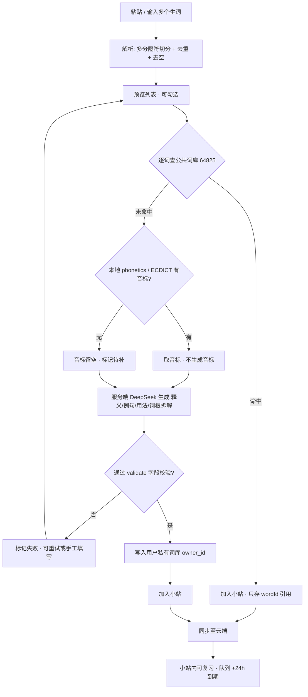

# 单词小站（Word Station）PRD

| 项 | 值 |
|---|---|
| Language | 中文 |
| Programming Language | 前端沿用 Vite + React + Tailwind；**新增 Node 服务端 + 数据库** |
| Project Name | `word_station` |
| 原始需求 | "我要让每个用户可以创建自己的单词小站，就是可以每天往里面扔生词，支持单次多词加入，如果不在词库里，你可以立刻生成并加入词库。" |
| 已定决策 | ① 注册账号 + 云端同步 ② 应用内即时生成（服务端持有 API Key） |

---

## 1. 产品目标

**一句话**：让每个注册用户拥有自己的"生词小站"，每天随手批量扔生词、缺词一键生成入库，并跨设备同步复习。

| # | 目标 | 衡量标准 |
|---|---|---|
| G1 | 加词效率 | 单次粘贴 ≥20 词，命中库全部入库 ≤10s；含 10 个待生成词 ≤60s |
| G2 | 生成可用性 | 不在库生词一键生成成功率 ≥95%，产出 100% 通过 `validate-data.mjs` 字段校验 |
| G3 | 多设备一致 | 两设备登录后小站词表 + 学习进度 5s 内一致，冲突零丢失 |

---

## 2. 用户故事

1. 作为注册用户，我要创建多个小站（如"雅思""论文阅读"），以便按场景分组收集生词。
2. 作为通勤用户，我要每天往小站里扔当天遇到的生词，以便不遗漏地积累。
3. 作为批量录入用户，我要一次粘贴一整段文本（逗号/空格/换行分隔）一次加入多个词，以便省去逐词录入。
4. 作为遇到生僻词的用户，当它不在 64825 公共库里时，我要点一下就立刻生成释义/例句并入库，以便不中断学习。
5. 作为多设备用户，我要在手机和电脑看到同一份小站与复习进度，以便换设备接着背。
6. 作为复习者，我要在小站内直接背这些词（复用现有难度分档、词族成组、答错 +24h 到期），以便只复习自己扔进来的词。
7. 作为谨慎用户，我要能编辑/删除/重新生成自己生成的词条，以便修正 AI 出错的释义。
8. 作为离线用户，我断网时加入的生词应先存草稿、联网后自动补生成，以便不丢词。

---

## 3. 需求池

| # | 需求项 | 优先级 | 验收标准 |
|---|---|---|---|
| R-01 | **账号体系**：邮箱+密码注册/登录，服务端会话，密码哈希存储 | P0 | 注册后可登录；未登录仅能浏览公共库；Key 不下发前端 |
| R-02 | **小站 CRUD + 云端持久化**：创建/改名/删除/置顶 | P0 | 每用户 ≥10 个小站；改动即时生效并持久化 |
| R-03 | **批量加词**：粘贴框多分隔符解析（`, ，; ；` 空格/换行/Tab）+ 去重 + 去空 + 勾选预览后一次提交 | P0 | 20 词解析准确率 100%；重复词自动跳过并提示条数 |
| R-04 | **命中公共库**：`form` 大小写不敏感匹配 64825 词 | P0 | 命中词直接加入小站，**只存 wordId 引用**，不复制词条 |
| R-05 | **未命中→一键生成**：服务端调 DeepSeek 生成 `pos/gloss/例句/用法/词根拆解(morphs+chain)`，写入私有词库并加入小站 | P0 | 成功率 ≥95%；**音标仅查表**（ECDICT / 本地 phonetics），查不到留空并显示"音标待补"，严禁模型编造 |
| R-06 | **私有词库隔离**：生成词按 `owner_id` 隔离，默认仅本人可见；公共库运行时只读 | P0 | 用户 A 看不到 B 的生成词；公共库无写入路径 |
| R-07 | **小站内复习**：复用 `learning.js` 队列与难度分档/词族成组/+24h 到期，作用域=小站 | P0 | 队列只含本小站词；到期口径与全局一致 |
| R-08 | **进度同步**：服务端存储并下发学习进度，localStorage 降为离线缓存 | P0 | 登录后以服务端为准合并，无进度丢失 |
| R-09 | 加词时间戳 + "今日加入"视图与每日计数 | P1 | 显示今日新增 N 词 |
| R-10 | 生成结果可编辑（释义/例句/词根）与重新生成 | P1 | 编辑后标记 `editedByUser` |
| R-11 | 小站导出/导入 JSON | P1 | 兼容现有标注导出格式 |
| R-12 | 生成限流与配额：每用户日配额（默认 50），异步排队 + 前端进度 | P1 | 超限给出明确提示而非静默失败 |
| R-13 | 冲突合并：按 `updatedAt` 最后写入胜出 + 操作日志可回溯 | P1 | 双端同时改不丢数据 |
| R-14 | 小站分享只读链接 | P2 | 未登录可只读访问 |
| R-15 | 用户词条"投稿"公共待审池，审批后合入公共库 | P2 | 投稿前自动跑校验，人工批准才合入 |
| R-16 | 第三方登录（GitHub / Google） | P2 | 与邮箱账号可绑定同一身份 |
| R-17 | 小站词云 / 统计面板 | P2 | 展示掌握率与新增趋势 |

---

## 4. 关键流程：批量加词 + 不在库即时生成

---

## 5. 词库合并规则（重点 · 产品建议）★

**三层结构**

| 层 | 归属 | 写权限 |
|---|---|---|
| 公共库 64825 词 | 全局共享 | **只读**，仅由仓库离线脚本 `scripts/gen-*.mjs` 产出并随版本发布；运行时任何用户写入一律禁止 |
| 用户私有库 | `owner_id` 隔离 | 本人可增删改 |
| 共享待审池（R-15，P2） | 投稿 → 校验 → 人工审批 → 合入公共库 | 批准后由维护者合入 |

> 核心不变量：**公共库永不接受运行时写入**。这同时解决两个问题——64825 词零污染，以及多用户并发写同一词条的冲突。

**冲突与兜底规则**

- `id` 沿用 `w.<form>`；用户词 `form` 与公共库重复时 **复用公共词条、禁止覆盖**，只允许用户追加个人笔记字段。
- AI 无法给出词根拆解时：`chain[].morph` 填 `null`、`morphs` 兜底为 `x.unk`（未拆解），保证图谱可见——沿用 `DATA_MODEL.md` 既有约定。
- **红线（沿用 `gen-phon.mjs`）**：音标严禁由模型生成，只能查表；查不到显示"音标待补"并进离线补表队列。
- 生成结果必须含 `pos/gloss/cefr/morphs/chain` 全套字段，否则判定失败（R-05）。

---

## 6. 待确认问题（需架构师 / 用户拍板）

| # | 问题 | 影响 |
|---|---|---|
| Q1 | **部署与存储形态**：现有是纯前端静态部署，加后端后走「独立 Node 服务 + 数据库」还是「静态站 + Serverless/Supabase」？另外公共词库现为 ~28MB 静态 JS 全量打进包里，是否改为服务端分片按需下发？ | 决定部署形态、首屏体积与构建方式，是本次最大的架构变更 |
| Q2 | **登录方式**：自研邮箱+密码 / 第三方 OAuth / Supabase Auth（托管）？ | 决定 R-01 工作量与安全责任边界 |
| Q3 | **生成成本与限流**：DeepSeek 并发上限、每用户日配额（建议 50）、是否做**跨用户同名词缓存**（A 生成过的词 B 直接复用，可显著降本）？ | 决定 API 成本与 R-12 配额策略 |
| Q4 | **词库隔离策略确认**：是否采纳 §5 的"公共库只读 + 私有库隔离 + 投稿审批"三层方案？还是希望用户生成的词默认全员可见（更快丰富词库，但有污染风险）？ | 决定数据模型与 R-06/R-15 范围 |
| Q5 | **离线与迁移**：断网加词是否允许"先入小站、联网补生成"？未登录游客是否保留 localStorage 试用模式？既有 `wrc.learn.v2` / `wrc.status.v1` 进度首次登录是否一次性上传并入账号？ | 决定离线体验与老用户数据不丢失 |

---

## 7. 范围之外（本次不做）

- 公共词库的在线协同编辑 / 众包释义投票
- 小站之间的跨站智能推荐、社交关注
- 移动端原生 App
